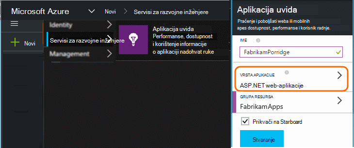
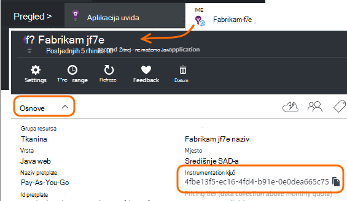

<properties 
    pageTitle="Razdvajanje aplikacije uvida resursi za razvojni, testiranje i radni" 
    description="Praćenje performansi i korištenje aplikacije na različite faze razvoja" 
    services="application-insights" 
    documentationCenter=""
    authors="alancameronwills" 
    manager="douge"/>

<tags 
    ms.service="application-insights" 
    ms.workload="tbd" 
    ms.tgt_pltfrm="ibiza" 
    ms.devlang="na" 
    ms.topic="article" 
    ms.date="05/04/2016" 
    ms.author="awills"/>

# Razdvajanje aplikacije uvida resursi

Trebali biste telemetrijskih iz verzije aplikacije i razne komponente biti poslane na drugi resursi uvida aplikacije ili posložene jedan? U ovom se članku izgleda kod najbolje prakse i potrebne tehnike.

Najprije Upoznajmo pitanje. Primljeni iz aplikacije podaci se pohranjuju, a obradili aplikacije uvida u Microsoft Azure *resursa*. Svaki resurs je označena i *instrumentation ključ* (iKey). U aplikaciji, tipku dostupni su uvida SDK aplikacije tako da ga možete poslati podatke prikuplja desnom resursa. Ključ se može pružati u kod ili u ApplicationInsights.config. Promjenom ključ u SDK možete usmjeriti podataka na različite resurse. 

U slučaju jednostavne prilikom stvaranja kod za novu aplikaciju i stvorite novi resurs u aplikaciji uvida. U Visual Studio, dijaloški okvir *novi projekt* to čini umjesto vas.

Ako je velikim prometom web-mjesta, možda implementirati na više od jedne instanca poslužitelja.

U složenije scenarije, imate sustav koji se sastoji od više komponenti –, na primjer, web-mjesta i pozadinske procesor. 

## Kada koristiti odvojene iKeys

Evo nekih opće smjernice:

* Gdje ste se jedinica neovisno deployable aplikacije koja se izvršava na skup poslužitelja instance koje možete skalirana gore/dolje nezavisno od druge komponente, a zatim obično koje želite mapirati na jedan resurs – to jest, imat će jednu instrumentation ključ (iKey).
* Za razliku od toga razloga za korištenje zasebnom iKeys obuhvaćaju sljedeće:
 - Lako čitati zasebnom metrika iz odvojene komponente.
 - Staviti donjem glasnoću telemetrijskih velikim prometom, tako da se ograničavanje kvote, a uzorkovanje na jedno strujanje ne utječu na drugi.
 - Zasebnom upozorenja, izvoz i rad konfiguracije stavke.
 - Širenje [ograničenja](app-insights-pricing.md#limits-summary) , kao što su kvota za telemetriju, ograničavanje i web-testiranje count.
 - Kod u razvoju i testiranje pošalje u zasebnom iKey od oznaka radnog.  

Mnogo portala sučelja aplikacije uvida osmišljeni su s ovim smjernicama na umu. Na primjer, poslužitelji prikaz segmenata na instanca poslužitelja upućivanje pretpostavci te telemetrijskih o nešto logičke komponente mogu potjecati iz nekoliko instanci poslužitelja.

## Jedan iKey

Koju šaljete telemetrijskih iz više komponenti jedan iKey:

* Dodavanje svojstva za telemetriju koji omogućuju segmentu i filtra na identitet komponentu. ID uloga se automatski dodaje telemetrijskih iz instanci uloga poslužitelja, ali u drugim slučajevima [telemetrijskih initializer](app-insights-api-filtering-sampling.md#add-properties) možete koristiti da biste dodali svojstvo.
* Ažurirajte u aplikaciji uvida SDK-ovi u različite komponente u isto vrijeme. Trebali biste telemetrijskih za jednu iKey potječu s istu verziju SDK-a.

## Zasebnom iKeys

Gdje su više iKeys za drugu aplikaciju komponente:

* Stvaranje [nadzorne ploče](app-insights-dashboards.md) za prikaz ključa telemetrijskih iz logičke aplikacije, kombinirati iz komponente drugu aplikaciju. Nadzorne ploče možete zajednički koristiti tako da jedan logički sustav prikaza mogu poslužiti različitih timova.
* Organiziranje [grupa resursa](app-insights-resources-roles-access-control.md) na razini tima. Dozvole za pristup dodjeljuju prema grupi resursa, a uključuju dozvole da biste postavili upozorenja. 
* Pomoću [upravitelja resursa Azure predložaka i Powershell](app-insights-powershell.md) upravljanje artefakte kao što su pravila upozorenja i web-testira.

## Zasebnom iKeys razvojni i testiranje i proizvodnje

Da biste lakše Promjena ključa automatski kada se aplikacija je skup iKey u kodu, umjesto ApplicationInsights.config.

### Dinamični instrumentation ključ

Ključ postavite u način Inicijalizacija, kao što su global.aspx.cs u servis za ASP.NET:

*C#*

    protected void Application_Start()
    {
      Microsoft.ApplicationInsights.Extensibility.
        TelemetryConfiguration.Active.InstrumentationKey = 
          // - for example -
          WebConfigurationManager.AppSettings["ikey"];
      ...

U ovom primjeru ikeys za različite resurse spremaju se u različitim verzijama web-konfiguracijska datoteka. Zamjena konfiguracijska datoteka web - izvedivi kao dio skripte izdanje - će zamijenite resursa cilj.

### Web-stranice

Na iKey koristi se u aplikaciju programa web-stranice, u [skriptu koju ste dobili od plohu brzi početak rada](app-insights-javascript.md). Umjesto kodiranje je doslovno u skriptu, generirati je stanje poslužitelja. Na primjer, u ASP.NET aplikacije:

*JavaScript u platforma Razor*

    <script type="text/javascript">
    // Standard Application Insights web page script:
    var appInsights = window.appInsights || function(config){ ...
    // Modify this part:
    }({instrumentationKey:  
      // Generate from server property:
      "@Microsoft.ApplicationInsights.Extensibility.
         TelemetryConfiguration.Active.InstrumentationKey"
    }) // ...

## Stvaranje dodatnih resursa za aplikaciju uvida
  
Ako odlučite da biste razdvojili telemetrijskih komponente drugu aplikaciju ili drugi žigovima (test/razvojni/Proizvodnja) isti komponente, zatim morat ćete stvoriti novi resurs uvida aplikacije.

U [portal.azure.com](https://portal.azure.com)dodati do uvida aplikacije resursa:

* **Vrsta aplikacije** utječe na ono što vidite na pregled plohu i svojstva dostupna u [metričkim Exploreru](app-insights-metrics-explorer.md). Ako ne vidite vrstu aplikacije, odaberite neku od vrste web-mjesta za web-stranice.
* **Grupa resursa** jest pogodnost za upravljanje svojstvima, kao što je [Kontrola pristupa](app-insights-resources-roles-access-control.md). Grupa zasebnom resursa možete koristiti za razvoj, testiranje i radni.
* **Pretplata** je račun za uplate u Azure.
* **Mjesto** je gdje ćemo zadržali podatke. Trenutno je nije moguće promijeniti. 
* **Dodaj na nadzornoj ploči** stavlja pločicu brzi pristup vašem resursa Azure početnu stranicu. 

Stvaranje resursa traje nekoliko sekundi. Vidjet ćete upozorenje kada to učiniti.

( [Skriptu PowerShell](app-insights-powershell-script-create-resource.md) da biste automatski stvorili resursa možete napisati.)

## Početak tipku instrumentation

Tipku instrumentation označava resurs koji ste stvorili. 

Potreban vam je tipki instrumentation svih resursa na koji će aplikacije poslati podatke.

 
