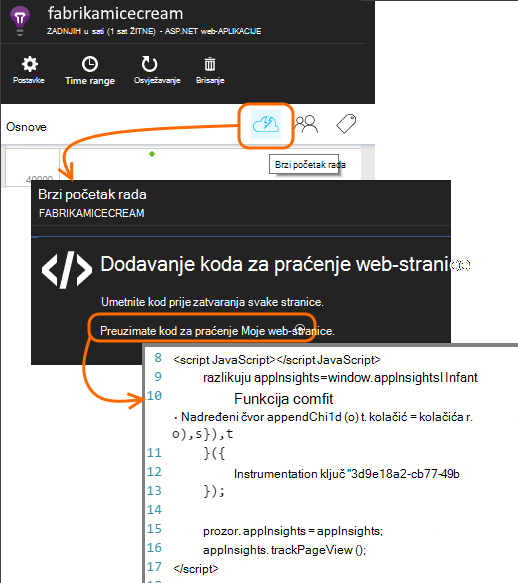
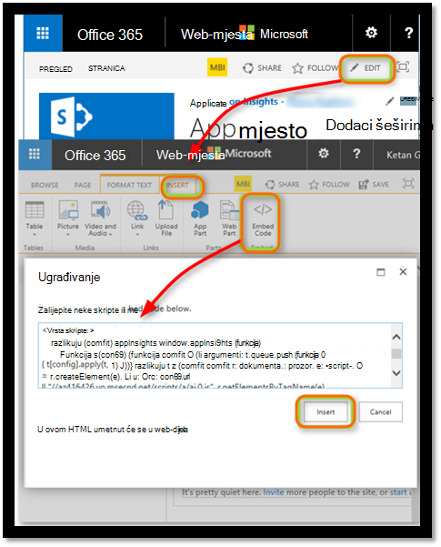

<properties 
    pageTitle="Praćenje web-mjesta sustava SharePoint s računala uvida" 
    description="Pokrenite novu aplikaciju za nadzor novim instrumentation ključem" 
    services="application-insights" 
    documentationCenter=""
    authors="alancameronwills" 
    manager="douge"/>

<tags 
    ms.service="application-insights" 
    ms.workload="tbd" 
    ms.tgt_pltfrm="ibiza" 
    ms.devlang="na" 
    ms.topic="article" 
    ms.date="03/24/2016" 
    ms.author="awills"/>

# <a name="monitor-a-sharepoint-site-with-application-insights"></a>Praćenje web-mjesta sustava SharePoint s računala uvida


Uvid aplikacije za Visual Studio nadzire dostupnost, performanse i korištenje aplikacije. Ovdje ćete Saznajte kako postaviti za web-mjesta sustava SharePoint.


## <a name="create-an-application-insights-resource"></a>Stvaranje do uvida aplikacije resursa


[Portal za Azure](https://portal.azure.com)stvoriti nove uvide aplikacije resurs. Odaberite ASP.NET kao vrsta aplikacije.


Plohu koji će se otvoriti je mjesto na kojem ćete vidjeti performanse i podataka o korištenju o aplikacije. Da biste se vratili ga sljedeći put prijavite za Azure, trebali biste pronaći pločicu za nju na početnom zaslonu. Umjesto toga kliknite Pregledaj da biste ga pronašli.
    


## <a name="add-our-script-to-your-web-pages"></a>Dodavanje naš skripte na web-stranice

U brzi početak rada se skripta za web-stranice:



Neposredno prije Umetanje skripte na &lt;/glavni&gt; oznaka svake stranice koje želite pratiti. Ako je web-mjesta na osnovnu stranicu, skriptu možete staviti postoji. Ako, na primjer, u projektu programa ASP.NET MVC se želite smjestiti ga u View\Shared\_Layout.cshtml

Skripta sadrži instrumentation ključ koji usmjerava telemetrijskih vaše aplikacije uvida resurs.

### <a name="add-the-code-to-your-site-pages"></a>Dodavanje koda za stranice web-mjesta

#### <a name="on-the-master-page"></a>Na osnovnoj stranici

Ako uređujete osnovnu stranicu na web-mjesta koja dat će nadzor na svakoj stranici web-mjesta.

Pogledajte na osnovnu stranicu i uređivati pomoću programa SharePoint Designer ili bilo kojem uređivaču.


Dodavanje koda za neposredno prije no što se </head> oznaka. 


#### <a name="or-on-individual-pages"></a>Ili na pojedinačne stranice

Da biste pratili ograničenim stranice, dodajte skriptu zasebno na svaku stranicu. 

Umetanje web-dijela i ugrađivanje koda u njoj.





## <a name="view-data-about-your-app"></a>Prikaz podataka o aplikacije

Ponovno implementirate aplikacije.

Vratite se na vaše aplikacije plohu [Azure portal](https://portal.azure.com).

Prvi događaje pojavit će se u pretraživanju. 


Ako se očekivana više podataka, kliknite Osvježi nakon nekoliko sekundi.

Plohu pregled kliknite **analitičkih** da biste vidjeli grafikoni korisnika, sesije i prikaza stranice:


Kliknite bilo koji od njih da biste vidjeli dodatne detalje – na primjer prikaza stranice:


Ili korisnika:


## <a name="capturing-user-id"></a>Dohvaćanje korisničkog Id-a


Isječak koda standardne web-stranice ne snimiti korisničkog id-a iz sustava SharePoint, no to možete učiniti s malim izmjene.


1. Kopirajte ključ instrumentation pokrenite aplikaciju iz Essentials padajućim u aplikaciji uvida. 


    

2. Zamijenite instrumentation ključ za 'XXXX' u isječak u nastavku. 
3. Ugrađivanje skriptu u aplikaciji SharePoint umjesto isječak dobijete na portalu.


```


<SharePoint:ScriptLink ID="ScriptLink1" name="SP.js" runat="server" localizable="false" loadafterui="true" /> 
<SharePoint:ScriptLink ID="ScriptLink2" name="SP.UserProfiles.js" runat="server" localizable="false" loadafterui="true" /> 
  
<script type="text/javascript"> 
var personProperties; 
  
// Ensure that the SP.UserProfiles.js file is loaded before the custom code runs. 
SP.SOD.executeOrDelayUntilScriptLoaded(getUserProperties, 'SP.UserProfiles.js'); 
  
function getUserProperties() { 
    // Get the current client context and PeopleManager instance. 
    var clientContext = new SP.ClientContext.get_current(); 
    var peopleManager = new SP.UserProfiles.PeopleManager(clientContext); 
     
    // Get user properties for the target user. 
    // To get the PersonProperties object for the current user, use the 
    // getMyProperties method. 
    
    personProperties = peopleManager.getMyProperties(); 
  
    // Load the PersonProperties object and send the request. 
    clientContext.load(personProperties); 
    clientContext.executeQueryAsync(onRequestSuccess, onRequestFail); 
} 
     
// This function runs if the executeQueryAsync call succeeds. 
function onRequestSuccess() { 
var appInsights=window.appInsights||function(config){
function s(config){t[config]=function(){var i=arguments;t.queue.push(function(){t[config].apply(t,i)})}}var t={config:config},r=document,f=window,e="script",o=r.createElement(e),i,u;for(o.src=config.url||"//az416426.vo.msecnd.net/scripts/a/ai.0.js",r.getElementsByTagName(e)[0].parentNode.appendChild(o),t.cookie=r.cookie,t.queue=[],i=["Event","Exception","Metric","PageView","Trace"];i.length;)s("track"+i.pop());return config.disableExceptionTracking||(i="onerror",s("_"+i),u=f[i],f[i]=function(config,r,f,e,o){var s=u&&u(config,r,f,e,o);return s!==!0&&t["_"+i](config,r,f,e,o),s}),t
    }({
        instrumentationKey:"XXXX"
    });
    window.appInsights=appInsights;
    appInsights.trackPageView(document.title,window.location.href, {User: personProperties.get_displayName()});
} 
  
// This function runs if the executeQueryAsync call fails. 
function onRequestFail(sender, args) { 
} 
</script> 


```


## <a name="next-steps"></a>Daljnji koraci

* [Testira web](app-insights-monitor-web-app-availability.md) praćenje dostupnosti web-mjesta.

* [Uvid u aplikaciji](app-insights-overview.md) za druge vrste aplikacija.


<!--Link references-->


 