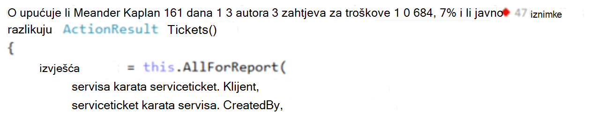
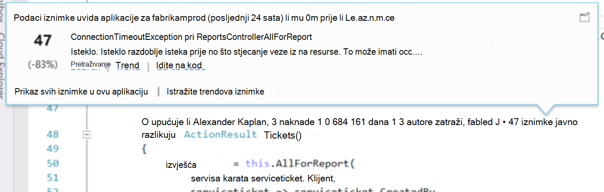
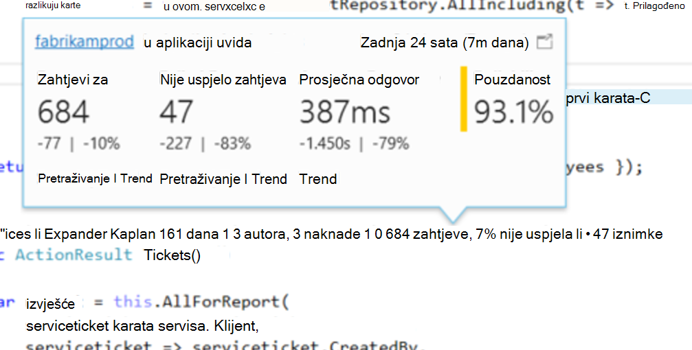
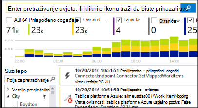
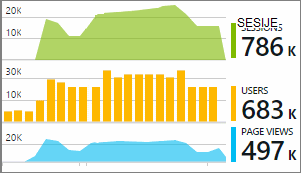

<properties 
    pageTitle="Aplikacija telemetrijskih uvida u Visual Studio CodeLens | Microsoft Azure" 
    description="Brz pristup vaše aplikacije uvida zahtjev i iznimke telemetrijskih s CodeLens u Visual Studio." 
    services="application-insights" 
    documentationCenter=".net"
    authors="numberbycolors" 
    manager="douge"/>

<tags 
    ms.service="application-insights" 
    ms.workload="tbd" 
    ms.tgt_pltfrm="ibiza" 
    ms.devlang="na" 
    ms.topic="get-started-article" 
    ms.date="08/30/2016" 
    ms.author="daviste"/>
    
# Aplikacija telemetrijskih uvida u Visual Studio CodeLens

Načini kod web-aplikacije možete dodavati napomene s telemetrijskih o izvođenju iznimke i zatražite od vremena odgovor. Ako instalirate [Visual Studio aplikacije uvida](app-insights-overview.md) u aplikaciji, za telemetriju pojavit će se u Visual Studio [CodeLens](https://msdn.microsoft.com/library/dn269218.aspx) - bilješke pri vrhu svake funkcije mjesto koje ste navikli korisne informacije kao što su broj mjesta funkciju poziva ili posljednje osobe koja je uređivanja.

> [AZURE.NOTE] Aplikacije uvida u CodeLens dostupna je u Visual Studio 2015 ažuriranje 3 i noviji ili najnoviju verziju preglednika [proširenje analize alate za razvojne inženjere](https://visualstudiogallery.msdn.microsoft.com/82367b81-3f97-4de1-bbf1-eaf52ddc635a). CodeLens dostupan je u Enterprise i Professional izdanja programa Visual Studio.

## Gdje pronaći aplikacije uvida podataka

Potražite telemetrijskih aplikacije uvida u pokazatelje CodeLens od metoda zahtjev za javno web-aplikacije. Pokazatelji CodeLens prikazane su iznad metodu i druge deklaracija u kodu C# i Visual Basic. Ako su podaci uvida aplikacije dostupne za metodu, vidjet ćete pokazatelja zahtjeve za i iznimke kao što su "100 zahtjeve, 1% nije uspjela" ili "10 iznimke." Kliknite pokazatelj CodeLens više pojedinosti. 

> [AZURE.TIP] Zahtjev za aplikaciju uvida i iznimke pokazatelja može proći nekoliko sekundi dodatni učitati nakon druge pokazatelje CodeLens pojavljuju.

## Iznimke u CodeLens

Pokazatelj CodeLens iznimku prikazuje broj iznimke koji se odvijaju u zadnjih 24 sata od 15 najčešće pojavljivanja iznimke u aplikaciji tijekom tog razdoblja tijekom obrade zahtjeva za posluživanje sustavom način.

Da biste vidjeli više detalja, kliknite pokazatelj CodeLens iznimke:

* Promjena postotka u broj iznimke od zadnja 24 sata odnosu prethodnog 24 sata
* Odaberite **Idi na kod** da biste došli do izvornog koda za funkciju prijavi iznimka
* Odaberite **pretraživanje** upita za sve instance Ova se iznimka koji su se pojavili u zadnjih 24 sata
* Odaberite **Trend** da biste pogledali trend vizualizacije za pojavljivanja Ova se iznimka u zadnjih 24 sata
* Odaberite **Prikaz svih iznimke u ovu aplikaciju** za postavljanje upita za sve iznimke koji su se pojavili u zadnjih 24 sata
* Odaberite **Istraži iznimku trendova** za prikaz trenda vizualizacije za sve iznimke koji su se pojavili u zadnjih 24 sata. 

> [AZURE.TIP] Ako se prikaže "0 iznimke" CodeLens, ali znate mora biti iznimke, provjerite obavezno desnom resursa aplikacije uvida u CodeLens. Da biste odabrali neki drugi resurs, desnom tipkom miša kliknite na projektu u pregledniku rješenja i odaberite **uvida aplikacije > Odabir izvora Telemetrijskih**. CodeLens samo za prikazuju se 15 Većina iznimke pojavljuje u aplikaciji u zadnjih 24 sata, stoga ako je iznimku na 16th najčešće ili manje, vidjet ćete "0 iznimke." Iznimke iz prikaza ASP.NET možda se neće prikazati na kontroler načina na koji je generirao tih prikaza.

> [AZURE.TIP] Ako se prikaže "? iznimke"u CodeLens, morate pridružiti račun za Azure Visual Studio ili vaš račun za Azure vjerodajnica je možda istekla. U svakom slučaju, kliknite "? iznimke", a zatim odaberite **Dodaj račun …** da biste unijeli vjerodajnice.

## Zahtjevi za u CodeLens

Zahtjev za CodeLens pokazatelja prikazuje broj HTTP zahtjeva koji su kvalificiranom metode u zadnjih 24 sata, uz postotak zahtjeve nije uspjelo.

Da biste vidjeli dodatne detalje, kliknite zahtjeva za CodeLens pokazatelj:

* Apsolutne i postotak promjene u broj zahtjeve, neuspjelih zahtjeva i average odgovor vremena tijekom proteklih 24 sata u usporedbi s prethodne 24 sata
* Pouzdanost metodu izračunava kao postotak zahtjevi za koje niste neće funkcionirati u zadnjih 24 sata
* Odaberite **pretraživanje** za zahtjeve ili neuspjelih zahtjeva za postavljanje upita za sve zahtjeve (nije uspjelo) do kojih je došlo u zadnjih 24 sata
* Odaberite **Trend** da biste pogledali vizualizacije trend za zahtjeve, neuspjelih zahtjeva ili prosjeka odgovor vremena tijekom proteklih 24 sata.
* Odaberite naziv resursa aplikacije uvida u gornjem lijevom kutu CodeLens prikaz pojedinosti da biste promijenili koji je izvor podataka CodeLens.

## Daljnji koraci

||
|---|---
|**[Rad s računala uvida u Visual Studio](app-insights-visual-studio.md)** Traženje telemetrijskih, pogledajte odjeljak podataka u CodeLens i konfiguriranje uvida aplikacije. Sve unutar Visual Studio. |
|**[Dodavanje dodatnih podataka](app-insights-asp-net-more.md)** Nadzor korištenja, dostupnost, ovisnosti, iznimke. Integrirati kašnjenja iz zapisivanje okviri. Napišite prilagođenu telemetrijskih. | 
|**[Rad s portala za aplikacije uvida](app-insights-dashboards.md)** Nadzorne ploče, naprednih alata dijagnostičkih i analitički, a zatim upozorenja, kartu uživo ovisnost aplikacije i telemetrijskih izvoz. |
