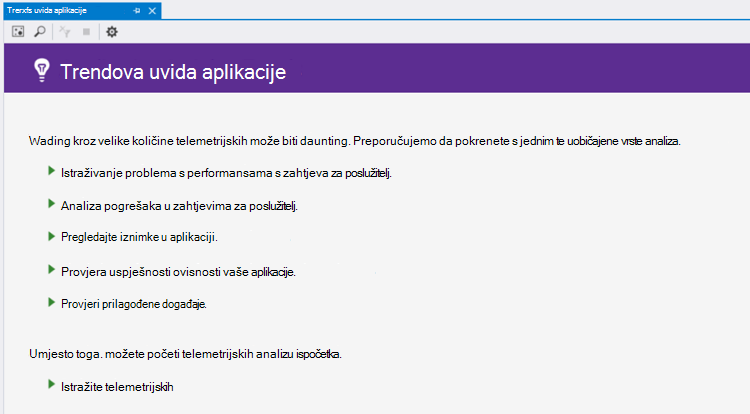

<properties 
    pageTitle="Analiza trendova u Visual Studio | Microsoft Azure" 
    description="Analiza, vizualizacija i istraživanje trendova u svoje telemetrijskih aplikacije uvida u Visual Studio." 
    services="application-insights" 
    documentationCenter=".net"
    authors="numberbycolors" 
    manager="douge"/>

<tags 
    ms.service="application-insights" 
    ms.workload="tbd" 
    ms.tgt_pltfrm="ibiza" 
    ms.devlang="na" 
    ms.topic="get-started-article" 
    ms.date="10/25/2016" 
    ms.author="daviste"/>
    
# Analiza trendova u Visual Studio

Alat za aplikaciju uvida trendova vizualiziraju kako vaše aplikacije važne telemetrijskih promijenite događaje s vremenom vam omogućuju brzo prepoznavanje probleme i anomalies. Postavljanjem veza na detaljnije dijagnostičke informacije, trendova omogućuju poboljšati performanse aplikacije programa, pronaći uzroka iznimke i steknite uvid iz prilagođene događaje.

> [AZURE.NOTE] Aplikacija uvida trendova dostupna je u Visual Studio 2015 ažuriranje 3 i novijeg, ili verzijom [alate za razvojne inženjere analize nastavak](https://visualstudiogallery.msdn.microsoft.com/82367b81-3f97-4de1-bbf1-eaf52ddc635a) 5.209 i noviji.

## Trendova uvida otvorenu aplikaciju

Da biste otvorili prozor trendova uvida aplikacije:

* Gumb s alatne trake aplikacije uvida odabrati **Istraživanje trendova Telemetrijskih**ili
* Na kontekstnom izborniku projekta odaberite **uvida aplikacije > Istraživanje trendova Telemetrijskih**, ili
* Na traci s izbornicima Visual Studio odaberite **Prikaz > drugi Windows > aplikacije uvida trendova**.

Vidjet ćete upit da biste odabrali resurs. Kliknite **Odabir resursa**, prijavite se pomoću Azure pretplate, a zatim odaberite programa resursa uvida aplikaciju s popisa za koju želite analizirati trendove telemetrijskih.

## Odaberite trend analizu

Počnite s radom tako da odaberete neku od pet uobičajenih trend analize, svaki analiziranje podataka iz zadnja 24 sata:

* **Probleme s performansama Investigate s zahtjeva za poslužitelj** - zahtjeve izvršene u funkcioniranju servisa grupirane vrijeme odaziva
* **Analiza pogrešaka u zahtjevima za poslužitelj** - zahtjeve izvršene u funkcioniranju servisa grupirane HTTP odgovor kod
* **Pregledajte iznimke u aplikaciji** – iznimke iz servisa, grupirane vrsta iznimke
* **Provjera uspješnosti ovisnosti vaše aplikacije** - usluga pozove na servisu grupirane vrijeme odaziva
* **Provjera prilagođene događaje** - prilagođene događaje koje ste postavili za servis, grupirati prema događaj.

Ove gotove analize dostupnih kasnije koristeći gumb **Prikaz čestih vrsta analize telemetriju** u gornjem lijevom kutu prozora trendova.

## Vizualni prikaz trendova u aplikaciji

Aplikacije uvida trendova stvara niz vizualizacije vremena telemetrijskih pokrenite aplikaciju. Svaki niz vizualizacije vremena prikazuje jednu vrstu telemetrijskih, grupirane jedno svojstvo te telemetrijskih iznad neke vremenskog razdoblja. Na primjer, možda ćete morati prikaz zahtjeve poslužitelja grupirane prema državi iz kojeg se potječe, tijekom zadnja 24 sata. U ovom primjeru svaki mjehurić na vizualizaciju predstavljala ukupan broj poslužitelj zahtjeva za neke države/regije tijekom jedan sat.

Da biste prilagodili koje vrste telemetrijskih pogledate pomoću kontrola pri vrhu prozora. Najprije odaberite vrste telemetriju u kojem koji vas zanima:

* **Vrsta telemetrijskih** - zahtjeve poslužitelja, iznimke, depdendencies ili prilagođene događaje
* **Vremenski raspon** - bilo gdje na zadnji 30 minuta zadnja tri dana
* **Group By** - iznimku vrsta, ID problema, države/regije i više.

Kliknite **Analiza Telemetrijskih** da biste pokrenuli upit.

Kretanje između mjehurića na:

* Kliknite da biste odabrali mjehuričasti kojom se ažuriraju filtara pri dnu prozora sa sažetkom samo tijekom određenog vremenskog razdoblja događaje
* Dvokliknite mjehuričasti otvorite alat za pretraživanje i vidjeti sve pojedinačne telemetrijskih događaja koji se tijekom tog razdoblja
* Kliknite držanje tipke CTRL slika poništite odabir u vizualizaciju.

> [AZURE.TIP] Trendove i pretraživanje tools zajedno da vam pinpoint uzroka problema na servisu među tisuće telemetrijskih događaja. Ako, na primjer, ako jedan poslijepodne klijentima obratite pozornost na to aplikacije se reagiraju, započnite s trendova. Analiza zahtjeve izvršene u funkcioniranju servisa putem zadnjih nekoliko sati grupirane reakcija. Pogledajte postoji li neuobičajeno velik klaster sporo zahtjeva. Zatim dvokliknite tog mjehurića da biste prešli na alat za pretraživanje, filtrirano događaje zahtjev. Iz pretraživanja, možete istraživati sadržaj zahtjeve i idite na kod koji je uključen da biste riješili taj problem.

## Filtar

Otkrijte konkretne trendove pomoću kontrola filtra pri dnu prozora. Da biste primijenili filtar, kliknite njezin naziv. Brzo možete se prebacivati između različitih filtara da biste otkrili trendove koji mogu skrivati u određenom dimenziju vaše telemetrijskih. Primjena filtra u jednu dimenziju, kao što su vrsta iznimke filtri u druge dimenzije ostati kliknuti čak i ako se pojavljuju sive izlaz. Za poništenje-primijenite filtar, ponovno kliknite. Kliknite uz držanje tipke CTRL da biste odabrali više filtara u istu dimenziju.

Ako želite primijeniti više filtara? 

1. Primjena prvi filtar. 
2. Kliknite gumb **Primjena odabrane filtre i ponovno upita** prema nazivu dimenzije prvi filtar. Vaše telemetrijskih za samo događaje koje odgovaraju prvi filtar se ponovno upita. 
3. Primjena drugog filtra. 
4. Ponovite postupak da biste pronašli trendova u određenim podskupovima vaše telemetrijskih. Ako, na primjer, zahtjeve poslužitelja pod nazivom "DOHVATI Polazno na indeks" _i_ koje ste dobili od Njemačka _i_ koje primili 500 odgovor kod. 

Za poništenje-primijenite jedan od ovih filtara, kliknite gumb za **Uklanjanje odabrane filtara i ponovnog upita** za dimenziju.

## Pronalaženje anomalies

Alat za trendova možete istaknuti mjehurića događaja koji su anomalous u usporedbi s drugim mjehurića u istom vremenski niz. Na padajućem popisu vrsta prikaza odaberite **Brojanje u vrijeme grupe (isticanje anomalies)** ili **postotke u vrijeme grupe (isticanje anomalies)**. Crvena mjehurića su anomalous. Anomalies definiraju se kao mjehurića s broji/postotaka premašuju 2.1 puta standardnu devijaciju broji/postotaka koji u prošlosti dva vremenskih razdoblja (48 sati Ako prikazujete zadnje 24 sata, itd.).

> [AZURE.TIP] Isticanje anomalies je posebno korisno za traženje outliers u vremenski niz malih mjehurića koji može izgledati drugačije na sličan način veličine.  

## Daljnji koraci

||
|---|---
|**[Rad s računala uvida u Visual Studio](app-insights-visual-studio.md)** Traženje telemetrijskih, pogledajte odjeljak podataka u CodeLens i konfiguriranje uvida aplikacije. Sve unutar Visual Studio. |
|**[Dodavanje dodatnih podataka](app-insights-asp-net-more.md)** Nadzor korištenja, dostupnost, ovisnosti, iznimke. Integrirati kašnjenja iz zapisivanje okviri. Napišite prilagođenu telemetrijskih. | 
|**[Rad s portala za aplikacije uvida](app-insights-dashboards.md)** Nadzorne ploče, naprednih alata dijagnostičkih i analitički, a zatim upozorenja, kartu uživo ovisnost aplikacije i telemetrijskih izvoz. |
