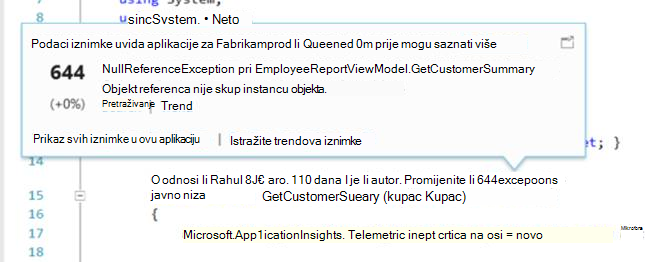

<properties 
    pageTitle="Rad s računala uvida u Visual Studio" 
    description="Analiza performansi i dijagnostici tijekom ispravljanje pogrešaka i radni." 
    services="application-insights" 
    documentationCenter=".net"
    authors="alancameronwills" 
    manager="douge"/>

<tags 
    ms.service="application-insights" 
    ms.workload="tbd" 
    ms.tgt_pltfrm="ibiza" 
    ms.devlang="na" 
    ms.topic="get-started-article" 
    ms.date="06/21/2016" 
    ms.author="awills"/>

# Rad s računala uvida u Visual Studio

U Visual Studio (2015 i noviji), možete analizirati performanse i dijagnosticiranje problema i pogrešaka i proizvodnje, pomoću telemetrijskih iz [Uvida aplikacije za Visual Studio](app-insights-overview.md).

Ako još niste [Instaliranih aplikacija uvida u aplikaciji](app-insights-asp-net.md), učinite to sada.

## Ispravljanje pogrešaka u projektu

Pokrenite aplikaciju s F5 i isprobajte sami: otvaranje različite stranice da biste generirali neke telemetrijskih.

U Visual Studio, prikazat će ukupan broj događaja koji su zapisane.

Kliknite ovaj gumb da biste otvorili dijagnostike pretraživanja. 

## Dijagnostičke pretraživanja

Prozor za pretraživanje prikazuje događaje koje su zapisane. (Ako ste prijavljeni u Azure prilikom postavljanja aplikacije uvide, moći da biste pronašli iste događaja na portalu.)

Pretraživanje slobodni tekstni funkcionira na sva polja u događaje. Na primjer, potražili dio URL-a na stranici vrijednost svojstva kao što je Grad klijenta; ili ili određenim riječima u zapisnik praćenja.

Kliknite bilo koji događaj da biste vidjeli detaljne svojstva.

Možete otvoriti i karticu povezane stavke za dijagnostiku neuspjelih zahtjeva ili iznimke.

## Dijagnostika koncentratora

Koncentrator Dijagnostika (u Visual Studio 2015 ili noviji) prikazuje telemetrijskih poslužitelj aplikacije uvida generira. To funkcionira čak i ako ste odlučili samo da biste instalirali SDK, bez povezivanja s resursa na portalu za Azure.

## Iznimke

Ako ste [postavili iznimku nadzor](app-insights-asp-net-exceptions.md), izvješća iznimku prikazat će se u prozor za pretraživanje. 

Kliknite iznimku za praćenje stogu. Ako kod za aplikaciju je otvorena u Visual Studio, možete kliknuti kroz Praćenje stoga na odgovarajući redak koda.

Osim toga, u retku kod leće iznad svake metode prikazat će ukupan broj iznimke zapisuje aplikacije uvida u zadnjih 24h.

## Lokalni nadzor

(Iz Visual Studio 2015 ažuriranje 2) Ako niste konfigurirali SDK da biste poslali telemetrijskih portal za aplikacije uvida (tako da nema instrumentation ključa u ApplicationInsights.config) prozor Dijagnostika će prikazati telemetrijskih od najkasnijeg pogrešaka sesiju. 

Ovo je poželjno ako već objavljene prethodne verzije aplikacije. Ne želite na telemetrijskih iz pogrešaka sesija biti kombinaciju telemetrijskih portala za aplikacije uvida u aplikaciji objavljene.

Također je korisno ako imate neke [prilagođene telemetrijskih](app-insights-api-custom-events-metrics.md) koju želite za ispravljanje pogrešaka prije no što pošaljete telemetrijskih portalu.

* *Isprva potpuno li konfiguriran uvida aplikacije da biste poslali telemetrijskih portalu. No sada želim da biste vidjeli telemetrijskih samo u Visual Studio.*

 * U odjeljku postavke prozora za pretraživanje postoji mogućnost da biste pronašli lokalne Dijagnostika čak i ako se aplikacije šalje telemetrijskih portalu.
 * Da biste zaustavili telemetrijskih šalje se na portal sustava, komentar izvan redak `<instrumentationkey>...` iz ApplicationInsights.config. Kada budete spremni ponovno poslati telemetrijskih portalu, uklonite ga.

## Trendova

Trendova je alat za vizualizacija ponašanje aplikacije tijekom vremena. 

Odaberite **Istraživanje trendova Telemetrijskih** iz aplikacije uvida gumb na alatnoj traci ili prozor aplikacije uvida pretraživanje. Odaberite neku od pet uobičajene upite za početak rada. Možete analizirati različite skupove podataka na temelju vrste telemetrijskih, vremenski raspon i druga svojstva. 

Da biste pronašli anomalies u vašim podacima, odaberite neku od mogućnosti značajkom u odjeljku "Vrsta prikaza" padajući popis. Mogućnosti filtriranja pri dnu prozora olakšavaju uobličite u na određenim podskupovima vaše telemetrijskih.

[Dodatne informacije o trendova](app-insights-visual-studio-trends.md).

## Što je sljedeće?

||
|---|---
|**[Dodavanje dodatnih podataka](app-insights-asp-net-more.md)** Nadzor korištenja, dostupnost, ovisnosti, iznimke. Integrirati kašnjenja iz zapisivanje okviri. Napišite prilagođenu telemetrijskih. | 
|**[Rad s portala za aplikacije uvida](app-insights-dashboards.md)** Nadzorne ploče, naprednih alata dijagnostičkih i analitički, a zatim upozorenja, kartu uživo ovisnost aplikacije i telemetrijskih izvoz. |

 
