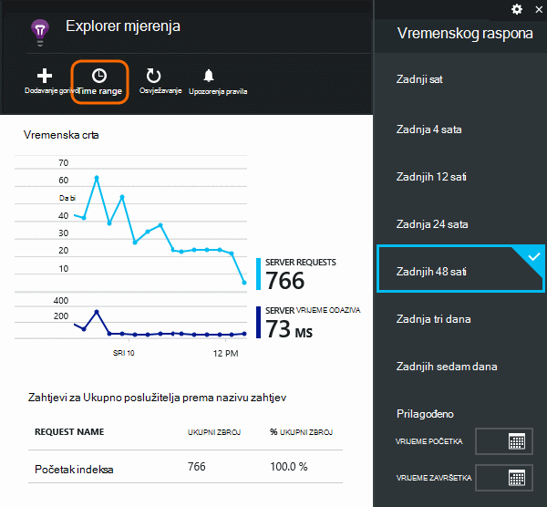
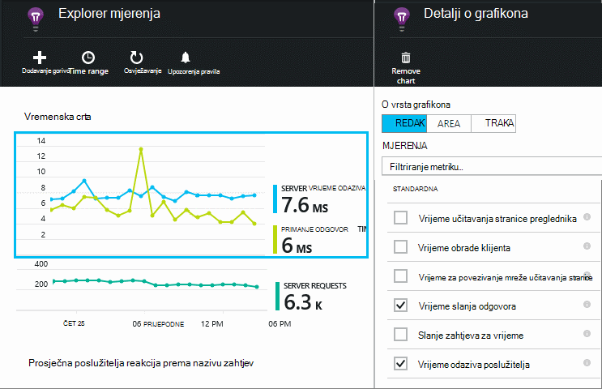
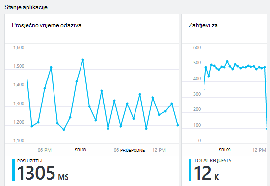
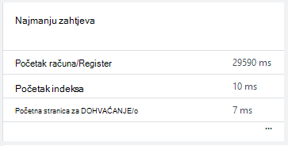
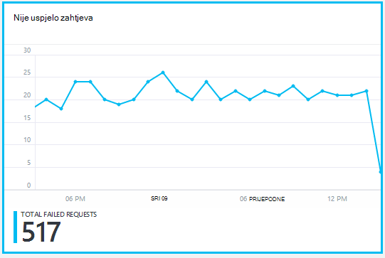
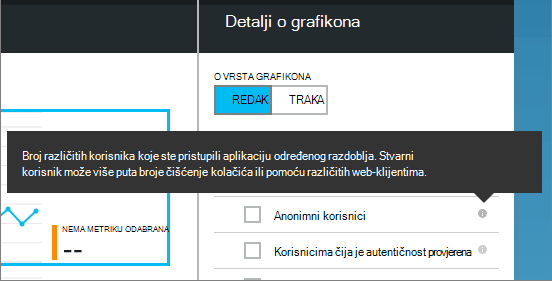
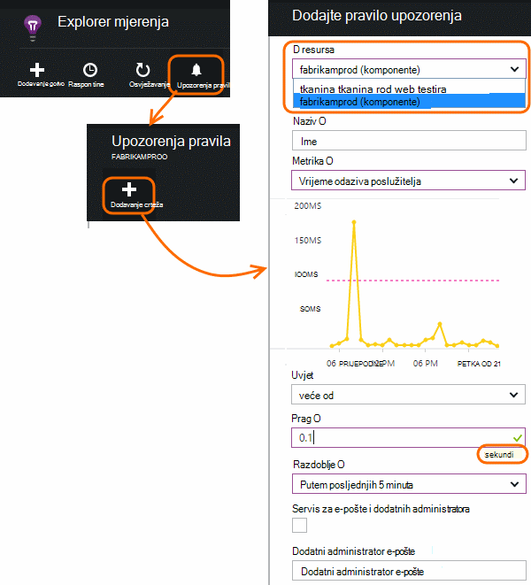

<properties 
    pageTitle="Praćenje stanja i korištenje s računala uvida pokrenite aplikaciju" 
    description="Početak rada s uvida aplikacije. Analiza korištenja, dostupnost i performanse svog lokalnog ili aplikacije Microsoft Azure." 
    services="application-insights" 
    documentationCenter=""
    authors="alancameronwills" 
    manager="douge"/>

<tags 
    ms.service="application-insights" 
    ms.workload="tbd" 
    ms.tgt_pltfrm="ibiza" 
    ms.devlang="na" 
    ms.topic="article" 
    ms.date="11/25/2015" 
    ms.author="awills"/>
 
# Praćenje performansi u web-aplikacijama

*Aplikacija uvida je u pretpregledu.*

Provjerite je li aplikacija i izvršava i brzo Saznajte više o sve pogreške. [Aplikacija uvida] [ start] će vas obavijestiti o sve probleme s performansama i iznimke i olakšavaju pronalaženje i dijagnosticiranje korijenskog uzroka.

Aplikacija uvida možete nadzirati Java i ASP.NET web-aplikacije i servise, a zatim WCF services. Moguće ih je nalazi na lokaciji, na virtualnim strojevima ili kao web-mjesta Microsoft Azure. 

Na klijentskoj strani uvida aplikacija može potrajati telemetrijskih iz web-stranice i raznih uređaja uključujući iOS i Android i Windows trgovine aplikacija.

## Postavljanje praćenje performansi

Ako još niste dodali aplikacije uvid u projekt (to jest, ako nema ApplicationInsights.config), odaberite neku od sljedećih načina za početak rada:

* [ASP.NET web-aplikacije](app-insights-asp-net.md)
 * [Dodavanje iznimke nadzora](app-insights-asp-net-exceptions.md)
 * [Dodaj nadzor ovisnost](app-insights-monitor-performance-live-website-now.md)
* [J2EE web-aplikacije](app-insights-java-get-started.md)
 * [Dodaj nadzor ovisnost](app-insights-java-agent.md)

## Istraživanje metriku performansi

[Portal za Azure](https://portal.azure.com)pronađite aplikaciju uvida resursa koji ste postavili za svoju aplikaciju. Pregled plohu prikazuje podataka o performansama osnovni:

Kliknite bilo koji od njih da biste vidjeli više detalja, a da biste vidjeli rezultate za dulje razdoblje. Ako, na primjer, kliknite pločicu zahtjeve, a zatim odaberite vremenski raspon:

Kliknite grafikon da biste odabrali koje metriku ga prikazuje ili dodali novi grafikon i odaberite njezin mjernih podataka:

> [AZURE.NOTE] **Poništite sve metriku** da biste vidjeli cijeli odabir koja je dostupna. Metriku podijeljene grupe; Kada je odabrana bilo koji član grupe, prikazuju se samo ostalih članova te grupe.

## Što znači li to sve? Pločice uspješnosti i izvješća

Postoji raznih performanse metriku možete dobiti. Započnimo s onima koje se prikazuju po zadanom na plohu aplikacije.

### Zahtjevi za

Broj HTTP zahtjeva u određenom razdoblju. Usporediti s rezultatima na druga izvješća da biste vidjeli kako se aplikacije ponaša kao opterećenje mijenja se.

HTTP zahtjeva obuhvaćaju sve zahtjeve za DOHVAĆANJE ili objavu za stranice, podataka i slike.

Kliknite pločicu da biste dobili Prebrojava određenih URL-ova.

### Prosječno vrijeme odaziva

Mjeri vrijeme između zahtjeva web unesete aplikacije i odgovor se vraćaju.

Upućivanje Prikaži na premještanje prosjek. Ako postoji mnogo zahtjeve, možda postoje neka koje proizlaze iz prosjeka bez očite Vršna ili dip u grafikonu.

Potražite neobično peaks. Općenito govoreći, očekivati reakcija na pokazivači s vodiča u zahtjevima. Ako je na vodiča disproportionate aplikacije možda odlazak ograničenje resursa kao što su procesora ili kapacitet usluge koristi.

Kliknite pločicu da biste dobili vremena za određenih URL-ova.

### Najmanju zahtjeva

Prikazuje zahtjeva za koje možda će biti potrebno ugađanju performansi.

### Nije uspjelo zahtjeva

Broj zahtjeva za izbacio je neuhvaćenu iznimke.

Kliknite pločicu da biste vidjeli detalje o određene pogreške pa odaberite pojedinačne zahtjev da biste vidjeli njegove pojedinosti. 

Samo predstavniku uzorak neuspjeha zadržava se za pojedine provjere.

### Ostale mjerenja

Da biste vidjeli što postavite druge mjernih podataka možete prikazati, kliknite grafikon i poništite odabir svih mjernih podataka da biste vidjeli dostupne cijelog. Kliknite (i) da biste vidjeli svaki metriku definicija.

Odabirom bilo koje metriku će onemogućiti drugima koji se ne prikazuju na istom grafikonu.

## Postavljanje upozorenja

Da biste primili obavijest putem e-pošte neobično vrijednosti sve mjerenja, dodajte upozorenja. Odaberite nešto od sljedećeg da biste poslali e-poštu administratorima računa ili adrese e-pošte određenog.

Postavite resurs prije ostalih svojstava. Ne odaberete resursi webtest upute za postavljanje upozorenja na performanse i korištenje mjernih podataka.

Pripazite da Imajte na umu jedinice u kojima se zatraži da unesete vrijednosti praga.

*Ne vidim gumb Dodaj upozorenje.* -Je to grupa računa kojima imate pristup samo za čitanje? Obratite se administratoru za račun.

## Dijagnosticiranje problema

Evo nekoliko savjeta za traženje i dijagnosticiranje probleme s performansama:

* Postavljanje [web testira] [ availability] biti obaviješteni ako web-mjestu funkcionira ili odgovori neispravno ili sporo. 
* Usporedite broj zahtjev s drugim metriku jesu li sporo odgovora ili pogreške vezane uz učitati.
* [Umetanje i pretraživanje izjave o praćenju] [ diagnostic] u kodu da biste lakše pinpoint problema.

## Daljnji koraci

[Web-testira] [ availability] -imaju web zahtjeva poslanih u aplikaciji u pravilnim vremenskim razmacima iz diljem svijeta.

[Snimanje i pretraživanje dijagnostičkih kašnjenja] [ diagnostic] - Umetanje pozive za praćenje i izravnog rezultate u pronalaženju uzroka problema.

[Korištenje praćenja] [ usage] – Saznajte načinom korištenja aplikacije.

[Otklanjanje poteškoća s] [ qna] - i značajka pitanja i odgovora

## Videozapis

[AZURE.VIDEO performance-monitoring-application-insights]

<!--Link references-->

[availability]: app-insights-monitor-web-app-availability.md
[diagnostic]: app-insights-diagnostic-search.md
[greenbrown]: app-insights-asp-net.md
[qna]: app-insights-troubleshoot-faq.md
[redfield]: app-insights-monitor-performance-live-website-now.md
[start]: app-insights-overview.md
[usage]: app-insights-web-track-usage.md

 
