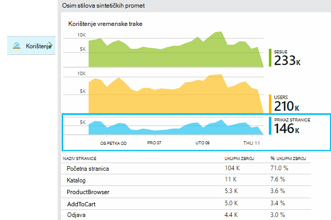
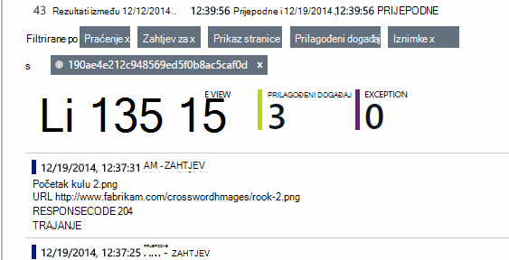

<properties 
    pageTitle="Analize korištenja za web-aplikacije s aplikaciju uvida" 
    description="Pregled analitičkih podataka o web-aplikacije pomoću aplikacije uvida" 
    services="application-insights" 
    documentationCenter=""
    authors="alancameronwills" 
    manager="douge"/>

<tags 
    ms.service="application-insights" 
    ms.workload="tbd" 
    ms.tgt_pltfrm="ibiza" 
    ms.devlang="na" 
    ms.topic="article" 
    ms.date="06/12/2016" 
    ms.author="awills"/>
 
# <a name="usage-analysis-for-web-applications-with-application-insights"></a>Analize korištenja za web-aplikacije pomoću aplikacije uvida

Kada zna načinom korištenja aplikacije omogućuje usredotočite se na scenarije koje su najvažnije im posla razvoj i dobiti uvida u ciljeve koji se mogu pronaći jednostavnije ili teže da biste postigli. 

Uvid aplikacije za Visual Studio omogućuje dvije razine korištenje praćenja:

* **Korisnici, sesije i prikaz podataka** – navedene u okvir.  
* **Prilagođeni telemetrijskih** - [kod] [ api] praćenje korisnicima putem korisničkog sučelja u aplikaciju programa. 

## <a name="setting-up"></a>Postavljanje

Otvorite do uvida aplikacije resursa za [Portal za Azure](https://portal.azure.com), kliknite prazan grafikona opterećenje preglednika stranice pa slijedite upute za postavljanje.

[uči više](app-insights-javascript.md) 


## <a name="how-popular-is-my-web-application"></a>Kako popularne je Moje web-aplikaciju?

Prijava na [portal za Azure][portal], pregled resursa na aplikaciju, a zatim kliknite korištenje:



* **Korisnika:** Broj različitih aktivni korisnici putem vremenski raspon grafikona. 
* **Sesije:** Broj aktivnih sesija
* **Prikaza stranice** Broji poziva trackPageView(), obično naziva jednom u svakoj web-stranici.

Kliknite bilo koju grafikoni da biste vidjeli dodatne detalje. Obratite pozornost na to da možete promijeniti vremenski raspon grafikone.

### <a name="where-do-my-users-live"></a>Gdje želite korisnicima live?

Plohu korištenje kliknite grafikon korisnika da biste vidjeli dodatne detalje:


 
### <a name="what-browsers-or-operating-systems-do-they-use"></a>Preglednici ili operacijskim sustavima koji ne koriste?

Grupiranje (segmenta) podataka tako da svojstvo preglednika, operacijski sustav ili grad:


## <a name="sessions"></a>Sesije

Sesija je bitno pojam u uvide aplikacije koje teži svog pridružiti svaki događaj telemetrijskih – kao što su zahtjeve, prikaza stranice, a zatim iznimke ili prilagođene događaje kod koje sami - sesije određenog korisnika. 

Informacije o kontekstu obogaćenog prikupljaju se o svakoj sesiji, kao što su karakteristika uređaja, mjesto zemlj., operacijski sustav i tako dalje.

Ako instrumenata postupak klijentske i poslužiteljske ([ASP.NET] [ greenbrown] ili [J2EE][java]), SDK-ovi Propagiranje id sesije između klijenta i poslužitelja, tako da možete Usklađeni događaji na obje strane.

Kada [Dijagnosticiranje problema][diagnostic], možete pronaći sve telemetrijskih vezane uz sesije u kojoj je došlo je do problema, uključujući sve zahtjeve i Svi događaji iznimke ili kašnjenja koji su prijavljeni.

Sesije pružaju dobar mjera popularnosti konteksta kao što je uređaj, operacijski sustav ili mjesto. Tako da u kojoj je prikazan zbroj sesije grupirane uređaj, na primjer, dobit točnije broj učestalosti uređaj koristi s aplikacijom, od brojeći prikaza stranice. Na ovom bi korisno unos možete razvrstavati bilo kojeg uređaja specifične problema.


#### <a name="whats-a-session"></a>Što je sesija?

Sesije predstavlja na jednom naići između korisnika i aplikaciju. U najjednostavniji obrazac, sesiju započinje s korisnikom pokretanje aplikacije i završi kada korisnik napusti aplikaciju. Web-aplikacijama po zadanom sesiju prekida nakon 30 minuta neaktivnosti prije ili nakon 24 sata aktivnosti. 

Ove zadane postavke možete promijeniti tako da uredite koda:

    <script type="text/javascript">
        var appInsights= ... { ... }({
            instrumentationKey: "...",
            sessionRenewalMs: 3600000,
            sessionExpirationMs: 172800000
        });

* `sessionRenewalMs`: Vrijeme u milisekundama, istek sesije zbog neaktivnosti korisnika. Zadani: 30 minuta.
* `sessionExpirationMs`: Maksimalna duljina sesije, u milisekundama. Ako korisnik ostaje aktivan nakon ovaj put, broje se druge sesije. Zadani: 24 sata.

**Sesije** traje [metriku] [ metrics] koji zapisuje raspon vremena između stavki imena i prezimena telemetrijskih sesije. (To ne obuhvaća isteklo.)

**Broj sesija** u na određeni vremenski interval se definira kao broj jedinstvenih sesije s nekim aktivnosti Ovaj interval. Kada tražite rasponu za dugo kao što su broj dnevnih sesija proteklog tjedna, to je obično jednake ukupan broj sesije. 

Međutim, kada Istraživanje kraći vremenski raspon kao što su Žitne svaki sat, sesije dugo koje se protežu na više vremena će se brojati za svaki sat u kojem je aktivan sesiju. 

## <a name="users-and-user-counts"></a>Korisnici i broji korisnika


Jedinstveni korisnički id pridruženo svaku korisničku sesiju. 

Prema zadanim postavkama, korisnik je označena potvrđivanjem kolačić. Više puta će se brojati korisnika koji koristi više preglednika ili uređaja. (Ali potražite u članku [provjerene korisnike](#authenticated-users))


Metriku **broj korisnika** u određenim interval se definira kao broj jedinstvenih korisnika s snimljenih aktivnosti Ovaj interval. Kao rezultat korisnici s dugim sesije mogu biti bi više puta, kada postavite vremenski raspon tako da je u Žitne manje od jednog sata ili tako da.

**Novi korisnici** broji korisnicima čiji prvi sesije s aplikacijom došlo je do Ovaj interval. Ako se koristi zadani način brojeći korisnicima tako da kolačići, zatim to će uvrštavati korisnicima koji imaju isključen njihove kolačiće ili osobe koje koriste na novi uređaj ili u pregledniku da biste pristupili aplikacije za prvi put.


### <a name="authenticated-users"></a>Korisnicima čija je autentičnost provjerena

Ako web-aplikaciju programa omogućuje korisnicima koji se prijavite, možete dobiti točnije count unosom uvida aplikacije s identifikatora jedinstveni korisnički. Nema se njegovo ime ili isti id koji koristite u svojoj aplikaciji. Čim aplikacija otkrio korisnika, koristi sljedeći kod:


*JavaScript kod klijenta*

      appInsights.setAuthenticatedUserContext(userId);

Ako aplikaciju grupe korisnika u račune, može proći i identifikator za račun. 

      appInsights.setAuthenticatedUserContext(userId, accountId);

ID korisnika i račun ne smije sadržavati razmake i znakove`,;=|`


U programu [explorer mjernih podataka](app-insights-metrics-explorer.md), možete stvoriti grafikon **Provjerene korisnike** i **računa**. 

## <a name="synthetic-traffic"></a>Stilova sintetičkih promet

Stilova sintetičkih promet uključuje zahtjeve iz dostupnosti i učitavanje testira, radi indeksiranja modul pretraživanja i druge agenata. 

Aplikacija pokušava uvida teži svog automatski određivanje klasifikaciju stilova sintetičkih promet i označite ga pravilno. U većini slučajeva stilova sintetičkih promet pozvati JavaScript SDK tako da je ta aktivnost izuzeti iz korisnika i brojeći sesiju. 

Međutim, za aplikaciju uvida [testira web][availability], korisnički id automatski postavlja ovisno o lokaciji POP i id sesije postavljena na temelju ID pokretanje testiranja. Po zadanom izvješća, stilova sintetičkih promet se filtrira prema zadanim postavkama, koji će se isključiti tim korisnicima i sesije. Međutim kada je uključen stilova sintetičkih promet ga može uzrokovati small povećava cjelokupan korisnika i broji sesiju.
 
## <a name="page-usage"></a>Korištenje stranica

Kliknite kroz grafikon prikaza stranice da biste dobili više stupaca u verzije za zajedno s razrada svega najpopularnije stranice:


 
Gornji primjer je igre web-mjestu. Iz nje trenutačno Vidimo:

* Korištenje poboljšane nije tijekom proteklog tjedna. Možda ne možemo trebali biste razmisliti o optimizaciju tražilice?
* Mnogo manje vide igre stranica od na početnu stranicu. Zašto se naš početne stranice ne privući ga drugi mogli reproducirati igre?
* 'Križaljka' je najpopularnijih igra. Da biste nove ideje i poboljšanja postoji smo mora dati prioritet.

## <a name="custom-tracking"></a>Prilagođeni praćenja

Pretpostavimo da umjesto implementacije svaki utakmica u zasebnom web-stranice, odlučite refactor ih sve u istom aplikaciju za jednu stranicu s većinom funkcionalnosti kodira kao JavaScript koda na web-stranici. Time se omogućuje korisniku brzo prebacivanje između igra, a drugi ili čak i imate nekoliko igre na jednoj stranici. 

No i dalje želite uvida aplikaciju da biste se prijavili koliko je puta svaki utakmica otvoren, u potpunosti na isti način kao kada su na zasebnom web-stranicama. To je jednostavno: samo umetnite poziv modul za telemetriju u svoje JavaScript mjesto na koje želite zapis koji se otvorio novi "stranice":

    appInsights.trackPageView(game.Name);

## <a name="custom-events"></a>Prilagođene događaje

Napišite prilagođenu telemetrijskih da biste se prijavili određene događaje. Osobito u aplikaciji za jednu stranicu ćete ako želite saznati koliko često korisnik izvodi određene akcije ili postiže određene ciljeve: 

    appInsights.trackEvent("GameEnd");

Na primjer, da biste se prijavili klikom na vezu:

    <a href="target.htm" onclick="appInsights.trackEvent('linkClick');return true;">my link</a>


## <a name="view-counts-of-custom-events"></a>Prikaz brojanja prilagođene događaje

Otvorite Eksplorer za mjernih podataka i dodavanje grafikona da bi se prikazala događaja. Fazi prema nazivu:


## <a name="drill-into-specific-events"></a>Dubinski analizirati određene događaje

Da biste bolje razumjeli kako uobičajene sesiju dolazi, možda ćete morati usredotočite se na određeni korisnik sesije koja sadrži određene vrste događaja. 

U ovom primjeru smo programiranja prilagođeni događaj "NoGame", koja se zove ako korisnik odjavljuje bez zapravo pokretanja igre. Zašto to korisniku želite učiniti? Možda ako dubinski smo neke određene pojave, ne možemo će se na podsjetnik. 

Prilagođene događaje koje ste primili iz aplikacije navedene su po nazivu na pregled plohu:


 
Kliknite kroz događaja koje vas zanimaju pa odaberite nedavne određenog pojavljivanja:


 
Pogledajmo sve telemetrijskih sesije u kojoj se pojavila taj određeni NoGame događaj. 



 
Došlo je do izuzetaka, tako da korisnik nije spriječio reproducira tako da neke pogreške.
 
Ne možemo možete filtrirati sve vrste telemetrijskih osim prikaza stranice za ovu sesiju:


 
A sada Vidimo da taj korisnik prijavljen samo da biste provjerili najnovijih rezultata. Možda ne možemo razmislite o razvoju priče korisnika koji olakšava vam da to učinite. (I smo treba implementirati prilagođeni događaj izvješće kada se pojavi tu određene priču.)

## <a name="filter-search-and-segment-your-data-with-properties"></a>Filtriranje, pretraživanje i fazi podataka sa svojstvima
Događaji koje možete pridružiti proizvoljne oznake i numeričke vrijednosti.
 

*JavaScript kod klijenta*

```JavaScript

    appInsights.trackEvent("WinGame",
        // String properties:
        {Game: currentGame.name, Difficulty: currentGame.difficulty},
        // Numeric measurements:
        {Score: currentGame.score, Opponents: currentGame.opponentCount}
    );
```

*C# na poslužitelju*

```C#

    // Set up some properties:
    var properties = new Dictionary <string, string> 
        {{"game", currentGame.Name}, {"difficulty", currentGame.Difficulty}};
    var measurements = new Dictionary <string, double>
        {{"Score", currentGame.Score}, {"Opponents", currentGame.OpponentCount}};

    // Send the event:
    telemetry.TrackEvent("WinGame", properties, measurements);
```

*VB na poslužitelju*

```VB

    ' Set up some properties:
    Dim properties = New Dictionary (Of String, String)
    properties.Add("game", currentGame.Name)
    properties.Add("difficulty", currentGame.Difficulty)

    Dim measurements = New Dictionary (Of String, Double)
    measurements.Add("Score", currentGame.Score)
    measurements.Add("Opponents", currentGame.OpponentCount)

    ' Send the event:
    telemetry.TrackEvent("WinGame", properties, measurements)
```

Dodavanje svojstva prikaza stranice na isti način:

*JavaScript kod klijenta*

```JS

    appInsights.trackPageView("Win", 
        url,
        {Game: currentGame.Name}, 
        {Score: currentGame.Score});
```

U dijagnostičkih pretraživanju Prikaz svojstava tako da kliknete putem pojedinačne pojavu događaja.


 
Koristite polje za pretraživanje da biste vidjeli pojavljivanja događaja vrijednošću određenog svojstva.


## <a name="a--b-testing"></a>A | Testiranje B

Ako ne znate koje variant značajka bit će, pustite oba, čime svaki dostupan drugi korisnici. Odrediti uspjeh svakog, a zatim kretanje objedinjenih verziju.

Za ovu tehniku priložiti distinct oznake telemetrijskih koji se šalju tako da u svakoj verziji aplikacije. To možete učiniti definiranjem svojstva u aktivni TelemetryContext. Ove zadana svojstva dodaju se sve telemetrijskih poruke koje šalje aplikaciju - ne samo prilagođene poruke, ali kao i standardne telemetrijskih. 

Na portalu za aplikaciju uvida ćete pa ćete moći filtriranje i grupiranje (segmenta) podataka na oznake, odnosno radi što Usporedba različitih verzija.

*C# na poslužitelju*

```C#

    using Microsoft.ApplicationInsights.DataContracts;

    var context = new TelemetryContext();
    context.Properties["Game"] = currentGame.Name;
    var telemetry = new TelemetryClient(context);
    // Now all telemetry will automatically be sent with the context property:
    telemetry.TrackEvent("WinGame");
```

*VB na poslužitelju*

```VB

    Dim context = New TelemetryContext
    context.Properties("Game") = currentGame.Name
    Dim telemetry = New TelemetryClient(context)
    ' Now all telemetry will automatically be sent with the context property:
    telemetry.TrackEvent("WinGame")
```

Pojedinačne telemetrijskih možete nadjačati zadane vrijednosti.

Univerzalni initializer možete postaviti tako da se svi novi TelemetryClients automatski koristiti kontekstu.

```C#


    // Telemetry initializer class
    public class MyTelemetryInitializer : ITelemetryInitializer
    {
        public void Initialize (ITelemetry telemetry)
        {
            telemetry.Properties["AppVersion"] = "v2.1";
        }
    }
```

U initializer aplikacija, kao što su Global.asax.cs:

```C#

    protected void Application_Start()
    {
        // ...
        TelemetryConfiguration.Active.TelemetryInitializers
        .Add(new MyTelemetryInitializer());
    }
```


## <a name="build---measure---learn"></a>Sastavljanje - mjere – Saznajte

Kada koristite analize, on postaje integrirani dijela vaše ciklusa razvoja - ne samo nešto razmislite o radi rješavanja problema. Evo nekoliko savjeta:

* Određivanje ključa metriku aplikacije. Želite li proizvoljan broj korisnika moguće ili biste radije malom Sretan korisnika? Želite li Maksimiziranje posjeta ili prodaju?
* Plan za mjerenje svaki priče. Kada skiciranje novi priče korisnika ili značajku ili plan da biste ažurirali postojećeg, uvijek razmislite o tome kako će odrediti uspjeh promjene. Prije nego što kodiranje pokreće, zamolite "koje efekt će to nalaziti na naše metriku ako to funkcionira? Treba mi pratiti sve nove događaje?"
I Naravno, kada je značajka uživo, provjerite je li pogledati analitičkih podataka i rad s rezultatima. 
* Ostale metriku odnose se na metriku ključa. Ako, na primjer, ako dodate značajku "Favoriti", želite Saznajte koliko često korisnici Dodaj u favorite. No možda više zanimljive Saznajte koliko često se vratite se na njihove favorite. Možete i najčešće važno je napomenuti da, ne korisnici koji koriste Favoriti konačni kupe više proizvoda?
* Testiranje canary. Postavljanje skretnice značajka koja omogućuje neka je nova značajka bude vidljivo samo određenih korisnika. Koristite uvide aplikacije da biste vidjeli hoće li se koristi nove značajke u način na koji ste envisaged. Izvršite promjene, a zatim pustite širem publici.
* Razgovarajte s korisnicima! Analitički nije dovoljno samostalno, ali komplementarnu za održavanje odnosa klijentima.


## <a name="references"></a>Reference

* [Korištenje API - pregled][api]
* [JavaScript API reference](https://github.com/Microsoft/ApplicationInsights-JS/blob/master/API-reference.md)

## <a name="video"></a>Videozapis

> [AZURE.VIDEO usage-monitoring-application-insights]


<!--Link references-->

[api]: app-insights-api-custom-events-metrics.md
[availability]: app-insights-monitor-web-app-availability.md
[client]: app-insights-javascript.md
[diagnostic]: app-insights-diagnostic-search.md
[greenbrown]: app-insights-asp-net.md
[java]: app-insights-java-get-started.md
[metrics]: app-insights-metrics-explorer.md
[portal]: http://portal.azure.com/
[windows]: app-insights-windows-get-started.md

 
