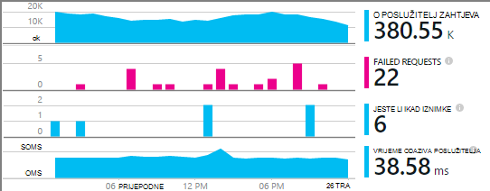

<properties
    pageTitle="Aplikacijske usluge uvida za Windows i uloge suradnika | Microsoft Azure"
    description="Ručno dodavanje uvida SDK aplikacije ASP.NET aplikacija radi analize korištenja, dostupnost i performanse."
    services="application-insights"
    documentationCenter=".net"
    authors="alancameronwills"
    manager="douge"/>

<tags
    ms.service="application-insights"
    ms.workload="tbd"
    ms.tgt_pltfrm="ibiza"
    ms.devlang="na"
    ms.topic="get-started-article"
    ms.date="08/30/2016"
    ms.author="awills"/>

# Ručno konfiguriranje aplikacija uvida za aplikacije ASP.NET 4

*Aplikacija uvida je u pretpregledu.*

[AZURE.INCLUDE [app-insights-selector-get-started](../../includes/app-insights-selector-get-started.md)]

Možete ručno konfigurirati [Uvida aplikacije za Visual Studio](app-insights-overview.md) praćenje servisa Windows, uloge suradnika i drugim aplikacijama ASP.NET. Web-aplikacijama ručna konfiguracija je alternative [Automatsko postavljanje međuverzije](app-insights-asp-net.md) nudi Visual Studio.

Aplikacija uvida pridonosi dijagnosticiranje problema i praćenje performansi i korištenje u aplikaciji za uživo.

#### Prije početka

trebaš:

* Pretplate na [Microsoft Azure](http://azure.com). Ako vaš tim ili tvrtka ili ustanova ima Azure pretplatu, vlasnik možete dodati ste ga pomoću [Microsoftova računa](http://live.com).
* Visual Studio 2013 ili noviji.

## 1. stvaranje do uvida aplikacije resursa

Prijava na [portal za Azure](https://portal.azure.com/)i stvoriti nove uvide aplikacije resurs. Odaberite ASP.NET kao vrsta aplikacije.

[Resursa](app-insights-resources-roles-access-control.md) u Azure je instanca servisa. Ovaj resurs je gdje analizirati i ponuđena telemetrijskih iz aplikacije.

Odabir vrsta aplikacije postavlja zadani sadržaj blades resursa i svojstva vidljive u [Programu Explorer metriku](app-insights-metrics-explorer.md).

#### Kopiranje tipku Instrumentation

Tipku označava resurs pa ćete ga instalirate uskoro u SDK za usmjeravanje podataka resursa.

Koraci koje ste upravo gotovo da biste stvorili novi resurs su dobar način da biste pokrenuli praćenje bilo koju aplikaciju. Sada možete poslati podatke na njega.

## 2. Instalirajte SDK u aplikaciji

Instaliranje i konfiguriranje uvida SDK aplikacije ovisi o platformu na kojima radite. Za aplikacije ASP.NET jednostavno je.

1. U Visual Studio, uredite paketa NuGet projekta web app.

    

2. Instalirajte aplikaciju uvida SDK za web-aplikacije.

    

    *Mogu li koristiti druge pakete?*

    Da. Ako samo želite koristiti u API da biste poslali vlastite telemetrijskih, odaberite Core API-JA (Microsoft.ApplicationInsights). Paketa Windows Server automatski uključuje Core API plus broj druge pakete kao što su performanse brojač prikupljanje i praćenje ovisnosti. 

#### Da biste nadogradili na budućim verzijama SDK

Ne možemo novu verziju SDK pustite s vremena na vrijeme.

Da biste nadogradili na [Novo izdanje SDK](https://github.com/Microsoft/ApplicationInsights-dotnet-server/releases/), otvorite NuGet ponovno Upravitelj paketa i filtriranje na instalirani paketi. Odaberite **Microsoft.ApplicationInsights.Web** , a zatim odaberite **nadogradnju**.

Ako ste sve prilagodbe ApplicationInsights.config, spremite kopiju prije nadogradnje, a naknadno spojiti promjene novu verziju.

## 3. slanje telemetrijskih

**Ako ste instalirali samo paket core API-JA:**

* Postavljanje tipku instrumentation u kodu, primjerice u `main()`: 

    `TelemetryConfiguration.Active.InstrumentationKey = "`*ključ*`";` 

* [Napišite vlastiti telemetrijskih pomoću na API-JA](app-insights-api-custom-events-metrics.md#ikey).

**Ako ste instalirali druge aplikacije uvida pakete** možete, po želji koristiti .config datoteku da biste postavili instrumentation ključ:

* Uređivanje ApplicationInsights.config (koji je dodan po instalaciju NuGet). Posebni znak ispred nje oznaka zatvaranja:

    `<InstrumentationKey>`*tipku instrumentation koju ste kopirali*`</InstrumentationKey>`

* Provjerite je li svojstva ApplicationInsights.config u pregledniku rješenja postavljene na **izgraditi akcija = sadržaj, a zatim Kopiraj izlaznog direktorija = Kopiraj**.

## Pokrenite projekt

Korištenje **F5** da biste pokrenuli aplikaciju i isprobajte sami: otvaranje različite stranice da biste generirali neke telemetrijskih.

U Visual Studio, prikazat će ukupan broj događaja koji su poslani.

## Prikaz vaše telemetrijskih

Vratite se na [portal za Azure](https://portal.azure.com/) i pronađite vaše aplikacije uvida resursa.

Potražite podataka na grafikonima pregled. Najprije, samo vidjet ćete jednu ili dvije točke. Ako, na primjer:

Klikajte stavke za bilo koji od njih da biste vidjeli detaljnije metriku. [Saznajte više o mjernih podataka.](app-insights-web-monitor-performance.md)

#### Nema podataka?

* Korištenje aplikacije, otvaranje druge stranice tako da se generira neke telemetrijskih.
* Otvorite pločicu [pretraživanja](app-insights-diagnostic-search.md) da biste vidjeli pojedinačna događaja. Ponekad je potrebno događaje malo dok je dulje da biste dobili kroz kanal metriku.
* Pričekajte nekoliko sekundi, a zatim kliknite **Osvježi**. Grafikoni osvježavanje same povremeno, ali možete osvježiti ručno ako se čeka nekih podataka koji će se prikazati.
* Potražite u članku [Otklanjanje poteškoća](app-insights-troubleshoot-faq.md).

## Objavljivanje aplikacije

Sada implementacija aplikacije s poslužiteljem ili Azure i gledanje podataka skupiti.

Kada pokrenete u načinu rada za ispravljanje pogrešaka, telemetrijskih poslane kroz kanal, da bi se trebali biste vidjeti podatke koji se pojavljuje u nekoliko sekundi. Ako pokrenete aplikaciju u konfiguraciji izdanje, podaci se akumulira sporije.

#### Nema podataka nakon što ste objavili na poslužitelju?

Otvorite sljedeće priključke za odlazni promet u vatrozidu za vaš poslužitelj:

+ `dc.services.visualstudio.com:443`
+ `f5.services.visualstudio.com:443`

#### Imate li problema prilikom na poslužitelj za sastavljanje?

Pogledajte [ove stavke za otklanjanje poteškoća](app-insights-asp-net-troubleshoot-no-data.md#NuGetBuild).

> [AZURE.NOTE]Ako aplikaciju generira mnogo telemetriju (i koristite 2.0.0-beta3 za verzije platforme ASP.NET SDK ili noviji), modul prilagodljivo uzorkovanje automatski smanjite glasnoću koja je poslana na portal slanjem samo predstavniku razlomak događaja. Međutim, događaja koji se odnose na isti zahtjev će biti odabrana sustavu ili Neoznačeni grupe tako da možete se kretati između događaje povezane. 
> [Informirajte se o uzorkovanje](app-insights-sampling.md).

## Daljnji koraci

* [Dodavanje više telemetrijskih](app-insights-asp-net-more.md) da biste dobili prikaz 360 za stupanj aplikacije.

