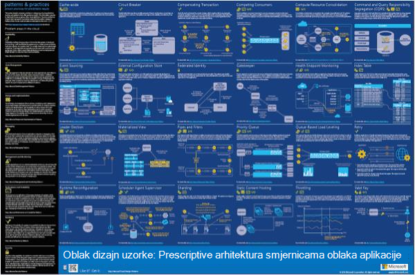
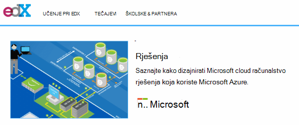
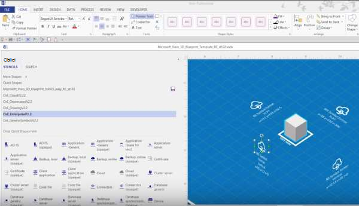
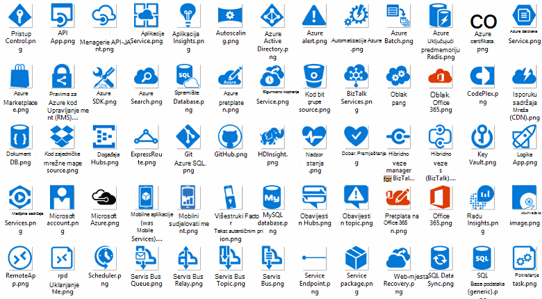
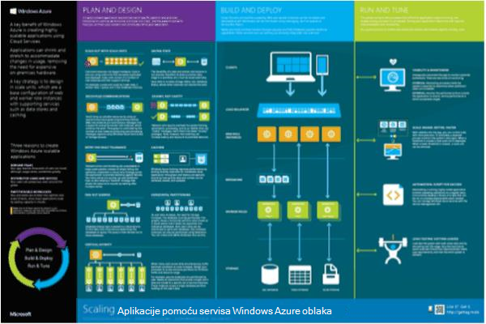

<properties 
    pageTitle="Arhitektura aplikacije na Microsoft Azure | Microsoft Azure" 
    description="Pregled arhitektura koji prekriva uobičajene uzorke dizajna" 
    services="" 
    documentationCenter="" 
    authors="Rboucher" 
    manager="jwhit" 
    editor="mattshel"/>

<tags 
    ms.service="multiple" 
    ms.workload="na" 
    ms.tgt_pltfrm="na" 
    ms.devlang="na" 
    ms.topic="article" 
    ms.date="09/13/2016" 
    ms.author="robb"/>

#Arhitektura aplikacije na Microsoft Azure
Resursi za stvaranje aplikacija koje koriste Microsoft Azure. To obuhvaća alate za dijagramima vizualno opisuju sustavi softvera. 

##Poster za dizajn obrazaca

Uzorci Microsoft & prakse objavio book [Uzoraka oblaka dizajna](http://msdn.microsoft.com/library/dn568099.aspx) koji je dostupan na MSDN- a u članku preuzimanje PDF-a. Postoji dostupno velikom formatu postera koji navodi sve uzorke. 

##Microsoft arhitektura ustanova tečaja

Microsoft stvorio tečaj za arhitektura Microsoft 70-534 ispitnim certifikata za podršku. Ovo je [besplatno dostupni na EDX.ORG](https://www.edx.org/course/architecting-microsoft-azure-solutions-microsoft-dev205x).  Koristi [Predložak programa Visio 3D nacrt](#3d-blueprint-visio-template). 

##Rješenja za Microsoft

Microsoft objavljuje skup visoke razine [arhitekturi rješenja](http://aka.ms/azblueprints) s prikazom načina za izgradnju određene vrste sustavi pomoću Microsoftove proizvode. 

Prethodno, Microsoft objaviti skup blueprints prikazuje primjer arhitekturi. One zamijenjeni arhitekturi rješenje što je već rečeno, a zatim vezu nacrt je bio preusmjeren pokažete na njih. Ako vam je potreban pristup s prethodne materijalima za blueprints zbog nekog razloga, pošaljite e-pošte [CnESymbols@microsoft.com](mailto:CnESymbols@microsoft.com) uz zahtjev.   

U blueprints i dijagrami arhitekturi rješenje koristite dijelove [Oblaku i postavljanje za Enterprise simbol](#Drawing-symbol-and-icon-sets).   

##3D nacrt Visio predloška

3D verzijama sada defunct [Microsoft arhitektura Blueprints](http://aka.ms/azblueprints) prethodno stvorene u alatu za trećih. Predložak programa Visio 2013 (i noviji) poslane na Kol 5, 2015 kao dio programa [Microsoft arhitektura ustanova tečaja distributed na EDX.ORG](#microsoft-architecture-certification-course).

Predložak je dostupan izvan tečaja. 

- [Prikaz videozapisa za obuku](http://aka.ms/3dBlueprintTemplateVideo) prvog da biste znali što možete raditi   
- Preuzimanje u [Microsoft 3d predložak programa Visio nacrt](http://aka.ms/3DBlueprintTemplate)
- Preuzimanje [oblaka i Enterprise simbola](#drawing-symbol-and-icon-sets) za uporabu 3D predložak. 

Slanje e-poštom nam se na [CnESymbols@microsoft.com](mailto:CnESymbols@microsoft.com) za određene pitanja ne materijala za obuku ili da biste poslali povratne informacije. Predložak više nije u aktivni razvoju, ali je i dalje korisno i odgovarajući jer možete koristiti bilo koji PNG ili u [oblak i Enterprise simbole](#drawing-symbol-and-icon-sets), koji će se ažurirati.  

##Skupovi ikona i simbol za crtanje 

[Prikaz programa Visio i simboli osposobljavanja videozapis](http://aka.ms/CnESymbolsVideo) , a zatim [Preuzmite u oblak i postavljanje simbol Enterprise](http://aka.ms/CnESymbols) da biste stvorili tehničke materijale koje opisuju Azure, Windows Server, SQL Server i drugo. Simboli u arhitektura dijagrami, materijala za obuku, prezentacija, podatkovne tablice, infographics, studije i čak i 3 strana knjige možete koristiti ako knjige vlakovi da korisnici koriste Microsoftove proizvode. Međutim, oni nisu namijenjenu za korištenje u korisničkog sučelja.

Simboli CnE su u obliku programa Visio, SVG i PNG. Dodatne upute o tome kako koristiti jednostavno pomoću simbola u programu PowerPoint nalaze u skupu. 

Simbola isporučuje tromjesečno i ažurira tijekom objavljivanja nove servise. 

Dodatni simboli za Microsoft Office i povezane tehnologije dostupnih u [Programu Microsoft Office Visio zaslona za prijavu](http://www.microsoft.com/en-us/download/details.aspx?id=35772), iako nisu optimizirane za arhitektonski dijagrame kao što je skup CnE.   

**Povratnih informacija:** Ako ste iskoristili CnE simbole, popunjavanje kratki 5 pitanje [iz upitnika](http://aka.ms/azuresymbolssurveyv2) ili e-pošte nam se na [CnESymbols@microsoft.com](mailto:CnESymbols@microsoft.com) za određene pitanja i probleme. Željeli bismo znali što mislite, uključujući pozitivan povratne informacije kako bismo znali da biste nastavili s ulažete vrijeme u njima. 

##Infographics arhitekture

Microsoft objavljuje nekoliko arhitektura povezane Posteri/infographics. To su [Sastavni stvarnog života oblaka aplikacije](https://azure.microsoft.com/documentation/infographics/building-real-world-cloud-apps/) i [Skaliranje s servisima u Oblaku](https://azure.microsoft.com/documentation/infographics/cloud-services/) . 

