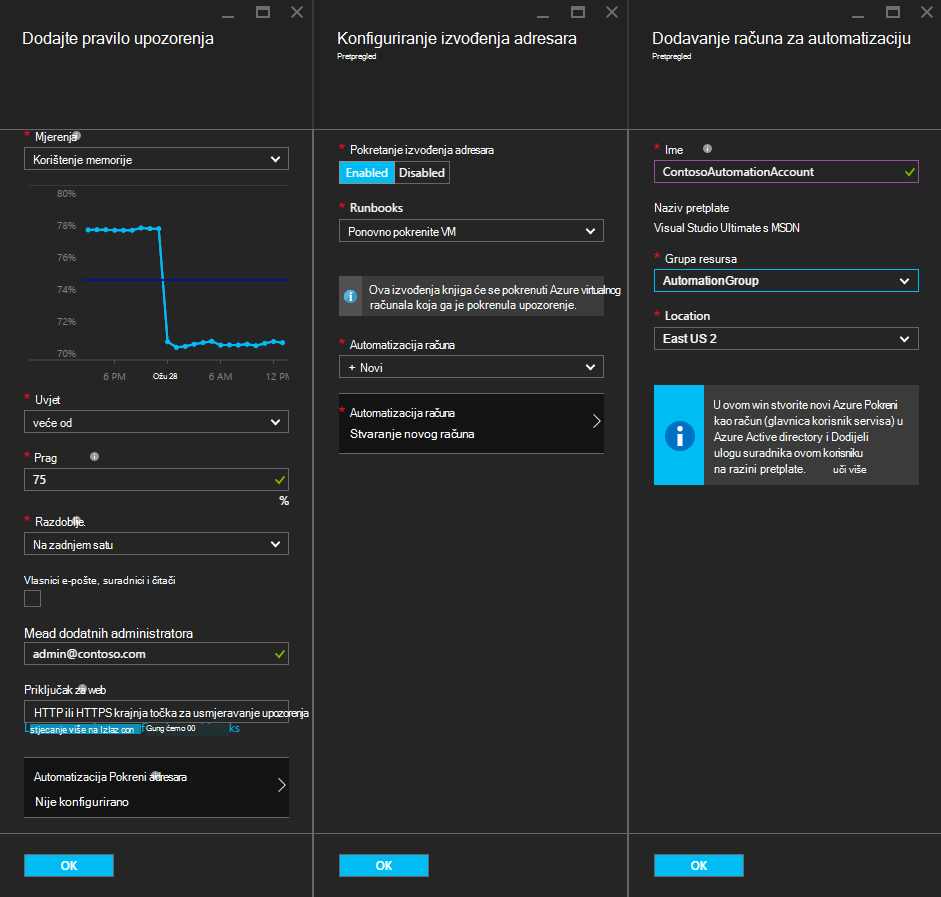
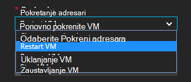
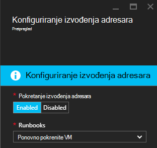
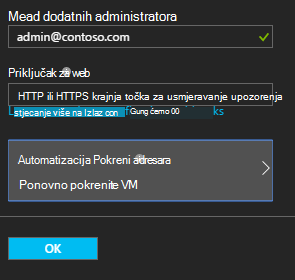

<properties
    pageTitle=" Remediate Azure VM upozorenja s Automatizacija Runbooks | Microsoft Azure"
    description="U ovom se članku objašnjava kako integrirati upozorenja Azure virtualnog računala s runbooks Automatizacija Azure i automatsko remediate problema"
    services="automation"
    documentationCenter=""
    authors="mgoedtel"
    manager="jwhit"
    editor="tysonn" />    
<tags
    ms.service="automation"
    ms.devlang="na"
    ms.topic="article"
    ms.tgt_pltfrm="na"
    ms.workload="infrastructure-services"
    ms.date="06/14/2016"
    ms.author="csand;magoedte" />

# <a name="azure-automation-scenario---remediate-azure-vm-alerts"></a>Scenarij Azure Automatizacija - remediate Azure VM upozorenja

Azure Automatizacija i virtualnim računalima sustava Azure izdala je nova značajka vam omogućuje konfiguriranje upozorenja virtualnog računala (VM) da biste pokrenuli runbooks automatizaciju. Tu mogućnost Nova omogućuje automatski Izvedi standardne olakšava u odgovoru VM upozorenja, kao što je ponovno pokrenuti ili zaustaviti na VM.

Prethodno, prilikom stvaranja upozorenja pravilo VM uspijete [Odredite programa automatizacije webhook](https://azure.microsoft.com/blog/using-azure-automation-to-take-actions-on-azure-alerts/) na runbook da bi se pokrenuti na runbook kad god se pokrene upozorenje. No to potrebno morate obaviti posao stvaranja na runbook, stvaranje webhook za runbook, i zatim kopiranje i lijepljenje u webhook tijekom stvaranja upozorenja pravilo. Postupak s novim izdanjima je jednostavniji jer izravno na raspolaganju u runbook popis tijekom stvaranja upozorenja pravilo, a možete odabrati Automatizacija račun koji će pokrenuti na runbook ili jednostavno stvaranje poslovnog subjekta.

U ovom se članku Pokazat ćemo vam kako je jednostavno možete postaviti upozorenje koje Azure VM i konfigurirati programa automatizacije runbook pokrenuti kad god se pokreće upozorenje. Ogledni scenariji obuhvaćaju ponovno pokretanje programa VM kada memorije koristi premaši neke prag zbog u aplikaciju na VM s memorije ili prekida u VM kada korisnik vrijeme procesora je ispod 1% zadnjih h, a se ne koristi. Ne možemo ćete objašnjava kako automatskog stvaranja servisa glavni na vašem računu Automatizacija pojednostavljuje korištenje runbooks u Azure olakšava upozorenja.

## <a name="create-an-alert-on-a-vm"></a>Stvaranje upozorenja na na VM

Izvršite sljedeće korake da biste konfigurirali upozorenje da biste pokrenuli u runbook nakon ispunjavanja praga.

>[AZURE.NOTE] Uz to je izdanje samo podržavamo V2 virtualnim strojevima i podrška za klasični VMs dodat će se uskoro.  

1. Prijavite se na portal za Azure, a zatim kliknite **virtualnih računala**.  
2. Odaberite jednu od virtualnih računala.  Nadzorna ploča plohu virtualnog računala prikazat će se i **Postavke** plohu s njezine desne strane.  
3. Plohu **Postavke** u odjeljku nadzor odaberite **upozorenja pravila**.
4. Na plohu **upozorenja pravila** kliknite **Dodaj upozorenje**.

Otvorit će se na **dodajte pravilo upozorenja** plohu, gdje možete konfigurirati uvjete za upozorenja i odabrati jedan ili sve od ovih mogućnosti: slanje e-pošte korisniku, pomoću programa webhook prosljeđivanje upozorenje da biste neki drugi sustav i/ili pokretanje programa automatizacije runbook u odgovor pokušaj remediate problem.

## <a name="configure-a-runbook"></a>Konfiguriranje programa runbook

Da biste konfigurirali runbook da biste pokrenuli praga upozorenja VM ispunjen, odaberite **Runbook automatizaciju**. U plohu **runbook Konfiguriraj** možete odabrati runbook da biste pokrenuli i račun za automatizaciju da biste pokrenuli u runbook u.



>[AZURE.NOTE] U ovom izdanju možete odabrati tri runbooks koja omogućuje servis – ponovno pokrenite VM, zaustavljanje VM ili uklanjanje VM (izbrišete).  Mogućnost da biste odabrali druge runbooks ili od vlastite runbooks bit će dostupni u buduće izdanje.



Kad odaberete neku od tri dostupne runbooks, pojavit će se padajući popis **Automatizacija računa** i možete odabrati na runbook će se pokrenuti kao račun za automatizaciju. Runbooks je potrebno za pokretanje u kontekstu [Automatizacija račun](automation-security-overview.md) koji se nalazi u pretplatu za Azure. Možete odabrati račun Automatizacija da ste već stvorili ili imate novi račun za automatizaciju za vas stvara.

Runbooks koje omogućuje provjeru autentičnosti Azure pomoću upravitelja za servis. Ako odaberete da biste pokrenuli u runbook u neki od vaših postojećih računa Automatizacija, ne možemo će automatski stvoriti servis glavni. Ako se odlučite za stvaranje novog računa Automatizacija, zatim ćemo će automatski stvoriti račun i servis upravitelja. U oba slučaja, dva sredstvima i stvorit će se u račun za automatizaciju – certifikat resursa pod nazivom **AzureRunAsCertificate** i veze resursa pod nazivom **AzureRunAsConnection**. Na runbooks će koristiti **AzureRunAsConnection** za provjeru s Azure da biste akciju upravljanje odnosu na VM.

>[AZURE.NOTE] Upravitelj servisa se stvara u opsegu pretplate i je dodijeljena uloga suradnika. Ta uloga potreban je račun koji želite imati dopuštenje za pokretanje Automatizacija runbooks kako bi upravljanje Azure VMs.  Stvaranje programa Automaton računa i/ili servis glavni je jednokratnog događaja. Nakon stvaranja, možete koristiti taj račun da biste pokrenuli runbooks za druga upozorenja Azure VM.

Kada kliknete **u redu** upozorenje je konfiguriran i ako ste odabrali mogućnost stvaranja novog računa Automatizacija, stvara se uz servis glavni.  To može potrajati nekoliko sekundi da biste dovršili.  



Po dovršetku konfiguracije vidjet ćete naziv u kompilacije pojavljuju se u plohu **dodajte pravilo upozorenja** .



Kliknite **u redu** u **dodajte pravilo upozorenja** plohu upozorenja pravilo stvorit će se i aktiviranje ako je u stanju izvršavanja virtualnog računala.

### <a name="enable-or-disable-a-runbook"></a>Omogućivanje i onemogućivanje programa runbook

Ako imate runbook konfiguriran za upozorenja, možete ga onemogućiti bez uklanjanja runbook konfiguracije. To možete zadržati upozorenje pokrenut i možda testiranje neka od upozorenja pravila, a zatim kasnije ponovno omogućiti na runbook.

## <a name="create-a-runbook-that-works-with-an-azure-alert"></a>Stvaranje runbook kojima radi Azure upozorenja

Kada se odlučite na runbook u sklopu Azure upozorenja pravila, u runbook mora imati logike u njoj za upravljanje podacima upozorenja koja se prenosi u nju.  Kada je runbook konfiguriran u pravilo za upozorenja, na webhook se stvara za runbook; tu webhook koristi se za pokretanje u runbook svaki put kada se pokrene upozorenje.  Stvarni poziv da biste započeli s runbook je zahtjev HTTP POST na webhook URL. U tijelu zahtjeva za objavu sadrži JSON formatiran objekt koji sadrži korisne svojstava koja se odnose na upozorenje.  Kao što možete vidjeti ispod, upozorenja podaci sadrže detalje kao što su subscriptionID, resourceGroupName, resourceName i resourceType.

### <a name="example-of-alert-data"></a>Primjer upozorenja podataka
```
{
    "WebhookName": "AzureAlertTest",
    "RequestBody": "{
    \"status\":\"Activated\",
    \"context\": {
        \"id\":\"/subscriptions/<subscriptionId>/resourceGroups/MyResourceGroup/providers/microsoft.insights/alertrules/AlertTest\",
        \"name\":\"AlertTest\",
        \"description\":\"\",
        \"condition\": {
            \"metricName\":\"CPU percentage guest OS\",
            \"metricUnit\":\"Percent\",
            \"metricValue\":\"4.26337916666667\",
            \"threshold\":\"1\",
            \"windowSize\":\"60\",
            \"timeAggregation\":\"Average\",
            \"operator\":\"GreaterThan\"},
        \"subscriptionId\":\<subscriptionID> \",
        \"resourceGroupName\":\"TestResourceGroup\",
        \"timestamp\":\"2016-04-24T23:19:50.1440170Z\",
        \"resourceName\":\"TestVM\",
        \"resourceType\":\"microsoft.compute/virtualmachines\",
        \"resourceRegion\":\"westus\",
        \"resourceId\":\"/subscriptions/<subscriptionId>/resourceGroups/TestResourceGroup/providers/Microsoft.Compute/virtualMachines/TestVM\",
        \"portalLink\":\"https://portal.azure.com/#resource/subscriptions/<subscriptionId>/resourceGroups/TestResourceGroup/providers/Microsoft.Compute/virtualMachines/TestVM\"
        },
    \"properties\":{}
    }",
    "RequestHeader": {
        "Connection": "Keep-Alive",
        "Host": "<webhookURL>"
    }
}
```

Kada Automation Services webhook primi HTTP POST izdvaja upozorenja podatke i prosljeđuje runbook u na ulazni parametar runbook WebhookData.  U nastavku je runbook uzorka koji pokazuje kako koristiti parametar WebhookData izdvojiti upozorenja podatke i koristiti za upravljanje Azure resurs koji se aktivira upozorenje.

### <a name="example-runbook"></a>Primjer runbook

```
#  This runbook will restart an ARM (V2) VM in response to an Azure VM alert.

[OutputType("PSAzureOperationResponse")]

param ( [object] $WebhookData )

if ($WebhookData)
{
    # Get the data object from WebhookData
    $WebhookBody = (ConvertFrom-Json -InputObject $WebhookData.RequestBody)

    # Assure that the alert status is 'Activated' (alert condition went from false to true)
    # and not 'Resolved' (alert condition went from true to false)
    if ($WebhookBody.status -eq "Activated")
    {
        # Get the info needed to identify the VM
        $AlertContext = [object] $WebhookBody.context
        $ResourceName = $AlertContext.resourceName
        $ResourceType = $AlertContext.resourceType
        $ResourceGroupName = $AlertContext.resourceGroupName
        $SubId = $AlertContext.subscriptionId

        # Assure that this is the expected resource type
        Write-Verbose "ResourceType: $ResourceType"
        if ($ResourceType -eq "microsoft.compute/virtualmachines")
        {
            # This is an ARM (V2) VM

            # Authenticate to Azure with service principal and certificate
            $ConnectionAssetName = "AzureRunAsConnection"
            $Conn = Get-AutomationConnection -Name $ConnectionAssetName
            if ($Conn -eq $null) {
                throw "Could not retrieve connection asset: $ConnectionAssetName. Check that this asset exists in the Automation account."
            }
            Add-AzureRMAccount -ServicePrincipal -Tenant $Conn.TenantID -ApplicationId $Conn.ApplicationID -CertificateThumbprint $Conn.CertificateThumbprint | Write-Verbose
            Set-AzureRmContext -SubscriptionId $SubId -ErrorAction Stop | Write-Verbose

            # Restart the VM
            Restart-AzureRmVM -Name $ResourceName -ResourceGroupName $ResourceGroupName
        } else {
            Write-Error "$ResourceType is not a supported resource type for this runbook."
        }
    } else {
        # The alert status was not 'Activated' so no action taken
        Write-Verbose ("No action taken. Alert status: " + $WebhookBody.status)
    }
} else {
    Write-Error "This runbook is meant to be started from an Azure alert only."
}
```

## <a name="summary"></a>Sažetak

Kada konfigurirate upozorenja na programa Azure VM, sada imate mogućnost jednostavno konfiguriranje programa automatizacije runbook za automatski akciju olakšava kada upozorenje. U ovom izdanju možete birati runbooks da biste ponovno pokrenite, prekinuti ili brisanje VM ovisno o scenariju upozorenja. To je samo početak omogućivanjem scenarija u kojem određujete Akcije (obavijesti, otklanjanje poteškoća potražite alat za) koje će biti izvedena automatski kada upozorenja.

## <a name="next-steps"></a>Daljnji koraci

- Početak rada s grafički runbooks, potražite u članku [Moj prvi grafički runbook](automation-first-runbook-graphical.md)
- Početak rada s runbooks PowerShell tijeka rada, u odjeljku [Moje prvi runbook PowerShell tijeka rada](automation-first-runbook-textual.md)
- Dodatne informacije o vrstama runbook, njihove prednosti i ograničenja potražite u članku [vrste runbook Automatizacija Azure](automation-runbook-types.md)
