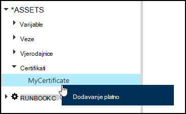
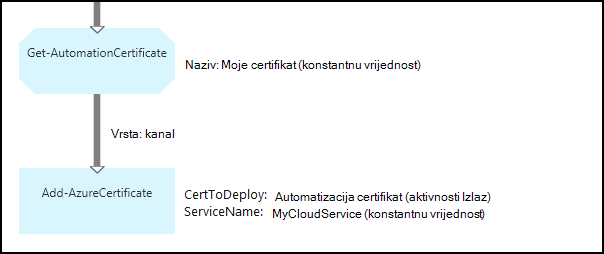

<properties 
   pageTitle="Potvrda resursima u Azure Automatizacija | Microsoft Azure"
   description="Certifikati moguće pohraniti sigurno u Azure Automatizacija tako da se može pristupiti runbooks ili DSC konfiguracija za provjeru autentičnosti Azure i resursima drugih proizvođača.  U ovom se članku objašnjava detalje certifikata i kako raditi s njima u tekstnih i grafičke za izradu."
   services="automation"
   documentationCenter=""
   authors="mgoedtel"
   manager="stevenka"
   editor="tysonn" />
<tags 
   ms.service="automation"
   ms.devlang="na"
   ms.topic="article"
   ms.tgt_pltfrm="na"
   ms.workload="infrastructure-services"
   ms.date="02/23/2016"
   ms.author="magoedte;bwren" />

# Certifikat resursima u Automatizacija Azure

Certifikati može se spremiti sigurno u automatizaciji Azure tako da se može pristupiti runbooks ili DSC konfiguracije pomoću **Get-AutomationCertificate** aktivnosti. Omogućuje stvaranje runbooks i konfiguracija DSC koje koriste certifikate za provjeru autentičnosti ili ih dodaje Azure ili drugih proizvođača resursa.

>[AZURE.NOTE] Sigurna resursima u Azure Automatizacija obuhvaćaju vjerodajnice, certifikata, veze i šifrirane varijabli. Ove imovine šifriraju se i pohranjuju u automatizaciji Azure pomoću jedinstvenih tipke koje generira za svaki račun za automatizaciju. Ovaj ključ je šifrirana uz osnovne certifikata i pohranjene u automatizaciji Azure. Prije pohrani sigurne resursa, ključ za račun za automatizaciju je dešifriranu pomoću osnovnih certifikata i za šifriranje sredstava.

## Cmdleti za Windows PowerShell

Cmdleti za u tablici u nastavku se koriste za stvaranje i upravljanje resursima certifikat za automatizaciju s komponentom Windows PowerShell. Isporuka se kao dio [Modul Azure PowerShell](../powershell-install-configure.md) koji je dostupan za korištenje u runbooks Automatizacija i DSC konfiguracije.

|Cmdleti za|Opis|
|:---|:---|
|[Get-AzureAutomationCertificate](http://msdn.microsoft.com/library/dn913765.aspx)|Dohvaća podatke o potvrdi. Certifikat sam možete dohvatiti samo iz Get-AutomationCertificate aktivnosti.|
|[Novi AzureAutomationCertificate](http://msdn.microsoft.com/library/dn913764.aspx)|Uvozi novi certifikat u Azure automatizaciju.|
|[Uklanjanje - AzureAutomationCertificate](http://msdn.microsoft.com/library/dn913773.aspx)|Uklanja certifikat iz Azure automatizaciju.|
|[Postavljanje – AzureAutomationCertificate](http://msdn.microsoft.com/library/dn913763.aspx)|Postavlja svojstva uključujući prijenos datoteka certifikata i postavljanje lozinke za na .pfx postojeći certifikat.|

## Aktivnosti da biste pristupili certifikata

Aktivnosti u tablici u nastavku koriste se za pristup potvrde u runbook ili DSC konfiguracije.

|Aktivnosti|Opis|
|:---|:---|
|Get-AutomationCertificate|Dohvaća certifikat koji ćete koristiti u runbook ili DSC konfiguracije.|

>[AZURE.NOTE] Izbjegavajte korištenje varijable u – naziv parametar Get-AutomationCertificate jer to može zakomplicirati željeli otkriti međuzavisnosti runbooks ili DSC konfiguracije i certifikata imovine u trenutku dizajniranja.

## Stvaranje novog certifikata

Kada stvorite novi certifikat, prenesite .cer ili .pfx datoteka za automatizaciju Azure. Ako označite certifikat kao izvesti, možete ga proslijedite iz spremišta certifikata za automatizaciju Azure. Ako se ne može izvesti, pa je možete se koristiti samo za potpisivanje unutar runbook ili DSC konfiguracije.

### Da biste stvorili novi certifikat s portala za Azure klasični

1. Računa automatizacije kliknite **Resursi** pri vrhu prozora.
1. Pri dnu prozora kliknite **Dodavanje postavku**.
1. Kliknite **Dodaj vjerodajnica**.
2. Na padajućem popisu **Vrsta vjerodajnica** odaberite **certifikat**.
3. U okvir **naziv** upišite naziv za potvrdu, a zatim kliknite strelicu desno.
4. Traženje .cer ili .pfx datoteka.  Ako ste odabrali .pfx datoteka, navedite lozinku i hoće li se smije moguće izvesti.
1. Kliknite kvačicu za prijenos datoteka certifikata i spremanje novog resursa certifikata.

### Da biste stvorili novi certifikat s portala za Azure

1. Računa automatizacije kliknite dio **imovine** da biste otvorili plohu **Resursi** .
1. Kliknite dio **potvrde** da biste otvorili plohu **certifikata** .
1. Kliknite **Dodaj certifikat** pri vrhu na plohu.
2. U okvir **naziv** upišite naziv certifikata.
2. Kliknite **Odaberite datoteku** u odjeljku **prijenos datoteka certifikata** za traženje .cer ili .pfx datoteka.  Ako ste odabrali .pfx datoteka, navedite lozinku i hoće li se smije moguće izvesti.
1. Kliknite **Stvori** da biste spremili novi certifikat resursa.

### Da biste stvorili novi certifikat s komponentom Windows PowerShell

Sljedeće primjere naredbi prikazuju kako stvoriti novi certifikat za automatizaciju i označava izvesti. Time se uvozi postojeći .pfx datoteka.

    $certName = 'MyCertificate'
    $certPath = '.\MyCert.pfx'
    $certPwd = ConvertTo-SecureString -String 'P@$$w0rd' -AsPlainText -Force
    
    New-AzureAutomationCertificate -AutomationAccountName "MyAutomationAccount" -Name $certName -Path $certPath –Password $certPwd -Exportable

## Pomoću certifikata

**Get-AutomationCertificate** aktivnosti morate koristiti da biste koristili certifikat. Cmdlet [Get-AzureAutomationCertificate](http://msdn.microsoft.com/library/dn913765.aspx) ne možete koristiti jer je vraća informacije o resursa certifikata, ali ne samu certifikata.

### Ogledna tekstnih runbook

Sljedeći ogledni kod prikazuje kako dodati certifikat u oblaku na runbook. U ovom primjeru lozinka se dohvaća iz varijablu šifrirane automatizaciju.

    $serviceName = 'MyCloudService'
    $cert = Get-AutomationCertificate -Name 'MyCertificate'
    $certPwd = Get-AutomationVariable –Name 'MyCertPassword'
    Add-AzureCertificate -ServiceName $serviceName -CertToDeploy $cert

### Grafički runbook uzorka

Dodati **Get-AutomationCertificate** grafički runbook tako da desnom tipkom miša na certifikat u oknu biblioteke grafički uređivača, a zatim odaberete **Dodaj da biste platna**.

Na sljedećoj je slici prikazan primjer korištenja certifikat u grafički runbook.  To je isti primjeru iznad za dodavanje certifikat na servis u oblaku iz tekstnih runbook.  

U ovom se primjeru koristi parametar **UseConnectionObject** postavljen za **Slanje TwilioSMS** aktivnosti koja koristi objekt veze za provjeru autentičnosti na servis.  [Veza za kanal](automation-graphical-authoring-intro.md#links-and-workflow) se mora koristiti ovdje jer niz veze želite vratiti zbirku koja sadrži jedan objekt koji se ne očekuje parametra veze.

## Vidi također

- [Veza za izradu grafički](automation-graphical-authoring-intro.md#links-and-workflow) 
