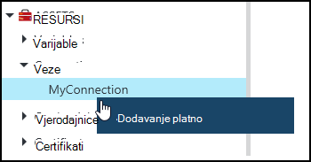
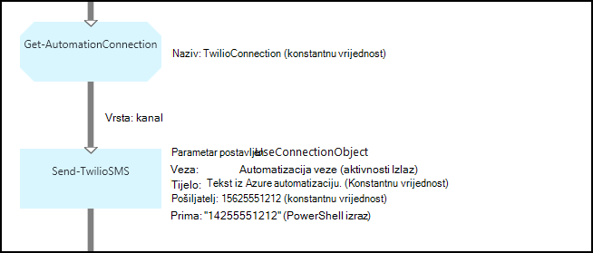
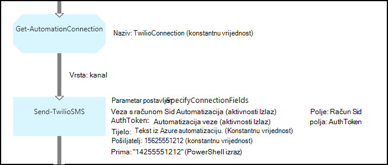

<properties 
   pageTitle="Resursi veze u automatizaciji Azure | Microsoft Azure"
   description="Resursi veze u automatizaciji Azure sadrže podatke potrebne za povezivanje s vanjskim servisom ili aplikacija iz runbook ili DSC konfiguracije. U ovom se članku objašnjava detalje o vezama i kako raditi s njima u tekstnih i grafičke za izradu."
   services="automation"
   documentationCenter=""
   authors="bwren"
   manager="stevenka"
   editor="tysonn" />
<tags 
   ms.service="automation"
   ms.devlang="na"
   ms.topic="article"
   ms.tgt_pltfrm="na"
   ms.workload="infrastructure-services"
   ms.date="01/27/2016"
   ms.author="bwren" />

# Resursi veze u automatizaciji Azure

Automatizacija imovine veze sadrži podatke potrebne za povezivanje s vanjskim servisom ili aplikacija runbook ili DSC konfiguracije. To može obuhvaćati potrebne podatke za provjeru autentičnosti, kao što je korisničko ime i lozinku uz podatke o vezi kao što su URL-a ili priključak. Vrijednost veze je čuvanja sva svojstva za povezivanje određenu aplikaciju u jednu imovinu umjesto većeg broja varijabli. Korisnik može uređivati vrijednosti za vezu na jednom mjestu, a naziv veze možete proslijediti runbook ili DSC konfiguracija u jedan parametar. Svojstva veze možete pristupiti u runbook ili DSC konfiguracija s **Get-AutomationConnection** aktivnosti.

Kada stvorite vezu, morate odrediti *vrstu veze*. Vrsta veze je predložak koji definira skup svojstava. Veza definira vrijednosti za svaki svojstvo definirano u vrstu veze. Vrsta veze se dodaju za automatizaciju Azure u module za integraciju ili stvorene pomoću [Azure Automatizacija API -JA](http://msdn.microsoft.com/library/azure/mt163818.aspx). Vrste samo veze koje su dostupne kada stvorite vezu su oni instaliran na vašem računu za automatizaciju.

>[AZURE.NOTE] Sigurna resursima u Azure Automatizacija obuhvaćaju vjerodajnice, certifikata, veze i šifrirane varijabli. Ove imovine šifriraju se i pohranjuju u automatizaciji Azure pomoću jedinstvenih tipke koje generira za svaki račun za automatizaciju. Ovaj ključ je šifrirana uz osnovne certifikata i pohranjene u automatizaciji Azure. Prije pohrani sigurne resursa, ključ za račun za automatizaciju je dešifriranu pomoću osnovnih certifikata i za šifriranje sredstava.

## Cmdleti za Windows PowerShell

Cmdleti za u tablici u nastavku se koriste za stvaranje i upravljanje vezama Automatizacija s komponentom Windows PowerShell. Isporuka se kao dio [Modul Azure PowerShell](../powershell-install-configure.md) koji je dostupan za korištenje u runbooks Automatizacija i DSC konfiguracije.

|Cmdlet|Opis|
|:---|:---|
|[Get-AzureAutomationConnection](http://msdn.microsoft.com/library/dn921828.aspx)|Dohvaća veze. Obuhvaća raspršivanje tablicu s vrijednosti polja željenu vezu.|
|[Novi AzureAutomationConnection](http://msdn.microsoft.com/library/dn921825.aspx)|Stvara novu vezu.|
|[Uklanjanje AzureAutomationConnection](http://msdn.microsoft.com/library/dn921827.aspx)|Uklonite postojeće veze.|
|[Postavljanje AzureAutomationConnectionFieldValue](http://msdn.microsoft.com/library/dn921826.aspx)|Postavlja vrijednost određenog polja za postojeće veze.|

## Aktivnosti

Da biste pristupili veze u runbook ili DSC konfiguracije koriste se aktivnosti u tablici u nastavku.

|Aktivnosti|Opis|
|---|---|
|Get-AutomationConnection|Dohvaća vezu da biste koristili. Vraća tablicu raspršivanje sa svojstvima veze.|

>[AZURE.NOTE] Izbjegavajte korištenje varijable u – naziv parametar **Get-AutomationConnection** jer je to zakomplicirati željeli otkriti međuzavisnosti runbooks ili DSC konfiguracije i resursi veze u trenutku dizajniranja.

## Stvaranje nove veze

### Da biste stvorili novu vezu s portala za Azure klasični

1. Računa automatizacije kliknite **Resursi** pri vrhu prozora.
1. Pri dnu prozora kliknite **Dodavanje postavku**.
1. Kliknite **Dodaj vezu**.
2. Na padajućem popisu **Vrsta veze** odaberite vrstu veze koju želite stvoriti.  Čarobnjak će prikazati svojstva za tu vrstu.
1. Dovršite čarobnjak, a zatim kliknite potvrdni okvir da biste spremili novu vezu.

### Da biste stvorili novu vezu s portala za Azure

1. Računa automatizacije kliknite dio **imovine** da biste otvorili plohu **Resursi** .
1. Kliknite dio **veze** da biste otvorili plohu **veze** .
1. Kliknite **Dodavanje veze** na vrhu na plohu.
2. Na padajućem popisu **Vrsta** odaberite vrstu veze koju želite stvoriti. Obrazac će prikazati svojstva za tu vrstu.
1. Ispunite obrazac, a zatim kliknite **Stvori** da biste spremili novu vezu.

### Da biste stvorili novu vezu s komponentom Windows PowerShell

Da biste stvorili novu vezu s komponentom Windows PowerShell pomoću cmdleta [New-AzureAutomationConnection](http://msdn.microsoft.com/library/dn921825.aspx) . Ovaj cmdlet sadrži parametar pod nazivom **ConnectionFieldValues** očekuje [raspršivanje tablice](http://technet.microsoft.com/library/hh847780.aspx) koji definira vrijednosti za svaku od svojstava definira vrstu veze.

Sljedeće primjere naredbi stvorite novu vezu za [Twilio](http://www.twilio.com) što je telefonski servis koji omogućuje slanje i primanje tekstnih poruka.  Modul za integraciju uzorka koja sadrži vrstu veze Twilio dostupan je u [Centar za skripte](http://gallery.technet.microsoft.com/scriptcenter/Twilio-PowerShell-Module-8a8bfef8).  Tu vrstu veze definira svojstva za SID računa i autorizacije tokena koje su potrebne za provjeru valjanosti računa prilikom povezivanja s Twilio.  Morate [preuzeti ovom modulu](http://gallery.technet.microsoft.com/scriptcenter/Twilio-PowerShell-Module-8a8bfef8) , i instalirajte ga na vašem računu Automatizacija za ovaj primjer koda za rad.

    $AccountSid = "DAf5fed830c6f8fac3235c5b9d58ed7ac5"
    $AuthToken  = "17d4dadfce74153d5853725143c52fd1"
    $FieldValues = @{"AccountSid" = $AccountSid;"AuthToken"=$AuthToken}

    New-AzureAutomationConnection -AutomationAccountName "MyAutomationAccount" -Name "TwilioConnection" -ConnectionTypeName "Twilio" -ConnectionFieldValues $FieldValues

## Pomoću veze u runbook ili DSC konfiguracija

Dohvaćanje veze u runbook ili DSC konfiguracija pomoću cmdleta **Get-AutomationConnection** .  Aktivnost dohvaća vrijednosti različitih polja u vezi i vraća ih kao [tablicu raspršivanje](http://go.microsoft.com/fwlink/?LinkID=324844) koji se zatim može koristiti odgovarajuće naredbe runbook ili DSC konfiguracije.

### Ogledna tekstnih runbook
Sljedeće primjere naredbi pokazati kako pomoću veze Twilio u prethodnom primjeru slanje tekstnih poruka iz programa runbook.  Slanje TwilioSMS aktivnosti ovdje koristiti ima dva parametra skupa svaki koristite drugi način za provjeru autentičnosti Twilio servisa.  Jedan koristi objekt veze i druge koristi pojedinačne parametara SID računa i autorizacije tokena.  U ovom primjeru prikazane su obje metode.

    $Con = Get-AutomationConnection -Name "TwilioConnection"
    $NumTo = "14255551212"
    $NumFrom = "15625551212"
    $Body = "Text from Azure Automation."

    #Send text with connection object.
    Send-TwilioSMS -Connection $Con -From $NumFrom -To $NumTo -Body $Body

    #Send text with connection properties.
    Send-TwilioSMS -AccountSid $Con.AccountSid -AuthToken $Con.AuthToken -From $NumFrom -To $NumTo -Body $Body

### Grafički runbook uzorka

Dodajte aktivnost **Get-AutomationConnection** grafički runbook tako da desnom tipkom miša na veze u oknu biblioteke grafički uređivača, a zatim odaberete **Dodaj da biste platna**.

Na sljedećoj je slici prikazan primjer pomoću veze u grafički runbook.  To je isti primjeru za slanje tekstnu poruku pomoću Twilio iz tekstnih runbook.  U ovom se primjeru koristi parametar **UseConnectionObject** postavljen za **Slanje TwilioSMS** aktivnosti koja koristi objekt veze za provjeru autentičnosti na servis.  [Veza za kanal](automation-graphical-authoring-intro.md#links-and-workflow) koristi se ovdje jer parametra veze očekuje jedan objekt.

Razlog PowerShell izraz koristi za vrijednost u parametru **Da biste** umjesto konstantna vrijednost koja je taj parametar da očekuje vrstu vrijednosti niza polja tako da možete poslati više brojeva.  PowerShell izraz omogućuje vam da navedete jednu vrijednost ili polju.

Na donjoj slici prikazano je isti kao gornjem primjeru no koristi **SpecifyConnectionFields** parametar postavljen koje očekuje AccountSid i AuthToken parametara da bude navedena pojedinačno umjesto korištenja connection objekt za provjeru autentičnosti.  U ovom slučaju polja veze određeni su klauzulom umjesto sam objekt.  

## Povezani članci

- [Veza za izradu grafički](automation-graphical-authoring-intro.md#links-and-workflow)
 
