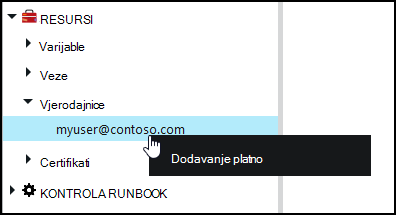
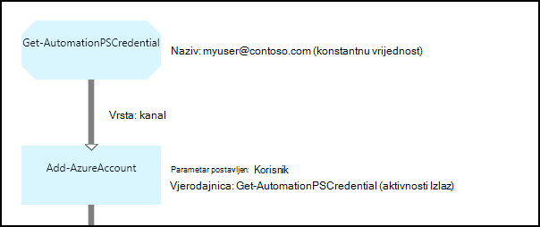

<properties 
   pageTitle="Vjerodajnica resursima u Azure Automatizacija | Microsoft Azure"
   description="Resursi vjerodajnica u automatizaciji Azure sadrže sigurnosnih vjerodajnica koje je moguće koristiti za provjeru autentičnosti resursi pristupati runbook ili DSC konfiguracije. U ovom se članku opisuje kako stvaranje imovine vjerodajnica te ih koristiti u runbook ili DSC konfiguracije."
   services="automation"
   documentationCenter=""
   authors="mgoedtel"
   manager="jwhit"
   editor="tysonn" />
<tags 
   ms.service="automation"
   ms.devlang="na"
   ms.topic="article"
   ms.tgt_pltfrm="na"
   ms.workload="infrastructure-services"
   ms.date="06/09/2016"
   ms.author="bwren" />

# Resursi vjerodajnica u automatizaciji Azure

Sredstvo vjerodajnicama automatizaciju naveden [PSCredential](http://msdn.microsoft.com/library/system.management.automation.pscredential) objekt koji sadrži sigurnosne vjerodajnice, kao što je korisničko ime i lozinku. Runbooks i DSC konfiguracije možda pomoću cmdleta koji prihvaćaju PSCredential objekt za provjeru autentičnosti ili možda izdvojiti korisničko ime i lozinku objekta PSCredential radi olakšavanja neke aplikacije ili servisa zahtijeva provjeru autentičnosti. Svojstva za vjerodajnice spremaju sigurno u automatizaciji Azure i može se pristupiti u runbook ili DSC konfiguracija s [Get-AutomationPSCredential](http://msdn.microsoft.com/library/system.management.automation.pscredential.aspx) aktivnosti.

>[AZURE.NOTE] Sigurna resursima u Azure Automatizacija obuhvaćaju vjerodajnice, certifikata, veze i šifrirane varijabli. Ove imovine šifriraju se i pohranjuju u automatizaciji Azure pomoću jedinstvenih tipke koje generira za svaki račun za automatizaciju. Ovaj ključ je šifrirana uz osnovne certifikata i pohranjene u automatizaciji Azure. Prije pohrani sigurne resursa, ključ za račun za automatizaciju je dešifriranu pomoću osnovnih certifikata i za šifriranje sredstava. 

## Cmdleta ljuske Windows PowerShell

Cmdleti za u tablici u nastavku se koriste za stvaranje i upravljanje njima automatizaciji vjerodajnica resursima pomoću komponente Windows PowerShell.  Isporuka se kao dio [Modul Azure PowerShell](../powershell-install-configure.md) koji je dostupan za korištenje u runbooks Automatizacija i DSC konfiguracije.

|Cmdleti za|Opis|
|:---|:---|
|[Get-AzureAutomationCredential](http://msdn.microsoft.com/library/dn913781.aspx)|Dohvaća podatke o imovini vjerodajnica. Vjerodajnica sam možete dohvatiti samo iz **Get-AutomationPSCredential** aktivnosti.|
|[Novi AzureAutomationCredential](http://msdn.microsoft.com/library/azure/jj554330.aspx)|Stvara novu vjerodajnice za automatizaciju.|
|[Uklanjanje - AzureAutomationCredential](http://msdn.microsoft.com/library/azure/jj554330.aspx)|Uklanja vjerodajnicu za automatizaciju.|
|[Postavljanje – AzureAutomationCredential](http://msdn.microsoft.com/library/azure/jj554330.aspx)|Postavlja svojstva za postojeće vjerodajnica za automatizaciju.|

## Runbook aktivnosti

Aktivnosti u tablici u nastavku koriste se za pristup vjerodajnice na runbook i konfiguracija DSC.

|Aktivnosti|Opis|
|:---|:---|
|Get-AutomationPSCredential|Dohvaća vjerodajnica za korištenje u runbook ili DSC konfiguracije. Vraća [System.Management.Automation.PSCredential](http://msdn.microsoft.com/library/system.management.automation.pscredential) objekt.|

>[AZURE.NOTE] Izbjegavajte korištenje varijable u – naziv parametar Get-AutomationPSCredential jer to može zakomplicirati željeli otkriti međuzavisnosti runbooks ili DSC konfiguracije i vjerodajnica imovine u trenutku dizajniranja.

## Stvaranje nove sredstvo vjerodajnicama

### Da biste stvorili novu vjerodajnice imovinu s portala za Azure klasični

1. Računa automatizacije kliknite **Resursi** pri vrhu prozora.
1. Pri dnu prozora kliknite **Dodavanje postavku**.
1. Kliknite **Dodaj vjerodajnica**.
2. Na padajućem popisu **Vrsta vjerodajnica** odaberite **PowerShell vjerodajnica**.
1. Dovršite čarobnjak, a zatim kliknite potvrdni okvir da biste spremili novi vjerodajnica.

### Da biste stvorili novu vjerodajnice imovinu s portala za Azure

1. Računa automatizacije kliknite dio **imovine** da biste otvorili plohu **Resursi** .
1. Kliknite dio **vjerodajnice** da biste otvorili plohu **vjerodajnice** .
1. Kliknite **Dodaj vjerodajnice** pri vrhu na plohu.
1. Ispunite obrazac, a zatim kliknite **Stvori** da biste spremili novi vjerodajnica.

### Da biste stvorili novu vjerodajnice imovinu s komponentom Windows PowerShell

Sljedeće primjere naredbi pokazati kako stvoriti novu vjerodajnice za automatizaciju. PSCredential objekt je stvoreno pomoću imena i lozinke i zatim koristiti za stvaranje sredstvo vjerodajnicama. Osim toga, nije moguće pomoću cmdleta **Get-vjerodajnica** dobiti upit o upišite ime i lozinku.

    $user = "MyDomain\MyUser"
    $pw = ConvertTo-SecureString "PassWord!" -AsPlainText -Force
    $cred = New-Object –TypeName System.Management.Automation.PSCredential –ArgumentList $user, $pw
    New-AzureAutomationCredential -AutomationAccountName "MyAutomationAccount" -Name "MyCredential" -Value $cred

## Pomoću komponente PowerShell vjerodajnica

Dohvaćanje vjerodajnica resursa u runbook ili DSC konfiguracija s **Get-AutomationPSCredential** aktivnosti. To vraća [PSCredential objekt](http://msdn.microsoft.com/library/system.management.automation.pscredential.aspx) koji možete koristiti s aktivnosti ili cmdlet koji zahtijeva PSCredential parametar. Također možete dohvatiti svojstva objekta vjerodajnica koji želite koristiti pojedinačno. Objekt ima svojstvo za korisničko ime i lozinku za sigurnu ili **GetNetworkCredential** način možete koristiti da biste se vratili na objekt [NetworkCredential](http://msdn.microsoft.com/library/system.net.networkcredential.aspx) koje vam ponuditi nezaštićenu verziju lozinku.

### Ogledna tekstnih runbook

Sljedeće primjere naredbi pokazati kako pomoću ljuske PowerShell vjerodajnica u na runbook. U ovom primjeru vjerodajnicu se dohvate i njegov korisničko ime i lozinku dodijeljena varijabli.

    $myCredential = Get-AutomationPSCredential -Name 'MyCredential'
    $userName = $myCredential.UserName
    $securePassword = $myCredential.Password
    $password = $myCredential.GetNetworkCredential().Password

### Grafički runbook uzorka

Dodajte aktivnost **Get-AutomationPSCredential** grafički runbook tako da desnom tipkom miša na vjerodajnica u oknu biblioteke grafički uređivača, a zatim odaberete **Dodaj da biste platna**.

Na sljedećoj je slici prikazan primjer korištenja vjerodajnice u grafički runbook.  U ovom slučaju se koristi za provjeru autentičnosti runbook Azure resursima kao što je opisano u [Autentičnost Runbooks Azure AD korisnički račun](automation-sec-configure-aduser-account.md).  Prvi aktivnosti dohvaća vjerodajnica koje ima pristup Azure pretplate.  **Dodavanje AzureAccount** aktivnosti koristi ove vjerodajnice omogućuje provjeru autentičnosti za sve aktivnosti koje se isporučuju iza nje.  [Veza za kanal](automation-graphical-authoring-intro.md#links-and-workflow) je ovdje jer **Get-AutomationPSCredential** očekuje jedan objekt.  

## Korištenje ljuske PowerShell vjerodajnica u DSC
Dok DSC konfiguracije u Azure Automatizacija možete referencirati vjerodajnica koju koristite **Get-AutomationPSCredential**, sredstvima vjerodajnica mogu i proslijediti u putem parametre, po želji. Dodatne informacije potražite u članku [Konfiguracija Compiling u DSC Automatizacija Azure](automation-dsc-compile.md#credential-assets).

## Daljnji koraci

- Dodatne informacije o vezama u grafički authoring potražite u članku [veze u grafički authoring](automation-graphical-authoring-intro.md#links-and-workflow)
- Da biste shvatili na različite načine provjere autentičnosti s Automatizacija, potražite u članku [Sigurnost Automatizacija Azure](automation-security-overview.md)
- Početak rada s grafički runbooks, potražite u članku [Moj prvi grafički runbook](automation-first-runbook-graphical.md)
- Početak rada s runbooks PowerShell tijeka rada, u odjeljku [Moje prvi runbook PowerShell tijeka rada](automation-first-runbook-textual.md) 

 
