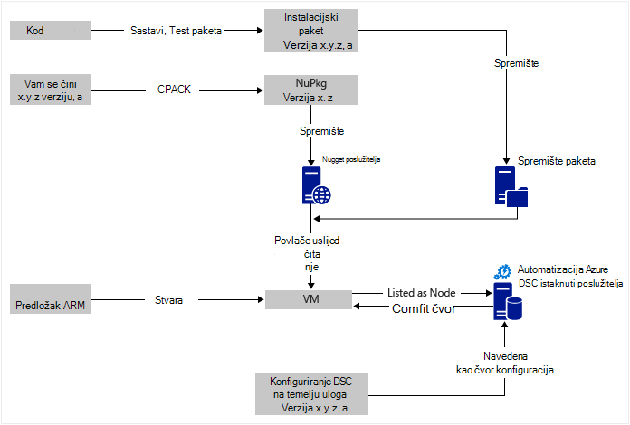
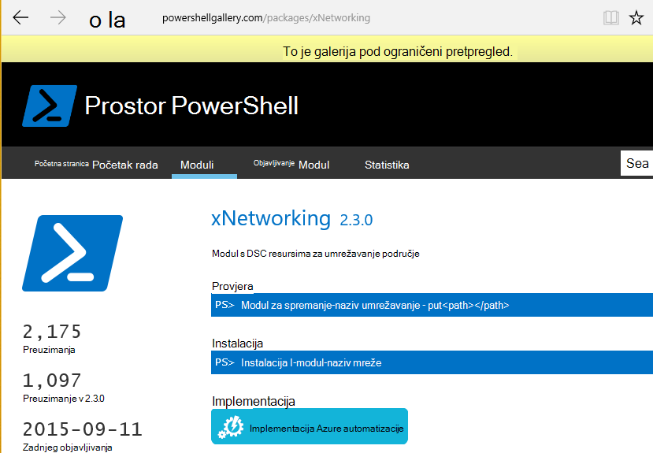

<properties
   pageTitle="Azure Automatizacija DSC neprekinuti implementacija s Chocolatey | Microsoft Azure"
   description="DevOps neprekidnog implementacija pomoću DSC Automatizacija Azure i Upravitelj Chocolatey paketa.  Primjer s puno JSON ARM predloška i PowerShell izvora."
   services="automation"
   documentationCenter=""
   authors="sebastus"
   manager="stevenka"
   editor=""/>

<tags
   ms.service="automation"
   ms.devlang="na"
   ms.topic="article"
   ms.tgt_pltfrm="vm-windows"
   ms.workload="na"
   ms.date="08/08/2016"
   ms.author="golive"/>

# Primjer korištenja: Neprekinuti implementacije virtualnim strojevima pomoću DSC Automatizacija i Chocolatey

U svijetu DevOps postoje mnoge Alati radi jednostavnijeg različite točke u kanalu neprekinuti integracije.  Konfiguracija Azure Automatizacija Desired stanje (DSC) je Dobro došli dodavanja nove mogućnosti koje možete koristiti DevOps timovima.  U ovom se članku objašnjava postavka gore neprekidnog implementacije (CD-a) na računalu sa sustavom Windows.  Možete proširiti postupak da biste dodali koliko računala sa sustavom Windows prema potrebi u ulozi (web-mjesto, na primjer) i iz nje kao i dodatnih ulogama.

## Visoke razine

Postoji vrlo malo događa ovdje, ali Srećom ga možete podijeljene u dva glavna procesa: 

  - Pisanja koda i testiranje je, zatim stvarati i objavljivati instalaciju paketa za glavne i radne verzije sustava. 
  - Stvaranje i upravljanje VMs koji će se instalirati i izvršiti kod u pakete.  

Kada su oba ti procesi core na mjestu, je kratki korak da biste automatski ažurirali paket koji se izvode na neki određeni VM kao nove verzije stvara i implementirati.

## Pregled komponente

Upravitelji paketa kao što su [Zemaljska get](https://en.wikipedia.org/wiki/Advanced_Packaging_Tool) su vrlo dobro poznate u svijetu Linux, ali ne toliko u svijetu sustava Windows.  [Chocolatey](https://chocolatey.org/) takve stvar, a luka Hanselman [blog](http://www.hanselman.com/blog/IsTheWindowsUserReadyForAptget.aspx) na temu sjajno Uvod.  Da ne duljimo, Chocolatey vam omogućuje instalaciju paketa iz središnje spremište paketa u sustav Windows pomoću naredbenog retka.  Možete stvoriti i upravljati vlastitim spremište i Chocolatey možete instalirati paketa iz bilo koji broj spremištima koju odredite.

Željeni stanje konfiguracije (DSC) ([Pregled](https://technet.microsoft.com/library/dn249912.aspx)) je alat za PowerShell koji vam omogućuje da deklarirati konfiguraciju za računalo.  Na primjer, možete reći "Želim Chocolatey instaliran, želim IIS instaliran, želim otvoriti priključak 80, želim 1.0.0 Moje web-mjesto instalirana verzija."  DSC Upravitelj lokalne konfiguracije (LCM) implementira tu konfiguraciju. DSC istaknuti Server sadrži spremište konfiguracije za vašeg računala. LCM na svakom računalu prijavi povremeno da biste vidjeli odgovara li svoju konfiguraciju pohranjene konfiguracije. Ga možete o statusu ili pokušajte ponovno dohvaćali računalu poravnanje u konfiguraciji pohranjene. Možete urediti konfiguraciju spremljene na poslužitelju istaknuti uzrokuju računala ili skup strojeva koji se isporučuju u poravnanje u konfiguraciji promijenjene.

Azure Automatizacija je servis za upravljane u Microsoft Azure omogućuje vam da biste automatizirali različitih zadataka pomoću runbooks, čvorove, vjerodajnice, resursa i sadržaje kao što su rasporede i globalne varijable. DSC Azure Automatizacija proširuje ta mogućnost Automatizacija sadrži alate za PowerShell DSC.  Evo sjajan [Pregled](automation-dsc-overview.md).

DSC resurs je modul koda koji ima određene značajke, kao što je upravljanje mrežom, servisa Active Directory ili SQL Server.  Chocolatey resursa DSC zna kako pristupiti poslužitelju NuGet (između ostalog), preuzimanje paketa, instalacija paketa i tako dalje.  Postoji mnogo drugih resursa DSC u [Galeriji PowerShell](http://www.powershellgallery.com/packages?q=dsc+resources&prerelease=&sortOrder=package-title).  Ove module instaliraju u Azure Automatizacija DSC istaknuti poslužitelja (vama) tako da koriste tako da vaše konfiguracije.

Predlošci ARM omogućuje deklarativno stvaranja infrastrukturu – elemente kao što su mreža, podmreže, mrežne sigurnosti i usmjeravanje, učitavanje balancers, NIC-ovi, VMs i tako dalje.  Evo [članak](../resource-manager-deployment-model.md) koji uspoređuje ARM implementaciju model (deklarativne) s Upravljanje servisom Azure (ASM ili klasični) model implementacije (imperative).  I drugi [članak](../virtual-machines/virtual-machines-windows-compare-deployment-models.md) o davatelji core resursa, računalnim, za pohranu i mreže.

Jedan ključa značajka predloška ARM je sposobnost da biste instalirali nastavkom VM u na VM kao što su mu dodijeljeni resursi.  Nastavkom VM sadrži određene mogućnosti kao što su pokretanje prilagođene skripte, instalacije antivirusni softver ili pokrenuti skriptu DSC konfiguracije.  Postoje mnoge druge vrste VM proširenja.

## Brzi putovanja oko dijagrama

Počevši od vrha, pisanje koda, sastavljanje i testirati, a zatim Stvori instalacijski paket.  Chocolatey možete rukovati razne vrste instalacije paketa, kao što su MSI, MSU, ZIP.  Te se punu snagu programa PowerShell učiniti stvarni instalacije ako nativne mogućnosti Chocolatey korisnika nisu prilično najviše ga.  Da biste postavili paketa u neko mjesto dostupno – spremište paketa.  Korištenje u ovom primjeru javne mape u račun za spremište blobova platforme Azure, ali može biti bilo kojeg mjesta.  Chocolatey nativno funkcionira s poslužiteljima NuGet i nekoliko druga za upravljanje metapodatke paketa.  [U ovom se članku](https://github.com/chocolatey/choco/wiki/How-To-Host-Feed) opisuju mogućnosti.  U ovom se primjeru korištenje koristi NuGet.  U Nuspec je metapodatke o vašem paketa.  Na Nuspec su "prevedene" u NuPkg korisnika i spremljene na poslužitelju NuGet.  Kada konfiguraciju zahtjeve paket po imenu, a odnosi se na poslužitelju NuGet, Chocolatey DSC resursa (sada na VM) privlače paketa i instalira umjesto vas.  Možete zatražiti i određenu verziju programa paketa.

U donjem lijevom dijelu slike, postoji predložak Azure resursa Manager (ARM).  U ovom primjeru korištenje proširenje VM registrira VM s Azure DSC istaknuti poslužitelja automatizacije (to jest, povlačite server) kao čvor.  Konfiguraciju pohranjuju se na poslužitelju povlačite.  Zapravo, sprema se dvaput: jedanput kao običan tekst, a kada prevedena kao datoteku MOF (za one koje zna što su.)  Na portalu s MOF je "čvor konfiguraciju" (a ne samo "konfiguracija").  To je artefakt koji je pridružen čvor da čvor će znali svoju konfiguraciju.  Detalji o nastavku pokazuju kako da biste dodijelili konfiguracije čvor čvor.

Presumably već radite bitne na vrhu ili većinu je.  Stvaranje na nuspec, prevođenje i spremanje na poslužitelju NuGet je small stvar.  I već upravljate VMs.  Pisanje na sljedeći korak s neprekinutim implementacijom zahtijeva postavljanju poslužitelja istaknuti (jednom), Registracija vaše čvorove pomoću njega (jednom) te stvarati i spremanje na konfiguraciju (prethodno).  Zatim paketa su nadograditi a uvesti u spremište osvježite konfiguraciju i konfiguraciji čvor na poslužitelju istaknuti (ponavljanja po potrebi).

Ako ne pokrećete s predloškom ARM, koji je i u redu.  Postoje cmdleta ljuske PowerShell omogućuje da morate registrirati svoje VMs poslužitelja povlačite i sve ostale. Dodatne informacije potražite u članku: [strojeva za Uhodavanje za upravljanje po DSC Automatizacija Azure](automation-dsc-onboarding.md)

## Korak 1: Postavljanje istaknuti poslužitelja i Automatizacija računa

Pri čija je autentičnost provjerena (Dodaj AzureRmAccount) PowerShell naredbenog retka: (može potrajati nekoliko minuta dok povlačite poslužitelja postavite)

    New-AzureRmResourceGroup –Name MY-AUTOMATION-RG –Location MY-RG-LOCATION-IN-QUOTES
    New-AzureRmAutomationAccount –ResourceGroupName MY-AUTOMATION-RG –Location MY-RG-LOCATION-IN-QUOTES –Name MY-AUTOMATION-ACCOUNT 

Automatizacija račun možete staviti u bilo koju od sljedećih regija (ili mjesto): istočnoazijske sad 2, Južna središnje NAM, NAM Gov Virginia, Zapad Europa, Jugoistočne Azije, Istok Japan, središnje Indija i Australija Jugoistok.

## Korak 2: VM proširenje promjene predložak ARM

Detalje o VM Registracija (pomoću proširenje PowerShell DSC VM) navedene u ovom [Azure brzi početak rada predloška](https://github.com/Azure/azure-quickstart-templates/tree/master/dsc-extension-azure-automation-pullserver).  Ovaj korak registrira svoje nove VM s poslužiteljem povlačite na popisu DSC čvorove.  Dio ovog Registracija je koji navodi konfiguracije čvor zatvoriti čvor.  Tu konfiguraciju čvor nema postoji još poslužitelju istaknuti tako da je u redu je korak 4 gdje je to učiniti prvi put.  No ovdje korak 2 morate odlučili naziv čvor i konfiguracije.  U ovom primjeru korištenje 'isvbox' je čvor i konfiguracija je 'ISVBoxConfig'.  Stoga je čvor naziva konfiguracije (da biste je li navedena u DeploymentTemplate.json) 'ISVBoxConfig.isvbox'.  

## Korak 3: Dodavanje potrebni resursi DSC istaknuti poslužitelja

Galerija PowerShell instrumented je da biste instalirali DSC resursa na račun za Azure automatizaciju.  Dođite do resursa i kliknite gumb "Implementacija za Azure Automatizacija".

Druga tehnika Nedavno dodane portalu Azure omogućuje vam da biste izvukli novi moduli ili ažurirati postojeće module. Kliknite putem računa za automatizaciju resursa, pločicu resursi i na kraju pločicu module.  Ikona galerije Pregledaj omogućuje potražite na popisu module u galeriji, kroz razine naniže u pojedinosti i konačni uvesti na račun za automatizaciju. To je odličan način module Ostanite u tijeku s vremena na vrijeme. Možete i značajku uvoz Provjera ovisnosti s drugim module da biste bili sigurni da ništa ne može vidjeti usklađen.

Ili je ručno pristup.  Struktura mapa za modul za integraciju ljuske PowerShell za računalu sa sustavom Windows malo razlikuje se od struktura mapa za očekivan po Automatizacija Azure.  Za tu radnju malo tweaking na svoj dio.  Ali nije napravili, a to učiniti samo jedanput po resursa (osim ako ne želite li nadograditi ga u budućnosti.)  Dodatne informacije o PowerShell Integracija module za izradu, potražite u članku: [Stvaranje Integracija modula za automatizaciju Azure](https://azure.microsoft.com/blog/authoring-integration-modules-for-azure-automation/)

-   Instalirajte modul koji vam je potrebna na vaše radne stanice, na sljedeći način:
    -   Instalirajte [Windows Management Framework, v5](http://aka.ms/wmf5latest) (nije potrebna za Windows 10)
    -   `Install-Module –Name MODULE-NAME`< – privlače modula iz galerije PowerShell 
-   Kopiranje modula mapu s `c:\Program Files\WindowsPowerShell\Modules\MODULE-NAME` u mapu temp 
-   Brisanje uzoraka i u dokumentaciji o iz glavnog mape 
-   Poštanski broj glavnu mapu imenovanja ZIP datoteke točno onako kao što je mapa 
-   Da biste postavili ZIP datoteke u dostupna HTTP mjesto, primjerice blobova u račun za Azure prostora za pohranu.
-   Pokrenite ovaj PowerShell:

        New-AzureRmAutomationModule `
            -ResourceGroupName MY-AUTOMATION-RG -AutomationAccountName MY-AUTOMATION-ACCOUNT `
            -Name MODULE-NAME –ContentLink "https://STORAGE-URI/CONTAINERNAME/MODULE-NAME.zip"
        

Uključeni primjer izvodi korake za cChoco i xNetworking. Pogledajte [bilješke](#notes) za posebni postupak za cChoco.

## Korak 4: Dodavanje čvor konfiguraciju poslužitelja istaknuti

Nema ništa posebno o prvi put u poslužitelju povlačite i Kompiliranje uvezete konfiguraciju.  Sve narednih uvoz/sastavlja isti konfiguracije izgledaju točno.  Svaki put kada ažuriranje pakiranju morati automatske je radnog obavljate ovaj korak nakon osiguravanje konfiguracijska datoteka ispravna – uključujući novu verziju paketa.  Evo konfiguracijskoj datoteci i PowerShell:

ISVBoxConfig.ps1:

    Configuration ISVBoxConfig 
    { 
        Import-DscResource -ModuleName cChoco 
        Import-DscResource -ModuleName xNetworking
    
        Node "isvbox" {   
    
            cChocoInstaller installChoco 
            { 
                InstallDir = "C:\choco" 
            }
    
            WindowsFeature installIIS 
            { 
                Ensure="Present" 
                Name="Web-Server" 
            }
    
            xFirewall WebFirewallRule 
            { 
                Direction = "Inbound" 
                Name = "Web-Server-TCP-In" 
                DisplayName = "Web Server (TCP-In)" 
                Description = "IIS allow incoming web site traffic." 
                DisplayGroup = "IIS Incoming Traffic" 
                State = "Enabled" 
                Access = "Allow" 
                Protocol = "TCP" 
                LocalPort = "80" 
                Ensure = "Present" 
            }
    
            cChocoPackageInstaller trivialWeb 
            {            
                Name = "trivialweb" 
                Version = "1.0.0" 
                Source = “MY-NUGET-V2-SERVER-ADDRESS” 
                DependsOn = "[cChocoInstaller]installChoco", 
                "[WindowsFeature]installIIS" 
            } 
        }    
    }

Novi-ConfigurationScript.ps1:

    Import-AzureRmAutomationDscConfiguration ` 
        -ResourceGroupName MY-AUTOMATION-RG –AutomationAccountName MY-AUTOMATION-ACCOUNT ` 
        -SourcePath C:\temp\AzureAutomationDsc\ISVBoxConfig.ps1 ` 
        -Published –Force
    
    $jobData = Start-AzureRmAutomationDscCompilationJob ` 
        -ResourceGroupName MY-AUTOMATION-RG –AutomationAccountName MY-AUTOMATION-ACCOUNT ` 
        -ConfigurationName ISVBoxConfig 
    
    $compilationJobId = $jobData.Id
    
    Get-AzureRmAutomationDscCompilationJob ` 
        -ResourceGroupName MY-AUTOMATION-RG –AutomationAccountName MY-AUTOMATION-ACCOUNT ` 
        -Id $compilationJobId

Rezultat ove korake u novu konfiguraciju čvor naziva "ISVBoxConfig.isvbox" koja se nalazi na poslužitelju povlačite.  Konfiguriranje čvor naziva ugrađena je kao "configurationName.nodeName".

## Korak 5: Stvaranje i održavanje paketa metapodataka

Za svaki paket u spremištu paketa morate nuspec koji je opisuje.  Tu nuspec mora biti prevedena i spremljene u vašem poslužitelju NuGet. Ovaj postupak je opisan [u nastavku](http://docs.nuget.org/create/creating-and-publishing-a-package).  MyGet.org možete koristiti kao NuGet poslužitelja.  Oni prodajete taj servis, ali ste starter SKU koji je besplatno.  Pri NuGet.org nalaze se upute za instalaciju vlastiti NuGet poslužitelj za privatnih paketa.

## Korak 6: Zauzimanja je sve zajedno

Svakom verzija prosljeđuje značajke pitanja i odgovora i odobrenja za implementaciju, paket se stvara nuspec i nupkg ažurirati i implementirati NuGet poslužitelj.  Osim toga, konfiguracije (4 koraku gore) moraju se ažurirati slažete novi broj verzije.  Mora biti poslana s poslužiteljem povlačite i prevesti.  Od tog trenutka na je VMs koje ovise o toj konfiguraciji želite povući ažuriranja i instalirajte ga.  Svaki od tih ažuriranja su jednostavni – samo redak ili dva PowerShell.  U slučaju Visual Studio Team Services, neke od njih encapsulated u Sastavi zadatke koji mogu biti povezane zajedno u na Sastavi.  U ovom se [članku](https://www.visualstudio.com/en-us/docs/alm-devops-feature-index#continuous-delivery) navedeni su dodatni Detalji.  [GitHub repo](https://github.com/Microsoft/vso-agent-tasks) detalje o različite zadatke dostupna Sastavi.

## Bilješke

U ovom se primjeru korištenje počinje VM iz generički Windows Server 2012 R2 slike iz galerije Azure.  Možete pokrenuti s bilo kojeg spremljenu sliku, a zatim dotjerati iz njega u konfiguraciji DSC.  Međutim, promjena konfiguracije koji je pečeni u sliku je mnogo teže od dinamički ažuriranje konfiguracije pomoću DSC.

Ne morate koristiti predložak OKVIRA i nastavak VM za korištenje ove tehnike s vašeg VMs.  A vaš VMs ne morate biti na Azure se u odjeljku Upravljanje CD-a.  Sve što je potrebno je instalirati Chocolatey i na LCM konfiguriran na VM da bi ga znali gdje se nalazi poslužitelj povlačite.  

Naravno, ažurirate paket na VM koji se nalazi u radnom ćete morati poduzeti te VM iz zakretanja dok ažuriranje nije instalirano.  Kako to učiniti znatno razlikuje.  Ako, na primjer, s VM iza programa Azure opterećenja, možete dodati prilagođene koji isprobati.  Prilikom ažuriranja u VM imati krajnju točku probni vratili na 400.  Na koji dotjerati potrebno uzrokovati ta promjena može biti unutar konfiguraciju, kao što je možete dotjerati da biste se vratili na vraćanje na 200 nakon dovršetka ažuriranja.

Potpuna izvor da bi ovaj primjer korištenja je [taj projekt Visual Studio](https://github.com/sebastus/ARM/tree/master/CDIaaSVM) na GitHub.

##Povezani članci##

- [Azure Automatizacija DSC pregled] (Automatizacija-dsc-overview.md)
- [Azure Automatizacija DSC cmdleta] (https://msdn.microsoft.com/library/mt244122.aspx)
- [Za Uhodavanje strojeva za upravljanje po Azure Automatizacija DSC] (Automatizacija-dsc-onboarding.md)
