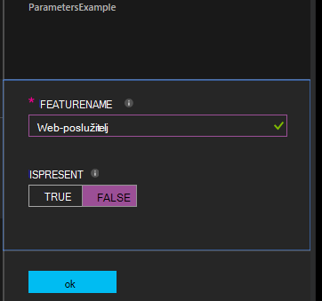

<properties 
   pageTitle="Kompiliranje konfiguracije u Azure Automatizacija DSC | Microsoft Azure" 
   description="Pregled dva načina za Kompiliranje konfiguracije želji stanje konfiguracije (DSC): na portalu za Azure i s komponentom Windows PowerShell. " 
   services="automation" 
   documentationCenter="na" 
   authors="coreyp-at-msft" 
   manager="stevenka" 
   editor="tysonn"/>

<tags
   ms.service="automation"
   ms.devlang="na"
   ms.topic="article"
   ms.tgt_pltfrm="powershell"
   ms.workload="na" 
   ms.date="01/25/2016"
   ms.author="coreyp"/>
   
#Kompiliranje konfiguracije u DSC Automatizacija Azure#

Možete sastaviti konfiguracije želji stanje konfiguracije (DSC) na dva načina s Azure Automatizacija: na portalu za Azure i s komponentom Windows PowerShell. U sljedećoj su tablici će vam pomoći odrediti kada koristiti koju metodu na temelju karakteristikama svih: 

###Portal za Azure pretpregled###
- Najjednostavniji način interaktivne korisničko sučelje
- Obrazac za unos vrijednosti parametra jednostavne
- Jednostavno pratite stanje posla
- Pristup ovjerena Azure prijave

###Komponente Windows PowerShell###
- Pozivanje iz naredbenog retka pomoću cmdleta ljuske Windows PowerShell
- Moguće ih je uvrstiti u automatiziranog rješenje s više koraka
- Unos vrijednosti parametra jednostavnih i složenih
- Praćenje stanja posla
- Klijent potrebne za podršku cmdleta ljuske PowerShell
- Prenesite ConfigurationData
- Kompiliranje koristi vjerodajnice

Nakon što ste odlučili metode sastavljanja, možete pratiti sljedeće odgovarajući postupke da biste počeli sastavljati.

##Kompiliranje DSC konfiguracija pomoću portala za Azure##

1.  Vaš račun automatizacije kliknite **konfiguracije**.
2.  Kliknite konfiguraciju da biste otvorili njegov plohu.
3.  Kliknite **Prevedi**.
4.  Ako je konfiguraciju bez parametara, zatražit će se da biste potvrdili da želite prevesti. Ako je konfiguraciju parametara, plohu **Kompiliranje konfiguracije** će se otvoriti tako da možete unijeti vrijednosti parametara. U odjeljku <a href="#basic-parameters">**Osnovni parametara**</a> ispod dodatne detalje parametara.
5.  **Zadatak sastavljanja** plohu otvara se tako da možete pratiti zadatak sastavljanja stanje i konfiguracija čvor (MOF konfiguracije dokumenti) je uzrok smjestiti na poslužitelj za izvlačenje DSC programa Azure automatizaciju.

##Kompiliranje DSC konfiguracije s komponentom Windows PowerShell##

Možete koristiti [`Start-AzureRmAutomationDscCompilationJob`](https://msdn.microsoft.com/library/mt244118.aspx) da biste počeli sastavljati s komponentom Windows PowerShell. Sljedeći primjer kod pokreće sastavljanja DSC konfiguracije pod nazivom **SampleConfig**.

    Start-AzureRmAutomationDscCompilationJob -ResourceGroupName "MyResourceGroup" -AutomationAccountName "MyAutomationAccount" -ConfigurationName "SampleConfig" 
 
`Start-AzureRmAutomationDscCompilationJob`Vraća objekt posla sastavljanja koje možete koristiti da biste pratili njezin status. Možete koristiti taj objekt posao sastavljanja s [`Get-AzureRmAutomationDscCompilationJob`](https://msdn.microsoft.com/library/mt244120.aspx) da biste odredili statusa posla Sastavljanje i [`Get-AzureRmAutomationDscCompilationJobOutput`](https://msdn.microsoft.com/library/mt244103.aspx) da biste pogledali strujanja (rezultat). Sljedeći ogledni kod pokreće sastavljanja konfiguracije **SampleConfig** , čeka dok se ne dovrši, a prikazuje njegov strujanja.
    
    $CompilationJob = Start-AzureRmAutomationDscCompilationJob -ResourceGroupName "MyResourceGroup" -AutomationAccountName "MyAutomationAccount" -ConfigurationName "SampleConfig"
    
    while($CompilationJob.EndTime –eq $null -and $CompilationJob.Exception –eq $null)           
    {
        $CompilationJob = $CompilationJob | Get-AzureRmAutomationDscCompilationJob
        Start-Sleep -Seconds 3
    }
    
    $CompilationJob | Get-AzureRmAutomationDscCompilationJobOutput –Stream Any 

##Osnovni parametara##

Deklariranje parametar u DSC konfiguracijama, uključujući vrste parametra i svojstva, radi jednaki onima Automatizacija Azure runbooks. Potražite dodatne informacije o runbook parametara [Početni runbook u automatizaciji Azure](automation-starting-a-runbook.md) .

Sljedeći primjer koristi dva parametra pod nazivom **FeatureName** i **IsPresent**da biste odredili vrijednosti svojstava u konfiguraciji čvor **ParametersExample.sample** generiraju tijekom sastavljanja.

    Configuration ParametersExample
    {
        param(
            [Parameter(Mandatory=$true)]
    
            [string] $FeatureName,
    
            [Parameter(Mandatory=$true)]
            [boolean] $IsPresent
        )
    
        $EnsureString = "Present"
        if($IsPresent -eq $false)
        {
            $EnsureString = "Absent"
        }
    
        Node "sample"
        {
            WindowsFeature ($FeatureName + "Feature")
            {
                Ensure = $EnsureString
                Name = $FeatureName
            }
        }
    }

Možete sastaviti DSC konfiguracije koji koriste osnovni parametre na portalu za Azure Automatizacija DSC ili pak s Azure PowerShell:

###Portal###

Na portalu možete unijeti vrijednosti parametara nakon klika na **Prevedi**.

###PowerShell###

PowerShell zahtijeva parametara u [hashtable](http://technet.microsoft.com/library/hh847780.aspx) gdje tipku odgovara nazivu parametra i vrijednost jednaka vrijednosti parametra.

    $Parameters = @{
            "FeatureName" = "Web-Server"
            "IsPresent" = $False
    }
    
    
    Start-AzureRmAutomationDscCompilationJob -ResourceGroupName "MyResourceGroup" -AutomationAccountName "MyAutomationAccount" -ConfigurationName "ParametersExample" -Parameters $Parameters 
    

Informacije o prosljeđivanje PSCredentials kao parametar potražite u članku <a href="#credential-assets">**Vjerodajnica imovine**</a> ispod.

##ConfigurationData##

**ConfigurationData** omogućuje razdvajanje strukturnih konfiguracije iz bilo kojeg konfiguracije okruženja određene tijekom korištenja PowerShell DSC. Potražite dodatne informacije o **ConfigurationData** [Razdvajanje "Što" s "Gdje" u PowerShell DSC](http://blogs.msdn.com/b/powershell/archive/2014/01/09/continuous-deployment-using-dsc-with-minimal-change.aspx) .

>[AZURE.NOTE] **ConfigurationData** možete koristiti za sastavljanje Azure Automatizacija DSC pomoću komponente PowerShell Azure, ali ne na portalu za Azure.

Sljedeći primjer konfiguraciju DSC koristi **ConfigurationData** putem **$ConfigurationData** i **$AllNodes** ključne riječi. Trebat ćete [ **xWebAdministration** modul](https://www.powershellgallery.com/packages/xWebAdministration/) u ovom primjeru:

     Configuration ConfigurationDataSample
     {
        Import-DscResource -ModuleName xWebAdministration -Name MSFT_xWebsite
    
        Write-Verbose $ConfigurationData.NonNodeData.SomeMessage 
    
        Node $AllNodes.Where{$_.Role -eq "WebServer"}.NodeName
        {
            xWebsite Site
            {
                Name = $Node.SiteName
                PhysicalPath = $Node.SiteContents
                Ensure   = "Present"
            }
        }
    }

Možete sastaviti konfiguraciju DSC iznad sa servisom PowerShell. U ispod PowerShell dodaje dva čvor konfiguracije poslužitelj za izvlačenje DSC programa Azure automatizaciju: **ConfigurationDataSample.MyVM1** i **ConfigurationDataSample.MyVM3**:

    $ConfigData = @{
        AllNodes = @(
            @{
                NodeName = "MyVM1"
                Role = "WebServer"
            },
            @{
                NodeName = "MyVM2"
                Role = "SQLServer"
            },
            @{
                NodeName = "MyVM3"
                Role = "WebServer"
    
            }
    
        )
    
        NonNodeData = @{
            SomeMessage = "I love Azure Automation DSC!"
    
        }
    
    } 
    
    Start-AzureRmAutomationDscCompilationJob -ResourceGroupName "MyResourceGroup" -AutomationAccountName "MyAutomationAccount" -ConfigurationName "ConfigurationDataSample" -ConfigurationData $ConfigData

##Resursi##

Reference resursa jednaki su u Azure Automatizacija DSC konfiguracije i runbooks. Pročitajte dodatne informacije:

- [Certifikati](automation-certificates.md)
- [Veze](automation-connections.md)
- [Vjerodajnice](automation-credentials.md)
- [Varijable](automation-variables.md)

###Resursi vjerodajnica###
Dok DSC konfiguracije u Azure Automatizacija možete referencirati vjerodajnica koju koristite **Get-AzureRmAutomationCredential**, vjerodajnica resursi mogu i proslijediti u putem parametre, po želji. Ako konfiguraciju traje parametar vrste **PSCredential** , morate proslijedite naziv niza sredstvo vjerodajnicama Azure Automatizacija kao vrijednost za taj parametar, umjesto PSCredential objekt. U pozadini resursa vjerodajnica za automatizaciju Azure s tim nazivom bit će dohvatiti i proslijeđena konfiguracije.

Zadržavanje vjerodajnice sigurne u čvor konfiguracijama (MOF konfiguracije dokumenti) potreban je šifriranje vjerodajnica u konfiguracijskoj datoteci MOF čvor. Azure Automatizacija dodatno uzima jednog koraka i šifrira cijelu MOF datoteku. Međutim, trenutno odmah PowerShell DSC to znači da nije problem za vjerodajnice za outputted u obliku običnog teksta tijekom generacije MOF za konfiguraciju čvor PowerShell DSC ne zna da Azure Automatizacija će biti šifriranje cijelu MOF datoteku nakon njegova generacije putem posao sastavljanja.

Znat ćete PowerShell DSC je za vjerodajnice da bi se outputted u obliku običnog teksta u konfiguraciji generirani čvor MOFs pomoću <a href="#configurationdata">**ConfigurationData**</a>u redu. Treba proći `PSDscAllowPlainTextPassword = $true` putem **ConfigurationData** za svaki blok čvor naziv koji se pojavljuje u konfiguraciji DSC koristi vjerodajnice.

Sljedeći primjer prikazuje DSC konfiguracije koji koristi sredstvo vjerodajnicama automatizaciju.

    Configuration CredentialSample
    {
       $Cred = Get-AzureRmAutomationCredential -Name "SomeCredentialAsset"
    
        Node $AllNodes.NodeName
        { 
            File ExampleFile
            { 
                SourcePath = "\\Server\share\path\file.ext" 
                DestinationPath = "C:\destinationPath" 
                Credential = $Cred 
            }
        }
    }

Možete sastaviti konfiguraciju DSC iznad sa servisom PowerShell. U ispod PowerShell dodaje dva čvor konfiguracije poslužitelj za izvlačenje DSC programa Azure automatizaciju: **CredentialSample.MyVM1** i **CredentialSample.MyVM2**.

    $ConfigData = @{
        AllNodes = @(
            @{
                NodeName = "*"
                PSDscAllowPlainTextPassword = $True
            },
            @{
                NodeName = "MyVM1"
            },
            @{
                NodeName = "MyVM2"
            }
        )
    }
    
    Start-AzureRmAutomationDscCompilationJob -ResourceGroupName "MyResourceGroup" -AutomationAccountName "MyAutomationAccount" -ConfigurationName "CredentialSample" -ConfigurationData $ConfigData
