<properties
   pageTitle="Uvod u DSC Automatizacija Azure"
   description="Objašnjenje i primjeri uobičajene zadatke u Azure Automatizacija želji stanje konfiguracije (DSC)"
   services="automation" 
   documentationCenter="na" 
   authors="eslesar" 
   manager="dongill" 
   editor="tysonn"/>

<tags
   ms.service="automation"
   ms.devlang="na"
   ms.topic="article"
   ms.tgt_pltfrm="powershell"
   ms.workload="na" 
   ms.date="06/06/2016"
   ms.author="magoedte;eslesar"/>
   

# <a name="getting-started-with-azure-automation-dsc"></a>Uvod u DSC Automatizacija Azure

U ovoj se temi objašnjava kako uobičajene zadatke s Azure Automatizacija želji stanje konfiguracije (DSC), kao što su stvaranje, uvoz, i Kompiliranje konfiguracijama strojeva za uhodavanje da biste upravljali, i prikaz izvješća. Pregled novosti DSC Azure Automatizacija, potražite u članku [Pregled DSC za automatizaciju Azure](automation-dsc-overview.md). Dokumentacija DSC potražite u članku [Pregled želji stanje konfiguracije komponente Windows PowerShell označite](https://msdn.microsoft.com/PowerShell/dsc/overview).

Ova tema sadrži Postupni vodič za korištenje DSC Automatizacija Azure. Ako želite okruženju uzorka koja je već postavljena bez slijedeći korake opisane u ovoj temi, možete koristiti [Sljedeći predložak OKVIRA](https://github.com/azureautomation/automation-packs/tree/master/102-sample-automation-setup). Ovaj predložak postavlja dovršene Azure Automatizacija DSC okruženju, uključujući programa Azure VM kojim upravlja DSC Automatizacija Azure.
 
## <a name="prerequisites"></a>Preduvjeti

Da biste dovršili primjeri u ovoj temi, sljedeće potrebni su:

- Račun za Azure automatizaciju. Upute o stvaranju račun za Azure Automatizacija Pokreni kao potražite u članku [Azure pokrenuti kao račun](automation-sec-configure-azure-runas-account.md).
- Programa Azure resursima VM (ne klasični) izvodi Windows Server 2008 R2 ili novijim. Upute o stvaranju na VM potražite u članku [Stvaranje prve strojno virtualne Windows Azure portalu](../virtual-machines/virtual-machines-windows-hero-tutorial.md)

## <a name="creating-a-dsc-configuration"></a>Stvaranje DSC konfiguracija

Ne možemo će stvoriti jednostavan [DSC konfiguracije](https://msdn.microsoft.com/powershell/dsc/configurations) koji osigurava prisutnost ili odsutnost od na **Web-poslužitelju** Windows značajka (IIS), ovisno o tome kako dodijeliti čvorove.

1. Pokrenite Windows Očisti filtar (ili bilo kojem uređivaču teksta).

2. Upišite sljedeći tekst:

    ```powershell
    configuration TestConfig
    {
        Node WebServer
        {
            WindowsFeature IIS
            {
                Ensure               = 'Present'
                Name                 = 'Web-Server'
                IncludeAllSubFeature = $true

            }
        }

        Node NotWebServer
        {
            WindowsFeature IIS
            {
                Ensure               = 'Absent'
                Name                 = 'Web-Server'

            }
        }
        }
    ```
3. Spremite datoteku kao `TestConfig.ps1`.

Tu konfiguraciju poziva jedan resurs u blokove čvor [WindowsFeature resursa](https://msdn.microsoft.com/powershell/dsc/windowsfeatureresource), koji omogućuje prisutnost ili odsutnost značajke **Web-poslužitelj** .

## <a name="importing-a-configuration-into-azure-automation"></a>Uvoz konfiguraciju u Automatizacija Azure

Nakon toga ne možemo ćete uvesti konfiguraciju računa za automatizaciju.

1. Prijavite se na [portal za Azure](https://portal.azure.com).

2. Na izborniku koncentrator kliknite **Resursi za sve** , a zatim naziv računa za automatizaciju.

3. Na plohu **Automatizacija računa** kliknite **DSC konfiguracije**.

4. Na plohu **DSC konfiguracije** kliknite **Dodaj konfiguraciju**.

5. Na plohu **Uvoz konfiguracije** pomaknite se na `TestConfig.ps1` datoteku na računalu.
    
    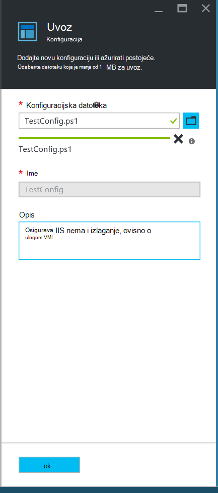
    

6. Kliknite **u redu**.

## <a name="viewing-a-configuration-in-azure-automation"></a>Prikaz konfiguraciju u Automatizacija Azure

Nakon što ste uvezli konfiguraciju, možete je prikaz Azure portalu.

1. Prijavite se na [portal za Azure](https://portal.azure.com).

2. Na izborniku koncentrator kliknite **Resursi za sve** , a zatim naziv računa za automatizaciju.

3. Na plohu **Automatizacija računa** kliknite **DSC konfiguracija**

4. Na plohu **DSC konfiguracije** kliknite **TestConfig** (to je naziv konfiguracije koju ste uvezli iz prethodnog postupka).

5. Na plohu **TestConfig konfiguracije** kliknite **Prikaži izvor konfiguracije**.

    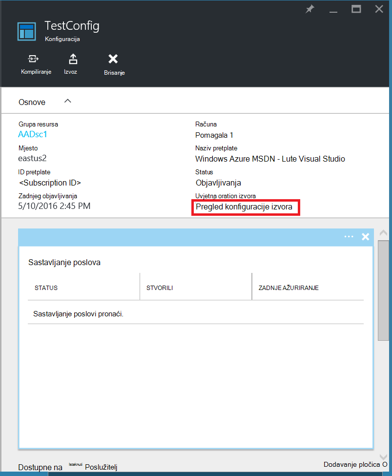
    
    Otvorit će se **izvoru konfiguracije TestConfig** plohu prikaz PowerShell koda za konfiguraciju.
    
## <a name="compiling-a-configuration-in-azure-automation"></a>Kompiliranje konfiguracija u Automatizacija Azure

Prije nego što možete primijeniti željenom stanju čvor, DSC konfiguracije koji definira to stanje mora biti prevedene u jednu ili više čvor konfiguracije (MOF dokument) i stavite na poslužitelj za izvlačenje DSC automatizaciju. Detaljnije opis Kompiliranje konfiguracije u DSC Azure Automatizacija, potražite u članku [Kompiliranje konfiguracije u DSC Automatizacija Azure](automation-dsc-compile.md). Dodatne informacije o Kompiliranje konfiguracije potražite u članku [Konfiguracija DSC](https://msdn.microsoft.com/PowerShell/DSC/configurations).

1. Prijavite se na [portal za Azure](https://portal.azure.com).

2. Na izborniku koncentrator kliknite **Resursi za sve** , a zatim naziv računa za automatizaciju.

3. Na plohu **Automatizacija računa** kliknite **DSC konfiguracija**

4. Na plohu **DSC konfiguracije** kliknite **TestConfig** (ime koje ste prethodno uvezenih konfiguraciju).

5. Na plohu **TestConfig konfiguracije** kliknite **Prevedi**, a zatim kliknite **da**. Time ćete posao sastavljanja.
    
    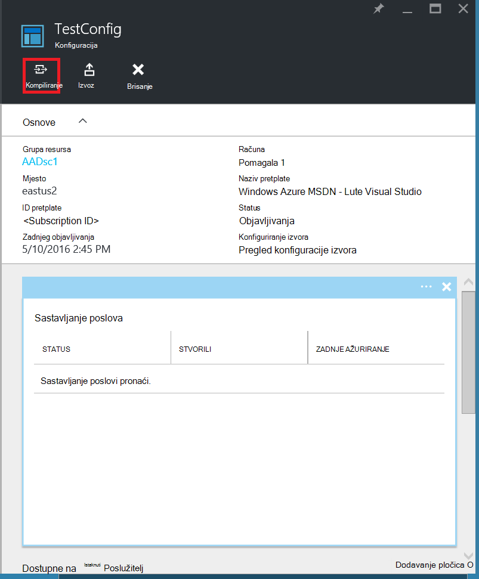
    
> [AZURE.NOTE] Kada Kompiliranje konfiguracija u Azure Automatizacija, ga automatski uvodi sve stvorene čvor konfiguracije MOFs istaknuti poslužitelj.

## <a name="viewing-a-compilation-job"></a>Prikaz posao sastavljanja

Kada započnete s sastavljanja, možete je prikazati u pločicu **sastavljanja zadacima** u **konfiguraciji** plohu. Pločicu **sastavljanja zadacima** prikazuje se trenutno izvode, dovršiti i nije uspjela zadacima. Kada otvorite plohu za posao sastavljanja, prikazuju se informacije o taj posao uključujući sve pogreške i upozorenja naišao na, ulaznih parametara koristiti u konfiguraciji i sastavljanje zapisnika.

1. Prijavite se na [portal za Azure](https://portal.azure.com).

2. Na izborniku koncentrator kliknite **Resursi za sve** , a zatim naziv računa za automatizaciju.

3. Na plohu **Automatizacija računa** kliknite **DSC konfiguracije**.

4. Na plohu **DSC konfiguracije** kliknite **TestConfig** (ime koje ste prethodno uvezenih konfiguraciju).

5. Na pločicu **sastavljanja poslove** plohu **TestConfig konfiguracije** kliknite na bilo kojoj zadataka na popisu. Otvorit će se **Zadatak sastavljanja** plohu koje su označene datum koji je pokrenut zadatak sastavljanja.

    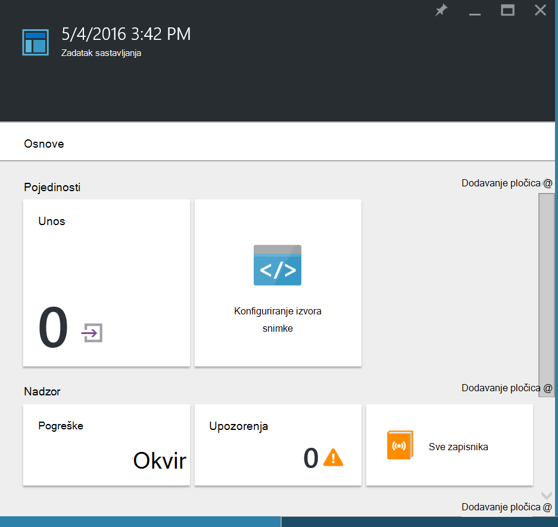
  
6. Kliknite neku pločicu u plohu **Posao sastavljanja** da biste vidjeli dodatne detalje o posao.

## <a name="viewing-node-configurations"></a>Prikaz čvor konfiguracija

Uspješan dovršetak posao sastavljanja stvara jednu ili više novi čvor konfiguracije. Konfiguraciju čvor je MOF dokument koji je implementiran na poslužitelj povlačite i spremni povlače i primijeniti čvorovi jedan ili više. Konfiguracija čvor možete pogledati na svom računu za automatizaciju u plohu **DSC čvor konfiguracije** . Konfiguraciju čvor ima naziv s obrascem *ConfigurationName*. *NodeName*.

1. Prijavite se na [portal za Azure](https://portal.azure.com).

2. Na izborniku koncentrator kliknite **Resursi za sve** , a zatim naziv računa za automatizaciju.

3. Na plohu **Automatizacija računa** kliknite **DSC čvor konfiguracije**.

    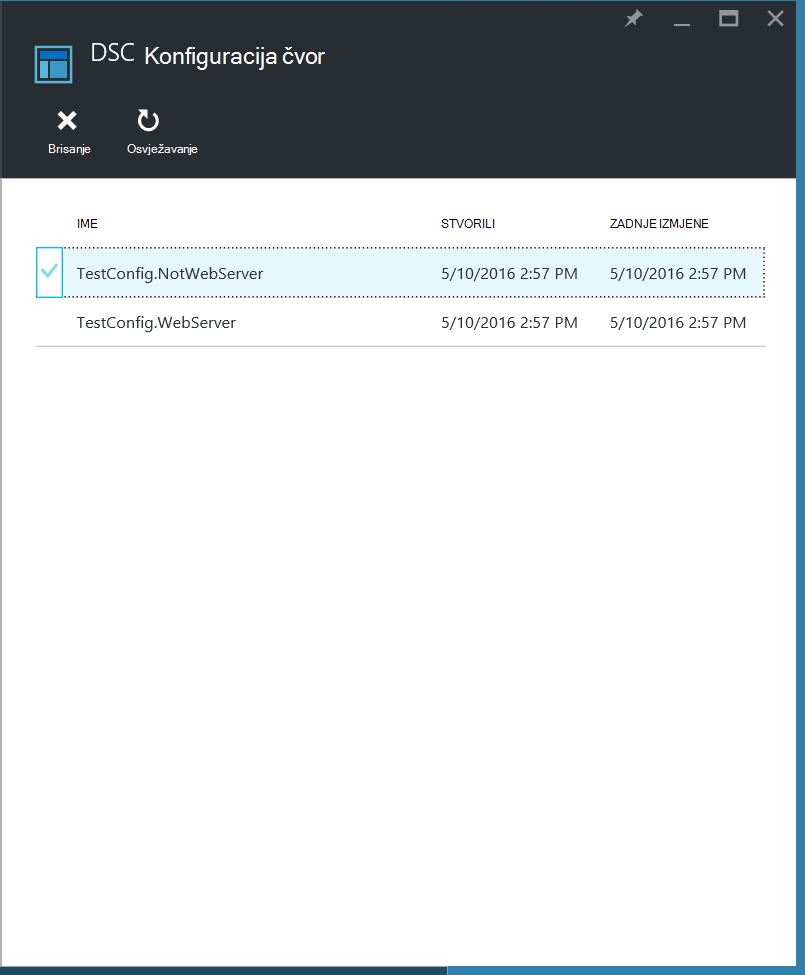
    
## <a name="onboarding-an-azure-vm-for-management-with-azure-automation-dsc"></a>Za Uhodavanje sustava Azure VM za upravljanje s DSC Automatizacija Azure

DSC Automatizacija Azure možete koristiti za upravljanje Azure VMs (klasični i resursima), lokalni VMs, Linux strojeva, AWS VMs i lokalne fizičke strojeva. Ovoj se temi ćemo objasniti kako onboard samo VMs Azure Voditelj resursa. Informacije o za uhodavanje druge vrste strojeva, potražite u članku [za Uhodavanje strojeva za upravljanje po DSC Automatizacija Azure](automation-dsc-onboarding.md).

### <a name="to-onboard-an-azure-resource-manager-vm-for-management-by-azure-automation-dsc"></a>Da biste onboard programa Azure resursima VM za upravljanje po DSC Automatizacija Azure

1. Prijavite se na [portal za Azure](https://portal.azure.com).

2. Na izborniku koncentrator kliknite **Resursi za sve** , a zatim naziv računa za automatizaciju.

3. Na plohu **Automatizacija računa** kliknite **DSC čvorove**.

4. U plohu **DSC čvorove** kliknite **Dodavanje VM Azure**.

    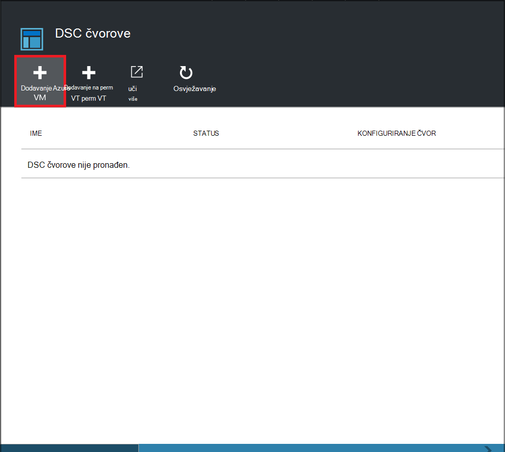

5. U plohu **Dodavanje Azure VMs** kliknite **Odaberite virtualnih računala da biste onboard**.

6. U plohu **Odaberite VMs** odaberite VM želite onboard pa kliknite **u redu**.

    >[AZURE.IMPORTANT] To mora biti VM resursima Azure koja se izvodi Windows Server 2008 R2 ili novijim.
    
7. U plohu **Dodavanje Azure VMs** kliknite **Konfiguriraj Registracija podataka**.

8. U plohu **Registracija** unesite naziv konfiguracije čvor koju želite primijeniti VM u okvir **Naziv čvor konfiguracije** . To mora u potpunosti odgovarati naziv konfiguracija čvor u račun za automatizaciju. U ovom trenutku davanja naziva nije obavezno. Možete promijeniti dodijeljene čvor konfiguracija nakon za uhodavanje čvor.
Provjera **Čvor ako je potrebno ponovno pokrenuti računalo**, a zatim kliknite **u redu**.
    
    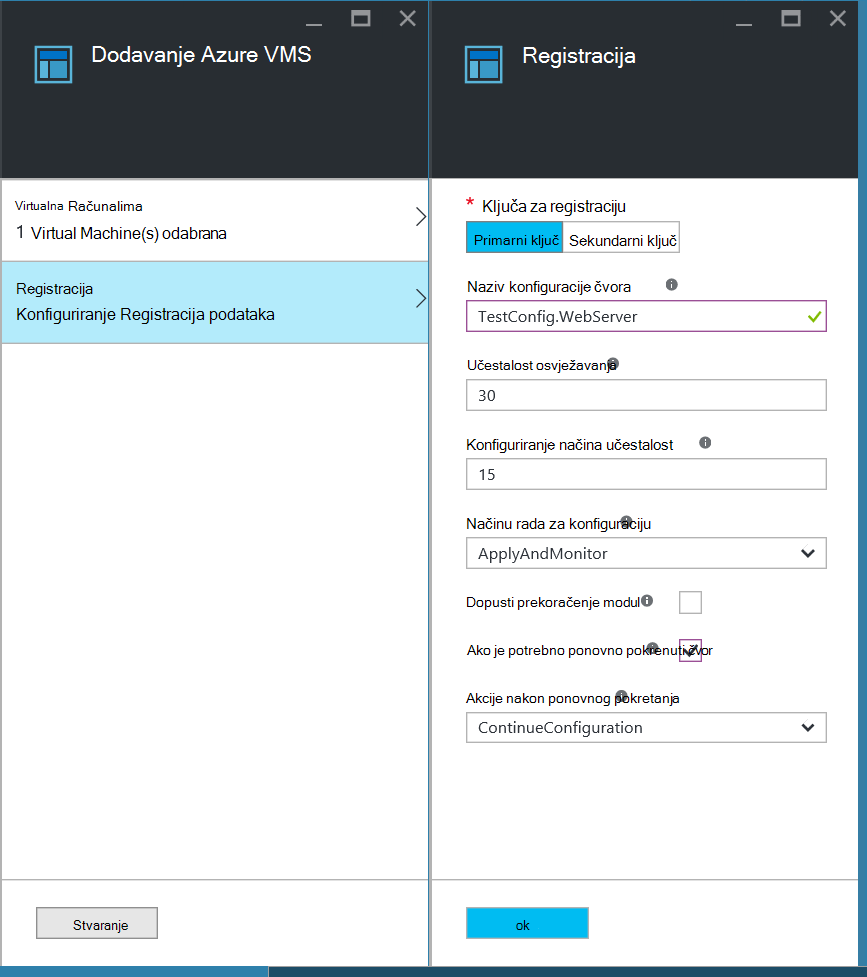
    
    Konfiguracija čvor koje ste naveli će se primijeniti na na VM intervalima određen **Učestalost način konfiguracije**, a na VM će Provjeri ima li ažuriranja konfiguracije čvor intervalima određen **Učestalost osvježavanja**. Dodatne informacije o korištenju ove vrijednosti su potražite u članku [Konfiguriranje Upravitelj konfiguracije lokalno](https://msdn.microsoft.com/PowerShell/DSC/metaConfig).
    
9. U plohu **Dodavanje Azure VMs** kliknite **Stvori**.

Azure započinje postupak za uhodavanje u VM. Kada je dovršen, na VM prikazat će se u plohu **DSC čvorove** na računu za automatizaciju.

## <a name="viewing-the-list-of-dsc-nodes"></a>Prikaz popisa DSC čvorove

Možete pogledati popis svim računalima koja su onboarded za upravljanje na svom računu za automatizaciju u plohu **DSC čvorove** .

1. Prijavite se na [portal za Azure](https://portal.azure.com).

2. Na izborniku koncentrator kliknite **Resursi za sve** , a zatim naziv računa za automatizaciju.

3. Na plohu **Automatizacija računa** kliknite **DSC čvorove**.

## <a name="viewing-reports-for-dsc-nodes"></a>Prikaz izvješća za čvorove DSC

Svaki put kada Azure Automatizacija DSC izvodi Provjera dosljednosti upravljanih čvor čvor šalje izvješća o statusu istaknuti poslužitelj. Ta izvješća možete pregledati na plohu za taj čvor.

1. Prijavite se na [portal za Azure](https://portal.azure.com).

2. Na izborniku koncentrator kliknite **Resursi za sve** , a zatim naziv računa za automatizaciju.

3. Na plohu **Automatizacija računa** kliknite **DSC čvorove**.

4. Na pločici **izvješća** kliknite na bilo kojoj od tih izvješća na popisu.

    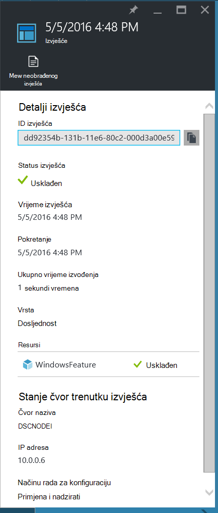

Na plohu za pojedinačne izvješće, vidjet ćete sljedeće informacije o stanju za odgovarajuće Provjera dosljednosti:

- Status izvješća – hoće li je čvor "Compliant", "Nije uspjela", konfiguriranje ili je čvor "Nije usklađen" (kada je čvor u načinu **applyandmonitor** i na računalu nije u željenom stanju).
- Vrijeme početka Provjera dosljednosti.
- Ukupna runtime Provjera dosljednosti.
- Vrsta Provjera dosljednosti.
- Sve pogreške, uključujući šifre pogrešaka i poruka o pogrešci. 
- Bilo koji DSC resursa koji se koriste u konfiguraciji i stanje svakog resursa (čvor je li u željenom stanju za resursa) – možete kliknuti na svaki resurs da biste dobili više informacija za taj resurs.
- Naziv, IP adresa i konfigurira čvora.

Možete kliknuti i **Prikaz neobrađenog izvješća** da biste vidjeli stvarnih podataka koje čvor šalje na poslužitelj. Dodatne informacije o korištenju tih podataka potražite u članku [Korištenje DSC poslužitelj za izvješća](https://msdn.microsoft.com/powershell/dsc/reportserver).

Može potrajati neko vrijeme nakon čvor onboarded prije prvo izvješće. Možda ćete morati proći do 30 minuta za prvo izvješće nakon što se čvor.

## <a name="reassigning-a-node-to-a-different-node-configuration"></a>Dodjelom čvor različite čvor konfiguraciju

Možete dodijeliti čvor da biste koristili različite čvor konfiguracije od prethodno dodijeljena.

1. Prijavite se na [portal za Azure](https://portal.azure.com).

2. Na izborniku koncentrator kliknite **Resursi za sve** , a zatim naziv računa za automatizaciju.

3. Na plohu **Automatizacija računa** kliknite **DSC čvorove**.

4. Na plohu **DSC čvorove** kliknite naziv čvor želite ponovno dodijeliti.

5. Na plohu za taj čvor, kliknite **Dodijeli čvor**.

    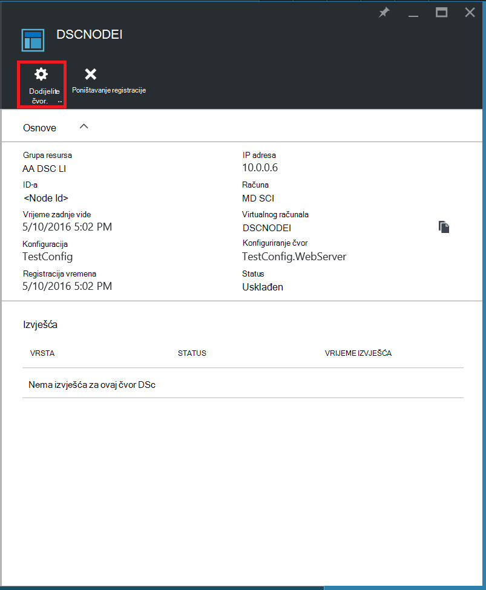

6. Na plohu **Dodijeliti čvor konfiguracije** odaberite čvor konfiguracija kojoj želite dodijeliti čvor, a zatim **u redu**.

    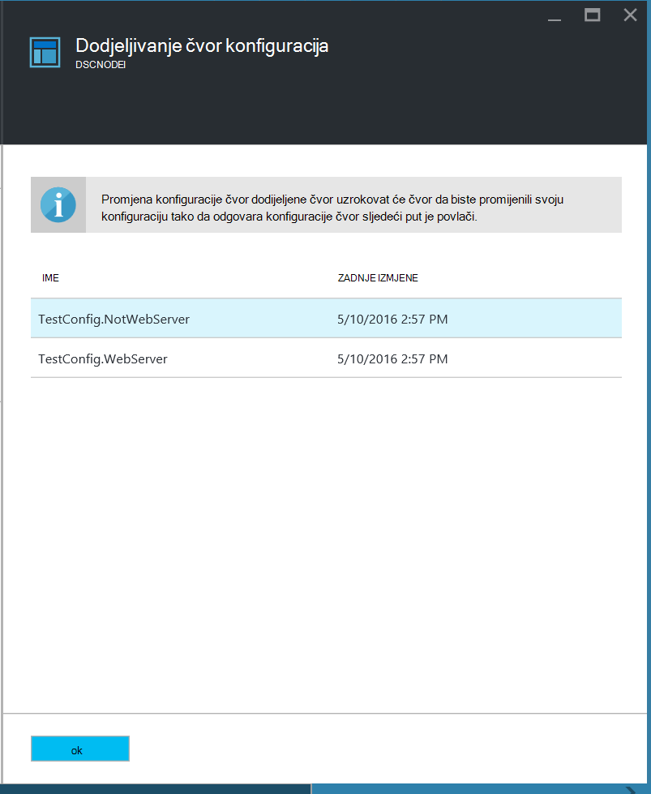
    
## <a name="unregistering-a-node"></a>Poništavanje registriranja čvor

Ako više ne želite da se čvor da biste upravlja Azure Automatizacija DSC možete je odjaviti.

1. Prijavite se na [portal za Azure](https://portal.azure.com).

2. Na izborniku koncentrator kliknite **Resursi za sve** , a zatim naziv računa za automatizaciju.

3. Na plohu **Automatizacija računa** kliknite **DSC čvorove**.

4. Na plohu **DSC čvorove** kliknite naziv čvor želite Odjava.

5. Na plohu za taj čvor, kliknite **neregistriranja**.

    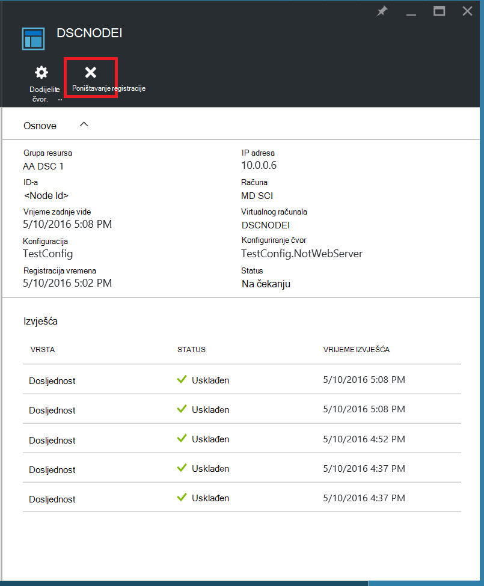

## <a name="related-articles"></a>Povezani članci
* [Pregled Azure DSC automatizacije](automation-dsc-overview.md)
* [Za Uhodavanje strojeva za upravljanje po DSC Automatizacija Azure](automation-dsc-onboarding.md)
* [Komponente Windows PowerShell želji pregled stanja konfiguracija](https://msdn.microsoft.com/powershell/dsc/overview)
* [Azure Automatizacija DSC cmdleta](https://msdn.microsoft.com/library/mt244122.aspx)
* [Automatizacija DSC Azure cijene](https://azure.microsoft.com/pricing/details/automation/)

