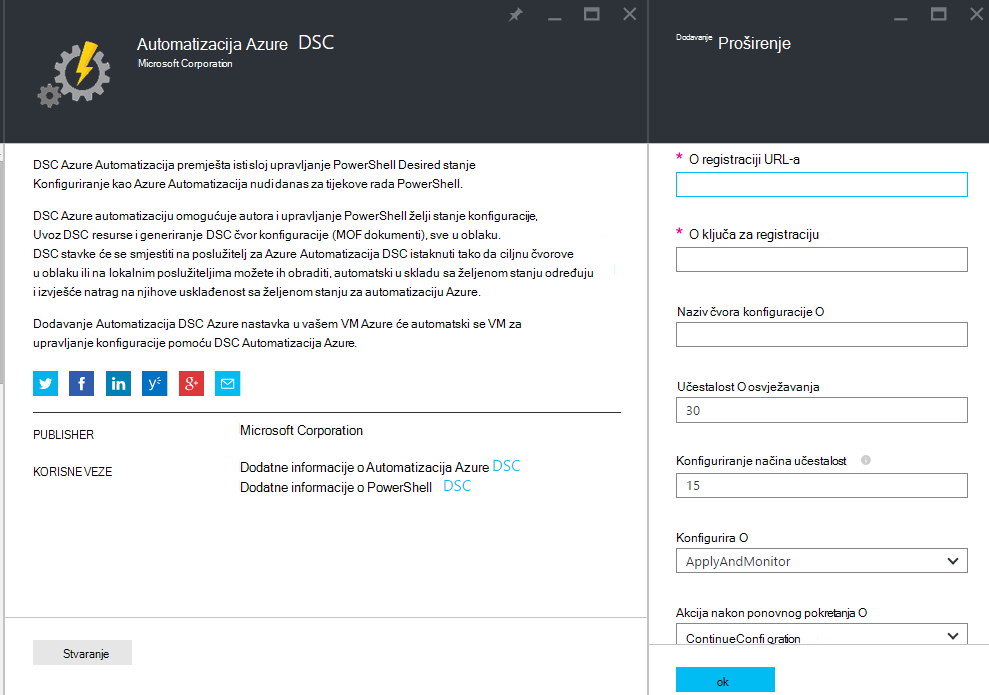
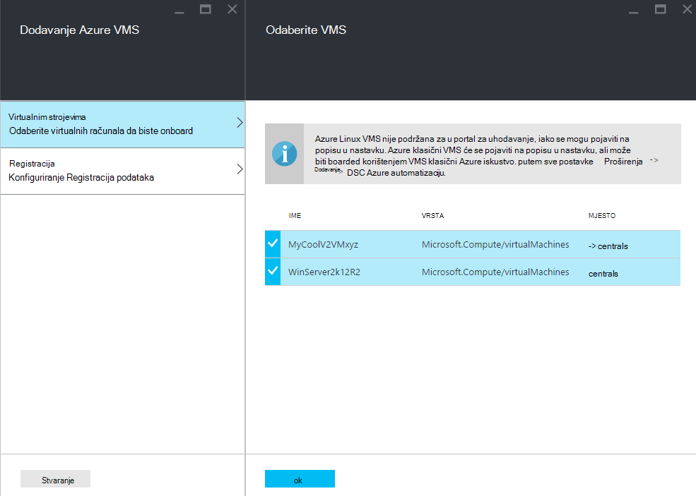
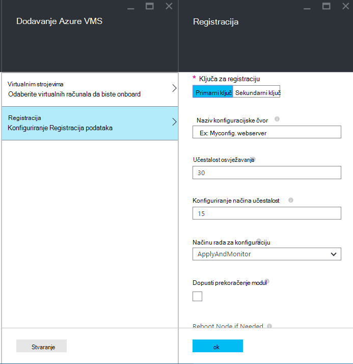
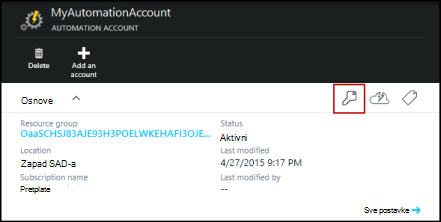
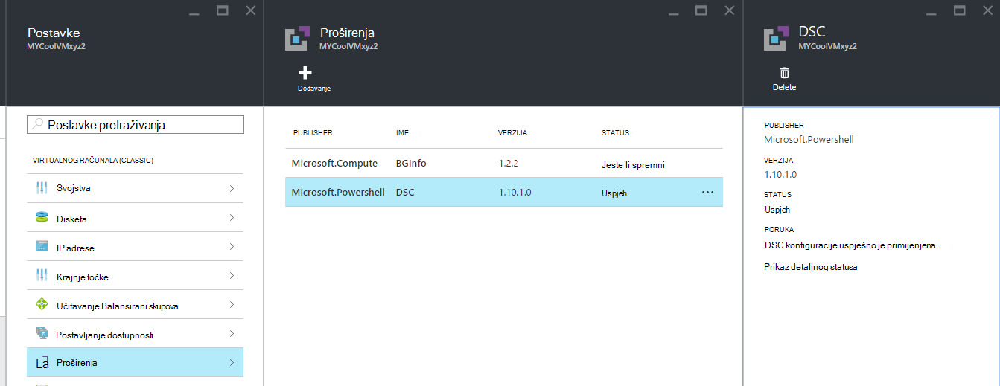

<properties 
   pageTitle="Za Uhodavanje fizičkih i virtualne strojeva za upravljanje po Azure Automatizacija DSC | Microsoft Azure" 
   description="Postavljanje računala za upravljanje s DSC Automatizacija Azure" 
   services="automation" 
   documentationCenter="dev-center-name" 
   authors="coreyp-at-msft" 
   manager="stevenka" 
   editor="tysonn"/>

<tags
   ms.service="automation"
   ms.devlang="NA"
   ms.topic="article"
   ms.tgt_pltfrm="powershell"
   ms.workload="TBD" 
   ms.date="04/22/2016"
   ms.author="coreyp"/>

# Za Uhodavanje strojeva za upravljanje po DSC Automatizacija Azure

## Zašto upravljanje računalima s DSC Automatizacija Azure?

Kao što su [Konfiguracija stanje želji PowerShell](https://technet.microsoft.com/library/dn249912.aspx)Azure Automatizacija želji stanje konfiguracije je jednostavno, ali napredni, konfiguracije upravljanja servis za čvorove DSC (fizičke i virtualnih računala) u bilo kojem oblaku ili na lokalnim poslužiteljima podatkovnog centra. Omogućuje skalabilnost preko tisuće strojeva brzo i jednostavno iz središnjem, sigurnom mjestu. Možete jednostavno onboard računalima, dodijelite ih deklarativno konfiguracija i prikaz izvješća koja prikazuju svaki na računalu je usklađenost u željenom stanju koje ste naveli. DSC Automatizacija Azure upravljanja sloj je DSC što Automatizacija Azure upravljanja sloj je za skriptiranje PowerShell. Drugim riječima, na isti način koji Azure Automatizacija olakšava upravljanje skripte komponente PowerShell i olakšava vam upravljanje DSC konfiguracije. Dodatne informacije o prednostima korištenja Azure Automatizacija DSC potražite u članku [Pregled DSC Automatizacija Azure](automation-dsc-overview.md). 

DSC Azure Automatizacija može se koristiti za upravljanje raznih strojeva:

*    Azure virtualnim strojevima (classic)
*    Azure virtualnim strojevima
*    Virtualnim strojevima Amazon Web Services (AWS)
*    Fizičke virtualne Windows strojeva informacije o lokalnom ili u oblak osim Azure/AWS
*    Fizičke virtualne Linux strojeva lokalnim Azure ili u oblak osim Azure

Osim toga, ako niste spremni upravljati konfiguracije računala iz oblaka, Azure Automatizacija DSC možete koristit i kao krajnju točku koja je samo za izvješća. Time da biste postavili (automatske) željena konfiguracija kroz DSC lokalnog i detaljima obogaćenog izvješćivanja na čvor usklađenost sa željenom stanju u automatizaciji Azure.

U sljedećim se odjeljcima strukture kako možete se svaku vrstu računala za Azure Automatizacija DSC.

## Azure virtualnim strojevima (classic)

Uz Azure DSC Automatizacija, možete jednostavno onboard Azure virtualnim strojevima (klasični) za upravljanje konfiguracije pomoću na portal za Azure ili PowerShell. Pokaži napredne postavke i bez potrebe za udaljene u na VM administratora proširenje Azure VM želji stanje konfiguracije registrira u VM s DSC Automatizacija Azure. Budući da nastavak Azure VM želji stanje konfiguracije asinkrono, pokreće korake da biste pratili tijek ili otklanjanje poteškoća s navedene su u odjeljku [**za otklanjanje poteškoća s Azure virtualnog računala uhodavanje**](#troubleshooting-azure-virtual-machine-onboarding) .

### Portal za Azure

[Portal za Azure](http://portal.azure.com/)kliknite **Pregledaj** -> **virtualnim strojevima (klasični)**. Odaberite VM Windows želite onboard. Na plohu nadzorne ploče virtualnog računala, kliknite **sve postavke** -> **proširenja** -> **Dodaj** -> **Azure Automatizacija DSC** -> **Stvori**. Unesite [vrijednosti Upravitelj konfiguracije komponente PowerShell DSC lokalne](https://msdn.microsoft.com/powershell/dsc/metaconfig4) potrebne za korištenje slučaj, ključa za registraciju Automatizacija računa i registracija URL i po želji čvor konfiguracije da biste dodijelili na VM.

Da biste pronašli Registracija URL i ključ za za automatizaciju račun za se računalo, u odjeljku [**sigurne Registracija**](#secure-registration) ispod.

### PowerShell

    # log in to both Azure Service Management and Azure Resource Manager
    Add-AzureAccount
    Add-AzureRmAccount
    
    # fill in correct values for your VM/Automation account here
    $VMName = ""
    $ServiceName = ""
    $AutomationAccountName = ""
    $AutomationAccountResourceGroup = ""

    # fill in the name of a Node Configuration in Azure Automation DSC, for this VM to conform to
    $NodeConfigName = ""

    # get Azure Automation DSC registration info
    $Account = Get-AzureRmAutomationAccount -ResourceGroupName $AutomationAccountResourceGroup -Name $AutomationAccountName
    $RegistrationInfo = $Account | Get-AzureRmAutomationRegistrationInfo

    # use the DSC extension to onboard the VM for management with Azure Automation DSC
    $VM = Get-AzureVM -Name $VMName -ServiceName $ServiceName
    
    $PublicConfiguration = ConvertTo-Json -Depth 8 @{
      SasToken = ""
      ModulesUrl = "https://eus2oaasibizamarketprod1.blob.core.windows.net/automationdscpreview/RegistrationMetaConfigV2.zip"
      ConfigurationFunction = "RegistrationMetaConfigV2.ps1\RegistrationMetaConfigV2"

    # update these PowerShell DSC Local Configuration Manager defaults if they do not match your use case.
    # See https://technet.microsoft.com/library/dn249922.aspx?f=255&MSPPError=-2147217396 for more details
     Properties = @{
        RegistrationKey = @{
          UserName = 'notused'
          Password = 'PrivateSettingsRef:RegistrationKey'
        }
        RegistrationUrl = $RegistrationInfo.Endpoint
        NodeConfigurationName = $NodeConfigName
        ConfigurationMode = "ApplyAndMonitor"
        ConfigurationModeFrequencyMins = 15
        RefreshFrequencyMins = 30
        RebootNodeIfNeeded = $False
        ActionAfterReboot = "ContinueConfiguration"
        AllowModuleOverwrite = $False
      }
    }

    $PrivateConfiguration = ConvertTo-Json -Depth 8 @{
      Items = @{
         RegistrationKey = $RegistrationInfo.PrimaryKey
      }
    }
    
    $VM = Set-AzureVMExtension `
     -VM $vm `
     -Publisher Microsoft.Powershell `
     -ExtensionName DSC `
     -Version 2.19 `
     -PublicConfiguration $PublicConfiguration `
     -PrivateConfiguration $PrivateConfiguration `
     -ForceUpdate

    $VM | Update-AzureVM

## Azure virtualnim strojevima

Azure DSC automatizaciju omogućuje vam da jednostavno onboard Azure virtualnim strojevima za upravljanje konfiguracije pomoću portala za Azure, predlošci Voditelj resursa Azure ili PowerShell. Pokaži napredne postavke i bez potrebe za udaljene u na VM administratora proširenje Azure VM želji stanje konfiguracije registrira u VM s DSC Automatizacija Azure. Budući da nastavak Azure VM želji stanje konfiguracije asinkrono, pokreće korake da biste pratili tijek ili otklanjanje poteškoća s navedene su u odjeljku [**za otklanjanje poteškoća s Azure virtualnog računala uhodavanje**](#troubleshooting-azure-virtual-machine-onboarding) .

### Portal za Azure

[Portal za Azure](https://portal.azure.com/)dođite do Azure Automatizacija računa koju želite onboard virtualnim računalima. Na nadzornoj ploči za račun Automatizacija, kliknite **DSC čvorove** -> **Dodavanje VM Azure**.

U odjeljku **Odaberite virtualnih računala da biste onboard**, odaberite jedan ili više Azure virtualnih računala da biste onboard.

U odjeljku **Konfiguriranje Registracija podataka**, unesite [vrijednosti Upravitelj konfiguracije komponente PowerShell DSC lokalne](https://msdn.microsoft.com/powershell/dsc/metaconfig4) potrebne za korištenje slučaj i po želji čvor konfiguracije da biste dodijelili na VM.

 
### Predlošci Azure Voditelj resursa

Azure virtualnim strojevima može uvesti i onboarded za Azure Automatizacija DSC putem Voditelj resursa Azure predložaka. Potražite u članku [Konfiguriranje VM putem DSC proširenje i Azure Automatizacija DSC](https://azure.microsoft.com/documentation/templates/dsc-extension-azure-automation-pullserver/) za predložak programa primjer onboards postojeće VM za Azure Automatizacija DSC. Da biste pronašli ključa za registraciju i registracija URL uzima kao ulaz u ovaj predložak, u odjeljku [**sigurne Registracija**](#secure-registration) ispod.

### PowerShell

Cmdlet [Register AzureRmAutomationDscNode](https://msdn.microsoft.com/library/mt603833.aspx) se može koristiti za onboard virtualnim strojevima na portalu za Azure PowerShell.

## Virtualnim strojevima Amazon Web Services (AWS)

Možete jednostavno onboard Amazon web-servisi virtualnim strojevima za upravljanje konfiguraciju tako da Azure Automatizacija DSC korištenje kompleta alata za DSC AWS. Dodatne informacije o kompleta alata za [ovdje](https://blogs.msdn.microsoft.com/powershell/2016/04/20/aws-dsc-toolkit/).

## Fizičke virtualne Windows strojeva informacije o lokalnom ili u oblak osim Azure/AWS

Lokalnog sustava Windows računalima i računalima sustava Windows koji nisu Azure oblaka (kao što su Amazon web-servisi) može biti onboarded za Azure DSC Automatizacija, pod uvjetom da imaju izlaznog pristup Internetu putem nekoliko jednostavnih koraka:

1. Provjerite je li instaliran najnoviju verziju [WMF 5](http://aka.ms/wmf5latest) na računalima želite onboard za Azure Automatizacija DSC.
2. Slijedite upute u odjeljku [**metaconfigurations generiranje DSC**](#generating-dsc-metaconfigurations) dolje da biste generirali mape koja sadrži potrebne metaconfigurations DSC.
3. Primjena daljinski metaconfiguration PowerShell DSC strojeva želite onboard. **Na računalu je ta naredba Pokreni s morate imati najnoviju verziju [WMF 5](http://aka.ms/wmf5latest) instaliran**:

    `Set-DscLocalConfigurationManager -Path C:\Users\joe\Desktop\DscMetaConfigs -ComputerName MyServer1, MyServer2`

4. Ako ne možete primijeniti metaconfigurations PowerShell DSC daljinski, kopirajte metaconfigurations mapu iz korak 2 na svakom računalu onboard. Zatim pozovite **Skup DscLocalConfigurationManager** lokalno na svakom računalu da biste onboard.
5. Pomoću portala za Azure ili Cmdlete, provjerite strojeva koji onboard sada prikazuju kao čvorove DSC registrirana na vašem računu Azure automatizaciju.

## Fizičke virtualne Linux strojeva lokalnim Azure ili u oblak osim Azure

Lokalni Linux strojeva, Linux računalima Azure i Linux računalima koje nisu Azure oblaka može biti onboarded za Azure DSC Automatizacija, pod uvjetom da imaju izlaznog pristup Internetu putem nekoliko jednostavnih koraka:

1. Provjerite je li instaliran najnoviju verziju [DSC Linux agent](http://www.microsoft.com/download/details.aspx?id=49150) na računalima želite onboard za Azure Automatizacija DSC.

2. Ako je [zadano Upravitelj konfiguracije komponente PowerShell DSC lokalne](https://msdn.microsoft.com/powershell/dsc/metaconfig4) VELIKA/mala slova na korištenje, a želite na onboard machines kao što su te ih **povlačiti sadržaje iz i izvješća za Azure Automatizacija DSC** :

    *    Na računalu da biste onboard za Azure Automatizacija DSC svaki Linux pomoću Register.py onboard pomoću upravitelja konfiguracije komponente PowerShell DSC lokalne zadanih:

        `/opt/microsoft/dsc/Scripts/Register.py <Automation account registration key> <Automation account registration URL>`

    *    Da biste pronašli ključa za registraciju i URL za registraciju za vaš račun automatizacije, u odjeljku [**sigurne Registracija**](#secure-registration) ispod.

    Ako upravitelju konfiguracije lokalne DSC PowerShell zadane postavke **učinite** **ne** podudaraju koristi slučaj ili želite onboard strojeva tako da samo izvješća za Azure Automatizacija DSC, ali učinili ne istaknuti konfiguraciju ili module PowerShell iz nje, slijedite korake 3-6. U suprotnom prijeđite izravno u koraku 6.

3.  Slijedite upute [**za generiranje DSC metaconfigurations**](#generating-dsc-metaconfigurations) odjeljak u nastavku da biste generirali mape koja sadrži potrebne metaconfigurations DSC.
4.  Daljinsko primijeniti metaconfiguration PowerShell DSC strojeva želite onboard:
        
        $SecurePass = ConvertTo-SecureString -String "<root password>" -AsPlainText -Force
        $Cred = New-Object System.Management.Automation.PSCredential "root", $SecurePass
        $Opt = New-CimSessionOption -UseSsl -SkipCACheck -SkipCNCheck -SkipRevocationCheck

        # need a CimSession for each Linux machine to onboard
        
        $Session = New-CimSession -Credential $Cred -ComputerName <your Linux machine> -Port 5986 -Authentication basic -SessionOption $Opt
        
        Set-DscLocalConfigurationManager -CimSession $Session –Path C:\Users\joe\Desktop\DscMetaConfigs
    
Na računalu je ta naredba Pokreni s morate imati najnoviju verziju [WMF 5](http://aka.ms/wmf5latest) instaliran.

5.  Ako metaconfigurations PowerShell DSC nije moguće primijeniti daljinski, za svaku Linux računalo da biste se, kopirali metaconfiguration iz mape u koraku 5 na računalo Linux koje odgovaraju na tom računalu. Zatim poziva `SetDscLocalConfigurationManager.py` lokalno na svakom računalu Linux želite na onboard DSC Azure Automatizacija:

    `/opt/microsoft/dsc/Scripts/SetDscLocalConfigurationManager.py –configurationmof <path to metaconfiguration file>`

6.  Pomoću portala za Azure ili Cmdlete, provjerite strojeva koji onboard sada prikazuju kao čvorove DSC registrirana na vašem računu Azure automatizaciju.

##Generiranje DSC metaconfigurations
Da biste generically onboard bilo kojeg uređaja za Azure DSC Automatizacija, DSC metaconfiguration može biti generira koji, kada se primjenjuje govori DSC agent na računalu povlačiti sadržaje iz i/ili izvješća za Azure Automatizacija DSC. DSC metaconfigurations za Azure Automatizacija DSC možete generirati pomoću komponente PowerShell DSC konfiguraciju ili cmdleta ljuske PowerShell za automatizaciju Azure.

**Bilješke:** DSC metaconfigurations sadrže tajne potrebne za onboard računala za programa automatizacije računa za upravljanje. Provjerite jeste li ispravno zaštita sve metaconfigurations DSC stvarate ili ih izbrisati nakon korištenja.

###DSC konfiguraciju
1.  Otvorite Očisti filtar u ulozi administratora na računalu u lokalnom okruženju. Na računalu morate imati najnoviju verziju [WMF 5](http://aka.ms/wmf5latest) instaliran.

2.  Kopirajte sljedeću skriptu lokalno. Ova skripta sadrži konfiguracije DSC ljuske PowerShell za stvaranje metaconfigurations i naredbu izbaciti stvaranja metaconfiguration.
    
        # The DSC configuration that will generate metaconfigurations
        [DscLocalConfigurationManager()]
        Configuration DscMetaConfigs 
        { 
            param 
            ( 
                [Parameter(Mandatory=$True)] 
                [String]$RegistrationUrl,
         
                [Parameter(Mandatory=$True)] 
                [String]$RegistrationKey,

                [Parameter(Mandatory=$True)] 
                [String[]]$ComputerName,

                [Int]$RefreshFrequencyMins = 30, 
            
                [Int]$ConfigurationModeFrequencyMins = 15, 
            
                [String]$ConfigurationMode = "ApplyAndMonitor", 
            
                [String]$NodeConfigurationName,

                [Boolean]$RebootNodeIfNeeded= $False,

                [String]$ActionAfterReboot = "ContinueConfiguration",

                [Boolean]$AllowModuleOverwrite = $False,

                [Boolean]$ReportOnly
            )

    
            if(!$NodeConfigurationName -or $NodeConfigurationName -eq "") 
            { 
                $ConfigurationNames = $null 
            } 
            else 
            { 
                $ConfigurationNames = @($NodeConfigurationName) 
            }

            if($ReportOnly)
            {
               $RefreshMode = "PUSH"
            }
            else
            {
               $RefreshMode = "PULL"
            }

            Node $ComputerName
            {

                Settings 
                { 
                    RefreshFrequencyMins = $RefreshFrequencyMins 
                    RefreshMode = $RefreshMode 
                    ConfigurationMode = $ConfigurationMode 
                    AllowModuleOverwrite = $AllowModuleOverwrite 
                    RebootNodeIfNeeded = $RebootNodeIfNeeded 
                    ActionAfterReboot = $ActionAfterReboot 
                    ConfigurationModeFrequencyMins = $ConfigurationModeFrequencyMins 
                }

                if(!$ReportOnly)
                {
                   ConfigurationRepositoryWeb AzureAutomationDSC 
                    { 
                        ServerUrl = $RegistrationUrl 
                        RegistrationKey = $RegistrationKey 
                        ConfigurationNames = $ConfigurationNames 
                    }

                    ResourceRepositoryWeb AzureAutomationDSC 
                    { 
                       ServerUrl = $RegistrationUrl 
                       RegistrationKey = $RegistrationKey 
                    }
                }

                ReportServerWeb AzureAutomationDSC 
                { 
                    ServerUrl = $RegistrationUrl 
                    RegistrationKey = $RegistrationKey 
                }
            } 
        }
        
        # Create the metaconfigurations
        # TODO: edit the below as needed for your use case
        $Params = @{
             RegistrationUrl = '<fill me in>';
             RegistrationKey = '<fill me in>';
             ComputerName = @('<some VM to onboard>', '<some other VM to onboard>');
             NodeConfigurationName = 'SimpleConfig.webserver';
             RefreshFrequencyMins = 30;
             ConfigurationModeFrequencyMins = 15;
             RebootNodeIfNeeded = $False;
             AllowModuleOverwrite = $False;
             ConfigurationMode = 'ApplyAndMonitor';
             ActionAfterReboot = 'ContinueConfiguration';
             ReportOnly = $False;  # Set to $True to have machines only report to AA DSC but not pull from it
        }
        
        # Use PowerShell splatting to pass parameters to the DSC configuration being invoked
        # For more info about splatting, run: Get-Help -Name about_Splatting
        DscMetaConfigs @Params

3.  Unesite ključ za registraciju i URL-a za vaš račun Automatizacija, kao i nazivi strojeva koji onboard. Svi drugi parametri nisu obavezni. Da biste pronašli ključa za registraciju i URL za registraciju za vaš račun automatizacije, u odjeljku [**sigurne Registracija**](#secure-registration) ispod.

4.  Ako želite strojeva izvješća DSC informacije o statusu da biste DSC Automatizacija Azure, ali ne istaknuti konfiguraciju ili PowerShell module, postavite parametar **ReportOnly** na true.

5.  Pokrenite skriptu. Trebala bi se u mapu pod nazivom **DscMetaConfigs** u direktoriju raditi, koji sadrži metaconfigurations DSC ljuske PowerShell za računala da biste onboard.

###Pomoću cmdleta za automatizaciju Azure
Ako zadane postavke upravitelja konfiguracije komponente PowerShell DSC lokalne VELIKA/mala slova na korištenje, a želite onboard strojeva tako da ih i povlačiti sadržaje iz i izvješća za Azure Automatizacija DSC, cmdleti za automatizaciju Azure sadrže pojednostavljeni način metaconfigurations DSC potrebne za generiranje:

1.  Otvorite konzole PowerShell ili Očisti filtar u ulozi administratora na računalu u lokalnom okruženju.

2.  Povezivanje za Azure Voditelj resursa pomoću **Dodaj AzureRmAccount**

3.  Preuzimanje metaconfigurations DSC ljuske PowerShell za strojeva želite onboard s računa za automatizaciju na kojem želite onboard čvorove:

        # Define the parameters for Get-AzureRmAutomationDscOnboardingMetaconfig using PowerShell Splatting
        $Params = @{
            ResourceGroupName = 'ContosoResources'; # The name of the ARM Resource Group that contains your Azure Automation Account
            AutomationAccountName = 'ContosoAutomation'; # The name of the Azure Automation Account where you want a node on-boarded to
            ComputerName = @('web01', 'web02', 'sql01'); # The names of the computers that the meta configuration will be generated for
            OutputFolder = "$env:UserProfile\Desktop\";
        }
        
        # Use PowerShell splatting to pass parameters to the Azure Automation cmdlet being invoked
        # For more info about splatting, run: Get-Help -Name about_Splatting
        Get-AzureRmAutomationDscOnboardingMetaconfig @Params

Trebala bi se u mapu pod nazivom ***DscMetaConfigs***, koji sadrži metaconfigurations DSC ljuske PowerShell za računala da biste onboard.

##Registracija za sigurnu

Strojeva možete sigurno se s računom za automatizaciju Azure kroz protokol za registraciju WMF 5 DSC koji omogućuje DSC čvor za provjeru autentičnosti PowerShell DSC V2 istaknuti ili izvješćivanja poslužitelja (uključujući Azure Automatizacija DSC). Čvor registrira poslužitelj na **URL Registracija**, provjera autentičnosti pomoću **ključa za registraciju**. Tijekom registracije, čvor DSC i povlačite izvješćivanja DSC server sklopite jedinstveni certifikat za ovaj čvor koristiti za provjeru autentičnosti na poslužitelju nakon registracije. Ovaj postupak onemogućuje onboarded čvorove oponaša nešto drugo, primjerice ako čvor ugrožena i ponaša zlonamjerno. Nakon registracije, ključa za registraciju se koristi za provjeru autentičnosti ponovno i izbriše s čvor.

Možete dobiti informacije potrebne za registraciju protokol DSC iz plohu **Upravljanje tipke** na portalu za Azure pretpregled. Otvorite ovaj plohu tako da kliknete ikonu ključa na ploči **Essentials** za automatizaciju račun.

*    Registracija URL je polja URL-a u plohu upravljanje tipke.
*    Registracija ključ se primarni ključ Access ili sekundarni tipkovnog plohu upravljanje tipke. Neki ključ može se koristiti.

Radi dodatne sigurnosti primarnih i sekundarnih pristupnih tipki računa za automatizaciju mogu biti regenerated u bilo kojem trenutku (na plohu **Upravljanja ključevima** ) da biste spriječili buduće čvor registracije pomoću prethodne tipki.

##Otklanjanje poteškoća za uhodavanje Azure virtualnog računala

DSC Azure automatizaciju omogućuje vam da jednostavno onboard VMs Windows Azure upravljanja konfiguracije. U odjeljku Napredne postavke, proširenje Azure VM želji stanje konfiguracije koristi se za morate registrirati u VM DSC Automatizacija Azure. Budući da nastavak Azure VM želji stanje konfiguracije asinkrono, pokreće tijek za praćenje i njegova izvođenja za otklanjanje poteškoća mogu biti važna. 

>[AZURE.NOTE] Bilo koji način za uhodavanje sustava VM Windows Azure za Azure Automatizacija DSC koja koristi datotečni nastavak Azure VM želji stanje konfiguracije može potrajati i do jedan sat za čvor da biste prikazali najviše registrirana u automatizaciji Azure. To je zbog instalacije paketa Windows Management Framework 5.0 na VM nastavak Azure VM DSC koje je potrebno da biste onboard VM za Azure Automatizacija DSC.

Otklanjanje poteškoća s ili prikaz statusa proširenje Azure VM želji stanje konfiguracije, u na Azure portal dođite do VM se onboarded, a zatim kliknite -> **sve postavke** -> **proširenja** -> **DSC**. Dodatne informacije, kliknite **Prikaz detaljnog statusa**.

## Istek certifikat i reregistration

Nakon registracije stroj kao DSC čvor u DSC Azure Automatizacija, postoji nekoliko razloga zašto možda ćete morati ponovno registrirajte taj čvor u budućnosti:

* Nakon registracije, svaki čvor automatski pregovara jedinstveni certifikat za provjeru autentičnosti koja istječe nakon jedne godine. Trenutno protokol za registraciju PowerShell DSC ne može automatski se obnoviti potvrde kada su oni nearing isteka, pa ćete morati ponovno registrirajte čvorove nakon vremena u godini. Prije registrirati, provjerite je li da svaki čvor se izvodi Windows Management Framework 5.0 RTM. Certifikat za provjeru autentičnosti u čvor istekne, a čvor je reregistered, čvor neće biti moguće možete komunicirati s Automatizacija Azure i bit će označene "Unresponsive." Reregistration izvršiti 90 dana ili manje od vrijeme isteka certifikata ili bilo kojem trenutku nakon isteka vremena certifikat rezultirat će novi certifikat generira i koristi.

* Da biste promijenili [Upravitelj konfiguracije komponente PowerShell DSC lokalne vrijednosti](https://msdn.microsoft.com/powershell/dsc/metaconfig4) koja su postavljena tijekom početne registracije čvor, kao što su ConfigurationMode. Trenutno te vrijednosti agent DSC mogu se promijeniti samo putem reregistration. Jednu iznimku je konfiguracija čvor dodijeljene čvor--to se može promijeniti u Azure Automatizacija DSC izravno.

Reregistration može izvoditi na isti način kao i ste registrirali čvor prethodno, na bilo koji od načina za uhodavanje opisani u ovom dokumentu. Nije potrebna odjava čvor iz DSC Azure automatizacije prije nego što je registrirati.

## Povezani članci
* [Pregled Azure DSC automatizacije](automation-dsc-overview.md)
* [Azure Automatizacija DSC cmdleta](https://msdn.microsoft.com/library/mt244122.aspx)
* [Automatizacija DSC Azure cijene](https://azure.microsoft.com/pricing/details/automation/)

