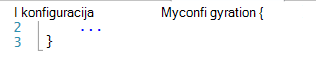
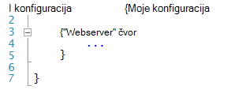
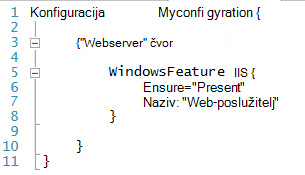
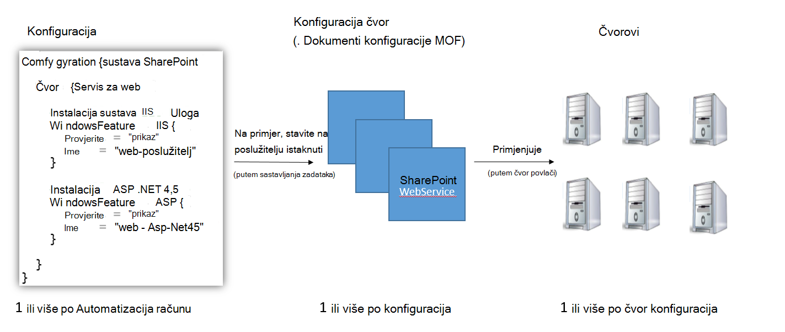
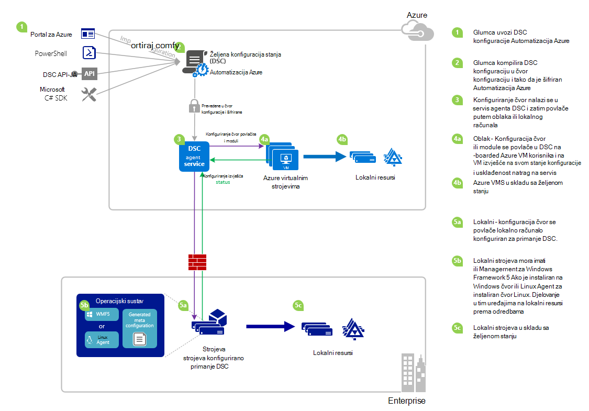

<properties 
   pageTitle="Pregled DSC Azure Automatizacija | Microsoft Azure" 
   description="Na pregled od Azure Automatizacija želji stanje konfiguracije (DSC), uvjeti i poznati problemi" 
   services="automation" 
   documentationCenter="dev-center-name" 
   authors="coreyp-at-msft" 
   manager="stevenka" 
   editor="tysonn"
   keywords="PowerShell dsc, željenom stanju konfiguracija, a zatim powershell dsc azure"/>

<tags
   ms.service="automation"
   ms.devlang="NA"
   ms.topic="article"
   ms.tgt_pltfrm="powershell"
   ms.workload="TBD" 
   ms.date="05/10/2016"
   ms.author="magoedte;coreyp"/>

# Pregled DSC Azure automatizacije #

##Što je DSC Automatizacija Azure?##
Uvođenje i održavanje željenom stanju poslužitelja i resursima aplikacije mogu biti zamoran i pogreškama podložni. S Azure Automatizacija željeni stanje konfiguracije (DSC), možete dosljedno implementacije, pouzdano praćenje i automatsko ažuriranje željenom stanju svih vaš IT resursa na razini iz oblaka. U komponenti na PowerShell DSC Automatizacija DSC možete poravnati konfiguracije računala s određenim stanje preko fizičke i virtualnim strojevima (VMs), pomoću sustava Windows ili Linux, i u oblaku ili na lokalnim poslužiteljima. Možete omogućiti neprekinuti IT usluge isporuke s kontrolom dosljedan i upravljanje brzog promjena heterogenih hibridno okruženje za IT s lakoćom.

DSC Azure Automatizacija sastavlja pri vrhu osnove uvedena u DSC PowerShell možete unijeti pojednostaviti konfiguracije sučelje za upravljanje. Azure Automatizacija DSC premješta isti sloj upravljanje konfiguracije [Stanje želji PowerShell](https://msdn.microsoft.com/powershell/dsc/overview) kao Azure Automatizacija nudi za PowerShell skriptiranje danas.

Azure DSC automatizaciju omogućuje [Stvaranje i upravljanje PowerShell želji stanje konfiguracije](https://technet.microsoft.com/library/dn249918.aspx), Uvoz [DSC resurse](https://technet.microsoft.com/library/dn282125.aspx)i generiranje DSC čvor konfiguracije (MOF dokumenti), sve u oblaku. DSC stavke će se smjestiti na Azure Automatizacija [DSC istaknuti poslužitelj](https://technet.microsoft.com/library/dn249913.aspx) tako da se čvorove ciljne (kao što su fizičke i virtualnim strojevima) u oblaku ili na lokalnim poslužiteljima možete ih obraditi, automatski u skladu sa željenom stanju određuju i izvješće vratili na svoje usklađenost sa željenom stanju za automatizaciju Azure.

Radije gledaju za čitanje? Imate pogledati na ispod videozapisa s svibanj 2015 kada je Azure Automatizacija DSC najprije objaviti. **Bilješke:** Dok koncepata i životni ciklus spominju u ovom ćete videozapisu ispravni mnogo je progressed Azure Automatizacija DSC jer je naveden u ovom se videozapisu. Je sada je Općenito dostupan, sadrži mnogo širi korisničko Sučelje na portalu za Azure i podržava mnoge dodatne mogućnosti.

> [AZURE.VIDEO microsoft-ignite-2015-heterogeneous-configuration-management-using-microsoft-azure-automation]

## Azure Automatizacija DSC uvjeta ##
### Konfiguracija ###
PowerShell DSC uvedena novi pojam naziva konfiguracije. Konfiguracija omogućuju definiranje putem sintaksa PowerShell željenom stanju vaše okruženje. Da biste pomoću DSC konfigurirati vaše okruženje, najprije definiranje blok skripte komponente Windows PowerShell pomoću ključnih riječi za konfiguraciju, a zatim slijedite s identifikatoru, zatim s vitičaste zagrade ({}) da biste razdijelite bloka.

Unutar bloka konfiguracije možete definirati čvor konfiguraciju blokove koji određuju željena konfiguracija skupa čvorove (računala) u okruženju sustava mora biti konfigurirana točno onako. Na taj način čvor konfiguracije predstavlja "uloga" za jednu ili više čvorove pretpostavlja da. Konfiguracija blok čvor počinje čvor ključnu riječ. Slijedite ove ključne riječi s nazivom ulogu, što može biti varijabla ili izraz. Nakon naziva uloga pomoću zagrade {} razdijelite konfiguracije bloka čvor.

 
U konfiguraciji bloka čvor možete definirati blokove resursa za konfiguriranje određene DSC resursi. Blok resursa započinje nazivom resursa, nakon čega slijedi identifikator da biste odredili za taj blok, a zatim vitičaste zagrade {} da biste razdijelite bloka.

Detaljnije informacije o konfiguraciji ključnu riječ, potražite u članku: [Objašnjenje ključnu riječ konfiguraciju u želji konfiguraciji stanje](http://blogs.msdn.com/b/powershell/archive/2013/11/05/understanding-configuration-keyword-in-desired-state-configuration.aspx "Ključnu riječ razumijevanje konfiguraciju u želji konfiguraciji stanja")

Pokretanje (Kompiliranje) DSC konfiguracije će stvoriti jednu ili više DSC čvor konfiguracije (MOF dokumenti), koje su koji se DSC čvorove primjenjivati u skladu sa željenom stanju.

Azure DSC automatizaciju omogućuje vam da biste uvezli, autor, i Kompiliranje DSC konfiguracije u Azure Automatizacija, slično kako runbooks moguće je uvesti, autor, te pokreće Azure automatizaciju.

>[AZURE.IMPORTANT] Konfiguraciju smiju sadržavati samo jedan blok za konfiguraciju, s istim nazivom kao konfiguraciju DSC Automatizacija Azure. 

###Konfiguriranje čvor###

Kada prikupljaju se DSC konfiguracije, jedan ili više konfiguracije čvor da je proizvedeno ovisno o blokovima čvor u konfiguraciji Čvor konfiguracije ista je kao "MOF" ili "konfiguracije dokument" (Ako ste upoznati s tim uvjetima PS DSC) i predstavlja "ulozi", kao što su webserver ili tempiranja, želji stanju jedan ili više čvorove treba pretpostavlja ili potražiti usklađenost na temelju. Imena čvor konfiguracije u Azure Automatizacija DSC se pojavljuju u obliku "Konfiguracija Name.NodeConfigurationBlockName".

PS DSC čvorove postaju upoznat čvor konfiguracije oni treba enact putem automatske DSC ili povlačite metode. DSC Azure Automatizacija ovisi o istaknuti metodu DSC gdje su primjene iz DSC Automatizacija Azure čvorove zahtjev čvor konfiguracije istaknuti poslužitelja. Jer čvorove unijeli zahtjev DSC Azure Automatizacija, može biti čvorove iza vatrozida, imate sve dolazni priključke Zatvoreno, itd. Koje su im potrebne samo izlaznog pristup Internetu (izravno ili putem proxy poslužitelj).

###Čvor###

DSC čvor je bilo koji stroju koji ima svoju konfiguraciju upravlja DSC. To može biti sa sustavom Windows ili Linux Azure VM, lokalni VM / fizičke glavno računalo ili računalo u drugom javno oblaka. Čvorovi enact čvor konfiguracija postaju i održavanje usklađenost sa željenom stanju definiranja i također možete izvješće izvješćivanja poslužitelj na svom stanje konfiguracije i usklađenost nasuprot željenom stanju.

DSC Azure Automatizacija olakšano za uhodavanje sustava čvorove za upravljanje po DSC Automatizacija Azure, a omogućuje promjenu konfiguracije čvor dodijeljene svaki čvor poslužiteljsko, tako da se sljedeći put čvor provjerava poslužitelj upute bit će pretpostavlja drugu ulogu i promijeniti način na koji je konfiguriran i complaince status ga treba izvješća na temelju tako da odgovara.

###Resurs###
DSC Resursi su sastavne blokove koje možete koristiti da biste definirali konfiguraciju Windows PowerShell želji stanje konfiguracije (DSC). DSC dolazi sa skupom ugrađene resurse kao što su oni za datoteke i mape, značajke server i uloge, postavke registra, varijable okruženja i servise i procesa. Da biste saznali više o cijeli popis ugrađene DSC resursa i kako ih koristiti, potražite u članku [Ugrađene Windows PowerShell želji stanje konfiguracije resursi](https://technet.microsoft.com/library/dn249921.aspx).

DSC resursa moguće je uvesti i kao dio moduli PowerShell da biste proširili skup ugrađenih DSC resursi. Resursi koji nisu zadani će povlačenje čvorovi DSC istaknuti poslužitelja DSC ako čvor konfiguracije čvor htjeli enact sadrži reference na tih resursa. Da biste saznali kako stvoriti prilagođene resursa, potražite u članku [Stvaranje prilagođenih Windows PowerShell želji stanje konfiguracije resursa](https://technet.microsoft.com/library/dn249927.aspx).

DSC Azure Automatizacija dolazi s resursima iste ugrađene DSC kao PS DSC. Dodatni resursi mogu se dodati Azure Automatizacija DSC uvozom PowerShell moduli koji sadrži resurse u Azure automatizaciju.

###Zadatak sastavljanja###
Zadatak sastavljanja u Azure Automatizacija DSC je instance komponente sastavljanja konfiguracije, da biste stvorili jedan ili više čvor konfiguracije. Oni su slične Azure automatizaciju zadataka runbook, osim što se oni ne zapravo zadatak sve osim za stvaranje čvor konfiguracije. Sve konfiguracije čvor stvorio posao sastavljanja automatski sprema na poslužitelj za Azure Automatizacija DSC povlačite i prebrisati prethodne verzije konfiguracije čvor ako oni su postojali tu konfiguraciju. Naziv čvor konfiguracije koje je stvorio posao sastavljanja sastoji od "ConfigurationName.NodeConfigurationBlockName". Na primjer, Kompiliranje na ispod konfiguracije želite proizvesti konfiguraciju jedan čvor naziva "MyConfiguration.webserver"

>[AZURE.NOTE] Baš kao i runbooks, možete objaviti konfiguracije. To nije povezan stavljati DSC na poslužitelj za Azure Automatizacija DSC povlačite. Sastavljanje poslove prouzročiti DSC stavki koje će se nalaziti na poslužitelju istaknuti DSC Automatizacija Azure. Dodatne informacije o "Objavljivanje" u automatizaciji Azure potražite u članku [Objavljivanje na Runbook](https://msdn.microsoft.com/library/dn903765.aspx).

##Životni ciklus DSC Azure automatizacije##
Stizati s računa za automatizaciju prazan upravljanog skupa pravilno konfigurirani čvorove uključuje skup procese za definiranje konfiguracijama, isključivanjem te konfiguracija u čvor konfiguracije i za uhodavanje čvorove DSC Automatizacija Azure i one čvor konfiguracije. Na sljedećem su dijagramu ilustrira životni ciklus DSC Azure Automatizacija:

Sljedeća slika prikazuje detaljne detaljan postupak u vijek trajanja DSC. Uključuje različite načine konfiguraciju je uvesti i primjenjuje na čvorove u Azure Automatizacija, komponente koje su potrebne za programa lokalnog računala za podršku DSC i interakcije između različitih komponenata. 

     

##Preprekama / Poznati problemi:##

- Prilikom nadogradnje na WMF 5 RTM, ako na računalu već je registrirana kao čvor u DSC Azure Automatizacija, unregister iz DSC Automatizacija Azure i registrirati nakon nadogradnje WMF 5 RTM.

- DSC Azure Automatizacija ne podržava djelomična ili složeni DSC konfiguracije trenutno. DSC složeni resursa možete biti uvezeni i samo poput koristi u Azure Automatizacija DSC konfiguracije u lokalnom PowerShell Omogućivanje ponovnog korištenja konfiguracije.

- Najnoviju verziju WMF 5 mora biti instaliran da PowerShell DSC agent za Windows da biste mogli komunicirati s Azure automatizaciju. Najnoviju verziju programa PowerShell DSC agent za Linux mora biti instaliran da Linux da biste mogli komunicirati s Azure automatizaciju.

- Tradicionalni poslužitelja istaknuti PowerShell DSC očekuje modul zips smjestiti na poslužitelju istaknuti u obliku **ModuleName_Version.zip "**. Azure Automatizacija očekuje PowerShell module za uvoz s nazivima u obliku **ModuleName.zip**. Potražite u [blogu](https://azure.microsoft.com/blog/2014/12/15/authoring-integration-modules-for-azure-automation/) dodatne informacije na oblik Integracija modul potrebne za uvesti modul Azure automatizaciju. 

- Moduli PowerShell uvezeni u Azure Automatizacija ne smije sadržavati .doc i .docx datoteke. Neke komponente PowerShell module koji sadrži resurse DSC sadrže te datoteke u svrhu pomoć. Te se datoteke treba ukloniti iz prethodnih uvesti Azure Automatizacija module.

- Kada čvor je registriran s računom za automatizaciju Azure ili čvor mijenja se mogu mapirati na različite čvor konfiguracije poslužiteljsko, njegova statusa bit će 'Compliant', čak i ako se status u čvor nije zapravo sukladan s konfiguracijom čvor sada mapirati u. Kada čvor izvodi njegov prvi istaknuti i šalje prvo izvješće, nakon registracije ili mapiranje promjene konfiguracije čvor, status čvor možete smatraju pouzdanima.

- Kada za uhodavanje sustava VM Windows Azure upravljanja po Azure Automatizacija DSC na bilo koji od naše izravnu za uhodavanje metoda ga može proći čas za VM koja će se prikazivati kao DSC čvor u automatizaciji Azure. To je zbog instalacije paketa Windows Management Framework 5.0 na VM nastavak Azure VM DSC koje je potrebno da biste onboard VM za Azure Automatizacija DSC.

- Nakon registracije, svaki čvor automatski pregovara jedinstveni certifikat za provjeru autentičnosti koja istječe nakon jedne godine. Trenutno protokol za registraciju PowerShell DSC ne može automatski obnoviti potvrde kada su oni nearing isteka, pa ćete morati ponovno registrirajte čvorove nakon vremena u godini. Prije registrirati, provjerite je li da svaki čvor se izvodi Windows Management Framework 5.0 RTM. Certifikat za provjeru autentičnosti u čvor istekne, a čvor je reregistered, čvor neće biti moguće možete komunicirati s Automatizacija Azure i bit će označene "Unresponsive." Reregistration izvodi se na isti način kao i prethodno registrirani čvor. Reregistration izvršiti 90 dana ili manje od vrijeme isteka certifikata ili bilo kojem trenutku nakon isteka vremena certifikat rezultirat će novi certifikat generira i koristi.

- Prilikom nadogradnje na WMF 5 RTM, ako na računalu već je registrirana kao čvor u DSC Azure Automatizacija, unregister iz DSC Automatizacija Azure i registrirati nakon nadogradnje WMF 5 RTM. Prije nego što registrirati, izbrišite $env:windir\system32\configuration\DSCEngineCache.mof datoteku.

- PowerShell DSC cmdleti možda neće funkcionirati ako WMF 5 RTM je instaliran pri vrhu WMF 5 radnog pretpregled. Da biste riješili taj problem, pokrenite sljedeću naredbu u sesiju ljuske PowerShell povećane (Pokreni kao administrator):`mofcomp $env:windir\system32\wbem\DscCoreConfProv.mof`
 

##Povezani članci##

- [Za Uhodavanje strojeva za upravljanje po Azure Automatizacija DSC] (.. /Automation/Automation-DSC-onboarding.md)
- [Kompiliranje konfiguracije u Azure Automatizacija DSC] (.. /Automation/Automation-DSC-Compile.md)
- [Azure Automatizacija DSC cmdleta] (https://msdn.microsoft.com/library/mt244122.aspx)
- [Azure Automatizacija DSC cijena] (https://azure.microsoft.com/pricing/details/automation/)
- [Neprekinuti implementacije IaaS VMs pomoću Azure Automatizacija DSC i Chocolatey] (Automatizacija-dsc-cd-chocolatey.md)
