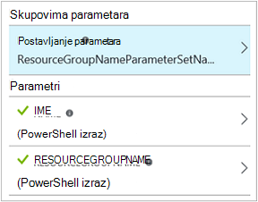

<properties
    pageTitle="Moje prvi grafički runbook u automatizaciji Azure | Microsoft Azure"
    description="Praktični vodič koji vas vodi kroz stvaranje, testiranje i jednostavnog grafički kompilacije za objavljivanje."
    services="automation"
    documentationCenter=""
    authors="mgoedtel"
    manager="jwhit"
    editor=""
    keywords="runbook, runbook predložak, runbook Automatizacija, azure runbook"/>
<tags
    ms.service="automation"
    ms.workload="tbd"
    ms.tgt_pltfrm="na"
    ms.devlang="na"
    ms.topic="get-started-article"
    ms.date="07/06/2016"
    ms.author="magoedte;bwren"/>

# <a name="my-first-graphical-runbook"></a>Moje prvi grafički runbook

> [AZURE.SELECTOR] - [Grafički](automation-first-runbook-graphical.md) - [PowerShell](automation-first-runbook-textual-PowerShell.md) - [PowerShell tijeka rada](automation-first-runbook-textual.md)

Pomoću ovog praktičnog vodiča vodit će vas kroz stvaranje [grafički runbook](automation-runbook-types.md#graphical-runbooks) u automatizaciji Azure.  Ne možemo ćete počinju jednostavne runbook koje ćemo ćete testiranje i objavljivanje dok smo objašnjavaju kako praćenje stanja runbook posla.  Zatim ćemo ćete izmijeniti runbook zapravo upravljanje Azure resursa, u tom slučaju početni Azure virtualnog računala.  Ćemo zatim napraviti u runbook Robusniji dodavanjem parametara runbook i uvjetno veze.

## <a name="prerequisites"></a>Preduvjeti

Da biste dovršili ovaj Praktični vodič, morate sljedeće.

-   Azure pretplate.  Ako ne postoji još, možete ga [aktivirati svoje prednosti pretplatnika MSDN](https://azure.microsoft.com/pricing/member-offers/msdn-benefits-details/) ili <a href="/pricing/free-account/" target="_blank"> [prijave za besplatan račun](https://azure.microsoft.com/free/).
-   [Azure pokrenuti kao račun](automation-sec-configure-azure-runas-account.md) za držite na runbook i provjeru autentičnosti Azure resursi.  Račun mora imati dozvolu za pokretanje i zaustavljanje virtualnog računala.
-   Azure virtualnog računala.  Ne možemo će zaustaviti i pokrenuti ovo računalo da bi se trebala bi biti radnog.


## <a name="step-1---create-new-runbook"></a>Korak 1 – da biste stvorili novi runbook

Ne možemo ćete pokrenuti tako da stvorite jednostavan runbook koji proizvodi tekst *Pozdrav svijeta*.

1.  Na portalu za Azure otvorite računa za automatizaciju.  
    Automatizacija stranice računa omogućuje brzi pregled resursa u taj račun.  Trebali biste već imate neki resursi.  Većina one su moduli automatski uključenima u novi račun za automatizaciju.  Trebali biste dobiti i resursa vjerodajnica koje se spominju u [preduvjeti](#prerequisites).
2.  Kliknite pločicu **Runbooks** da biste otvorili popis runbooks.<br> 
3.  Stvorite novi runbook klikom na gumb **Dodaj u runbook** a zatim **Stvori novu runbook**.
4.  Imenujte na runbook na *MyFirstRunbook grafički*.
5.  U ovom slučaju ne možemo ćete stvoriti [grafički runbook](automation-graphical-authoring-intro.md) pa odaberite **Graphical** za **Runbook vrsta**.<br> <br>
6.  Kliknite **Stvori** da biste stvorili na runbook i otvorite uređivač grafički.

## <a name="step-2---add-activities-to-the-runbook"></a>Korak 2 – Dodavanje aktivnosti u runbook

Kontrola biblioteke na lijevoj strani uređivača omogućuje odabir aktivnosti koje želite dodati na runbook.  Ne možemo ćete dodati cmdlet **Pisanje izlaz** za izlaz teksta u runbook.

1.  U kontroli biblioteke kliknite tekstni okvir za pretraživanje i upišite **Pisanje izlaz**.  Rezultati će se prikazati ispod. <br> 
2.  Pomaknite se na dno popisa.  Možete desnom tipkom miša kliknite **Unos izlazne** i odaberite **Dodaj da biste platno** ili kliknite Elipsa pokraj cmdlet i odaberite **Dodavanje platna**.
3.  Kliknite **Unos izlaz** aktivnosti u području crtanja.  Otvorit će se plohu kontrola konfiguracije koji omogućuje vam da konfigurirate aktivnosti.
4.  **Natpis** zadane postavke na naziv cmdlet, ali ne možemo možete promijeniti nešto više neslužbeni. Promijenite *Pisanje pozdrav svijeta izlaz*.
5.  Kliknite **parametara** unesite vrijednosti za parametre u cmdlet.  
    Neke cmdleta imati više skupova parametar pa ćete morati odabrati koju ćete koristiti. U ovom slučaju **Pisanje izlaz** sadrži samo jedan skup parametara, pa ne morate odabrati jednu. <br> 
6.  Odaberite parametar **InputObject** .  To je parametar kojem će odrediti tekst da biste poslali strujanje Izlaz.
7.  Na padajućem popisu **izvora podataka** odaberite **PowerShell izraz**.  Na padajućem popisu **izvora podataka** sadrži različitih izvora koji koristite za popunjavanje vrijednosti parametra.  
    Možete koristiti Izlaz iz takve izvora kao što su druge aktivnosti, sredstvo Automatizacija ili izrazu PowerShell.  U ovom slučaju samo želimo izlaz tekst *Pozdrav svijeta*. Ne možemo koristite izraz PowerShell i odredite niz.
8.  U **okvir izrazn** upišite *"Pozdrav svijeta"* , a zatim **u redu** dvaput da biste se vratili na područje crtanja.<br> 
9.  Spremite na runbook klikom na gumb **Spremi**.<br> 

## <a name="step-3---test-the-runbook"></a>Korak 3 - Test s runbook

Prije nego što objavljujete runbook ga učiniti dostupnim u radni želimo testirati da biste provjerili funkcionira li ispravno.  Kada testiranje na runbook, pokrenite njegova verzija **skice** , a interaktivno prikaz rezultat.

1.  Kliknite **Testiraj okna** da biste otvorili plohu Test.<br> 
2.  Kliknite **Start** pokrenite test.  To mora biti omogućen mogućnost.
3.  Stvara se [posao runbook](automation-runbook-execution.md) i ima li status prikazuje u oknu.  
    Status zadatka će se pokrenuti kao *Queued* koja označava da je čeka runbook suradnika u oblaku postane dostupna.  On zatim premjestit će *Početni* kada zahtjeve u zadatak, a zatim *izvodi* pri na runbook zapravo pokretanju pokrenut.  
4.  Nakon dovršetka posla runbook prikazuje se rezultat. U našem slučaju smo trebali biste vidjeti *Pozdrav svijeta*.<br> 
5.  Zatvorite plohu Test da biste se vratili na područje crtanja.

## <a name="step-4---publish-and-start-the-runbook"></a>Korak 4 - objavljivanje i počnite s runbook

Runbook koji smo upravo stvorili je i dalje u načinu skice. Moramo da ga objavite smo mogli pokrenuti u radnog.  Kad objavite na runbook, Prebriši postojeće objavljena verzija verzijom skice.  U našem slučaju smo objavljena verzija još nemate jer smo upravo stvorili na runbook.

1.  Kliknite **Objavi** da biste objavili na runbook, a zatim **da** kada se to od vas zatraži.<br> 
2.  Ako je pomicanje lijevo da biste vidjeli na runbook u plohu **Runbooks** , ona će prikazati programa **Za izradu Status** **objavljena**.
3.  Pomicanje udesno da biste prikazali na plohu za **MyFirstRunbook**.  
    Mogućnosti na vrhu dopustite nam da biste započeli s runbook, zakažite Započni u budućnosti neko vrijeme, ili stvorite [webhook](automation-webhooks.md) da bi se može se pokrenuti putem poziv HTTP-a.
4.  Samo želimo da biste započeli s runbook pa kliknite **Start** , a zatim **da** kada se to od vas zatraži.<br> 
5.  Zadatak plohu otvara se runbook zadatka koji smo upravo stvorili.  Ne možemo možete zatvoriti ovaj plohu, ali u ovom slučaju ne možemo ćete ostavite ga otvorenog pa ćemo možete gledati napretka posla.
6.  Status posla prikazuju se u **Sažetak zadatka** i uspoređuje statusi koji smo vidjeli kad smo testirati u runbook.<br> 
7.  Kada je stanje runbook prikazuje *Dovršeno*, kliknite **Izlaz**. **Izlaz** plohu otvoren, a Vidimo naš *Pozdrav svijeta* u oknu.<br>   
8.  Zatvorite plohu izlaz.
9.  Kliknite **Sve zapisnike** da biste otvorili plohu strujanja za posao runbook.  Ne možemo trebali biste vidjeti *Pozdrav svijeta* u izlaz toka, ali to možete prikazati druge strujanja runbook zadatka kao što su tekstni i pogreške u runbook piše da biste ih.<br> 
10. Zatvorite sve zapisnike plohu i plohu zadatak da biste se vratili plohu MyFirstRunbook.
11. Kliknite **Zadaci** da biste otvorili plohu zadatke za ovaj runbook.  Popis svih zadataka koji je stvorio ovaj runbook. Ne možemo trebali biste vidjeti samo jedan zadatak na popisu jer samo naišli posao jednom.<br> 
12. Možete kliknuti na taj zadatak da biste otvorili isti okno zadatka koje ćemo prikazivati kada ne možemo pokrenuti na runbook.  Time da biste se vratili u vremenu i prikaz detalja o bilo koji zadatak koji je stvoren za određeni runbook.

## <a name="step-5---create-variable-assets"></a>Drugi korak 5 – stvaranje varijable resursi

Ćemo testirati i objaviti naše runbook, ali dosad korisne ništa ne učinite. Želimo da biste ga Upravljanje resursima Azure.  Prije nego što smo konfigurirali runbook za provjeru autentičnosti, ne možemo će stvoriti varijabla držite ID pretplate i referencu nakon ćemo postavljanje aktivnosti za provjeru autentičnosti u koraku 6 ispod.  Uključujući reference kontekst pretplate omogućuje jednostavno rad s datotekama u višestruke pretplate.  Prije nego što nastavite, kopirajte identifikacijskog Broja za pretplatu iz pretplate mogućnost iz navigacijskog okna.  

1. U plohu Automatizacija računi kliknite pločicu **Resursi** , a zatim je otvoriti plohu **Resursi** .
2. U plohu sredstvima kliknite pločicu **varijabli** .
3. Na plohu varijable kliknite **Dodaj tjednog prikaza kalendara**.<br>
4. U novi varijable plohu, u okvir **naziv** unesite **AzureSubscriptionId** i u okvir **vrijednost** upišite svoje pretplate ID-a.  Zadrži *niz* za **vrstu** i zadane vrijednosti za **šifriranje**.  
5. Kliknite **Stvori** da biste stvorili varijablu.  


## <a name="step-6---add-authentication-to-manage-azure-resources"></a>Drugi korak 6 - dodajte provjere autentičnosti da biste upravljali Azure resursi

Imamo tjednog prikaza kalendara na čuvanje naš ID pretplate, ne možemo možete konfigurirati naše runbook za provjeru autentičnosti s vjerodajnicama za pokretanje kao koji se nazivaju u [preduvjeti](#prerequisites).  Ne možemo učiniti tako da dodate Azure Pokreni kao vezu **resursa** i **Dodavanje AzureRMAccount** cmdlet područje crtanja.  

1.  Otvorite uređivač grafički tako da kliknete **Uređivanje** plohu MyFirstRunbook.<br> 
2.  Ne možemo nisu potrebne **Pisanje pozdrav svijeta izlaz** , tako da desnom tipkom miša kliknite i odaberite **Izbriši**.
3.  U kontroli biblioteke proširite **veze** i dodajte **AzureRunAsConnection** područje crtanja tako da odaberete **Dodaj platna**.
4.  U području crtanja, odaberite **AzureRunAsConnection** i na upravljačkoj ploči konfiguracije upišite **Se pokrenuti kao vezu** u tekstni okvir **oznaka** .  Ovo je veza 
5.  U kontroli biblioteke u tekstni okvir za pretraživanje upišite **Dodaj AzureRmAccount** .
6.  Dodajte **Dodaj AzureRmAccount** područje crtanja.<br> 
7.  Pokazivač **Se pokrenuti kao vezu** dok se ne pojavi kruga na dno oblika. Kliknite krug i povucite strelicu za **Dodavanje AzureRmAccount**.  Strelice koje ste upravo stvorili je *veza*.  Na runbook će počinju **Se pokrenuti kao vezu** , a zatim pokrenite **Dodaj AzureRmAccount**.<br> 
8.  U području crtanja, odaberite **Dodaj AzureRmAccount** i konfiguracija držeći tipku control okno vrsta **prijave za Azure** u tekstni okvir **oznaka** .
9.  Kliknite **parametara** i konfiguracija parametar aktivnosti prikazuje se plohu. 
10.  **Dodavanje AzureRmAccount** sadrži više skupova parametar tako da je potrebna da biste odabrali jedan prije dajemo vrijednosti parametara.  Kliknite **Parametar postavljen** , a zatim odaberite skup parametara **ServicePrincipalCertificate** . 
11.  Kada odaberete skup parametara, parametri prikazuju se u plohu konfiguracija parametar aktivnosti.  Kliknite **APPLICATIONID**.<br> 
12.  U plohu vrijednost parametra odaberite **Izlaz aktivnosti** za **izvor podataka** i odaberite **Početak pokrenuti kao vezu** s popisa, u tekstni okvir upišite **put polje** **ApplicationId**, a zatim **u redu**.  Naziv svojstva polja put ne možemo navodite jer aktivnost proizvodi objekta s više svojstva.
13.  Kliknite **CERTIFICATETHUMBPRINT**, a u plohu vrijednost parametra odaberite **Izlaz aktivnosti** za **izvor podataka**.  Odaberite **Početak pokrenuti kao vezu** s popisa, u tekstni okvir upišite **put polje** **CertificateThumbprint**, a zatim kliknite **u redu**. 
14.  Kliknite **SERVICEPRINCIPAL**i plohu vrijednost parametra odaberite **ConstantValue** za **izvor podataka**, kliknite željenu mogućnost **True**, a zatim **u redu**.
15.  Kliknite **TENANTID**, a u plohu vrijednost parametra odaberite **Izlaz aktivnosti** za **izvor podataka**.  Odaberite **Početak pokrenuti kao vezu** s popisa, u tekstni okvir upišite **put polje** **TenantId**, a zatim dvaput kliknite **u redu** .  
16.  U kontroli biblioteke u tekstni okvir za pretraživanje upišite **Skup AzureRmContext** .
17.  Dodajte **Skup AzureRmContext** područje crtanja.
18.  U području crtanja, odaberite **Skup AzureRmContext** i u konfiguraciji kontrolirati okno vrsta **Navedite Id pretplate** u tekstni okvir **oznaka** .
19.  Kliknite **parametara** i konfiguracija parametar aktivnosti prikazuje se plohu. 
20. **Postavljanje AzureRmContext** sadrži više skupova parametar tako da je potrebna da biste odabrali jedan prije dajemo vrijednosti parametara.  Kliknite **Parametar postavljen** , a zatim odaberite skup parametara **SubscriptionId** .  
21.  Kada odaberete skup parametara, parametri prikazuju se u plohu konfiguracija parametar aktivnosti.  Kliknite **SubscriptionID**
22.  U plohu vrijednost parametra odaberite **Varijable resursa** za **izvor podataka** s popisa odaberite **AzureSubscriptionId** i dvaput kliknite **u redu** .   
23.  Pokazivač **Prijavi Azure** dok se ne pojavi kruga na dno oblika. Kliknite krug i povucite strelicu da biste **Odredili Id pretplate**.


Vaše runbook trebao bi izgledati ovako sada: <br>

## <a name="step-7---add-activity-to-start-a-virtual-machine"></a>Korak 7 – Dodavanje aktivnosti da biste pokrenuli virtualnog računala

Sada ćemo dodati **Start AzureRmVM** aktivnosti da biste pokrenuli virtualnog računala.  Možete odabrati sve virtualnog računala u vašoj pretplati Azure i za sada ćemo će biti hardcoding taj naziv u cmdlet.

1. U kontroli biblioteke upišite **Pokreni AzureRm** u tekstni okvir za pretraživanje.
2. Dodavanje **Start AzureRmVM** područje crtanja i zatim kliknite i povucite ga ispod **Navedite Id pretplate**.
3. Prijeđite pokazivačem preko **Navedite Id pretplate** dok se ne pojavi kruga na dno oblika.  Kliknite krug i povucite strelicu za **Početak AzureRmVM**. 
4.  Odaberite **Start AzureRmVM**.  Kliknite **Parametri** , a zatim **Parametar postavljen** da biste prikazali skupovi za **Početak AzureRmVM**.  Odaberite skup parametara **ResourceGroupNameParameterSetName** . Napomena da **ResourceGroupName** i **naziv** imati uskličnika sljedeće ih.  To označava da su potrebne parametre.  Imajte na umu i oba očekivati vrijednosti niza.
5.  Odaberite **naziv**.  Odaberite **izraz ljuske PowerShell** za **izvor podataka** i upišite naziv virtualnog računala unutar dvostrukih navodnika koje ćemo započinje s ovom runbook.  Kliknite **u redu**.<br>
6.  Odaberite **ResourceGroupName**. Koristite **PowerShell izraz** za **izvor podataka** i upišite naziv grupe resursa unutar dvostrukih navodnika.  Kliknite **u redu**.<br> 
8.  Kliknite okno za testiranje tako da se može se testirati u runbook.
9.  Kliknite **Start** pokrenite test.  Kada se dovrši, provjerite je li pokrenuta virtualnog računala.

Vaše runbook trebao bi izgledati ovako sada: <br>

## <a name="step-8---add-additional-input-parameters-to-the-runbook"></a>Drugi korak 8 - dodavanje dodatnih ulaznih parametara u runbook

Naš runbook trenutno pokreće virtualnog računala u grupi resursa koje ćemo navedene u cmdlet **Start AzureRmVM** , ali naše runbook bila još korisnijim ćemo navesti i kada se pokrene u runbook.  Sada dodat ćemo ulaznih parametara za runbook za tu funkciju.

1. Otvorite uređivač grafički tako da kliknete **Uređivanje** u oknu **MyFirstRunbook** .
2. Kliknite **Ulazni i izlazni** , a zatim **dodajte unos** da biste otvorili okno Runbook ulazni parametar.<br> 
3. Navedite *VMName* **naziv**.  Zadrži *niz* za **vrste**, ali promijeniti **obavezno** na *da*.  Kliknite **u redu**.
4. Stvorite drugi obavezan unos parametra naziva *ResourceGroupName* , a zatim **u redu** da biste zatvorili okno **Ulazni i izlazni** .<br> 
5. Odaberite **Start AzureRmVM** aktivnosti, a zatim kliknite **Parametri**.
6. Promjena **izvora podataka** za **naziv** **Runbook unos** , a zatim odaberite **VMName**.<br>
7. Promjena **izvora podataka** za **ResourceGroupName** **Runbook unos** , a zatim odaberite **ResourceGroupName**.<br> 
8. Spremite na runbook i otvorite okno za testiranje.  Imajte na umu da se sada unesite vrijednosti za dvije varijable unos koji će se koristiti u test.
9. Zatvaranje okna Test.
10. Kliknite **Objavi** da biste objavili novu verziju na kompilacije.
11. Zaustavite virtualnog računala koji ste započeli u prethodnom koraku.
12. Kliknite da biste započeli s runbook **Start** .  Upišite **VMName** i **ResourceGroupName** za virtualnog računala koje namjeravate pokrenuti.<br> 
13. Kada se runbook dovrši, provjerite je li pokrenuta virtualnog računala.

## <a name="step-9---create-a-conditional-link"></a>Drugi korak 9 – da biste stvorili uvjetno veze

Ne možemo će sada izmijeniti u runbook tako da će pokušati samo da biste pokrenuli virtualnog računala ako već nije pokrenut.  To ćemo učiniti tako da dodate **Get-AzureRmVM** cmdlet runbook koji će se status razine instancu virtualnog računala. Zatim ćemo dodati naziva **Se Status** sa isječak koda PowerShell da biste utvrdili je li stanje virtualnog računala pokrenut ili zaustavljen modul koda PowerShell tijeka rada.  Uvjetno vezu iz modula **Dobiti Status** će se pokrenuti samo **Početak AzureRmVM** ako se trenutno izvode stanje Zaustavi.  Na kraju, ne možemo izlaz poruku obavještava vas ako uspješno je pokrenut na VM ili ne koristite cmdlet pisanje izlaza PowerShell.

1. Otvorite **MyFirstRunbook** u uređivaču grafički.
2. Ukloni vezu između **Navedite Id pretplate** i **Početak AzureRmVM** tako da kliknete na njemu, a zatim pritiskom na tipku *Izbriši* .
3. U kontroli biblioteke u tekstni okvir za pretraživanje upišite **Get-AzureRm** .
4. Dodajte **Get-AzureRmVM** područje crtanja.
5. Odaberite **Get-AzureRmVM** , a zatim **Parametar postavljen** da biste prikazali skupovi za **Dohvaćanje AzureRmVM**.  Odaberite skup parametara **GetVirtualMachineInResourceGroupNameParamSet** .  Napomena da **ResourceGroupName** i **naziv** imati uskličnika sljedeće ih.  To označava da su potrebne parametre.  Imajte na umu i oba očekivati vrijednosti niza.
6. U odjeljku **izvor podataka** za **naziv**odaberite **Runbook unos** , a zatim odaberite **VMName**.  Kliknite **u redu**.
7. U odjeljku **izvor podataka** za **ResourceGroupName**odaberite **Runbook unos** , a zatim odaberite **ResourceGroupName**.  Kliknite **u redu**.
8. U odjeljku **izvor podataka** za **Status**odaberite **vrijednost konstante** , a zatim kliknite na **True**.  Kliknite **u redu**.  
9. Stvorite vezu s **Navedite Id pretplate** **Get-AzureRmVM**.
10. U kontroli biblioteke proširite **Runbook kontrole** i dodavanje **koda za** područje crtanja.  
11. Stvorite vezu **Dohvati AzureRmVM** **kod**.  
12. Kliknite **kod** i u oknu za konfiguraciju promijenite oznaku da biste **Dobili Status**.
13. Pojavit će se parametar odabira **kod** , a plohu **Uređivač kod** .  
14. U uređivaču kod, zalijepite sljedeći isječak koda:

     ```
     $StatusesJson = $ActivityOutput['Get-AzureRmVM'].StatusesText 
     $Statuses = ConvertFrom-Json $StatusesJson 
     $StatusOut ="" 
     foreach ($Status in $Statuses){ 
     if($Status.Code -eq "Powerstate/running"){$StatusOut = "running"} 
     elseif ($Status.Code -eq "Powerstate/deallocated") {$StatusOut = "stopped"} 
     } 
     $StatusOut 
     ```

15. Stvorite vezu **Dohvati Status** **Start AzureRmVM**.<br>   
16. Odaberite vezu, a zatim u oknu za konfiguraciju promijeniti **uvjet Primijeni** na **da**.   Imajte na umu vezu uključuje crtkani crtu koja označava da aktivnosti ciljne će se pokrenuti samo ako uvjet razrješava true.  
17. Za **uvjet izraz**, upišite *eq $ActivityOutput ["Dohvati Status"] "Zaustavljanja"*.  **Početak AzureRmVM** će odmah pokrenuti samo ako je zaustavljena virtualnog računala.
18. U kontroli biblioteke proširite **Cmdlete** , a zatim **Microsoft.PowerShell.Utility**.
19. **Pisanje izlaz** dvaput dodati područje crtanja.<br> 
20. Na prvu kontrolu **Pisanja izlaz** kliknite **Parametri** i promijenite vrijednost **oznake** za *Obavijesti VM rada*.
21. Za **InputObject**promjena **izvora podataka** da biste **izraz PowerShell** i upišite izraz *"$VMName uspješno pokrenut."*.
22. U drugom kontrola za **Pisanje izlaznu** kliknite **parametre** i promijenite vrijednost **natpisa** u *Obavijesti VM pokretanje nije uspjela*
23. Za **InputObject**promjena **izvora podataka** da biste **izraz PowerShell** i upišite izraz *"$VMName nije moguće pokrenuti."*.
24. Stvorite vezu s **Početka AzureRmVM** **Obavijesti VM rada** i **Obavijesti VM pokretanje nije uspjelo**.
25. Odaberite vezu za **Obavijesti VM rada** i promijenite **uvjet Primijeni** na **True**.
26. Za **uvjet izraz**, upišite *$ActivityOutput ["Start-AzureRmVM"]. IsSuccessStatusCode - eq $true*.  Ta kontrola pisanje izlaz će odmah pokrenuti samo ako virtualnog računala uspješno pokrenut.
27. Odaberite vezu na **Obavijesti VM pokretanje nije uspjelo** i promijenite **uvjet Primijeni** na **True**.
28. Za **uvjet izraz**, upišite *$ActivityOutput ["Start-AzureRmVM"]. IsSuccessStatusCode - ne $true*.  Ova kontrola pisanje izlaznu će sada se pokrenuti samo ako virtualnog računala uspješno nije pokrenut.
29. Spremite na runbook i otvorite okno za testiranje.
30. Započnite s runbook virtualnog računala zaustaviti, a naziv bi trebao počinjati.

## <a name="next-steps"></a>Daljnji koraci

-   Da biste saznali više o grafički Authoring, potražite u članku [Graphical vremenu u Automatizacija Azure](automation-graphical-authoring-intro.md)
-   Za početak rada s PowerShell runbooks potražite u članku [Moj prvi runbook PowerShell](automation-first-runbook-textual-powershell.md)
-   Početak rada s runbooks PowerShell tijeka rada, u odjeljku [Moje prvi runbook PowerShell tijeka rada](automation-first-runbook-textual.md)
