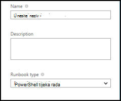
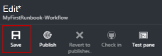
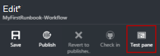
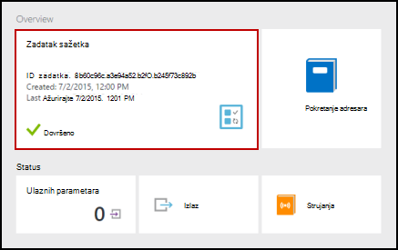
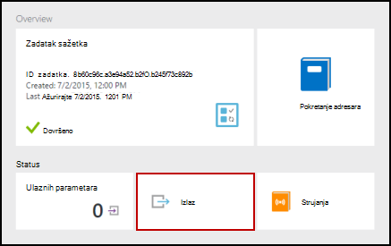
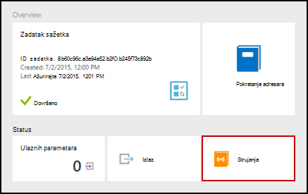
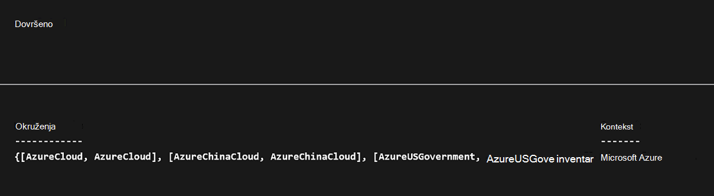
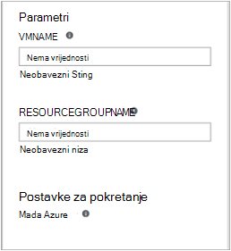

<properties
    pageTitle="Moje prvi runbook PowerShell tijeka rada u automatizaciji Azure | Microsoft Azure"
    description="Praktični vodič koji vas vodi kroz stvaranje, testiranje i objavljivanje kompilacije običnog teksta pomoću komponente PowerShell tijeka rada."
    services="automation"
    documentationCenter=""
    authors="mgoedtel"
    manager="jwhit"
    editor=""
    keywords="PowerShell tijeka rada, powershell primjere tijeka rada, powershell tijeka rada"/>
<tags
    ms.service="automation"
    ms.workload="tbd"
    ms.tgt_pltfrm="na"
    ms.devlang="na"
    ms.topic="get-started-article"
    ms.date="07/19/2016"
    ms.author="magoedte;bwren"/>

# <a name="my-first-powershell-workflow-runbook"></a>Moje prvi runbook PowerShell tijeka rada

> [AZURE.SELECTOR] - [Grafički](automation-first-runbook-graphical.md) - [PowerShell](automation-first-runbook-textual-PowerShell.md) - [PowerShell tijeka rada](automation-first-runbook-textual.md)

Pomoću ovog praktičnog vodiča vodit će vas kroz stvaranje [runbook PowerShell tijeka rada](automation-runbook-types.md#powerShell-workflow-runbooks) u automatizaciji Azure. Ne možemo ćete počinju jednostavne runbook koje ćemo ćete testiranje i objavljivanje dok smo objašnjavaju kako praćenje stanja runbook posla. Zatim ćemo ćete izmijeniti runbook zapravo upravljanje Azure resursa, u tom slučaju početni Azure virtualnog računala. Ćemo zatim napraviti u runbook Robusniji dodavanjem parametara runbook.

## <a name="prerequisites"></a>Preduvjeti

Da biste dovršili ovaj Praktični vodič, morate sljedeće.

-   Azure pretplate. Ako ne postoji još, možete ga [aktivirati svoje prednosti pretplatnika MSDN](https://azure.microsoft.com/pricing/member-offers/msdn-benefits-details/) ili <a href="/pricing/free-account/" target="_blank"> [prijave za besplatan račun](https://azure.microsoft.com/free/).
-   [Račun za automatizaciju](automation-security-overview.md) držite na runbook i provjeru autentičnosti Azure resursi.  Račun mora imati dozvolu za pokretanje i zaustavljanje virtualnog računala.
-   Azure virtualnog računala. Ne možemo će zaustaviti i pokrenuti ovo računalo da bi se trebala bi biti radnog.

## <a name="step-1---create-new-runbook"></a>Korak 1 – da biste stvorili novi runbook

Ne možemo ćete pokrenuti tako da stvorite jednostavan runbook koji proizvodi tekst *Pozdrav svijeta*.

1.  Na portalu za Azure otvorite računa za automatizaciju.  
    Automatizacija stranice računa omogućuje brzi pregled resursa u taj račun. Trebali biste već imate neki resursi. Većina one su moduli automatski uključenima u novi račun za automatizaciju. Trebali biste dobiti i resursa vjerodajnica koje se spominju u [preduvjeti](#prerequisites).
2.  Kliknite pločicu **Runbooks** da biste otvorili popis runbooks.<br> 
3.  Stvorite novi runbook klikom na gumb **Dodaj u runbook** a zatim **Stvori novu runbook**.
4.  Na runbook dati naziv *MyFirstRunbook-tijeka rada*.
5.  U ovom slučaju ne možemo ćete da biste stvorili [tijek rada PowerShell runbook](automation-runbook-types.md#powerShell-workflow-runbooks) pa odaberite **Powershell tijeka rada** za **vrstu Runbook**.<br> 
6.  Kliknite **Stvori** da biste stvorili na runbook i otvorite uređivač tekstnih.

## <a name="step-2---add-code-to-the-runbook"></a>Korak 2 – dodavanje koda u runbook

Možete ili Šifra vrste izravno u na runbook ili možete odabrati Cmdlete, runbooks i resursi iz kontrole biblioteke i ih dodati runbook s povezanim parametre. Za ovaj vodič smo ćete unose izravno na runbook.

1.  Naš runbook trenutno je prazno sa samo potrebni *tijeka rada* ključnu riječ, naziv naše runbook i zagrade koje će encase cijeli tijek rada. 

    ```
    Workflow MyFirstRunbook-Workflow
    {
    }
    ```

2.  Vrsta *Pisanje izlaznu "Pozdrav svijeta."* u zagradama. 
   
    ```
    Workflow MyFirstRunbook-Workflow
    {
      Write-Output "Hello World"
    }
    ```

3.  Spremite na runbook klikom na gumb **Spremi**.<br> 

## <a name="step-3---test-the-runbook"></a>Korak 3 - Test s runbook

Prije nego što objavljujete runbook ga učiniti dostupnim u radni želimo testirati da biste provjerili funkcionira li ispravno. Kada testiranje na runbook, pokrenite njegova verzija **skice** , a interaktivno prikaz rezultat.

1.  Kliknite **Testiraj okna** da biste otvorili okno za testiranje.<br> 
2.  Kliknite **Start** pokrenite test. To mora biti omogućen mogućnost.
3.  Stvara se [posao runbook](automation-runbook-execution.md) i prikazuje njezin status.  
    Status zadatka će se pokrenuti kao *Queued* koja označava da je čeka runbook suradnika u oblaku dolazi dostupna. On zatim premjestit će *Početni* kada zahtjeve u zadatak, a zatim *izvodi* pri na runbook zapravo pokretanju pokrenut.  
4.  Nakon dovršetka posla runbook prikazuje se rezultat. U našem slučaju, ne možemo trebali biste vidjeti *Pozdrav svijeta*.<br> 
5.  Zatvaranje okna Test da biste se vratili na područje crtanja.

## <a name="step-4---publish-and-start-the-runbook"></a>Korak 4 - objavljivanje i počnite s runbook

Runbook koji smo upravo stvorili je i dalje u načinu skice. Moramo da ga objavite smo mogli pokrenuti u radnog. Kad objavite na runbook, Prebriši postojeće objavljena verzija verzijom skice. U našem slučaju smo objavljena verzija još nemate jer smo upravo stvorili na runbook.

1.  Kliknite **Objavi** da biste objavili na runbook, a zatim **da** kada se to od vas zatraži.<br> 
2.  Ako je pomicanje lijevo da biste pogledali na runbook u oknu **Runbooks** , ona će prikazati programa **Za izradu Status** **objavljena**.
3.  Pomicanje udesno da biste prikazali okno za **MyFirstRunbook-tijek rada**.  
    Mogućnosti na vrhu dopustite nam da biste započeli s runbook, zakažite Započni u budućnosti neko vrijeme, ili stvorite [webhook](automation-webhooks.md) da bi se može se pokrenuti putem poziv HTTP-a.
4.  Samo želimo da biste započeli s runbook pa kliknite **Start** , a zatim **da** kada se to od vas zatraži.<br> 
5.  Okno zadatka otvara se runbook zadatka koji smo upravo stvorili. Ne možemo možete zatvoriti ovo okno, ali u ovom slučaju ne možemo ćete ostavite ga otvorenog pa ćemo možete gledati napretka posla.
6.  Status posla prikazuju se u **Sažetak zadatka** i uspoređuje statusi koji smo vidjeli kad smo testirati u runbook.<br> 
7.  Kada je stanje runbook prikazuje *Dovršeno*, kliknite **Izlaz**. Otvara se okno izlaz pa Vidimo naš *Pozdrav svijeta*.<br>   
8.  Zatvaranje okna izlaz.
9.  Kliknite **strujanja** da biste otvorili okno strujanja za posao runbook. Ne možemo trebali biste vidjeti *Pozdrav svijeta* u izlaz toka, ali to možete prikazati druge strujanja runbook zadatka kao što su tekstni i pogreške u runbook piše da biste ih.<br> 
10. Zatvaranje okna strujanja okno zadatka da biste se vratili u oknu MyFirstRunbook i.
11. Kliknite **Zadaci** da biste otvorili okno zadataka za ovaj runbook. Popis svih zadataka koji je stvorio ovaj runbook. Ne možemo trebali biste vidjeti samo jedan zadatak na popisu jer samo naišli posao jednom.<br> 
12. Možete kliknuti na taj zadatak da biste otvorili isti okno zadatka koje ćemo prikazivati kada ne možemo pokrenuti na runbook. Time da biste se vratili u vremenu i prikaz detalja o bilo koji zadatak koji je stvoren za određeni runbook.

## <a name="step-5---add-authentication-to-manage-azure-resources"></a>Drugi korak 5 - dodajte provjere autentičnosti da biste upravljali Azure resursi

Ćemo testirati i objaviti naše runbook, ali dosad korisne ništa ne učinite. Želimo da biste ga Upravljanje resursima Azure. Nećete se moći učiniti iako osim ako imamo je autentičnost pomoću vjerodajnica koje se nazivaju u [preduvjeti](#prerequisites). Ne možemo učiniti s cmdlet za **Dodavanje AzureRMAccount** .

1.  Otvorite uređivač tekstnih tako da kliknete **Uređivanje** u oknu MyFirstRunbook-tijeka rada.<br> 
2.  Ne možemo nisu potrebne redak **Pisanje izlaza** , pa nastaviti i izbrišite ga.
3.  Postavite pokazivač u praznom retku u zagradama.
4.  Upišite ili kopirajte i zalijepite sljedeći kod koji će se rukovati provjera autentičnosti pomoću računa za automatizaciju Pokreni kao:

    ```
    $Conn = Get-AutomationConnection -Name AzureRunAsConnection 
    Add-AzureRMAccount -ServicePrincipal -Tenant $Conn.TenantID `
    -ApplicationId $Conn.ApplicationID -CertificateThumbprint $Conn.CertificateThumbprint
    ```

5.  Kliknite **okno za testiranje** tako da se može se testirati u runbook.
6.  Kliknite **Start** pokrenite test. Kada se dovrši, trebali biste dobiti izlaz slično sljedeće, prikazivanja osnovnih podataka s računa. To potvrđuje vjerodajnicu vrijedi.<br> 

## <a name="step-6---add-code-to-start-a-virtual-machine"></a>Drugi korak 6 – dodavanje koda za pokretanje virtualnog računala

Sad kad naše runbook je provjera autentičnosti naš Azure pretplatu, ne možemo možete upravljati resursi. Ćemo dodati naredbu da biste započeli virtualnog računala. Možete odabrati sve virtualnog računala u vašoj pretplati Azure i za sada ćemo će biti hardcoding taj naziv u cmdlet.

1.  Nakon *Dodaj AzureRmAccount*upišite *Start AzureRmVM-naziv "VMName" - ResourceGroupName 'NameofResourceGroup'* pruža ime i naziv grupe resursa virtualnog računala da biste pokrenuli.  

    ```
    workflow MyFirstRunbook-Workflow
    {
      $Conn = Get-AutomationConnection -Name AzureRunAsConnection
      Add-AzureRMAccount -ServicePrincipal -Tenant $Conn.TenantID -ApplicationId $Conn.ApplicationID -CertificateThumbprint $Conn.CertificateThumbprint
      Start-AzureRmVM -Name 'VMName' -ResourceGroupName 'ResourceGroupName'
    }
    ``` 

2.  Spremanje na runbook, a zatim kliknite **testiranje okno** tako da ga može se testirati.
3.  Kliknite **Start** pokrenite test. Kada se dovrši, provjerite je li pokrenuta virtualnog računala.

## <a name="step-7---add-an-input-parameter-to-the-runbook"></a>Korak 7 – dodavanje ulazni parametar u runbook

Naš runbook trenutno započinje s virtualne na računalu te ćemo koji nisu u na runbook, ali bi korisnijim ako virtualnog računala ne možemo odrediti kada se pokrene u runbook. Sada dodat ćemo ulaznih parametara za runbook za tu funkciju.

1.  Dodajte parametre za *VMName* i *ResourceGroupName* u runbook i koristite tih varijabli pomoću cmdleta **Start AzureRmVM** kao u primjeru u nastavku. 

    ```
    workflow MyFirstRunbook-Workflow
    {
       Param(
        [string]$VMName,
        [string]$ResourceGroupName
       )  
     $Conn = Get-AutomationConnection -Name AzureRunAsConnection 
     Add-AzureRMAccount -ServicePrincipal -Tenant $Conn.TenantID -ApplicationId $Conn.ApplicationID -CertificateThumbprint $Conn.CertificateThumbprint
     Start-AzureRmVM -Name $VMName -ResourceGroupName $ResourceGroupName
    }
    ```

2.  Spremite na runbook i otvorite okno za testiranje. Imajte na umu da se sada unesite vrijednosti za dvije varijable unos koji će se koristiti u test.
3.  Zatvaranje okna Test.
4.  Kliknite **Objavi** da biste objavili novu verziju na kompilacije.
5.  Zaustavite virtualnog računala koji ste započeli u prethodnom koraku.
6.  Kliknite da biste započeli s runbook **Start** . Upišite **VMName** i **ResourceGroupName** za virtualnog računala koje namjeravate pokrenuti.<br> 

7.  Kada se runbook dovrši, provjerite je li pokrenuta virtualnog računala.

## <a name="next-steps"></a>Daljnji koraci

-  Početak rada s grafički runbooks, potražite u članku [Moj prvi grafički runbook](automation-first-runbook-graphical.md)
-  Za početak rada s PowerShell runbooks potražite u članku [Moj prvi runbook PowerShell](automation-first-runbook-textual-powershell.md)
-  Dodatne informacije o vrstama runbook, njihove prednosti i ograničenja potražite u članku [vrste runbook Automatizacija Azure](automation-runbook-types.md)
-  Dodatne informacije o skriptu PowerShell podržava značajku, pročitajte članak [nativni skriptu komponente PowerShell podržava u automatizaciji Azure](https://azure.microsoft.com/blog/announcing-powershell-script-support-azure-automation-2/)