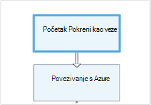

<properties 
    pageTitle="Grafički vremenu u Azure Automatizacija | Microsoft Azure"
    description="Prilikom stvaranja grafički omogućuje stvaranje runbooks za automatizaciju Azure bez rad s kodom. Ovaj članak sadrži Uvod u grafički authoring i sve pojedinosti koje su potrebne za stvaranje grafički runbook."
    services="automation"   
    documentationCenter=""
    authors="mgoedtel"
    manager="jwhit"
    editor="tysonn" />
<tags 
    ms.service="automation"
    ms.devlang="na"
    ms.topic="article"
    ms.tgt_pltfrm="na"
    ms.workload="infrastructure-services"
    ms.date="06/03/2016"
    ms.author="magoedte;bwren" />

# Grafički vremenu u Automatizacija Azure

## Uvod

Grafički dokumentima omogućuje stvaranje runbooks za automatizaciju Azure bez complexities podlozi kod komponente Windows PowerShell ili PowerShell tijeka rada. Dodavanje aktivnosti u područje crtanja iz biblioteke cmdleta i runbooks, ih povezivati i konfigurirati da biste obrazac tijeka rada.  Ako ste ikad radili s Orchestrator centar sustava ili servis za upravljanje Automatizacija (SMA), zatim to trebala bi izgledati poznatiji.   

Ovaj članak sadrži Uvod u grafički authoring i koncepata morate početi s radom u stvaranju grafički runbook.

## Grafički runbooks

Sve runbooks u automatizaciji Azure su tijekovi rada sustava Windows PowerShell.  Grafički i grafički PowerShell tijek rada runbooks generiranje koda za PowerShell namijenjeni tako da zaposlenici zaduženi za automatizaciju, ali se ne mogu pogledati ili izravno izmjena.  Grafički runbook može pretvoriti runbook grafički PowerShell tijeka rada i obratno, ali ih nije moguće pretvoriti tekstnih runbook. Postojeće tekstnih runbook nije moguće uvesti u grafički program za uređivanje.  

## Pregled grafički uređivača

Grafički uređivač možete otvoriti na portalu za Azure stvaranju ili uređivanju grafički runbook.

U sljedećim odjeljcima opisuju se kontrolama u uređivaču grafički.

### Područje crtanja
Područje crtanja je gdje dizajnirati svoje runbook.  Dodavanje aktivnosti iz čvorove u kontroli biblioteke na runbook i povezati ih s vezama na definiranje logike u kompilacije.

Da biste povećavati i smanjivati možete pomoću kontrola pri dnu područje crtanja.

### Kontrola na biblioteku

Kontrola biblioteke je gdje odabrati [aktivnosti](#activities) da biste dodali svoje runbook.  Dodajte ih na područje u kojem se povezujete ih da biste druge aktivnosti.  Uključuje četiri sekcije što je opisano u sljedećoj tablici.

| Sekcije | Opis |
|:---|:---|
| Cmdleti za | Obuhvaća sve cmdleti za koje je moguće koristiti u vašem runbook.  Cmdleti za organiziranih prema modul.  Sve module koji ste instalirali na svom računu za automatizaciju će biti dostupna.  |
| Runbooks |  Obuhvaća na runbooks na vašem računu za automatizaciju. Područje crtanja će se koristiti kao podređeni runbooks je moguće dodati te runbooks. Prikazuju se samo runbooks iste vrste core kao runbook uređuje; za Graphical runbooks samo PowerShell sustavom runbooks prikazuju, dok je za grafički tijeka rada PowerShell runbooks su prikazane samo PowerShell tijeka rada utemeljen na runbooks.
| Resursi | [Resursi za automatizaciju](http://msdn.microsoft.com/library/dn939988.aspx) obuhvaća na vašem računu za automatizaciju koji se mogu koristiti u vašem runbook.  Prilikom dodavanja imovine s runbook će dodati aktivnosti tijeka rada koji dohvaća odabranog resursa.  U slučaju varijable imovine možete odabrati želite li dodati aktivnost da biste dobili varijabla ili postavljanje varijable.
| Kontrola Runbook | Obuhvaća runbook kontrola aktivnosti koje možete koristiti u svoje trenutne runbook. *Grananja* potrebno više ulaza i čeka potpuno prije nastavka tijeka rada. Aktivnost *kod* pokreće jedan ili više redaka u kod ovisno o vrsti grafički runbook PowerShell ili PowerShell tijeka rada.  Aktivnost možete koristiti za prilagođeni kod ili funkcionalnost koja je teško da biste postigli s druge aktivnosti.|

### Konfiguracijska kontrola

Kontrola konfiguracije je koje unijeti detalje za objekt odabran na područje crtanja. Svojstva dostupna u toj kontroli ovise o vrsti objekta koji je označen.  Kad odaberete mogućnost u kontroli konfiguriranje, on će se otvoriti dodatne blades da bi se navedite dodatne podatke.

### Testiranje kontrola

Testiranje kontrola ne prikazuje se kada počeli grafički uređivač. Kada se otvori koju interaktivnu [testiranje grafički runbook](#graphical-runbook-procedures).  

## Grafički runbook postupaka 

### Izvoz i uvoz grafički runbook

Možete izvoziti samo objavljena verzija grafički kompilacije.  Ako na runbook još nije objavljena, zatim gumb **Izvoz objavljene** će biti onemogućena.  Kada kliknete gumb **objavljene izvoz** , u runbook preuzimaju se s vašim lokalnim računalom.  Naziv datoteke odgovara nazivu kompilacije s nastavkom *graphrunbook* .

Odabirom mogućnosti **uvoza** prilikom dodavanja u runbook možete uvesti runbook datoteke Graphical ili grafički PowerShell tijeka rada.   Kad odaberete datoteku koju želite uvesti, možete zadržati isti **naziv** ili unijeti novi.  Polje Vrsta Runbook prikazat će vrsta kompilacije nakon što ga assesses odabranu datoteku i pokušate da biste odabrali drugu vrstu koja nije ispravno, poruke prikazat će se sudjelovanje nema sukoba, a prilikom pretvorbe, ne može biti pogreške sintakse.  

### Testiranje grafički runbook

Možete testirati verzija skice u kompilacije na portalu za Azure tijekom pomicanja objavljena verzija na kompilacije nepromijenjena ili novi runbook možete testirati prije no što je objavljen. Omogućuje provjerite je li u runbook ispravno funkcionira prije no što zamjene objavljenu verziju. Kada testiranje na runbook, runbook skica se izvršava i akcije koje izvodi se dovrše. Stvara se bez dosadašnje iskustvo, ali izlaz prikazuje se u oknu Izlaz testiranja. 

Otvorite Test kontrolu na runbook otvaranjem runbook za uređivanje, a zatim kliknite gumb za **testiranje okno** .

Kontrola Test će zatraži ulazne parametre, a na runbook možete pokrenuti klikom na gumb **Start** .

### Grafički runbook za objavljivanje

Svaki runbook u automatizaciji Azure ima skicu i objavljena verzija. Samo objavljena verzija dostupna će se pokrenuti, a mogu se uređivati samo verzija skice. Objavljena verzija je ne utječe promjene verzija skice. Kada je verzija skice spreman da bi bio dostupan, objavite koju prebrisuje objavljena verzija verzijom skice.

Grafički runbook možete objaviti otvaranjem runbook za uređivanje, a zatim klikom na gumb **Objavi** .

Kada je runbook još nije objavljena, ima status **Novo**.  Prilikom objavljivanja, ima status **objavljena**.  Ako uređujete u runbook nakon što je objavljen i verzije skice "i" objavljeno razlikuju, na runbook sa stanjem **u uređivanju**.

 

Imate mogućnost da biste se vratili na verziju objavljena na kompilacije.  To throws Odsutan sve promjene jer se runbook zadnjeg objavljivanja i radne verzije na kompilacije zamjenjuje objavljena verzija.

## Aktivnosti

Aktivnosti su sastavni blokovi u kompilacije.  Aktivnost može biti cmdlet ljuske PowerShell, podređeni runbook ili aktivnost tijeka rada.  Dodavanje aktivnosti u runbook tako da desnom tipkom miša kliknete kontrolu biblioteke, a zatim odaberete **Dodaj platna**.  Kliknite pa povucite aktivnosti postavite bilo gdje u području crtanja koji vam se sviđa.  Mjesto na aktivnosti u području crtanja efekta postupka kompilacije na bilo koji način.  Možete izgled vaše runbook Međutim smatrate najčešće odgovarajuću vizualizirati njegov operacija. 

Odaberite aktivnosti u području crtanja konfiguriranje svojstava i parametara u plohu konfiguracije.  **Natpis** aktivnosti možete promijeniti nešto koji opisuje vama.  Izvorni cmdlet i dalje pokretati, jednostavno mijenjate njezin zaslonsko ime koje će se koristiti u uređivaču grafički.  Natpis mora biti jedinstvena u na runbook. 

### Skupovima parametara

Skup parametara definira obaveznih i neobaveznih parametre koje će prihvatiti vrijednosti za određeni cmdlet.  Sve cmdleta barem jedan parametar postavljen i neke imate više.  Ako je cmdlet ima više skupova parametar, zatim morate odabrati onaj koji ćete koristiti prije nego što možete konfigurirati parametara.  Parametre možete konfigurirati će ovisi o postavkama parametar koji odaberete.  Možete promijeniti skup parametara koristi aktivnost tako da odaberete **Parametar postavljen** , a zatim odaberete drugi skup.  U ovom slučaju sve vrijednosti parametra koje ste konfigurirali gube.

U sljedećem primjeru cmdlet Get-AzureRmVM ima tri skupovima parametara.  Ne možete konfigurirati vrijednosti parametara dok ne odaberete neku od skupovima parametara.  Postavljanje parametara ListVirtualMachineInResourceGroupParamSet je za vraćanje svih virtualnim strojevima u grupu resursa i sadrži jedan neobavezan parametar.  U GetVirtualMachineInResourceGroupParamSet je za određivanje virtualnog računala želite vratiti, a sadrži dvije obavezna i jedan parametar neobavezno.

#### Vrijednosti parametra

Kada odredite vrijednost za parametar, odaberite izvor podataka da biste odredili kako će biti navedeni vrijednost.  Izvori podataka koji su dostupni za određeni parametar ovisi o valjane vrijednosti za taj parametar.  Na primjer, Null neće biti dostupne mogućnosti za parametar koji ne dopušta vrijednosti null.

| Izvor podataka | Opis |
|:---|:---|
|Vrijednost konstante|Unos vrijednosti parametra.  To je dostupna samo za sljedeće vrste podataka: Int32, Int64, niz, Booleove vrijednosti, datumom i vremenom, promjenu. |
|Izlaz aktivnosti|Izlaz iz aktivnosti koja prethodi trenutne aktivnosti tijeka rada.  Će biti navedene sve valjani aktivnosti.  Odaberite samo aktivnosti da biste koristili rezultat vrijednosti parametra.  Ako aktivnost proizvodi objekta s više svojstva, zatim upišite naziv svojstva nakon odabira aktivnosti.|
|Unos Runbook |Odaberite ulazni parametar runbook kao ulazni parametar aktivnosti.|  
|Varijable resursa|Odaberite varijable programa automatizacije kao unos.|  
|Sredstvo vjerodajnicama|Odaberite vjerodajnicu za automatizaciju kao unos.|  
|Certifikat resursa|Odaberite potvrdu Automatizacija kao unos.|  
|Veza resursa|Odaberite vezu s Automatizacija kao unos.| 
|Izraz PowerShell|Navedite jednostavne [PowerShell izraz](#powershell-expressions).  Izraz će se računati prije aktivnosti i rezultata koristi za vrijednost parametra.  Varijable možete koristiti da biste se pozvali na Izlaz aktivnost ili runbook ulazni parametar.|
|Nije konfigurirano|Čisti bilo koju vrijednost koju ste prethodno konfigurirali.|

#### Neobavezni dodatni parametar

Sve cmdleta imat će mogućnost za dodatne parametre.  To su uobičajene parametara PowerShell ili drugi prilagođeni parametri.  Predstavljanja s tekstnim okvirom koje možete unijeti parametara pomoću komponente PowerShell sintakse.  Ako, na primjer, da biste koristili parametar uobičajenih **tekstni** bi navedite **"-tekstni: $True"**.

### Ponovite aktivnosti

**Pokušajte ponovno ponašanje** omogućuje aktivnost će se pokrenuti više puta dok se ispuni određeni uvjet, vrlo slično petlje.  Tu značajku možete koristiti za aktivnosti koje se izvoditi više puta, su pogreške podložni i možda potrebno više od jedne pokušaj za uspjeh ili test izlazne podatke aktivnosti za valjane podatke.    

Kada omogućite pokušaj za neku aktivnost, možete postaviti odgodu i uvjeta.  Odgoda je put (izmjereno u sekundama ili minutama) će čekati u runbook prije izvođenja aktivnost ponovno.  Ako nema kašnjenja nije naveden, zatim aktivnost će ponovno pokrenite neposredno nakon završetka. 

Pokušaj uvjeta je PowerShell izraz koji se vrednuje nakon svaki put kada pokrene aktivnosti.  Ako izraza na True, zatim aktivnost pokreće ponovno.  Ako izraza FALSE zatim aktivnosti ne ponovno pokrenite, a na runbook prelazi sljedeću aktivnosti. 

Pokušaj uvjet možete koristiti varijablu naziva $RetryData koji omogućuje pristup informacijama o ponovne pokušaje aktivnosti.  Ova varijabla ima svojstava u tablici u nastavku.

| Svojstvo | Opis |
|:--|:--|
| NumberOfAttempts | Broj koji je pokrenut aktivnosti.              |
| Izlaz           | Izlaz iz zadnjeg pokretanja aktivnosti.                    |
| TotalDuration    | Timed proteklih od aktivnosti je pokrenut prvi put. |
| StartedAt        | Vrijeme u obliku UTC aktivnost prvi koraci.           |

Slijede primjeri aktivnosti ponovite uvjeta.

    # Run the activity exactly 10 times.
    $RetryData.NumberOfAttempts -ge 10 

    # Run the activity repeatedly until it produces any output.
    $RetryData.Output.Count -ge 1 

    # Run the activity repeatedly until 2 minutes has elapsed. 
    $RetryData.TotalDuration.TotalMinutes -ge 2

Kada konfigurirate pokušaj uvjet za neku aktivnost, aktivnosti sadrži dvije vizualnih signala kao podsjetnik.  Jedan raspoređene su u aktivnost, a drugi je nakon što ste pregledali konfiguraciju aktivnosti.

### Kontrole za skripte tijeka rada

Kod kontrola je posebno aktivnosti koje prihvaća skriptu PowerShell ili PowerShell tijeka rada ovisno o vrsti grafički kompilacije se autor da bi se funkcionalnosti inače možda nije dostupna.  Ne može prihvatiti parametara, ali ga možete koristiti varijable za aktivnosti izlazne i runbook ulazne parametre.  Sve izlazne aktivnosti dodaje se na databus osim ako ih ne sadrži nijedan odlazne veze u tom slučaju dodali u Izlaz na kompilacije.

Na primjer sljedeći kod izvodi izračune datuma pomoću runbook unos varijabla pod nazivom $NumberOfDays.  Zatim šalje jedan izračunati datum kao rezultat se može koristiti u sljedećim aktivnosti u na runbook.

    $DateTimeNow = (Get-Date).ToUniversalTime()
    $DateTimeStart = ($DateTimeNow).AddDays(-$NumberOfDays)}
    $DateTimeStart

## Veze i tijeka rada

**Veza** na grafički runbook povezuje dvije aktivnosti.  Prikazuje se u području crtanja kao strelicu koja pokazuje od aktivnosti izvora na odredište aktivnosti.  Aktivnosti pokrenuti u smjeru okrenuta strelica s aktivnosti odredište početni nakon dovršetka aktivnosti izvora.  

### Stvaranje veze

Stvaranje veze između dvije aktivnosti, odaberite izvor aktivnosti i kliknite krug pri dnu oblika.  Povucite strelicu odredište aktivnosti i izdanje.

Odaberite vezu da biste konfigurirali svojstvima u plohu konfiguracije.  To obuhvaća vrsta veze koji je opisan u sljedećoj tablici.

| Vrsta veze | Opis |
|:---|:---|
| Kanal | Aktivnosti odredište pokreće se jednom za svaki objekt Izlaz iz izvora aktivnosti.  Odredište aktivnosti ne radi ako aktivnosti izvora rezultata bez izlaza.  Izlaz iz izvora aktivnosti nije dostupan kao objekt.  |
| Niz | Aktivnosti odredište izvodi samo jednom.  Primi polja objekata iz izvora aktivnosti.  Izlaz iz izvora aktivnosti nije dostupan kao polja objekata. |

### Pokretanje aktivnosti

Grafički runbook će se pokrenuti s bilo kojeg aktivnosti koje imaju dolazne veze.  To će često biti samo jedna aktivnosti koje će poslužiti kao početnu aktivnosti u runbook.  Ako više aktivnosti dolazne veze, u runbook će se pokrenuti tako da pokrenete ih paralelno.  Zatim pratite veze da biste pokrenuli druge aktivnosti kao što je svaki dovrši.

### Uvjeta

Kada odredite uvjet vezu, aktivnosti odredište je pokrenuti samo ako se uvjet razrješava true.  Varijablu $ActivityOutput obično ćete koristiti u uvjetu dohvatiti Izlaz iz izvora aktivnosti.  

Veze na kanalima za određivanje uvjeta za jedan objekt, a uvjet spada za svaki objekt izlazni izvor aktivnosti.  Aktivnosti odredište zatim pokrenite za svaki objekt koji zadovoljava uvjet.  Na primjer, pomoću aktivnost izvor Get-AzureRmVm sljedeću sintaksu ne može se koristiti uvjetno kanal veze za dohvatiti samo virtualnim strojevima u grupu resursa pod nazivom *1. grupa*.  

    $ActivityOutput['Get Azure VMs'].Name -match "Group1"

Za niz veze, uvjet samo procijeni u jednom od jednog polja, vraća se koja sadrži sve objekte Izlaz iz izvora aktivnosti.  Zbog toga niza veze ne može se koristiti za filtriranje kao vezu kanal, ali se jednostavno određuje hoće li se izvodi sljedeća aktivnost. Na primjer vođenje sljedećeg kompleta aktivnosti u našem runbook pokretanje VM.   
Postoje tri različite niz veze potvrđujete vrijednosti su dobili dva runbook ulaznih parametara koji predstavlja naziv VM i grupa resursa da biste utvrdili koji je odgovarajuće akcije da biste preuzeli – pokretanje jednom VM, pokrenite sve VMs u grupi resouce ili sve VMs u pretplatu.  Niz veze između za povezivanje s Azure i jedan VM Get, Evo logike uvjeta:

    <# 
    Both VMName and ResourceGroupName runbook input parameters have values 
    #>
    (
    (($VMName -ne $null) -and ($VMName.Length -gt 0))
    ) -and (
    (($ResourceGroupName -ne $null) -and ($ResourceGroupName.Length -gt 0))
    )

Kada koristite uvjetno vezu, podaci koji su dostupni iz izvora aktivnosti da biste druge aktivnosti u toj grani će se filtrirati uvjet.  Ako je aktivnost izvor da bi se više veza, podaci koji su dostupni za aktivnosti u granu ovise o uvjet u vezi povezivanja s tom grani.

Ako, na primjer, **Start AzureRmVm** aktivnosti u nastavku runbook pokreće sve virtualnim računalima.  Ima dvije uvjetno veze.  Prva uvjetno veza koristi izraz *$ActivityOutput ["Start-AzureRmVM"]. IsSuccessStatusCode - eq $true* da biste filtrirali ako aktivnosti Start AzureRmVm uspješno dovršena.  Drugi koristi izraz *$ActivityOutput ["Start-AzureRmVM"]. IsSuccessStatusCode - ne $true* da biste filtrirali neuspješne Start AzureRmVm aktivnosti da biste pokrenuli virtualnog računala.  

Aktivnost koji slijedi ime vezu i koristi aktivnost Izlaz iz Get-AzureVM dobit će samo virtualnim strojevima koji su pokrenuti u trenutku pokretanja Get-AzureVM.  Aktivnost koji se nalazi iza drugog veze samo će dobiti na virtualnim strojevima koji su prestao u trenutku pokretanja Get-AzureVM.  Aktivnost iza trećeg vezu će se sve virtualnim strojevima bez obzira na njihov stanje izvršavanja.

### Junctions

Na grananja je posebno aktivnosti koje će Pričekajte dok ne dovršite sve dolazne grana.  Time da biste pokrenuli više aktivnosti paralelno i bili sigurni da potpuno prije no što isprobate.

Dok je grananja možete imati neograničen broj dolazne veze, ne više od jedne te veze može biti na kanal.  Broj dolazne veze slijed je ograničeno.  Koje će moći stvarati na grananja s više dolazne veze kanal i spremati na runbook, ali neće uspjeti prilikom pokretanja.

U primjeru u nastavku je dio kompilacije koji se pokreće skup virtualnim strojevima tijekom istodobno preuzimanja zakrpa moguće primijeniti na tim uređajima.  Da biste bili sigurni da oba procesa dovrše prije nastavlja na runbook koristi se s grananja.

### Ciklusa

Krugu je kada aktivnosti odredište veze vratite za njegov aktivnosti izvora ili druge aktivnosti naposljetku sigurnosno veze do njegova izvora.  Ciklusa trenutno nije dopuštena u grafički autorizaciju.  Ako je vaš runbook krugu, spremit će ispravno ali će primiti pogrešku kada pokrene.

### Zajedničko korištenje podataka između aktivnosti

Sve podatke koje izlaznog aktivnosti s vezom za odlazne zapisuje na *databus* na runbook.  Aktivnost u programu na runbook pomoću podataka na na databus za popunjavanje vrijednosti parametara ili je uvrstite u kodu skripte.  Aktivnost možete pristupiti Izlaz iz bilo kojeg prethodne aktivnosti tijeka rada.     

Način na koji je podatke napisan na databus ovisi o vrsti vezu na nju.  Podaci su izlaz **kanal**kao objekti višestrukih grafikona.  Podaci su izlazne **niz** veze, kao polje.  Ako postoji samo jednu vrijednost, možda izlaz kao jedan element polja.

Možete pristupiti podacima na databus na jedan od dva načina.  Najprije koristi izvora podataka za **Izlaz aktivnosti** za popunjavanje parametra druge aktivnosti.  Ako je izlaz objekta, možete odrediti jednog svojstva.

Možete dohvatiti i izlaz iz aktivnosti u izvoru podataka **Komponente PowerShell izraz** ili od aktivnosti **Tijeka rada skripte** s varijablu ActivityOutput.  Ako je izlaz objekta, možete odrediti jednog svojstva.  Varijable ActivityOutput pomoću sljedeće sintakse.

    $ActivityOutput['Activity Label']
    $ActivityOutput['Activity Label'].PropertyName 

### Checkpoints

[Checkpoints](automation-powershell-workflow.md#checkpoints) u tijeka rada za grafički PowerShell runbook možete postaviti tako da odaberete *runbook kontrolne točke* na bilo koju aktivnost.  Zbog toga kontrolne točke da biste postavili nakon izvođenja aktivnosti.

Checkpoints omogućena samo u runbooks grafički PowerShell tijeka rada, nije dostupna u grafički runbooks.  Ako na runbook koristi Azure Cmdlete, morate slijediti aktivnost checkpointed s Dodaj AzureRMAccount u slučaju da se runbook se obustavlja i pokreće iz ovog kontrolne točke na različitim radnih. 

## Provjera autentičnosti na resurse za Azure

Runbooks u automatizaciji Azure Upravljanje resursima Azure potrebno je provjera autentičnosti za Azure.  Nova značajka [Pokreni kao račun](automation-sec-configure-azure-runas-account.md) (poznate i kao glavni servis) je zadani način da biste pristupili Voditelj resursa Azure resursa u pretplatu za automatizaciju runbooks.  Ta je funkcija možete dodati grafički runbook dodavanjem resursa **AzureRunAsConnection** veze koje je pomoću cmdleta ljuske PowerShell [Get-AutomationConnection](https://technet.microsoft.com/library/dn919922%28v=sc.16%29.aspx) i [Dodavanje AzureRmAccount](https://msdn.microsoft.com/library/mt619267.aspx) cmdlet za područje crtanja. To je što je prikazano u sljedećem primjeru.  
Aktivnosti se pokrenuti kao veze (odnosno Get-AutomationConnection), je konfiguriran za korištenje izvora podataka konstantu pod nazivom AzureRunAsConnection.  
Sljedeća aktivnost, dodavanje AzureRmAccount dodaje na čija je autentičnost provjerena Pokreni kao račun za korištenje na runbook. 
 
Za svaki parametar **APPLICATIONID**, **CERTIFICATETHUMBPRINT**i **TENANTID** morat ćete navesti naziv svojstva za put polje jer aktivnost proizvodi objekta s više svojstva.  U suprotnom prilikom izvršavanja u runbook, on neće uspjeti pokušaj provjere.  Ovo je što vam je potrebno barem za provjeru autentičnosti sustava runbook s računom Pokreni kao.

Da bi se zadržao unatrag kompatibilnosti za pretplatnike na koji ste stvorili Automatizacija račun za [Azure AD korisnički račun](automation-sec-configure-aduser-account.md) da biste upravljali Azure usluga upravljanja (ASM) ili Voditelj resursa Azure resursa, cmdlet za dodavanje AzureAccount s [vjerodajnicama resursa](http://msdn.microsoft.com/library/dn940015.aspx) koji predstavlja korisnik sustava Active Directory s pristupom račun za Azure je način za provjeru autentičnosti.

Ta je funkcija možete dodati grafički runbook dodavanjem vjerodajnica resursa u područje crtanja slijedi Dodaj AzureAccount aktivnost.  Dodavanje AzureAccount koristi aktivnost vjerodajnica za njegov unos.  To je što je prikazano u sljedećem primjeru.

Imate za provjeru autentičnosti na početku na kompilacije i nakon svakog kontrolne točke.  To znači da dodavanje zbrajanja Dodaj AzureAccount aktivnost nakon aktivnost Kontrolna točka-tijeka rada. Ne morate aktivnost vjerodajnica za zbrajanje Budući da koristite isti 

## Runbook ulazni i izlazni rezultat

### Unos Runbook

Na runbook možda ćete morati unos korisnika kada počnu runbook putem portala za Azure ili iz drugog runbook ako trenutnu koristi se kao podređeni.
Na primjer, ako imate runbook koji stvara virtualnog računala, morate unijeti podatke kao što su naziv virtualnog računala i druga svojstva svaki put kada pokrenete u runbook.  

Prihvaćanje unosa za na runbook definiranjem jedan ili više parametara za unos.  Unesete vrijednosti za ove parametre prilikom svakog pokretanja na runbook.  Kada započnete s runbook s portala za Azure, ponudit će koje možete unijeti vrijednosti za svaku na runbook ulaznih parametara.

Ulaznih parametara za na runbook možete pristupiti tako da kliknete gumb **Ulazni i izlazni** na alatnoj traci runbook.  

 

Otvorit će se kontrola **Ulazni i izlazni** gdje možete urediti postojeće ulazni parametar ili stvorite novi tako da kliknete **Dodaj unos**. 

Svaki ulazni parametar definira svojstava u tablici u nastavku.

|Svojstvo|Opis|
|:---|:---|
| Ime | Jedinstveni naziv parametra.  To se može sadržavati samo znamenke alfa i ne smije sadržavati razmak. |
| Opis | Neobavezni opis na ulazni parametar.  |
| Vrsta | Vrsta podataka očekivani za vrijednost parametra.  Portal za Azure će nudi odgovarajuću kontrolu za vrstu podataka za svaki parametar pri zahtjevu za unos. |
| Obavezna | Određuje je li vrijednost mora se navesti za parametar.  Nije moguće pokrenuti na runbook ako unesite vrijednost za svaki obavezno parametar koji ste definirali zadanu vrijednost. |
| Zadana vrijednost | Određuje koje se koristi vrijednost za parametar ako nešto nije naveden.  To može biti Null ili određenu vrijednost. |

### Izlaz Runbook

Podataka stvorio aktivnost koje imaju odlazne veze dodat će se u [Izlaz na kompilacije](http://msdn.microsoft.com/library/azure/dn879148.aspx).  Izlaz sprema se s runbook i dostupan je na nadređenom runbook na runbook koristi se kao podređeni.  

## PowerShell izraza

Jedna od prednosti grafički prilikom stvaranja se korisnikova mogućnost da biste sastavili runbook s minimalnim znanja PowerShell.  Trenutno, morate znati malo PowerShell Iako za popunjavanje određene [vrijednosti parametara](#activities) i postavljanje [uvjeta vezu](#links-and-workflow).  U ovom se odjeljku nalaze pogledajte Uvod u izraze ljuske PowerShell za korisnike koji se možda neće biti upoznati s njim.  Sve pojedinosti PowerShell dostupne su na [skriptiranje pomoću komponente Windows PowerShell](http://technet.microsoft.com/library/bb978526.aspx). 

### Izvor podataka izraz PowerShell

PowerShell izraz možete koristiti kao izvor podataka za popunjavanje vrijednosti [parametra aktivnosti](#activities) s rezultatima neke komponente PowerShell kod.  To može biti s jednim retkom kod koji se izvodi nekoliko jednostavnih funkcija ili više redaka izvršiti neke složene logike.  Bilo kakav izlaz iz naredbe koji je dodijeljen varijabla je izlaz na vrijednost parametra. 

Ako, na primjer, sljedeća naredba bi izlaz trenutni datum. 

    Get-Date

Sljedeće naredbe sastavljanje niz od trenutnog datuma i njezino dodavanje tjednog prikaza kalendara.  Sadržaj varijable pa se šalju Izlaz 

    $string = "The current date is " + (Get-Date)
    $string

Sljedeće naredbe ocjenjivanje trenutni datum i vraćanje niza koji označava je li trenutni dan vikenda ili dan u tjednu. 

    $date = Get-Date
    if (($date.DayOfWeek = "Saturday") -or ($date.DayOfWeek = "Sunday")) { "Weekend" }
    else { "Weekday" }
    
 
### Izlaz aktivnosti

Da biste koristili Izlaz iz prethodne aktivnosti u runbook, koristite varijablu $ActivityOutput pomoću sljedeće sintakse.

    $ActivityOutput['Activity Label'].PropertyName

Na primjer, možda imate aktivnost uz svojstvo koje je potrebno naziv virtualnog računala u tom slučaju možete koristiti sljedeći izraz.

    $ActivityOutput['Get-AzureVm'].Name

Ako je svojstvo obavezno virtualnog računala objekt umjesto samo svojstvo bi vratilo cijeli objekt pomoću sljedeće sintakse.

    $ActivityOutput['Get-AzureVm']

Izlaz iz aktivnost možete koristiti i u izrazu složenije kao što su sljedeće koji spaja tekst na naziv virtualnog računala.

    "The computer name is " + $ActivityOutput['Get-AzureVm'].Name

### Uvjeta

[Operatori usporedbe](https://technet.microsoft.com/library/hh847759.aspx) omogućuje Usporedba vrijednosti ili provjerite podudara li vrijednost s navedenim uzorkom.  Usporedba vraća vrijednost $true ili $false.

Ako, na primjer, sljedeći uvjeti određuje je li virtualnog računala s aktivnost pod nazivom *Get-AzureVM* trenutno *zaustavljen*. 

    $ActivityOutput["Get-AzureVM"].PowerState –eq "Stopped"

Sljedeći uvjeti provjerava je li iste virtualnog računala u bilo kojem stanju osim *zaustavio*.

    $ActivityOutput["Get-AzureVM"].PowerState –ne "Stopped"

Možete se uključiti više uvjeta kao što su korištenje [logičkih operatora](https://technet.microsoft.com/library/hh847789.aspx) **- a** ili **- ili**.  Ako, na primjer, sljedeći uvjeti provjerava je li iste virtualnog računala u prethodnom primjeru stanje *zaustaviti* ili *Prekid*.

    ($ActivityOutput["Get-AzureVM"].PowerState –eq "Stopped") -or ($ActivityOutput["Get-AzureVM"].PowerState –eq "Stopping") 

### Hashtables

[Hashtables](http://technet.microsoft.com/library/hh847780.aspx) su parove naziv/vrijednosti koje su korisne za vraćanje iz skupa vrijednosti.  Svojstva za određene aktivnosti možda očekivan hashtable umjesto jednostavne vrijednost.  Može se prikazati kao hashtable se nazivaju u rječnik. 

Stvorite tablicu raspršivanja pomoću sljedeće sintakse.  Tablicu raspršivanja može sadržavati bilo koji broj stavki, ali svaki definira naziv i vrijednost.

    @{ <name> = <value>; [<name> = <value> ] ...}

Na primjer, sljedeći izraz stvara hashtable koja će se koristiti u izvoru podataka parametra aktivnosti koje očekuje hashtable s vrijednostima za pretraživanje u programu internet.

    $query = "Azure Automation"
    $count = 10
    $h = @{'q'=$query; 'lr'='lang_ja';  'count'=$Count}
    $h

Sljedeći primjer koristi izlaza iz aktivnost naziva *Dohvati veze na Twitteru* za popunjavanje tablicu raspršivanja.

    @{'ApiKey'=$ActivityOutput['Get Twitter Connection'].ConsumerAPIKey;
      'ApiSecret'=$ActivityOutput['Get Twitter Connection'].ConsumerAPISecret;
      'AccessToken'=$ActivityOutput['Get Twitter Connection'].AccessToken;
      'AccessTokenSecret'=$ActivityOutput['Get Twitter Connection'].AccessTokenSecret}

## Daljnji koraci

- Početak rada s runbooks PowerShell tijeka rada, u odjeljku [Moje prvi runbook PowerShell tijeka rada](automation-first-runbook-textual.md) 
- Početak rada s grafički runbooks, potražite u članku [Moj prvi grafički runbook](automation-first-runbook-graphical.md)
- Saznajte više o vrstama runbook, njihove prednosti i ograničenja, potražite u članku [vrste runbook Automatizacija Azure](automation-runbook-types.md)
- Da biste razumjeli kako provjeriti autentičnost pomoću računa za automatizaciju Pokreni kao potražite u članku [Konfiguriranje Azure pokrenuti kao račun](automation-sec-configure-azure-runas-account.md)
 
