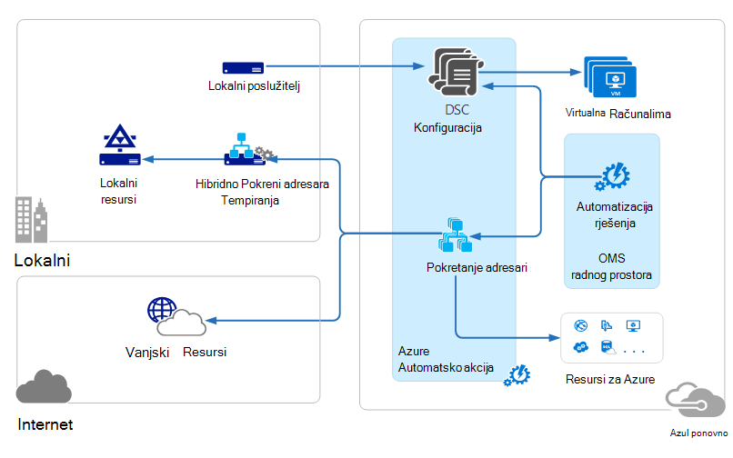
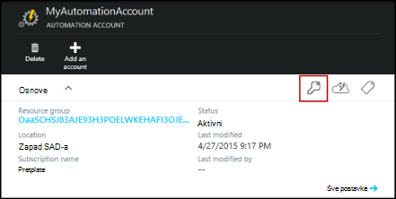
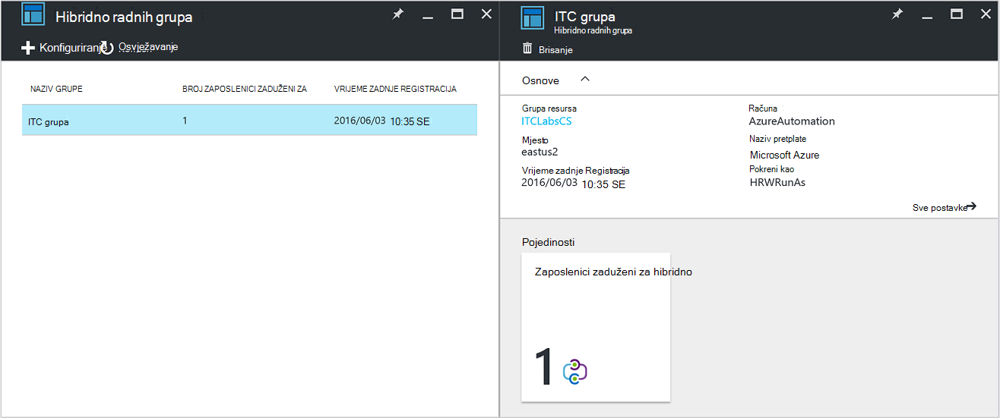
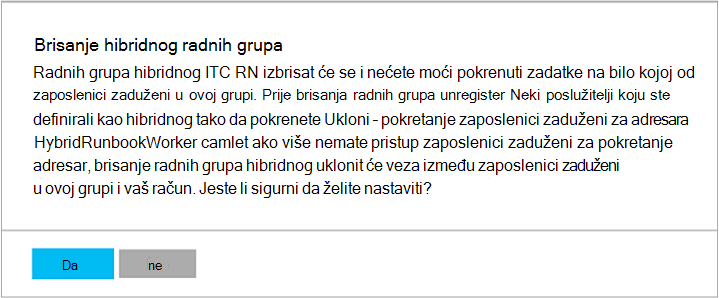

<properties
   pageTitle="Zaposlenici zaduženi za Azure Automatizacija hibridnog Runbook | Microsoft Azure"
   description="Ovaj članak sadrži informacije za instalaciju i korištenje hibridnog Runbook tempiranja koji je značajka servisa Azure Automatizacija koji omogućuje vam pokretanje runbooks na računala u centru za lokalne podatke."
   services="automation"
   documentationCenter=""
   authors="mgoedtel"
   manager="jwhit"
   editor="tysonn" />
<tags
   ms.service="automation"
   ms.devlang="na"
   ms.topic="article"
   ms.tgt_pltfrm="na"
   ms.workload="infrastructure-services"
   ms.date="10/14/2016"
   ms.author="bwren" />

# Zaposlenici zaduženi za Azure Automatizacija hibridnog Runbook

Runbooks u automatizaciji Azure ne može pristupiti resursa u centru za lokalnih podataka jer se pokrenu Azure oblaka.  Značajka tempiranja Runbook hibridnog Azure automatizaciju omogućuje vam pokretanje runbooks na računalima koja se nalazi u podatkovnom centru da biste upravljali Lokalni resursi. Na runbooks spremaju se i upravlja u automatizaciji Azure i isporučuju jedan ili više lokalnog računala.  

Ta je funkcija je što je prikazano na sljedećoj slici.   

Jedno ili više računala možete odrediti u podatkovnom centru poslužiti kao tempiranja za Runbook hibridnog i pokretanje runbooks s Azure automatizaciju.  Svaki tempiranja zahtijeva Microsoft Agent upravljanje s vezom okruženje za automatizaciju Azure runbook te Microsoft operacije upravljanja slaže.  Paket za upravljanje operacije koristi se samo za instalaciju i održavanje agent za upravljanje i praćenje funkcionalnost Zaposlenik.  Automatizacija Azure izvršava isporuku runbooks i upute za izvođenje ih.

Postoje bez vatrozida za unutarnje preduvjete za podršku zaposlenici zaduženi za hibridno Runbook. Agent na lokalnom računalu pokreće svu komunikaciju s Azure Automatizacija u oblaku. Kada se pokrene u runbook, automatizacija Azure stvara naredba kojom se dohvaćaju agent. Agenta zatim povlači prema dolje na runbook i parametre prije izvođenja.  Također dohvatiti neku [Resursi](http://msdn.microsoft.com/library/dn939988.aspx) koji koriste runbook iz Azure automatizaciju.

>[AZURE.NOTE] Zaposlenici zaduženi za hibridno Runbook trenutno ne podržava [DSC konfiguracije](automation-dsc-overview.md).

## Hibridno Runbook radnih grupa

Svaki tempiranja Runbook hibridnog je član grupe hibridnog Runbook tempiranja koji navedete kada instalirate agenta.  Grupe mogu sadržavati jedan agent, ali možete instalirati više agenata u grupi za visoke dostupnosti.

Kada započnete s runbook na tempiranja za Runbook hibridnog, navedite grupu kojoj će se izvoditi na.  Članovi grupe će odrediti koje tempiranja će servisni zahtjev.  Ne možete navesti određenu tempiranja.

## Preduvjeti za hibridno Runbook tempiranja

Morate odrediti barem jedan lokalnog računala da biste pokrenuli hibridnog runbook zadatke.  Ovo računalo mora imati sljedeće:

- Windows Server 2012 ili noviji
- Komponente Windows PowerShell 4.0 ili noviji
- Najmanje dva jezgri i 4 GB RAM-a

Razmislite o sljedećim preporukama za zaposlenici zaduženi za hibridno: 

- Odredite zaposlenici zaduženi za više hibridnog u svakoj grupi za visoke dostupnosti.  
- Zaposlenici zaduženi za hibridno mogu postojati zajedno s poslužiteljima runbook Automatizacija usluga upravljanja ili Orchestrator centar sustava.
- Preporučujemo da koristite računalo fizički smješten u ili blizu regija računa za automatizaciju jer podataka posao ponovnog slanja Azure Automatizacija nakon dovršetka posla.

>[AZURE.NOTE] Hibridno Runbook radnih verzija 7.2.11136.0 trenutno podržava komunikaciju putem proxy poslužitelja samo s skripte komponente PowerShell.  Podrška za skripte komponente PowerShell tijeka rada bit će dostupni u buduće izdanje.  

### Konfiguriranje postavki proxy poslužitelja i vatrozida

Na lokaciji hibridnog Runbook zaposlenik za povezivanje i registrirati sa servisom Microsoft operacije upravljanja paket (OMS), on mora imati pristup broj priključka i URL-ovi opisanim.  Time se uz [priključci i URL-ove potreban za Microsoft Agent nadzor](../log-analytics/log-analytics-proxy-firewall.md#configure-proxy-and-firewall-settings-with-the-microsoft-monitoring-agent) povezati OMS. Ako koristite proxy poslužitelj za komunikaciju između agenta i OMS usluga, morate da bi bili odgovarajuće resursi dostupni. Ako koristite vatrozid da biste ograničili pristup Internetu, morate konfigurirati vatrozida dopustiti pristup. 

Na temelju sljedećih informacija Navedite priključak i URL-ovi koji su potrebni za zaposlenik hibridnog Runbook komunikaciju s automatizaciju.

- Priključak: Samo TCP 443 nužan za izlazni pristup Internetu
- Globalni URL: *.azure automation.net

Ako imate račun za automatizaciju definiran za određenu regiju, a želite ograničiti komunikaciju s tom regionalnog podatkovnog centra, u sljedećoj su tablici navedeni DNS zapis za svako područje.

|**Regija**|**DNS zapis**|
|--------------|--------------|
|Južna središnje SAD-a|scus-jobruntimedata-RN-su1.azure-automation.net|
|Istočne sad 2|eus2-jobruntimedata-RN-su1.azure-automation.net|
|Europa Zapad|ne možemo-jobruntimedata-RN-su1.azure-automation.net|
|Sjeverna Europa|No-jobruntimedata-RN-su1.azure-automation.net|
|Središnja Kanada|kopija-jobruntimedata-RN-su1.azure-automation.net|
|Južna istočnoazijski|Sea-jobruntimedata-RN-su1.azure-automation.net|
|Središnje Indija|CID-jobruntimedata-RN-su1.azure-automation.net|
|Istok Japan|jpe-jobruntimedata-RN-su1.azure-automation.net|
|Australija Jug Istok|elika i mala slova-jobruntimedata-RN-su1.azure-automation.net|

## Instaliranje hibridnog Runbook tempiranja

Postupak u nastavku opisuje način instaliranja i konfiguriranja hibridnog Runbook tempiranja.  Jednom izvođenje prva dva koraka za vaše okruženje Automatizacija, a zatim ponovite preostale korake za svako računalo tempiranja.

### 1. stvaranje radnog prostora paket za upravljanje operacije

Ako već nemate radnog prostora programa operacije upravljanja paket, zatim stvoriti slijedeći upute na [Postavljanje radnog prostora](https://technet.microsoft.com/library/mt484119.aspx). Možete koristiti postojeće radnog prostora ako već postoji.

### 2. dodavanje rješenja za automatizaciju paket za upravljanje operacije radnog prostora

Rješenja dodavanje funkcija u paketu za upravljanje operacije.  Automatizacija rješenje dodaje funkcije za automatizaciju Azure uključujući podršku za hibridno Runbook tempiranja.  Kada dodate rješenje za radni prostor, ga će automatski automatske dolje tempiranja komponente agent za računalo na koje instalirate u sljedećem koraku.

Slijedite upute u [Da biste dodali rješenje pomoću galerije rješenja](../log-analytics/log-analytics-add-solutions.md) da biste dodali rješenja za **automatizaciju** paket za upravljanje operacije radnog prostora.

### 3. Instalirajte Microsoft Agent za nadzor

Agent za nadzor Microsoft povezuje računala u paketu za upravljanje operacije.  Kada agenta na lokalno računalo instalirati i povežite ga s radni prostor, automatski Preuzmi komponente potrebne za hibridno Runbook tempiranja.

Slijedite upute na [računalima povezivanje Windows prijava analitiku](../log-analytics/log-analytics-windows-agents.md) da biste instalirali agenta na lokalno računalo.  Ponovite taj postupak za više računala da biste dodali više zaposlenici zaduženi za svoje radno okruženje.

Kada je agenta uspješno povežete u paketu za upravljanje operacije, će biti naveden na kartici **Povezani izvora** paket za upravljanje operacije **Postavke** okna.  Možete provjeriti da agenta pravilno preuzme rješenja za automatizaciju kada je u mapu pod nazivom **AzureAutomationFiles** u c:\Programske datoteke\Microsoft nadzor Agent\Agent.  Da biste potvrdili verziju Runbook tempiranja hibridnog, možete se kretati c:\Programske datoteke\Microsoft nadzor Agent\Agent\AzureAutomation\ i bilješke na \\ *verziju* podmapi.   

### 4. instalacija okruženje runbook i povezati Automatizacija Azure

Kada dodate agent u paketu za upravljanje operacije, rješenje Automatizacija ih gura dolje modul ljuske PowerShell **HybridRegistration** koja sadrži cmdlet za **Dodavanje HybridRunbookWorker** .  Pomoću tog cmdleta za instalaciju okruženje runbook na računalu i registrirati s Automatizacija Azure.

Otvorite sesiju ljuske PowerShell u načinu za administratora i pokrenite sljedeće naredbe uvesti modul.

    cd "C:\Program Files\Microsoft Monitoring Agent\Agent\AzureAutomation\<version>\HybridRegistration"
    Import-Module HybridRegistration.psd1

Zatim pokrenite cmdlet za **Dodavanje HybridRunbookWorker** pomoću sljedeće sintakse:

    Add-HybridRunbookWorker –Name <String> -EndPoint <Url> -Token <String>

Možete dobiti informacije potrebne za ovaj cmdlet iz plohu **Upravljanje tipke** na portalu za Azure.  Otvorite ovaj plohu tako da kliknete ikonu ključa na ploči elemenata za automatizaciju račun.

- **Naziv** je naziv grupe radnih hibridnog Runbook. Ako ovu grupu već postoji u račun Automatizacija, a zatim u njega dodali trenutno računalo.  Ako je već postoji, zatim ono se dodaje.
- **Krajnja točka** je polja **URL-a** u plohu **Upravljanje tipke** .
- **Tokena** je **Primarni ključ Access** u plohu **Upravljanje tipke** .  

Korištenje na **-opširno** prijelaz s **Dodaj HybridRunbookWorker** prima detaljne informacije o instalaciji.

### 5. instaliranje modula PowerShell

Runbooks možete koristiti bilo koju od aktivnosti i cmdleta definirano u module instaliran u svom okruženju Automatizacija Azure.  Ove moduli ne automatski uvode lokalnog računala kroz, tako da ih morate ručno instalirati.  Iznimka je modul Azure koji se instalira po zadanom osiguravanja pristupa cmdleta za sve servise Azure i aktivnosti za automatizaciju Azure.

Budući da je Glavna svrha značajke hibridnog Runbook tempiranja da biste upravljali Lokalni resursi, najvjerojatnije morat ćete instalirati module koji podržavaju ove resurse.  Informacije o instaliranju modula Windows PowerShell može se odnositi na [Instaliranje modula](http://msdn.microsoft.com/library/dd878350.aspx) .

## Uklanjanje hibridnog Runbook tempiranja

Jedan ili više hibridnog Runbook zaposlenici zaduženi za možete ukloniti iz grupe ili možete ukloniti u grupu, ovisno o svojim potrebama.  Da biste uklonili tempiranja za Runbook hibridnog s lokalnog računala, otvorite sesiju ljuske PowerShell u načinu Administrator i pokrenite sljedeću naredbu - cmdlet **Ukloni HybridRunbookWorker** .  Korištenje na **-opširno** promjena za zapisnik detaljni postupak uklanjanja. 

Time se ne uklanja Microsoft Agent za nadzor s računala, samo funkcije i konfiguraciji hibridnog Runbook tempiranja uloge.  

Da biste uklonili grupu, najprije morate ukloniti Runbook tempiranja hibridnog iz svako računalo na kojem je član grupe pomoću naredbe za ranije prikazane, a zatim izvedite sljedeće korake da biste uklonili grupi.  

1. Da biste otvorili račun za automatizaciju na portalu za Azure.
2. Odaberite pločicu **Hibridnog radnih grupa** i u plohu **Hibridnog radnih grupa** odaberite grupu u koju želite izbrisati.  Kad odaberete određenu grupu, prikazuje se svojstva plohu **hibridnog radnih grupa** .     
3. Na plohu svojstva za odabranu grupu, kliknite **Izbriši**.  Poruka će se od vas zatražiti potvrdu ovu akciju, a odaberite **da** ako ste sigurni da želite nastaviti.    Taj postupak može potrajati nekoliko sekundi da biste dovršili, a možete pratiti tijek u odjeljku **primanje obavijesti** iz izbornika.  

## Početak runbooks hibridnog Runbook tempiranja

[Pokretanje Runbook u automatizaciji Azure](automation-starting-a-runbook.md) opisuju se različite načine za pokretanje programa runbook.  Hibridno Runbook tempiranja dodaje **RunOn** mogućnost u kojoj ćete navesti naziv za grupu radnih hibridnog Runbook.  Ako je navedena grupa, u runbook će se dohvaćaju i pokrenite tako da od zaposlenici zaduženi u toj grupi.  Ako ta mogućnost nije naveden, zatim pokretanja u automatizaciji Azure normalno.

Kada započnete s runbook na portalu za Azure, primit ćete mogućnošću **pokrenuti na** kojem možete odabrati **Azure** ili **Hibridnog radnih**.  Ako ste odabrali **Hibridnog tempiranja**, grupe možete odabrati na padajućem izborniku.

Koristite parametar **RunOn** nije koristite sljedeću naredbu da biste pokrenuli runbook pod nazivom Test Runbook na grupu hibridnog Runbook tempiranja pod nazivom MyHybridGroup pomoću komponente Windows PowerShell.

    Start-AzureRmAutomationRunbook –AutomationAccountName "MyAutomationAccount" –Name "Test-Runbook" -RunOn "MyHybridGroup"

>[AZURE.NOTE] Parametar **RunOn** dodan cmdlet **Start AzureAutomationRunbook** u verziji 0.9.1 sustava Microsoft Azure PowerShell.  Trebali biste [preuzeti najnoviju verziju](https://azure.microsoft.com/downloads/) ako imate neku stariju instaliran jedan.  Samo morate instalirati ovu verziju na radne stanice je mjesto koje počinju s runbook iz komponente Windows PowerShell.  Nije potrebno je instalirati na računalo radnih, osim ako ne namjeravate pokretanje runbooks na tom računalu.  Trenutno nije moguće pokrenuti na runbook na Runbook tempiranja za hibridno od drugog runbook jer to je potrebna najnoviju verziju programa Azure Powershell biti instalirani na vašem računu za automatizaciju.  Najnoviju verziju bit će automatski ažuriraju u Automatizacija Azure i automatski pomiču prema dolje na zaposlenicima koji rade s uskoro.

## Dozvole za Runbook

Runbooks sustavom tempiranja za Runbook hibridnog ne možete koristiti na isti [način na koji se obično koristi za runbooks provjere autentičnosti Azure resursima](automation-configuring.md#configuring-authentication-to-azure-resources) jer oni će pristupa resursima izvan Azure.  Na runbook možete unijeti vlastitu provjere autentičnosti za Lokalni resursi ili možete odrediti RunAs račun omogućuje kontekst korisnika za sve runbooks.

### Provjera autentičnosti Runbook

Prema zadanim postavkama, runbooks funkcionirat će u kontekstu lokalni sustav račun na računalu na lokalni tako da ih morate navesti vlastite provjere autentičnosti resursima koje oni će imati pristup.  

[Vjerodajnice](http://msdn.microsoft.com/library/dn940015.aspx) i [certifikat](http://msdn.microsoft.com/library/dn940013.aspx) resursi možete koristiti u vašem runbook cmdleta koje vam omogućuju da vjerodajnica tako da možete provjeriti autentičnost različite resursima sustava.  Sljedeći primjer prikazuje dio kompilacije koji ponovnog pokretanja računala.  Dohvaća vjerodajnice iz vjerodajnica resursa i naziv računala s varijable resursa, a zatim koristi te vrijednosti pomoću cmdleta ponovno pokretanje računala.

    $Cred = Get-AzureRmAutomationCredential -ResourceGroupName "ResourceGroup01" -Name "MyCredential"
    $Computer = Get-AzureRmAutomationVariable -ResourceGroupName "ResourceGroup01" -Name  "ComputerName"

    Restart-Computer -ComputerName $Computer -Credential $Cred

Možete koristiti i [InlineScript](automation-powershell-workflow.md#inline-script) koji omogućuje vam pokretanje blokova Šifra na neko drugo računalo s vjerodajnicama određen [PSCredential uobičajenih parametar](http://technet.microsoft.com/library/jj129719.aspx).

### RunAs računa

Umjesto da runbooks pružaju vlastite provjere autentičnosti za Lokalni resursi, možete odrediti **RunAs** račun za grupu hibridnog tempiranja.  Odredite [sredstvo vjerodajnicama](automation-credentials.md) koja ima pristup lokalnog resursa i sve runbooks će se pokrenuti u odjeljku te vjerodajnice kada se izvode na Runbook tempiranja za hibridno u grupi.  

Korisničko ime za vjerodajnicu mora biti u jednom od sljedećih oblika:

- domena/korisničko ime 
- username@domain
- korisničko ime (za račune lokalne na lokalno računalo)

Da biste odredili RunAs račun za grupu za radnih hibridnog pomoću sljedećeg postupka:

1. Stvaranje [sredstvo vjerodajnicama](automation-credentials.md) s pristupom Lokalni resursi.
2. Da biste otvorili račun za automatizaciju na portalu za Azure.
2. Odaberite pločicu **Hibridnog radnih grupa** , a zatim odaberite željenu grupu.
3. Odaberite **sve postavke** , a zatim **postavke za Hibridnu radnih grupa**.
4. Promijenite **Pokreni kao** iz **zadani** **Prilagođeno**.
5. Odaberite vjerodajnicu, a zatim kliknite **Spremi**.

## Stvaranje runbooks za hibridno Runbook tempiranja

Nema razlike u strukturi runbooks koji se izvode na Automatizacija Azure i one koji se izvode na tempiranja za Runbook hibridnog. Runbooks koje koristite sa svakom razlikovat će najvjerojatnije se znatno kroz jer runbooks za hibridno Runbook tempiranja obično će upravljati lokalnog resursa u podatkovnom centru dok runbooks u automatizaciji Azure obično Upravljanje resursima u oblaku Azure. 

Možete urediti u runbook hibridnog Runbook suradnika u automatizaciji Azure, no možda imate poteškoća ako pokušate testiranje na runbook u uređivaču.  PowerShell moduli koji pristup Lokalni resursi možda nije instaliran u svom okruženju Automatizacija Azure u tom slučaju test zadovoljavaju.  Ako instalirate potrebna module, pa će se pokrenuti na runbook, ali ga nećete moći pristupiti lokalnim resursima za dovršavanje test.

## Otklanjanje poteškoća s runbooks na hibridnog Runbook tempiranja

[Izlaz Runbook i poruke](automation-runbook-output-and-messages.md) šalju Azure Automatizacija iz hibridnog zaposlenici zaduženi za baš kao i zadacima runbook pokreću se u oblak.  Možete i omogućiti strujanja tekstni i napredak na isti način kao i za druge runbooks.  

Zapisnike pohranjuju lokalno na svaku tempiranja hibridnog pri C:\ProgramData\Microsoft\System Center\Orchestrator\7.2\SMA\Sandboxes.

Ako vaš runbooks nisu uspješno completeing i sažetak zadatka prikazuje status **obustavljeno**, pregledajte članak o otklanjanju poteškoća [hibridnog Runbook tempiranja: runbook posao završava sa statusom obustavljeno](automation-troubleshooting-hrw-runbook-terminates-suspended.md).   

## Odnos Automatizacija usluga upravljanja

[Servis za upravljanje Automatizacija (SMA)](https://technet.microsoft.com/library/dn469260.aspx) omogućuje vam pokretanje iste runbooks koje podržava automatizaciju Azure u centru za lokalne podatke. SMA obično je implementirana zajedno s paketa Windows Azure, kao što je Windows Azure paket sadrži grafičkog sučelja za upravljanje SMA. Za razliku od Automatizacija Azure SMA zahtijeva lokalne instalacije koji obuhvaća web-poslužiteljima za smještaj API-JA, baze podataka koja će sadržavati runbooks i konfiguracija SMA i Runbook zaposlenici zaduženi za izvršavanje zadataka runbook. Azure Automatizacija nudi tih servisa u oblaku i samo potrebno da biste zadržali zaposlenici zaduženi Runbook hibridnog u lokalnom okruženju.

Ako ste postojećem korisniku SMA, možete premjestiti na runbooks Azure Automatizacija koristi s hibridnog Runbook tempiranja bez ikakvih promjena, uz pretpostavku da se oni izvoditi vlastite provjere autentičnosti za resurse kao što je opisano u [stvaranju runbooks za hibridno Runbook radnih](#creating-runbooks-for-hybrid-runbook-worker).  Runbooks u SMA pokreću se u kontekstu račun servisa na poslužitelju tempiranja koji može vam dati te provjeru autentičnosti u runbooks.

Da biste odredili prikladnije na zahtjeve za automatizaciju Azure s hibridnog Runbook tempiranja ili Automatizacija usluga upravljanja možete koristiti sljedeće kriterije.

- SMA zahtijeva lokalne instalacije povezanih komponenti koji su povezani s paketa Windows Azure, ako je potrebno upravljanje grafičkog sučelja. Dodatni resursi za lokalni bit će potrebno s veći troškova održavanja od Azure Automatizacija, koje je potrebno samo agent instalirano zaposlenici zaduženi za lokalni runbook. Na agenata upravlja paket za upravljanje operacije, dodatno smanjuje troškove održavanja.
- Azure Automatizacija sprema njegov runbooks u oblaku i nudi ih zaposlenici zaduženi za lokalnog hibridnog Runbook. Ako sigurnosna pravila omogućuje takvo ponašanje, trebali biste koristiti SMA.
- SMA nalazi se u sklopu sustava centra; i zbog toga potrebna licenca sustava centra 2012 R2. Azure Automatizacija temelji se na model tiered pretplate.
- Azure Automatizacija sadrži napredne značajke kao što su grafički runbooks koje nisu dostupne u SMA.

## Daljnji koraci

- Da biste saznali više o različite načine na koje možete koristiti da biste započeli s runbook, pogledajte [pokretanje Runbook u automatizaciji Azure](automation-starting-a-runbook.md)
- Da biste shvatili različite postupke za rad s PowerShell i tijek rada PowerShell runbooks u automatizaciji Azure pomoću tekstnih uređivača, pogledajte [Uređivanje Runbook u automatizaciji Azure](automation-edit-textual-runbook.md)

 
