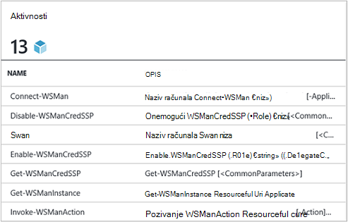

<properties
   pageTitle="Stvorite programa modul Azure Automatizacija Integracija | Microsoft Azure"
   description="Praktični vodič koji vodi vas kroz stvaranje, testiranje i primjer korištenja Integracija module u automatizaciji Azure."
   services="automation"
   documentationCenter=""
   authors="mgoedtel"
   manager="jwhit"
   editor="" />

<tags
   ms.service="automation"
   ms.workload="tbd"
   ms.tgt_pltfrm="na"
   ms.devlang="na"
   ms.topic="get-started-article"
   ms.date="09/12/2016"
   ms.author="magoedte" />

# <a name="azure-automation-integration-modules"></a>Modula Azure Automatizacija Integracija

PowerShell je Temeljna tehnologija iza Azure automatizaciju. Budući da je Azure Automatizacija utemeljena na PowerShell, moduli PowerShell su vam ključne za proširivanje Azure automatizaciju. U ovom se članku smo će vas voditi kroz specifičnosti Azure Automatizacija korištenje ljuske PowerShell moduli se nazivaju "Integracija moduli" i najbolje prakse stvaranja modul ljuske PowerShell da biste provjerili funkcioniraju kao module za integraciju unutar Automatizacija Azure. 

## <a name="what-is-a-powershell-module"></a>Što je modul ljuske PowerShell?

Modul ljuske PowerShell je grupa cmdleta ljuske PowerShell kao što su **Get-datum** ili **Kopiraj stavku**, koji se može koristiti s konzole PowerShell, skripte, tijekova rada, runbooks i resursima PowerShell DSC kao što su WindowsFeature ili datoteka koje je moguće koristiti s PowerShell DSC konfiguracije. Sve funkcije PowerShell je vidljiva kroz cmdleta i DSC resurse i svaki cmdlet/DSC resurs je sigurnosno po modul ljuske PowerShell, broj koji se isporučuju sa servisom PowerShell sam. Na primjer, cmdlet **Get-Date** je dio Microsoft.PowerShell.Utility modul ljuske PowerShell sustava, **Kopiraj stavku** cmdlet je dio modul ljuske Microsoft.PowerShell.Management PowerShell sustava i resursa paketa DSC je dio modul PSDesiredStateConfiguration PowerShell. Obje te moduli se isporučuju sa servisom PowerShell. No mnogo moduli PowerShell isporuka kao dio PowerShell i umjesto raspodijeljen prvog ili drugih proizvođača proizvode kao što je Upravitelj konfiguracije 2012 centar za sustav ili veliku PowerShell zajednica na mjesta kao što je galerija PowerShell.  Module korisne su jer oni izvršiti složene zadatke jednostavniji kroz encapsulated funkcije.  Dodatne informacije o [PowerShell modula na MSDN-u](https://msdn.microsoft.com/library/dd878324%28v=vs.85%29.aspx). 

## <a name="what-is-an-azure-automation-integration-module"></a>Što je modula za integraciju automatizacije programa Azure?

Modul za integraciju nije vrlo različit od modul ljuske PowerShell. Njegov jednostavno PowerShell modula neobavezno datotekom jedan dodatni - datoteku metapodataka koji navodi vrstu veze Azure Automatizacija koja će se koristiti u modulu cmdleta u runbooks sustava. Neobavezni datoteka ili ne, te PowerShell moduli je moguće uvesti u Azure Automatizacija da biste svoje cmdleta dostupan za korištenje unutar runbooks i njihovih DSC resursa dostupan za korištenje unutar DSC konfiguracije. U pozadini Azure Automatizacija sprema te moduli i runbook posla i DSC compiliation posao izvođenja vrijeme učitava ih u sandboxes Azure Automatizacija kojima se izvode runbooks i konfiguracija DSC su prevedene.  Sve DSC resursa u moduli se automatski smještaju se na istaknuti poslužitelja automatizacije DSC tako da se povlače po strojeva Pokušaj primjene DSC konfiguracije.  Ne možemo iz okvira u Azure Automatizacija možete koristiti da bi vam mogli početi s radom odmah Automatizacija Azure upravljanja, no jednostavno možete uvesti PowerShell module za bilo kakve sustava, servis ili alat za koje želite integrirati s isporuka broj modula Azure PowerShell. 

>[AZURE.NOTE] Za određene moduli su poslane kao "globalnih modula" u Automation Services. Ove globalnih modula dostupne iz okvira prilikom stvaranja računa programa automatizacije, a zatim ćemo ih ažurirati ponekad koji se automatski ih gura ih na račun za automatizaciju. Ako ne želite da budu automatski ažurira, možete uvijek uvesti isti modul sami, a koje će prednost pred verzija globalni modula te modula isporučene smo u servisu. 

Oblik uvoz paketa za integraciju modul nije komprimirane datoteke s istim nazivom kao modul i nastavkom .zip. Sadrži modul Windows PowerShell i sve podrške datoteke, uključujući manifesta datoteke (.psd1) ako modul postoji.

Ako modul mora sadržavati vrstu veze Azure Automatizacija, također mora sadržavati datoteka s nazivom *<ModuleName>*-Automation.json koji određuje vrsta svojstva veze. To je json datoteka nalazi u mapi modul komprimiranu .zip datoteke, a sadrži polja "povezivanje" koji je potreban za povezivanje sustava ili servisa predstavlja modul. To će se zaustaviti gore stvaranje vrsta veze u automatizaciji Azure. Pomoću ove datoteke možete postaviti nazive polja vrste i jesu li polja moraju biti šifrirane i / ili obavezan, za vrstu veze modula. Predložak u obliku datoteke json je:

```
{ 
   "ConnectionFields": [
   {
      "IsEncrypted":  false,
      "IsOptional":  false,
      "Name":  "ComputerName",
      "TypeName":  "System.String"
   },
   {
      "IsEncrypted":  false,
      "IsOptional":  true,
      "Name":  "Username",
      "TypeName":  "System.String"
   },
   {
      "IsEncrypted":  true,
      "IsOptional":  false,
      "Name":  "Password",
   "TypeName":  "System.String"
   }],
   "ConnectionTypeName":  "DataProtectionManager",
   "IntegrationModuleName":  "DataProtectionManager"
}
```

Ako imate implementiran Automatizacija usluga upravljanja i stvara module za integraciju paketa za vaše runbooks Automatizacija, to trebala bi izgledati vrlo poznat. 


## <a name="authoring-best-practices"></a>Najbolje prakse za izradu

Samo zato što module za integraciju su zapravo moduli PowerShell, koji ne znači da ne imamo skup prakse oko authoring ih. I dalje je mnogo preporučujemo uzeti u obzir prilikom modula ljuske PowerShell za izradu da biste najkorisniji u automatizaciji Azure. Nekih od tih Azure Automatizacija određene, a neke od njih korisna samo da bi module dobro funkcioniraju u tijek rada PowerShell, bez obzira na to je li koristite automatizaciju. 

1. Navedite sinopsisa, opis i pomoći URI za svaku cmdlet u modulu. U ljusci PowerShell, možete definirati određene informacije o pomoći za Cmdlete da biste korisnicima da biste dobili pomoć na pomoću cmdleta **Get-pomoć** . Na primjer, Evo kako možete definirati sinopsisa i pomoć URI za modul ljuske PowerShell pisane .psm1 datoteke.<br>  

    ```
    <#
        .SYNOPSIS
         Gets all outgoing phone numbers for this Twilio account 
    #>
    function Get-TwilioPhoneNumbers {
    [CmdletBinding(DefaultParameterSetName='SpecifyConnectionFields', `
    HelpUri='http://www.twilio.com/docs/api/rest/outgoing-caller-ids')]
    param(
       [Parameter(ParameterSetName='SpecifyConnectionFields', Mandatory=$true)]
       [ValidateNotNullOrEmpty()]
       [string]
       $AccountSid,

       [Parameter(ParameterSetName='SpecifyConnectionFields', Mandatory=$true)]
       [ValidateNotNullOrEmpty()]
       [string]
       $AuthToken,

       [Parameter(ParameterSetName='UseConnectionObject', Mandatory=$true)]
       [ValidateNotNullOrEmpty()]
       [Hashtable]
       $Connection
    )

    $cred = CreateTwilioCredential -Connection $Connection -AccountSid $AccountSid -AuthToken $AuthToken

    $uri = "$TWILIO_BASE_URL/Accounts/" + $cred.UserName + "/IncomingPhoneNumbers"
    
    $response = Invoke-RestMethod -Method Get -Uri $uri -Credential $cred

    $response.TwilioResponse.IncomingPhoneNumbers.IncomingPhoneNumber
    }
    ```
<br> 
Pružanje informacije će prikazati samo ovaj pomoću cmdleta **Potražite pomoć** u konzole za PowerShell, također izložiti funkcionalnost pomoć unutar Azure Automatizacija, na primjer prilikom umetanja aktivnosti tijekom runbook za izradu. Klikom "Prikaz detaljnu Pomoć" otvara se pomoć URI u drugu karticu web-pregledniku koji koristite za pristup Azure automatizaciju.<br>
2. Ako modul izvodi protiv udaljeni sustav na. Ona mora sadržavati datoteku metapodataka za integraciju modul koji definira podatke koji su potrebni za povezivanje s tom udaljeni sustav, što znači da se vrsta veze. b. Svaki cmdlet u modulu trebali biste moći vođenje connection objekt (instancu vrste veze) kao parametar.  
    Cmdleti za u modulu postaju lakše koristiti u automatizaciji Azure Ako dopustite prosljeđivanje objekt s poljima Vrsta veze kao parametar cmdlet. Ovaj način korisnici ne morate mapirati parametre veze resursa na cmdlet odgovarajuće parametre prilikom svakog pozivaju na cmdlet. Na temelju gornji primjer runbook koristi resursa za povezivanje Twilio pod nazivom CorpTwilio da biste pristupili Twilio i vratili sve telefonske brojeve u računa.  Obratite pozornost na to je kako mapiranje polja veze s parametre cmdlet?<br>

    ```
    workflow Get-CorpTwilioPhones
    {
      $CorpTwilio = Get-AutomationConnection -Name 'CorpTwilio'
    
      Get-TwilioPhoneNumbers 
        -AccountSid $CorpTwilio.AccountSid  
        -AuthToken $CorptTwilio.AuthToken
    }
    ```
<br>
Na lakše i bolje način možete postići to izravno prosljeđivanje objekt veze na cmdlet-

    ```
    workflow Get-CorpTwilioPhones
    {
      $CorpTwilio = Get-AutomationConnection -Name 'CorpTwilio'

      Get-TwilioPhoneNumbers -Connection $CorpTwilio
    }
    ```
<br>
Ponašanje ovako za vaše cmdleta možete omogućiti tako što im omogućuje da prihvatite connection objekt izravno kao parametar, umjesto samo veze polja za parametre. Najčešće željet ćete parametar postavljen za svaki, tako da se korisnik ne koristite Azure Automatizacija da biste uputili poziv na cmdleta bez izgradnje hashtable će poslužiti kao objekt veze. Skup parametara **SpecifyConnectionFields** ispod služi za prosljeđivanje veza svojstva polja jedan po jedan. **UseConnectionObject** omogućuje prosljeđivanje veza ravne putem. Kao što vidite, slanje TwilioSMS cmdlet u [Modul ljuske Twilio PowerShell](https://gallery.technet.microsoft.com/scriptcenter/Twilio-PowerShell-Module-8a8bfef8) omogućuje prosljeđivanje oba načina: 

    ```
    function Send-TwilioSMS {
      [CmdletBinding(DefaultParameterSetName='SpecifyConnectionFields', `
      HelpUri='http://www.twilio.com/docs/api/rest/sending-sms')]
      param(
         [Parameter(ParameterSetName='SpecifyConnectionFields', Mandatory=$true)]
         [ValidateNotNullOrEmpty()]
         [string]
         $AccountSid,

         [Parameter(ParameterSetName='SpecifyConnectionFields', Mandatory=$true)]
         [ValidateNotNullOrEmpty()]
         [string]
         $AuthToken,

         [Parameter(ParameterSetName='UseConnectionObject', Mandatory=$true)]
         [ValidateNotNullOrEmpty()]
         [Hashtable]
         $Connection

       )
    }
    ```
<br>
3. Definiranje Vrsta izlaza za sve cmdleta u modulu. Definiranje vrstu izlaz za na cmdlet omogućuje prilikom dizajniranja IntelliSense da biste utvrdili svojstva izlaz cmdlet za upotrebu tijekom za izradu. Posebno korisno je tijekom Automatizacija runbook grafički za izradu, pri čemu je dizajn vrijeme znanja ključ jednostavno korisnički doživljaj sustava modul.<br> <br> To je slično funkcionalnost "unaprijed upišite" na cmdlet outputa u Očisti filtar bez potrebe za ga pokrenuti.<br> <br>
4. Cmdleti za u modulu morate poduzeti vrste složenih objekata za parametre. Tijek rada PowerShell razlikuje od PowerShell u tom se pohranjuju složene vrste deserijalizirati obrasca. Jednostavne vrste će ostati kao primitives, ali složene vrste pretvaraju se u njihove verzije deserialized koje su zapravo vrećica svojstvo. Na primjer, ako ste koristili cmdlet **Get-postupak** u runbook (ili PowerShell tijeka rada za tu relevantnim), ga vratiti objekt vrste [Deserialized.System.Diagnostic.Process] nije očekivana vrsta [System.Diagnostic.Process]. Ovu vrstu ima sva svojstva kao vrstu koje nisu deserijalizirati, ali pomoću nijednog načina. A ako pokušate proslijediti tu vrijednost kao parametar cmdlet, gdje cmdlet očekuje [System.Diagnostic.Process] vrijednost za taj parametar, primit ćete sljedeću pogrešku: *ne može obraditi argument transformaciju na parametar "postupak". Pogreška: "nije moguće pretvoriti vrijednost"System.Diagnostics.Process (CcmExec)"Vrsta"Deserialized.System.Diagnostics.Process"upišite"System.Diagnostics.Process".*   To je zato što je nepodudarnost između očekivana vrsta [System.Diagnostic.Process] i dane vrste [Deserialized.System.Diagnostic.Process]. Putem riješili problem se da biste bili sigurni cmdleta sustava modul poduzeti složene vrste za parametre. Evo na pogrešan način to učiniti.

    ```
    function Get-ProcessDescription {
      param (
            [System.Diagnostic.Process] $process
      )
      $process.Description
    }
    ``` 
<br>
I ovdje je pravi način uzimajući u prim koje možete koristiti interno cmdlet za složene objekta te ga koristiti. Budući da cmdleti za izvršavanje u kontekstu PowerShell, ne PowerShell tijeka rada, unutar cmdlet $process postaje pravilnu vrstu [System.Diagnostic.Process].  

    ```
    function Get-ProcessDescription {
      param (
            [String] $processName
      )
      $process = Get-Process -Name $processName

      $process.Description
    }
    ```
<br>
Veza resursima u runbooks su hashtables koje su složene vrste i još te hashtables čini se da biste mogli biti ušli u cmdleti za svoje – parametra veze savršeno, uz iznimku bez glumcima. Tehnički, neke vrste PowerShell moći oblikuje se ispravno iz serijaliziranog obrasca deserialized obrazac i zato možete proslijediti u cmdleta za parametre prihvaćanja koje nisu deserialized vrstu. Hashtable je nešto od sljedećeg. Moguće je da autor modula definirani vrste koje će se primijeniti na način na koji se mogu pravilno ukloniti serijski broj kao i, no postoje neke tradeoffs da biste. Vrsta mora imati zadani Graditelj, svim svojstvima javno i imate u PSTypeConverter. Međutim, već definiran vrstama koje autor modula vlasnik, nema načina "" njihovo rješavanje, dakle preporuke da biste izbjegli složene vrste za parametre sve zajedno. Stvaranje Runbook Savjet: Ako za neke razloga cmdleta vam da iskoristite parametar složene vrste ili koristite tuđe modul koji zahtijeva parametar složenoj, zaobilazno rješenje u runbooks PowerShell tijeka rada i PowerShel tijekova rada u lokalnom PowerShell je da bi cmdlet koje generira složene i cmdlet troši složenoj u istoj InlineScript aktivnosti. Budući da InlineScript izvršava njegov sadržaj kao PowerShell umjesto PowerShell tijeka rada, cmdlet generiranje složene želite proizvesti odgovarajuće vrste, nije deserialized složene vrste.
5. Provjerite sve cmdleta u modulu bez praćenja stanja. PowerShell tijek rada pokreće svaki cmdlet naziva tijeka rada u različitim sesiju. To znači da sve cmdleta koje ovise o stanje sesije stvorili / izmijenio druge cmdleta u istom modulu neće funkcionirati u runbooks PowerShell tijeka rada.  Evo primjera što ne činiti.

    ```
    $globalNum = 0
    function Set-GlobalNum {
       param(
           [int] $num
       )
      
       $globalNum = $num
    }
    function Get-GlobalNumTimesTwo {
       $output = $globalNum * 2
     
       $output
    }
    ```
<br>
6. Modul potpuno treba nalaziti u Xcopy mogu paketa. Jer modula Azure Automatizacija distribuirali su za automatizaciju sandboxes kada runbooks morate izvršiti, koje su im potrebne za rad neovisno o glavnog računala na kojima rade. Što to znači da je da vam trebali biste moći Zip gore paketa modul Premjesti sve druge glavno računalo pomoću komponente PowerShell verzije iste ili novija verzija i ga funkcija normalne prilikom uvoza u okruženju koja hostiraju PowerShell. U redoslijedu za to da se dogodi modul ne treba ovise sve datoteke izvan modul mapu (mapa koja se dobiva zipane gore prilikom uvoza u Azure Automatizacija) ili na sve postavke jedinstvenih registra na glavnom računalu, kao što su oni postavio instalaciju proizvoda. Ako najbolja praksa je pratili, modul neće biti poljoprivredni u automatizaciji Azure.  

## <a name="next-steps"></a>Daljnji koraci

- Početak rada s runbooks PowerShell tijeka rada, u odjeljku [Moje prvi runbook PowerShell tijeka rada](automation-first-runbook-textual.md)
- Dodatne informacije o stvaranju module za PowerShell potražite u članku [modula Windows PowerShell za pisanje](https://msdn.microsoft.com/library/dd878310%28v=vs.85%29.aspx)