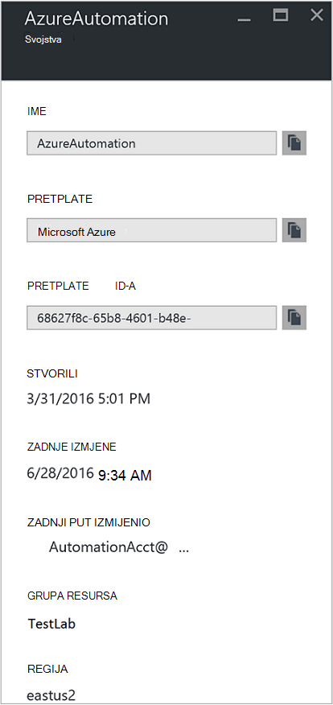
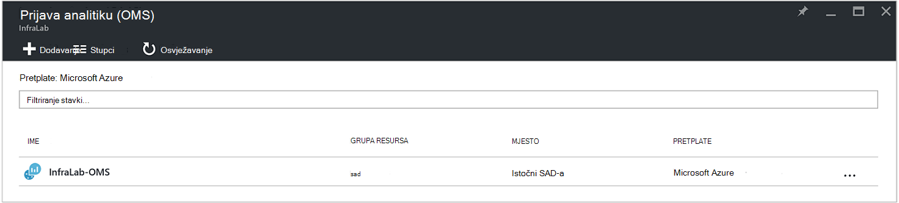
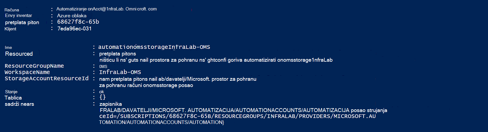
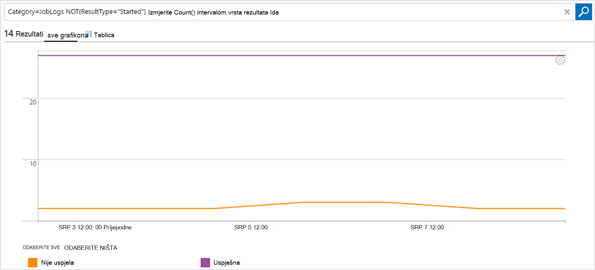

<properties
    pageTitle="Proslijediti status zadatka i posao strujanja s Automatizacija da biste prijava analitiku (OMS) | Microsoft Azure"
    description="U ovom se članku objašnjava kako stanja zadatka i pošaljite runbook posao strujanja analize zapisnika paket web-aplikacije Microsoft operacije upravljanja izlaganje dodatni uvid i upravljanje njima."
    services="automation"
    documentationCenter=""
    authors="MGoedtel"
    manager="jwhit"
    editor="tysonn" />
<tags
    ms.service="automation"
    ms.devlang="na"
    ms.topic="article"
    ms.tgt_pltfrm="na"
    ms.workload="infrastructure-services"
    ms.date="09/22/2016"
    ms.author="magoedte" />

# Proslijediti stanja zadatka i posao strujanja s Automatizacija da biste prijava analitiku (OMS)

Automatizacija možete poslati runbook posao statusa i posao strujanja Microsoft operacije upravljanja paket (OMS) zapisnika analize radnog prostora.  Dok se ove informacije možete prikazati na portalu za Azure ili sa servisom PowerShell stanje pojedinačne zadatka ili sve zadatke za određeni račun Automatizacija, ništa Dodatna podrška potrebama radu potrebno da biste stvorili prilagođene skripte komponente PowerShell.  Sada pomoću zapisnika Anaytics možete učiniti sljedeće:

- Dohvaćanje uvida na vaše automatizaciju zadataka 
- Pokretanje e-pošte ili upozorenje na temelju stanja zadatka runbook (npr. nije uspjelo ili obustavljeno) 
- Pisanje naprednih upita preko strujanje posla 
- Povezivanje zadacima u Automatizacija računa 
- Vizualizacija dosadašnje iskustvo tijekom vremena     

## Preduvjeti i napomene za implementaciju

Da biste započeli slanje vaše zapisnika Automatizacija analize zapisnika, morate imati sljedeće:

1. Pretplatu na OMS. Dodatne informacije potražite u članku [Početak rada s zapisnika analize](../log-analytics/log-analytics-get-started.md).  

    >[AZURE.NOTE]Radni prostor OMS i račun za automatizaciju moraju biti iste Azure pretplate za tu konfiguraciju da bi ispravno funkcionirala. 
  
2. [Račun za Azure prostora za pohranu](../storage/storage-create-storage-account.md).  
   
    >[AZURE.NOTE]U prostor za pohranu račun *mora* biti u području isti kao račun za automatizaciju. 
 
3. Azure PowerShell s verzijom 1.0.8 ili novija verzija od cmdleta radu uvide. Informacije o ovom izdanju i kako ga instalirati potražite u članku [kako instalirati i konfigurirati Azure PowerShell](../powershell-install-configure.md).
4. Azure Diagnostic and zapisnika analize PowerShell.  Dodatne informacije o ovom izdanju i kako ga instalirati potražite u članku [Azure dijagnostičkih i analitiku zapisnika](https://www.powershellgallery.com/packages/AzureDiagnosticsAndLogAnalytics/0.1).  
5. Preuzimanje skriptu PowerShell **Omogući AzureDiagnostics.ps1** iz [Galerije PowerShell](https://www.powershellgallery.com/packages/Enable-AzureDiagnostics/1.0/DisplayScript). Ova skripta će konfigurirati sljedeće:
 - Račun za pohranu na čuvanje runbook posla statusa i strujanja podataka za automatizaciju računa koji navedete.
 - Omogućivanje zbirke tih podataka s računa za automatizaciju pohraniti u računa spremišta blobova platforme Azure u JSON OSNOVNI oblik.
 - Konfiguriranje prikupljanje podataka s računa za spremište blobova platforme OMS zapisnika analize.
 - Omogućivanje rješenja za automatizaciju zapisnika analize OMS radnog prostora.   

**Omogući AzureDiagnostics.ps1** skripte zahtijeva sljedećih parametara tijekom izvođenja:

- *AutomationAccountName* – naziv računa za automatizaciju
- *LogAnalyticsWorkspaceName* - naziv OMS radnog prostora

Da biste pronašli vrijednosti *AutomationAccountName*, na portalu za Azure odaberite svoj račun za automatizaciju iz plohu **Automatizacija račun** i odaberite **sve postavke**.  Plohu **sve postavke** u odjeljku **Postavke računa** odaberite **Svojstva**.  U plohu **Svojstva** možete zabilježiti te vrijednosti.  .

## Postavljanje Integracija s zapisnika Analytics

1. Na računalu, pokrenite **Windows PowerShell** s **početnom** zaslonu.  
2. Iz naredbenog retka ljuske PowerShell dođite do mape koja sadrži skripte preuzimaju i izvršavanje ga promijenite vrijednosti za parametre *- AutomationAccountName* i *- LogAnalyticsWorkspaceName*.

    >[AZURE.NOTE] Zatražit će se za provjeru s Azure nakon izvršavanja skriptu.  **Morate** se prijaviti pomoću računa koji je član uloge pretplate administratori i dodatnih administratora pretplate.   
    
        .\Enable-AzureDiagnostics -AutomationAccountName <NameofAutomationAccount> `
        -LogAnalyticsWorkspaceName <NameofOMSWorkspace> `

3. Nakon izvođenja ovu skriptu trebali biste vidjeti zapisa u prijava analitiku otprilike 30 minuta nakon nove dijagnostičkih podataka napisan za pohranu.  Ako se zapisi nisu dostupne kada se ovaj put odnose se na odjeljak otklanjanje poteškoća u [JSON datoteka u spremište blobova platforme](../log-analytics/log-analytics-azure-storage-json.md#troubleshooting-configuration-for-azure-diagnostics-written-to-blob-in-json).

### Provjerite je li konfiguracija

Da biste potvrdili skriptu vašeg računa za automatizaciju i OMS wokspace uspješno konfigurirano, možete poduzeti sljedeće korake u ljusci PowerShell.  Prije toga, da biste pronašli vrijednosti za naziv radnog prostora OMS i naziv grupe resursa, na portalu Azure idite na prijava analitiku (OMS) i plohu prijava analitiku (OMS) zabilježite vrijednost za **naziv** i **Grupu resursa**.   koristit ćemo te dvije vrijednosti kada smo Provjerite konfiguraciju u radnom prostoru OMS pomoću cmdleta ljuske PowerShell [Get-AzureRmOperationalInsightsStorageInsight](https://msdn.microsoft.com/library/mt603567.aspx).

1.  Na portalu Azure idite na web-mjesto za pohranu računa i u okvir za pretraživanje za sljedeći račun za pohranu koji koristi konvencije imenovanja - *AutomationAccountNameomsstorage*.  Nakon što je runbook dovršetka posla uskoro naknadno trebali biste vidjeti dva Blob spremnika stvorili - **uvida zapisnika joblogs** i **uvida zapisnika jobstreams**.  

2.  Iz komponente PowerShell pokrenite sljedeći kod PowerShell promijenite vrijednosti za parametre **ResourceGroupName** i **WorkspaceName** koje ste kopirali ili zabilježili neke starije verzije.  

    Prijava AzureRmAccount Get-AzureRmSubscription - SubscriptionName 'SubscriptionName' | Postavljanje AzureRmContext Get-AzureRmOperationalInsightsStorageInsight - ResourceGroupName "OMSResourceGroupName" "-radnog prostora"OMSWorkspaceName" 

    Vratit će uvid prostora za pohranu za navedeni OMS radni prostor.  Želimo da biste potvrdili uvid prostora za pohranu za automatizaciju račun ne možemo navedena na popisu postoji i objekt **stanja** prikazuje vrijednost **u redu**.  .

## Prijava analitiku zapisa

Automatizacija stvara dvije vrste zapisa u spremištu OMS.

### Zapisnici posla

Svojstvo | Opis|
----------|----------|
Vrijeme | Datum i vrijeme kada se izvršava runbook posao.|
resourceId | Navodi vrstu resursa u Azure.  Automatizacija, vrijednost je račun za automatizaciju povezan s na runbook.|
operationName | Navodi vrstu operacije obavljene u Azure.  Automatizacija, vrijednost će biti posao.|
resultType | Stanje runbook posao.  Moguće vrijednosti su: -Rada -Zaustavljeno -Obustavljeno -Nije uspjela – Uspješno|
resultDescription | U članku se opisuje stanje runbook posao rezultat.  Moguće vrijednosti su: -Pokreće posao -Posao nije uspjela -Zadatak dovršen|
CorrelationId | GUID koji je Id korelacije runbook posla.|
Kategorija | Klasifikacija vrstu podataka.  Automatizacija, vrijednost je JobLogs.|
RunbookName | Naziv na kompilacije.|
JobId | GUID koji je Id runbook posao.|
Pozivatelja |  Tko je pokrenuo postupak.  Moguće vrijednosti su adresu e-pošte ili sustav za Zakazani zadaci.|

### Strujanja posla
Svojstvo | Opis|
----------|----------|
Vrijeme | Datum i vrijeme kada se izvršava runbook posao.|
resourceId | Navodi vrstu resursa u Azure.  Automatizacija, vrijednost je račun za automatizaciju povezan s na runbook.|
operationName | Navodi vrstu operacije obavljene u Azure.  Automatizacija, vrijednost će biti posao.|
resultType | Stanje runbook posao.  Moguće vrijednosti su: – U tijeku|
resultDescription | Obuhvaća strujanje Izlaz iz na runbook.|
CorrelationId | GUID koji je Id korelacije runbook posla.|
Kategorija | Klasifikacija vrstu podataka.  Automatizacija, vrijednost je JobStreams.|
RunbookName | Naziv na kompilacije.|
JobId | GUID koji je Id runbook posao.|
Pozivatelja | Tko je pokrenuo postupak.  Moguće vrijednosti su adresu e-pošte ili sustav za Zakazani zadaci.| 
StreamType | Vrsta zadatka strujanje. Moguće vrijednosti su: -Tijeku -Izlaz -Upozorenje -Pogreška -Ispravljanje pogrešaka -Opširno|

## Prikaz Automatizacija zapisnike u zapisnik Analytics 

Sad kad ste pokrenuli slanje vaše zapisnika posao Automatizacija analize zapisnika, pogledajmo što možete učiniti pomoću ove zapisnika unutar OMS.   

### Slanje poruke e-pošte kada posao runbook ne uspije ili obustavlja 

Jedno od naše gornji korisnike pita za mogućnost da šaljete poruku e-pošte ili tekst nešto pošlo po redu runbook posla.   

Da biste stvorili pravilo upozorenja, pokrenite stvaranjem zapisnika pretraživanja za zapise runbook posla koji treba pozivanje upozorenje.  Gumb **upozorenje** tada će biti dostupna tako da možete stvoriti i konfigurirati upozorenja pravilo.

1.  Na stranici pregled OMS kliknite **Zapisnika pretraživanja**.
2.  Stvorite upit za pretraživanje zapisnika za vaše upozorenje upisivanjem u sljedeće u polju upita: `Category=JobLogs (ResultType=Failed || ResultType=Suspended)`.  Na RunbookName možete grupirati pomoću: `Category=JobLogs (ResultType=Failed || ResultType=Suspended) | measure Count() by RunbookName_s`.   
  
    Ako postavite zapisnika s više od jednog računa za automatizaciju ili pretplatu za radni prostor, koje možda će vas zanimati grupiranja upozorenja pretplatu ili računa za automatizaciju.  Naziv računa za automatizaciju može biti izvedena iz polja resursa u pretraživanju JobLogs.  

3.  Kliknite **upozorenje** pri vrhu stranice da biste otvorili zaslon **Dodavanje upozorenja pravila** .  Dodatne informacije o mogućnosti da biste konfigurirali upozorenje, pročitajte članak [upozorenja u zapisnik analize](../log-analytics/log-analytics-alerts.md#creating-an-alert-rule).

### Pronalaženje svih zadataka koje ste završili rad s pogreškama 

Osim upozorenjem temeljiti pogreške, vjerojatno želite li znati kada posao runbook je prošao otklanjanje pogrešaka koje nisu prekidanje (PowerShell stvara sustava strujanje pogreške, ali nije prekidanje pogreške ne prouzročiti odgoditi ili neće uspjeti).    

1. Na portalu OMS kliknite **Zapisnika pretraživanja**.
2. U polje upita upišite `Category=JobStreams StreamType_s=Error | measure count() by JobId_g` , a zatim kliknite **pretraživanje**.

### Prikaz zadatka strujanja za posao  

Kada su pogrešaka posla, možda želite pogleda strujanja posao.  Upit u nastavku prikazuje sve strujanja jedan zadatak s GUID 2ebd22ea-e05e-4eb9 - 9d 76-d73cbd4356e0:   

`Category=JobStreams JobId_g="2ebd22ea-e05e-4eb9-9d76-d73cbd4356e0" | sort TimeGenerated | select ResultDescription` 

### Prikaz statusa povijesne posla 

Na kraju, trebali biste vizualizacija dosadašnje iskustvo tijekom vremena.  Ovaj upit možete koristiti da biste potražili status poslova tijekom vremena. 

`Category=JobLogs NOT(ResultType="started") | measure Count() by ResultType interval 1day`  
   

## Sažetak

Slanjem Automatizacija posao statusa i strujanja podataka prijava analitiku možete dobiti bolji uvid u statusa vaše automatizaciju zadataka tako da postavite upozorenja da vas obavijesti kada postoji problem i prilagođene nadzornih ploča pomoću naprednih upita vizualizirati rezultate runbook, runbook status zadatka, i ostale povezane ključne pokazatelje ili metriku.  Na taj ćete omogućiti preglednosti radu i adresu kupljenih brže.  

## Daljnji koraci

- Da biste saznali više o tome kako sastavljanje upita za pretraživanje za različite i Pregled zapisnika posao Automatizacija pomoću zapisnika analize, potražite u članku [zapisnika pretraživanja u zapisnik Analytics](../log-analytics/log-analytics-log-searches.md)
- Da biste naučili kako stvoriti i dohvaćanje izlazne i pogreškama poruka iz runbooks, potražite u članku [Runbook izlazne i poruke](automation-runbook-output-and-messages.md) 
- Da biste saznali više o izvođenja runbook kako praćenje runbook poslovi i drugim tehničke pojedinosti potražite u članku [praćenje runbook posla](automation-runbook-execution.md)
- Dodatne informacije o OMS zapisnika analize i izvore zbirke podataka potražite u članku [Prikupljanje Azure prostora za pohranu podataka u Pregled zapisnika analize](../log-analytics/log-analytics-azure-storage.md)