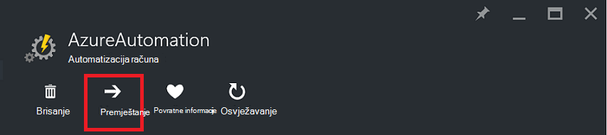
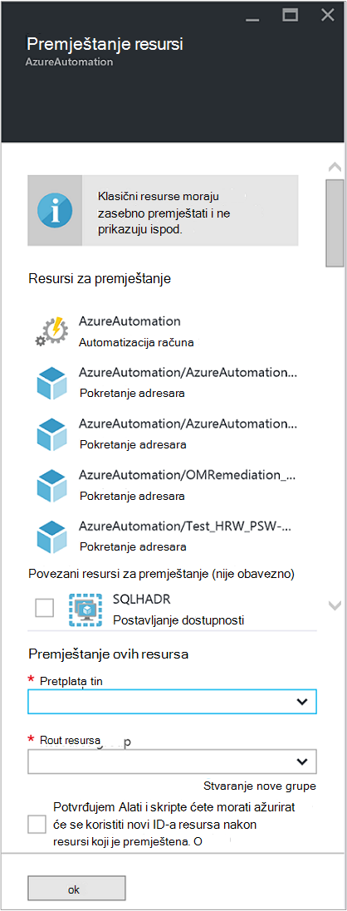

<properties
   pageTitle="Migracija Automatizacija računa i resursima | Microsoft Azure"
   description="U ovom se članku opisuje kako prijeći računa za automatizaciju u Automatizacija Azure i pridružene resurse iz jedne pretplate na drugu."
   services="automation"
   documentationCenter=""
   authors="MGoedtel"
   manager="jwhit"
   editor="tysonn" />
<tags
   ms.service="automation"
   ms.devlang="na"
   ms.topic="article"
   ms.tgt_pltfrm="na"
   ms.workload="infrastructure-services"
   ms.date="07/07/2016"
   ms.author="magoedte" />

# <a name="migrate-automation-account-and-resources"></a>Migracija Automatizacija računa i resursi

Za automatizaciju račune i njegove pridružene resurse (odnosno imovine runbooks, module, itd.) koje ste stvorili na portalu za Azure i želite migrirati iz jedne grupe resursa u drugu ili s jednog pretplate na drugu, možete to jednostavno pomoću [Premještanje resursa](../resource-group-move-resources.md) značajke dostupne na portalu za Azure. Međutim, prije nego što nastavite ovu akciju, trebali biste pregledate sljedeće [kontrolnog popisa prije prelaska resursa](../resource-group-move-resources.md#Checklist-before-moving-resources) , a uz to, na popisu u nastavku karakteristično za automatizaciju.   

1.  Grupa pretplate/resursa odredište mora biti u istom području izvorišnog web-mjesta.  Što znači, računa za automatizaciju nije moguće premjestiti preko područja.
2.  Prilikom pomicanja resursi (npr. runbooks zadacima, itd.), grupi izvora i odredišnu grupu zaključane su trajanje operacije. Pisanje i brisanje operacije blokiraju na grupa dok se ne dovrši premještanje.  
3.  Runbooks ni varijable koje upućuju Identifikacijska resursa ili pretplatu na postojeću pretplatu ćete morati ažurirati nakon dovršetka migracije.   


>[AZURE.NOTE] Ta značajka ne podržava premještanje klasični Automatizacija resursi.

## <a name="to-move-the-automation-account-using-the-portal"></a>Da biste premjestili Automatizacija račun pomoću portala

1. S računa automatizacije kliknite **Premjesti** pri vrhu na plohu.<br> <br> 
2. Na plohu **Premještanje resursi** Imajte na umu on predstavlja resurse vezane uz račun za automatizaciju i ste grupama za resursa.  Odaberite **pretplatu** i **grupa resursa** s padajućim popisima ili odaberite mogućnost **Stvori novu grupu resursa** i unesite novi naziv grupe resursa u polje.  
3. Pregled, a zatim odaberite potvrdni okvir da biste potvrdili ste *Razumijevanje Alati i skripte morate ažurirati da biste koristili novi resurs ID-a kada je premještena resursi* pa kliknite **u redu**.<br> <br>   

Time će potrajati nekoliko minuta da biste dovršili.  U **obavijesti**, primit ćete sa statusom svaku akciju koja se odvija – Provjera valjanosti, prijenos, a zatim na kraju kada se završi.     

## <a name="to-move-the-automation-account-using-powershell"></a>Da biste premjestili Automatizacija račun pomoću komponente PowerShell

Da biste premjestili postojećih Automatizacija resursa u drugu grupu resursa ili na pretplatu, koristite cmdlet **Get-AzureRmResource** da biste na određeni Automatizacija račun, a zatim **Premjesti AzureRmResource** cmdlet za izvođenje premještanje.

Prvi primjer pokazuje kako možete premjestiti račun za automatizaciju novu grupu resursa.

   ```
    $resource = Get-AzureRmResource -ResourceName "TestAutomationAccount" -ResourceGroupName "ResourceGroup01"
    Move-AzureRmResource -ResourceId $resource.ResourceId -DestinationResourceGroupName "NewResourceGroup"
   ``` 

Nakon izvršavanja gornji primjer koda, zatražit će se da biste potvrdili da želite izvršiti akciju.  Kada kliknite **da** , a omogućuju skriptu da biste nastavili, nećete primati obavijesti dok se izvodi migracije.  

Da biste se premjestili na novu pretplatu, uvrstite vrijednost za parametar *DestinationSubscriptionId* .

   ```
    $resource = Get-AzureRmResource -ResourceName "TestAutomationAccount" -ResourceGroupName "ResourceGroup01"
    Move-AzureRmResource -ResourceId $resource.ResourceId -DestinationResourceGroupName "NewResourceGroup" -DestinationSubscriptionId "SubscriptionId"
   ``` 

Kao i u prethodnom primjeru, zatražit će se da biste potvrdili premještanje.  

## <a name="next-steps"></a>Daljnji koraci

- Dodatne informacije o premještanju resursa ili pretplatu za novu grupu resursa potražite u članku [Premještanje resursa ili pretplatu za novu grupu resursa](../resource-group-move-resources.md)
- Dodatne informacije o kontrola pristupa na temelju uloga u automatizaciji Azure priručniku [Kontrola pristupa na temelju uloga u automatizaciji Azure](../automation/automation-role-based-access-control.md).
- Da biste saznali više o PowerShell cmdleti za Upravljanje pretplatom, potražite u članku [Korištenje Azure PowerShell s Voditelj resursa](../powershell-azure-resource-manager.md)
- Da biste saznali više o značajkama portala za Upravljanje pretplatom, pogledajte odjeljak [Korištenje Azure Portal za upravljanje resursima](../azure-portal/resource-group-portal.md). 
