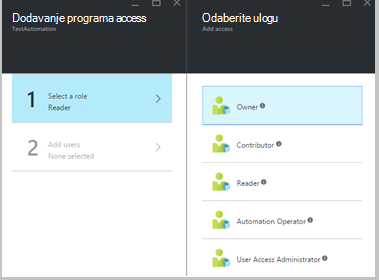

<properties 
   pageTitle="Kontrola pristupa na temelju uloga u automatizaciji Azure | Microsoft Azure"
   description="Kontrola pristupa na temelju uloga (RBAC) omogućuje upravljanje pristupom za Azure resurse. U ovom se članku opisuje kako postaviti RBAC u automatizaciji Azure."
   services="automation"
   documentationCenter=""
   authors="mgoedtel"
   manager="jwhit"
   editor="tysonn"
   keywords="Automatizacija rbac, uloge kontrola pristupa na temelju, azure rbac" />
<tags 
   ms.service="automation"
   ms.devlang="na"
   ms.topic="get-started-article"
   ms.tgt_pltfrm="na"
   ms.workload="infrastructure-services"
   ms.date="09/12/2016"
   ms.author="magoedte;sngun"/>

# Kontrola pristupa na temelju uloga u automatizaciji Azure

## Kontrola pristupa na temelju uloga

Kontrola pristupa na temelju uloga (RBAC) omogućuje upravljanje pristupom za Azure resurse. Korištenje [RBAC](../active-directory/role-based-access-control-configure.md), možete segregate obavezama koje imate u tim i dati samo razinu pristupa za korisnike, grupe i aplikacijama koje su im potrebne za izvođenje svoje zadatke. Na temelju uloga pristup se mogu dodijeliti korisnicima pomoću portala za Azure, Azure alati naredbenog retka ili API-ji za upravljanje Azure.

## RBAC u Automatizacija računi

U automatizaciji Azure pristup moguć je dodjelom odgovarajuću ulogu RBAC korisnike, grupe i aplikacije u račun dosegu automatizacije. Ovo su ugrađene uloge podržava račun Automatizacija:  

|**Uloga** | **Opis** |
|:--- |:---|
| Vlasnik | Uloga vlasnika omogućuje pristup svim resurse i akcije poslovnog subjekta Automatizacija uključujući osiguravanja pristupa za druge korisnike, grupe i aplikacije za upravljanje računom za automatizaciju. |
| Suradnik | Uloga suradnika omogućuje upravljanje sve osim izmjena dozvole za pristup drugi korisnik s računom za automatizaciju. |
| Čitač | Ulozi čitač omogućuje prikaz svih resursa u račun za automatizaciju, ali ne možete mijenjati.|
| Automatizacija Operator | Automatizacija Operator uloga omogućuje izvođenje operativnih zadataka kao što su početka, zaustavljanje, privremeno obustavljanje, životopis i zakazivati zadatke. Ta uloga je korisno ako želite zaštiti resursi za automatizaciju računa kao što su resursi vjerodajnice i runbooks pregledavanju i mijenjati, ali još uvijek Dopusti članovima vaše tvrtke ili ustanove za izvršavanje te runbooks. |
| Korisnički pristup administratora | Ulogu administratora korisnički pristup omogućuje upravljanje korisničkim pristupom s računima za automatizaciju Azure. |

>[AZURE.NOTE] Ne možete dodijeliti prava pristupa za određene runbook ili runbooks, samo na resurse i akcije subjekta automatizaciju.  

U ovom članku smo će vas voditi kroz postavljanje RBAC u automatizaciji Azure. No prvi, pogledajmo detaljnije Upoznavanje pojedinačne dozvole dodijeljene suradnika, čitač, automatizacija Operator i korisnički pristup administratora pa ćemo dobiti dobro upoznavanje prije svatko dodjelu prava na račun za automatizaciju.  U suprotnom je može rezultirati neželjeni ili neželjenog posljedice.     

## Dozvole za uloge suradnika

Sljedeća tablica predstavlja određene akcije koje se mogu izvršiti uloga suradnika u automatizaciju.

| **Vrsta resursa** | **Čitanje** | **Pisanje** | **Brisanje** | **Druge akcije** |
|:--- |:---|:--- |:---|:--- |
| Račun za Azure automatizacije |  |  |  | | 
| Automatizacija certifikat resursa |  |  |  | |
| Automatizacija veze resursa |  |  |  | | 
| Automatizacija veze vrste resursa |  |  |  | | 
| Automatizacija vjerodajnica resursa |  |  |  | |
| Automatizacija raspored resursa |  |  |  | |
| Automatizacija varijable resursa |  |  |  | |
| Automatizacija želji stanja konfiguracija | | | |  |
| Vrsta resursa za hibridno Runbook tempiranja |  | |  | | 
| Azure Automatizacija posla |  |  | |  | 
| Automatizacija posao strujanje |  | | | | 
| Automatizacija raspored posla |  |  |  | |
| Modul za automatizaciju |  |  |  | |
| Automatizacija Azure Runbook |  |  |  |  |
| Automatizacija Runbook skice |  | | |  |
| Automatizacija Runbook skica Test posla |  |  | |  | 
| Automatizacija Webhook |  |  |  |  |

## Dozvole za čitanje uloge

Sljedeća tablica predstavlja određene akcije koje se mogu izvršiti ulogom Reader u automatizaciji.

| **Vrsta resursa** | **Čitanje** | **Pisanje** | **Brisanje** | **Druge akcije** |
|:--- |:---|:--- |:---|:--- |
| Administrator klasični pretplate |  | | | 
| Upravljanje lock |  | | | 
| Dozvole |  | | |
| Operacije davatelja usluga |  | | | 
| Dodjela uloga |  | | | 
| Definicije uloge |  | | | 

## Dozvole za automatizaciju Operator uloge

Sljedeća tablica predstavlja određene akcije koje se mogu izvršiti ulogom Automatizacija Operator u automatizaciji.

| **Vrsta resursa** | **Čitanje** | **Pisanje** | **Brisanje** | **Druge akcije** |
|:--- |:---|:--- |:---|:--- |
| Račun za Azure automatizacije |  | | | 
| Automatizacija certifikat resursa | | | |
| Automatizacija veze resursa | | | |
| Automatizacija veze vrste resursa | | | |
| Automatizacija vjerodajnica resursa | | | |
| Automatizacija raspored resursa |  |  | | |
| Automatizacija varijable resursa | | | |
| Automatizacija želji stanja konfiguracija | | | | |
| Vrsta resursa za hibridno Runbook tempiranja | | | | | 
| Azure Automatizacija posla |  |  | |  | 
| Automatizacija posao strujanje |  | | |  
| Automatizacija raspored posla |  |  | | |
| Modul za automatizaciju | | | |
| Automatizacija Azure Runbook |  | | | |
| Automatizacija Runbook skice | | | |
| Automatizacija Runbook skica Test posla | | | |  
| Automatizacija Webhook | | | |

Dodatne detalje [Akcija za automatizaciju operator](../active-directory/role-based-access-built-in-roles.md#automation-operator) popis podržanih ulogom operator Automatizacija na račun za automatizaciju i njegovih resursa akcija.

## Korisnički pristup administratorske uloge dozvole

Sljedeća tablica predstavlja određene akcije koje se može izvoditi na korisnički pristup ulogu administratora u automatizaciji.

| **Vrsta resursa** | **Čitanje** | **Pisanje** | **Brisanje** | **Druge akcije** |
|:--- |:---|:--- |:---|:--- |
| Račun za Azure automatizacije |  | | | |
| Automatizacija certifikat resursa |  | | | |
| Automatizacija veze resursa |  | | | |
| Automatizacija veze vrste resursa |  | | | |
| Automatizacija vjerodajnica resursa |  | | | |
| Automatizacija raspored resursa |  | | | |
| Automatizacija varijable resursa |  | | | |
| Automatizacija želji stanja konfiguracija | | | | |
| Vrsta resursa za hibridno Runbook tempiranja |  | | | | 
| Azure Automatizacija posla |  | | | | 
| Automatizacija posao strujanje |  | | | | 
| Automatizacija raspored posla |  | | | |
| Modul za automatizaciju |  | | | |
| Automatizacija Azure Runbook |  | | | |
| Automatizacija Runbook skice |  | | | |
| Automatizacija Runbook skica Test posla |  | | | | 
| Automatizacija Webhook |  | | |

## Konfiguriranje RBAC za automatizaciju račun pomoću portala za Azure

1.  Prijavite se na [Portal za Azure](https://portal.azure.com/) i otvorite računa za automatizaciju iz plohu Automatizacija računi.  

2.  Kliknite kontrolu **pristupa** u gornjem desnom kutu. Otvorit će se **korisnici** plohu gdje možete dodati nove korisnike, grupe i aplikacije za prikaz postojeći uloge koje je moguće je konfigurirati za automatizaciju račun i upravljanje računa za automatizaciju.  

      

>[AZURE.NOTE] **Administratori pretplata** već postoji kao zadanog korisnika. Grupi pretplate administratori servisa active directory sadrži administrator(s) servisa i co-administrator(s) Azure pretplatu. Administrator servisa je vlasnik pretplate Azure i njegovih resursa, te će imati uloga vlasnika nasljeđuje za račune za automatizaciju previše. To znači da access **Inherited** **Administratori servisa i suadministratora** pretplatu i njegova **dodijeljene** za sve druge korisnike. Kliknite **Administratori pretplate** da biste vidjeli dodatne detalje o njihove dozvole.  

### Dodavanje novog korisnika i dodijelite uloge

1.  Plohu korisnika, kliknite **Dodaj** da biste otvorili **Dodaj pristup plohu** gdje možete dodati korisniku, grupi ili aplikacije i dodijeliti uloge.  

      

2.  Odaberite ulogu s popisa dostupnih uloge. Ne možemo će odabir uloge **čitač** , ali možete odabrati bilo koji od dostupne ugrađene uloge koje podržava račun za automatizaciju ili sve prilagođene uloge koje ste definirali.  

      

3.  Kliknite **Dodavanje korisnika** da biste otvorili plohu **Dodavanje korisnika** . Ako ste dodali sve korisnike, grupe ili aplikacije da biste upravljali pretplatom navedene su ti korisnici, a zatim ih da biste dodali access možete odabrati. Ako nisu navedeni korisnici ili ako korisnik koji vas zanima dodavanjem nije naveden na popisu pa kliknite **Pozovi** da biste otvorili na **pozivanje gost** plohu gdje možete pozvati korisnik s na valjanu adresu Microsoftova računa e-pošte kao što je Outlook.com, OneDrive ili Xbox Live ID-a. Kada unesete adresu e-pošte korisnika, kliknite **Odaberite** Dodavanje korisnika, a zatim kliknite **u redu**. 

      
 
    Sada trebali biste vidjeti korisnik dodan plohu **korisnika** s ulogom **čitač** dodijeljeni.  

      

    Uloge možete dodijeliti korisnika i iz plohu **uloge** . 

1. Kliknite **uloge** iz plohu korisnika da biste otvorili **plohu uloge**. U ovom plohu možete vidjeti naziv uloge, broj korisnika i grupa dodijeljene uloge.

      
   
    >[AZURE.NOTE] Kontrola pristupa na temelju uloga može se postaviti samo na razini Automatizacija račun i ne na bilo koji resurs ispod račun za automatizaciju.

    Više uloga možete dodijeliti korisniku, grupi ili aplikacije. Na primjer, ako dodat ćemo ulogu **Automatizacija Operator** uz **ulozi čitač** korisniku, pa ih možete pogledati sve resurse za automatizaciju, kao i izvršavanje zadataka runbook. Možete proširiti na padajućem popisu da biste pogledali popis uloge dodijeljene korisnika.  

      
 
### Uklanjanje korisnika

Možete ukloniti dozvola pristupa za korisnika koji je upravljati računom Automatizacija ili koji više ne funkcionira za tvrtku ili ustanovu. Slijede upute za uklanjanje korisnika: 

1.  Plohu **korisnika** odaberite Dodjela uloge koje želite ukloniti.

2.  Kliknite gumb **Ukloni** u pojedinosti plohu dodjele.

3.  Kliknite **da** da biste potvrdili uklanjanje. 

      

## Uloga dodijeljenog korisnika

Kada korisniku dodijelite uloge zapisnike u svoj račun Automatizacija, sada mogu vidjeti vlasnika račun naveden na popisu **Zadano direktorija**. Da biste pregledavali Automatizacija računa koji su dodani su mora se prebaciti zadani direktorij vlasnika zadani direktorij.  

  

### Korisničko sučelje za automatizaciju operator uloga

Kada se korisnik, koji je dodijeljen uloga prikaza Automatizacija Operator dodjeljuju se račun za automatizaciju, ih možete samo vidjeti na popisu runbooks, runbook zadacima i rasporede stvorene u račun za automatizaciju ali ne možete prikazati njihove definicija. Oni možete započeti, zaustavljanje, privremeno obustavljanje, životopis ili raspoređivanje zadatka runbook. Korisnik će imati pristup na druge resurse za automatizaciju, kao što su konfiguracije hibridnog radnih grupa ili DSC čvorove.  

  

Kada korisnik klikne na runbook, naredbe izvorišnog web-mjesta za prikaz i uređivanje u runbook su navedeni kao operator uloga Automatizacija ne dopušta pristup do njih.  

  

Korisnik će automatski dobiti pristup za prikaz i stvaranje rasporeda, ali će automatski dobiti pristup bilo koju drugu vrstu resursa.  

  

Taj korisnik i nema pristup da biste pogledali webhooks pridružene na runbook

  

## Konfiguriranje RBAC za automatizaciju račun pomoću komponente PowerShell Azure

Na temelju uloga pristup moguće je konfigurirati i s računom za automatizaciju pomoću sljedeće [Cmdlete Azure PowerShell](../active-directory/role-based-access-control-manage-access-powershell.md).

• [Get-AzureRmRoleDefinition](https://msdn.microsoft.com/library/mt603792.aspx) popis svih uloga RBAC koje su dostupne u Azure Active Directory. Koristite tu naredbu zajedno s svojstvo **naziv** da biste dobili popis sve akcije koje mogu izvršavati određene uloge.  
    **Primjer:**  
      

• [Get-AzureRmRoleAssignment](https://msdn.microsoft.com/library/mt619413.aspx) popis Azure AD RBAC dodjele uloga na navedeni opseg. Bez sve parametre ta naredba Vrati sve dodjele uloga izvršene u odjeljku pretplate. Koristite parametar **ExpandPrincipalGroups** dodjele pristup popisa za navedenog korisnika, kao i grupa je korisnik član.  
    **Primjer:** Da biste dobili popis svih korisnika i njihove uloge poslovnog subjekta Automatizacija, koristite sljedeću naredbu.

    Get-AzureRMRoleAssignment -scope “/subscriptions/<SubscriptionID>/resourcegroups/<Resource Group Name>/Providers/Microsoft.Automation/automationAccounts/<Automation Account Name>” 

• [Novo AzureRmRoleAssignment](https://msdn.microsoft.com/library/mt603580.aspx) da biste dodijelili pristup korisnike, grupe i aplikacije za dani doseg.  
    **Primjer:** Dodjeljivanje uloge "Automatizacija Operator" za korisnika u opsegu račun Automatizacija, koristite sljedeću naredbu.

    New-AzureRmRoleAssignment -SignInName <sign-in Id of a user you wish to grant access> -RoleDefinitionName "Automation operator" -Scope “/subscriptions/<SubscriptionID>/resourcegroups/<Resource Group Name>/Providers/Microsoft.Automation/automationAccounts/<Automation Account Name>”  

• Pomoću [Ukloni AzureRmRoleAssignment](https://msdn.microsoft.com/library/mt603781.aspx) da biste uklonili pristup određeni korisnik, grupa ili aplikacije za dani doseg.  
    **Primjer:** Koristite sljedeću naredbu da biste uklonili korisnika iz uloge "Automatizacija Operator" u opsegu Automatizacija računa.

    Remove-AzureRmRoleAssignment -SignInName <sign-in Id of a user you wish to remove> -RoleDefinitionName "Automation Operator" -Scope “/subscriptions/<SubscriptionID>/resourcegroups/<Resource Group Name>/Providers/Microsoft.Automation/automationAccounts/<Automation Account Name>”

U gornjem primjerima zamijenite **prijavite se u ID-a**, **Id pretplate**, **naziv grupe resursa** i **naziv računa za automatizaciju** podatke o računu. Odaberite **da** kada se zatraži potvrda prije nastavka da biste uklonili Dodjela uloge korisnika.   

## Daljnji koraci
-  Informacije o različitim načinima konfiguracije RBAC za automatizaciju Azure priručniku [Upravljanje RBAC s Azure PowerShell](../active-directory/role-based-access-control-manage-access-powershell.md).
- Detalje na različite načine da biste započeli s runbook potražite u članku [počevši s runbook](automation-starting-a-runbook.md)
- Informacije o vrstama različite runbook potražite [vrste runbook Automatizacija Azure](automation-runbook-types.md)

