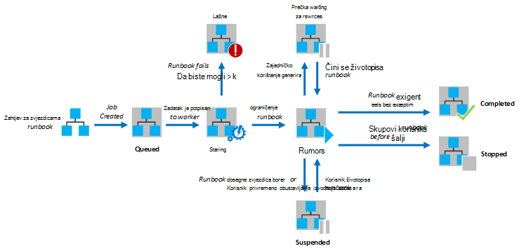
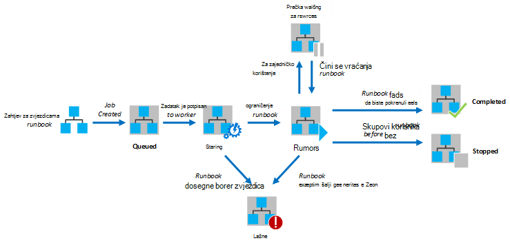

<properties
   pageTitle="Izvršavanje Runbook u Automatizacija Azure"
   description="U članku se opisuje detalje o obradu runbook u automatizaciji Azure."
   services="automation"
   documentationCenter=""
   authors="mgoedtel"
   manager="stevenka"
   editor="tysonn" />
<tags
   ms.service="automation"
   ms.devlang="na"
   ms.topic="article"
   ms.tgt_pltfrm="na"
   ms.workload="infrastructure-services"
   ms.date="03/21/2016"
   ms.author="bwren" />

# Izvršavanje Runbook u Automatizacija Azure

Kada započnete s runbook u automatizaciji Azure, posao se stvara. Zadatak je jedan izvršavanja instance programa kompilacije. Programa automatizacije Azure tempiranja dodjeljuje se pokrenuti svaki zadatak. Dok zaposlenici zaduženi za zajednički koriste više računa Azure, poslovi iz različitih računa za automatizaciju su Izolirani međusobno. Nemate kontrolu nad kojim tempiranja će servisnog zahtjeva za svoj posao.  Jedan runbook može imati više zadataka istodobno radite. Kada pregledavate popis runbooks na portalu za Azure, će popisa status posljednji zadatak koji je pokrenut za svaku runbook. Da biste pratili status svih možete pogledati na popisu zadataka za svaku runbook. Opis statusi različite posla, potražite u članku [Statusi posao](#job-statuses).

Sljedeći dijagram prikazuje životni ciklus posla runbook za [grafički runbooks](automation-runbook-types.md#graphical-runbooks) i [runbooks PowerShell tijeka rada](automation-runbook-types.md#powershell-workflow-runbooks).

Sljedeći dijagram prikazuje životni ciklus runbook posla [PowerShell runbooks](automation-runbook-types.md#powershell-runbooks).

Poslova će imati pristup Azure resurse tako da veza u pretplatu za Azure. Samo imaju pristup resursima u centru za podataka ako su dostupni iz javne oblaka tih resursa.

## Statusi posla

U sljedećoj tablici opisane različite statusi moguće za posao.

| Status| Opis|
|:---|:---|
|Dovršeno|Zadatak je uspješno dovršena.|
|Nije uspjela| Za [runbooks Graphical i PowerShell tijeka rada](automation-runbook-types.md)na runbook kompiliranje nije uspjelo.  [Skriptu PowerShell runbooks](automation-runbook-types.md)pokretanje na runbook nije uspjelo ili posao do iznimke. |
|Nije uspjelo čekanje resursa|Posao nije uspjelo jer dosegne ograničenje [sajma zajedničko korištenje](#fairshare) triput i rada s istom Kontrolna točka ili start na kompilacije svaki put.|
|U redu čekanja|Posao čekanje resursa na programa automatizacije tempiranja dolazi dostupna tako da se može se pokrenuti.|
|Pokretanje|Zadatak je dodijeljen u, a sustav je u tijeku je pokrenuti.|
|Nastavljanje|Sustav je u tijeku nastavljanje posla nakon što ga je obustavljena.|
|Pokretanje|Zadatak je pokrenut.|
|Pokrenut, čekanje resursa|Zadatak više nije učitan jer je dostigao ograničenje [sajma zajedničko korištenje](#fairshare) . Nastavak će uskoro iz njegova zadnjeg kontrolne točke.|
|Zaustavi|Zadatak je zaustavljeno korisnik je prije dovršetka.|
|Zaustavljanje|Sustav je u tijeku zaustavljanje posao.|
|Obustavljena|Zadatak je obustavljena korisnik, sustava ili naredbu u na runbook. Zadatak koji je obustavljena možete ponovno pokrenuti i će nastaviti s njegova zadnjeg Kontrolna točka ili od početka na kompilacije ako nema checkpoints. Na runbook samo je obustavljeno sustav slučaju iznimku. Po zadanom je ErrorActionPreference postavljen **Nastavi** značenje koje posao će zadržati pokrenute na pogrešku. Ako je ova preferenca varijabla postavljen da biste **zaustavili** posao će privremeno obustavljanje na pogrešku.  Odnosi se na [Graphical i tijek rada PowerShell runbooks](automation-runbook-types.md) samo.|
|Zatvaranja|Sustav pokušava obustaviti posao u zahtjevu za korisnika. Na runbook moraju doći do njegova sljedeće kontrolne točke prije nego što može biti obustavljeno. Ako je već prošao njegova zadnjeg kontrolne točke, pa ga će završiti može biti obustavljeno.  Odnosi se na [Graphical i tijek rada PowerShell runbooks](automation-runbook-types.md) samo.|

## Prikaz statusa posla pomoću portala za upravljanje Azure

### Automatizacija nadzorne ploče

Nadzorna ploča za automatizaciju prikazuje sažetak svih runbooks za određeni Automatizacija račun. Obuhvaća i pregled korištenja za račun. Sažetak graph prikazuje broj ukupni zadatke za sve runbooks koji unijeli svaki status na zadani broj dana ili sati. Možete odabrati vremenski raspon u gornjem desnom kutu na grafikonu. Vrijeme osi na grafikonu će se promijeniti prema vrsti vremenski raspon koji ste odabrali. Možete odabrati želite li da bi se prikazao u retku za određeni status tako da kliknete na njemu pri vrhu zaslona.

Možete koristiti sljedeće korake da biste prikazali nadzorne ploče za automatizaciju.

1. Na portalu za upravljanje Azure odaberite **Automatizacija** , a zatim kliknite naziv računa za automatizaciju.
1. Odaberite karticu **nadzorne ploče** .

### Runbook nadzorne ploče

Na nadzornoj ploči Runbook prikazuje sažetak za jednu runbook. Sažetak graph prikazuje broj Ukupno poslova runbook koji unijeli svaki status na zadani broj dana ili sati. Možete odabrati vremenski raspon u gornjem desnom kutu na grafikonu. Vrijeme osi na grafikonu će se promijeniti prema vrsti vremenski raspon koji ste odabrali. Možete odabrati želite li da bi se prikazao u retku za određeni status tako da kliknete na njemu pri vrhu zaslona.

Da biste prikazali Runbook nadzornu ploču možete koristiti sljedeće korake.

1. Na portalu za upravljanje Azure odaberite **Automatizacija** , a zatim kliknite naziv računa za automatizaciju.
1. Kliknite naziv programa kompilacije.
1. Odaberite karticu **nadzorne ploče** .

### Zadatak sažetka

Možete pogledati popis svih zadataka koje su stvorene za određeni runbook i njihovo najnovije stanje. Možete filtrirati ovaj popis prema statusu zadatka i raspon datuma zadnje promjene na posao. Kliknite naziv zadatka da biste vidjeli njezin detaljne informacije i rezultat. Detaljni prikaz posla sadrži vrijednosti za parametre runbook koju ste dobili za taj zadatak.

Možete koristiti sljedeće korake da biste prikazali zadatke za na runbook.

1. Na portalu za upravljanje Azure odaberite **Automatizacija** , a zatim kliknite naziv računa za automatizaciju.
1. Kliknite naziv programa kompilacije.
1. Odaberite karticu **zadatke** .
1. Kliknite stupac **Stvoren zadatak** za posao da biste vidjeli njegove pojedinosti i izlaz.

## Dohvaćanje stanja zadatka pomoću komponente Windows PowerShell

[Get-AzureAutomationJob](http://msdn.microsoft.com/library/azure/dn690263.aspx) možete koristiti za dohvaćanje zadataka stvorio za na runbook i detalje o određeni posao. Ako vam je runbook s komponentom Windows PowerShell pomoću [Start AzureAutomationRunbook](http://msdn.microsoft.com/library/azure/dn690259.aspx), pa će se vratiti rezultirajući zadatak. Da biste pristupili izlaz s posla, slijedite [Get-AzureAutomationJob](http://msdn.microsoft.com/library/azure/dn690263.aspx)izlaz.

Sljedeće primjere naredbi dohvaća zadnji zadatak za uzorak runbook i prikazuje je status, navedite vrijednosti za parametre runbook i izlaz iz posla.

    $job = (Get-AzureAutomationJob –AutomationAccountName "MyAutomationAccount" –Name "Test-Runbook" | sort LastModifiedDate –desc)[0]
    $job.Status
    $job.JobParameters
    Get-AzureAutomationJobOutput –AutomationAccountName "MyAutomationAccount" -Id $job.Id –Stream Output

## Sajma zajedničko korištenje

Da biste omogućili zajedničko korištenje resursa među svim runbooks u oblaku, automatizacija Azure će privremeno memorije bilo koji zadatak kada je pokrenuta 3 sata.    Runbooks [Graphical](automation-runbook-types.md#graphical-runbooks) i [PowerShell tijek](automation-runbook-types.md#powershell-workflow-runbooks) rada će se nastaviti s njihovim posljednje [Kontrolna točka](http://technet.microsoft.com/library/dn469257.aspx#bk_Checkpoints). Za to vrijeme posao prikazivat će se status je pokrenut, čekanje resursa. Ako na runbook sadrži bez checkpoints ili posao imali do prvog kontrolne točke prije nego što uklanja, ona će pokrenuti od početka.  [PowerShell](automation-runbook-types.md#powershell-runbooks) runbooks uvijek se pokrene od početka jer ne podržavaju checkpoints.

>[AZURE.NOTE] Ograničenje sajma zajedničko korištenje nije primjenjivo runbook zadataka koji se izvršavaju na zaposlenici zaduženi za hibridno Runbook.

Ako na runbook ponovnog pokretanja iz iste Kontrolna točka ili od početka na kompilacije triput zaredom će prekinuti sa statusom nije uspjelo čekanje resursa. Time se zaštititi od runbooks radi beskonačno bez dovršavanja, kao što je ne mogu ga učiniti sljedeće kontrolne točke bez ponovnog uklanja. U ovom slučaju, primit ćete sljedeću iznimku s pogreške.

*Posao ne može nastaviti pokrenete jer je više puta uklonjen iz iste kontrolne točke. Provjerite je li vaša Runbook izvođenje dugotrajan operacija bez persisting stanje.*

Kada stvorite na runbook, potrebno je provjeriti da vrijeme pokretanje željene aktivnosti između dva checkpoints nije veća od 3 sata. Možda ćete morati dodati checkpoints vaše runbook da biste bili sigurni da ga ne dođete do to ograničenje 3 sata i prekinuti tako dugo postupke. Na primjer, vaše runbook može izvršiti je ponovno indeksiranje velike SQL baze podataka. Ako ovaj postupak jedne ne dovrši unutar ograničenja za sajma zajedničko korištenje, zatim posao će biti nije učitan i ponovno pokrenuti od početka. U ovom slučaju treba prelomiti gore ponovno indeksiranje operacije u više koraka, kao što je li jednu tablicu odjednom, a zatim umetnite u Kontrolna točka nakon svakog operacije tako da posao ne može nastaviti nakon zadnjeg operacije da biste dovršili.

## Daljnji koraci

- [Pokretanje programa runbook u automatizaciji Azure](automation-starting-a-runbook.md)
