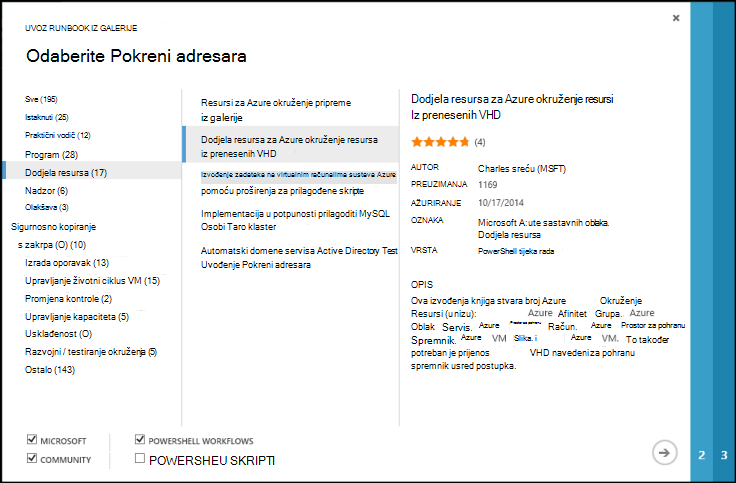
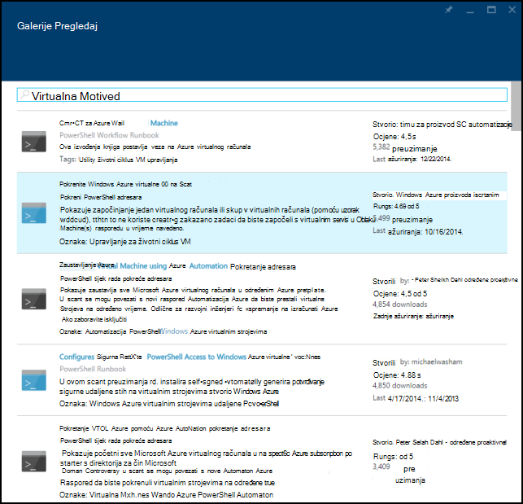
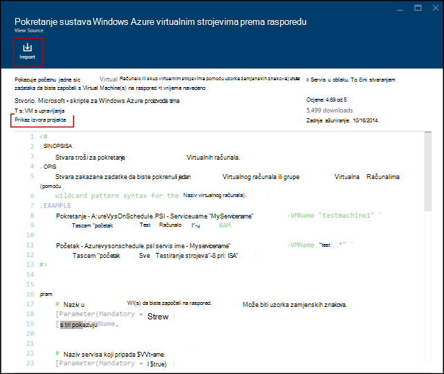
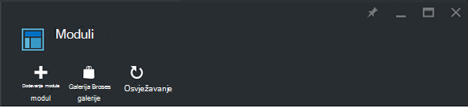
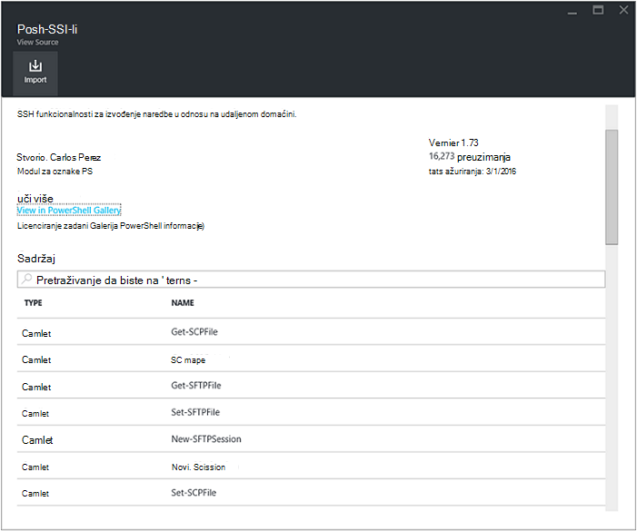
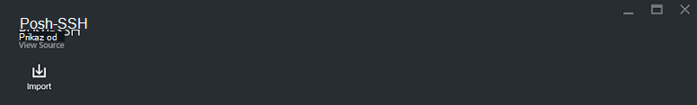
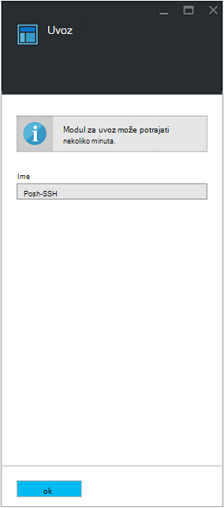

<properties
    pageTitle="Galerija Runbook i module za automatizaciju Azure | Microsoft Azure"
    description="Runbooks i moduli tvrtke Microsoft i zajednice dostupni su za morate instalirati i koristiti u svom okruženju Azure automatizaciju.  U ovom se članku opisuje kako pristupiti ove resurse i da biste slali vaše runbooks u galeriju."
    services="automation"
    documentationCenter=""
    authors="mgoedtel"
    manager="jwhit"
    editor="tysonn" />
<tags
    ms.service="automation"
    ms.devlang="na"
    ms.topic="article"
    ms.tgt_pltfrm="na"
    ms.workload="infrastructure-services"
    ms.date="09/18/2016"
    ms.author="magoedte;bwren" />

# Galerija Runbook i module za automatizaciju Azure

Umjesto stvaranja vlastite runbooks i module u automatizaciji Azure, možete pristupiti raznih scenarija koji se već ugrađeni Microsoft i zajednice.  Pomoću tih scenarija bez izmjene ili možete ih koristiti kao početnu točku i njihovo uređivanje za posebne zahtjeve.

Runbooks možete pristupiti iz [Galerije Runbook](#runbooks-in-runbook-gallery) i moduli iz [Galerije PowerShell](#modules-in-powerShell-gallery).  Mogu se i pridonositi u zajednici slanjem scenariji koju ste razvili.

## Runbooks u galeriji Runbook

[Runbook Galerija](http://gallery.technet.microsoft.com/scriptcenter/site/search?f[0].Type=RootCategory&f[0].Value=WindowsAzure&f[1].Type=SubCategory&f[1].Value=WindowsAzure_automation&f[1].Text=Automation) nudi brojne runbooks tvrtke Microsoft i zajednice koje možete uvesti u Automatizacija Azure. Možete preuzeti runbook iz galerije koji se nalazi se u [Centar za skripte TechNet](http://gallery.technet.microsoft.com/)ili runbooks možete uvesti izravno iz galerije Azure klasični portal ili Azure portal.

Možete uvesti samo izravno iz galerije Runbook pomoću portala za Azure klasični ili Azure portal. Nećete moći izvršiti ove funkcije pomoću komponente Windows PowerShell.

>[AZURE.NOTE] Trebali biste provjeriti sadržaj bilo koje runbooks dobiti iz galerije Runbook i ekstremne Oprez u instalaciju i pokretanje ih u okruženju radnog. |

### Da biste uvezli u runbook iz galerije Runbook s portala za Azure klasični

1. Na portalu za Azure kliknite, **novu** **aplikaciju servisa**, **Automatizacija**, **Runbook**, **Iz galerije**.
2. Odaberite kategoriju da biste pogledali povezane runbooks pa odaberite runbook za prikaz detalja. Kad odaberete runbook želite, kliknite gumb sa strelicom desno.

    

3. Pregledajte sadržaj na kompilacije i zabilježite sve zahtjeve u opisu. Kada završite, kliknite gumb sa strelicom desno.
4. Unesite detalje runbook, a zatim kliknite gumb s kvačicom. Naziv runbook će već biti unesena.
5. Na runbook pojavit će se na kartici **Runbooks** za automatizaciju račun.

### Da biste uvezli u runbook iz galerije Runbook s portala za Azure

1. Na portalu za Azure otvorite računa za automatizaciju.
2. Kliknite pločicu **Runbooks** da biste otvorili popis runbooks.
3. Kliknite gumb **Pregled galerije** .

    

4. Pronađite stavku galerije, a zatim ga da biste vidjeli njegove detalje.

    

4. Kliknite **projekt izvorišnog prikaz** da biste pogledali stavke u [Centar za skripte TechNet](http://gallery.technet.microsoft.com/).
5. Da biste uvezli stavke, kliknite da biste prikazali detalje o, a zatim gumb **Uvoz** .

    

6. Po želji promijenite naziv u kompilacije i **u redu** da biste se uvesti u runbook.
5. Na runbook pojavit će se na kartici **Runbooks** za automatizaciju račun.

### Dodavanje u runbook u galeriju runbook

Microsoft potiče dodavanje runbooks galeriju Runbook mislite da će biti korisno da biste ostali korisnici.  Možete dodati na runbook tako da [prenesete centar za skripte](http://gallery.technet.microsoft.com/site/upload) uzimajući u obzir sljedeće detalje.

- Za **kategorije** i *automatizaciju* za **potkategorije** za na runbook da se prikazuje u čarobnjaku morate navesti *Windows Azure* .  

- Prijenos mora biti u jednu datoteku .ps1 ili .graphrunbook.  Ako na runbook zahtijeva sve module, podređeni runbooks ili resursi, pa vam treba popis onih u opisu predavanje i u odjeljak komentari u kompilacije.  Ako imate scenarij koji je potrebno više runbooks, svaka zasebno prijenos i popis imena povezane runbooks u svakoj od njihovi opisi. Provjerite je li koristiti istu oznaku tako da ih prikazat će se u istu kategoriju. Korisnik će morati pročitajte opis znati jesu li druge runbooks potreban scenarij za rad.

- Dodajte oznake "GraphicalPS" Ako objavljujete na **grafički runbook** (ne grafički tijek rada). 

- Umetnite isječak koda PowerShell ili PowerShell tijeka rada u opis pomoću ikone za **Umetanje pozivni broj** .

- Sažetak za prijenos prikazat će se u rezultatima Galerija Runbook tako da se mora sadržavati detaljne informacije koje će olakšati prepoznavanje funkciju u kompilacije korisnika.

- Prijenos treba dodijeliti jedan do tri sljedeće oznaka.  Na runbook će biti naveden u čarobnjaku za u odjeljku kategorije koje odgovaraju njegov oznake.  Čarobnjak će zanemariti sve oznake nije na ovom popisu. Ako ne navedete sve odgovarajuće oznake, u runbook će se prikazati u odjeljku drugu kategoriju.

 - Sigurnosno kopiranje
 - Upravljanje kapaciteta
 - Promjena kontrole
 - Usklađenost
 - Razvojni / testiranje okruženja
 - Izrada oporavak
 - Nadzor
 - Zakrpa
 - Dodjela resursa
 - Olakšava
 - Upravljanje VM životni ciklus

- Automatizacija obnavlja galerije jednom na sat tako da nećete vidjeti vaše prilozima odmah.

## Moduli u galeriji PowerShell

Moduli PowerShell sadrži cmdleta koje možete koristiti u vašem runbooks i postojeće module koje možete instalirati u automatizaciji Azure dostupni u [Galeriji PowerShell](http://www.powershellgallery.com).  Možete pokrenuti galerije s portala za Azure i instalirajte ih izravno u Automatizacija Azure ili možete preuzeti ih i ručno instalirati.  Nije moguće instalirati module izravno na portalu Azure klasični, ali ih možete preuzeti instalirajte ih kao i sve druge module.

### Da biste uvezli modula iz galerije modul Automatizacija pomoću portala za Azure

1. Na portalu za Azure otvorite računa za automatizaciju.
2. Kliknite pločicu **Resursi** da biste otvorili popis resursi.
3. Kliknite pločicu **module** da biste otvorili popis module.
4. Kliknite gumb **Pregledaj Galerija** i plohu galerije Pregledaj je pokrenuo.

      
5. Nakon pokretanja plohu galerije Pregledaj možete pretraživati prema sljedeća polja:

   - Naziv modula
   - Oznaka
   - Autor
   - Naziv cmdleta/DSC resursa

6. Pronađite modul koji vas zanima i odaberite je da biste prikazali detalje o.  
Kada dubinski određene modul, možete prikazati dodatne informacije o modulu, uključujući vezu Galerija PowerShell potrebne zavisnosti i sve cmdleta i/ili DSC resursi koji sadrži modul.

      

7. Da biste instalirali modul izravno u Azure Automatizacija, kliknite gumb **Uvezi** .

    

8. Kada kliknete gumb Uvezi, vidjet ćete naziv modula koju želite uvesti. Ako su instalirane sve ovisnosti, gumb **u redu** će biti aktivna. Ako nema ovisnosti morate uvesti one prije uvoza ovom modulu.
9. Kliknite **u redu** da biste uvezli modul i plohu modul će se pokrenuti. Kada Azure Automatizacija uvozi modula za vaš račun, izdvaja metapodataka o modul i s cmdletima.

    

    Budući da svakoj aktivnosti treba izdvojiti to može potrajati nekoliko minuta.
10. Primit ćete obavijest modul se uvodi i obavijest kad se dovrši.
11. Nakon uvoza modul vidjet ćete dostupna aktivnosti, a možete koristiti svojih resursa u runbooks i želji stanje konfiguracije.

## Traženje runbook ili modul

Zahtjevi za možete poslati [Govorne korisnika](https://feedback.azure.com/forums/246290-azure-automation/).  Ako trebate pomoć u runbook za pisanje ili imaju pitanja o PowerShell, postavite pitanje na našem [forum](http://social.msdn.microsoft.com/Forums/windowsazure/en-US/home?forum=azureautomation&filter=alltypes&sort=lastpostdesc).

## Daljnji koraci

- Početak rada s runbooks, potražite u članku [Stvaranje ili uvoz runbook u automatizaciji Azure](automation-creating-importing-runbook.md)
- Da biste razumjeli razlike između PowerShell i PowerShell tijeka rada s runbooks, potražite u članku [učenje PowerShell tijeka rada](automation-powershell-workflow.md)
