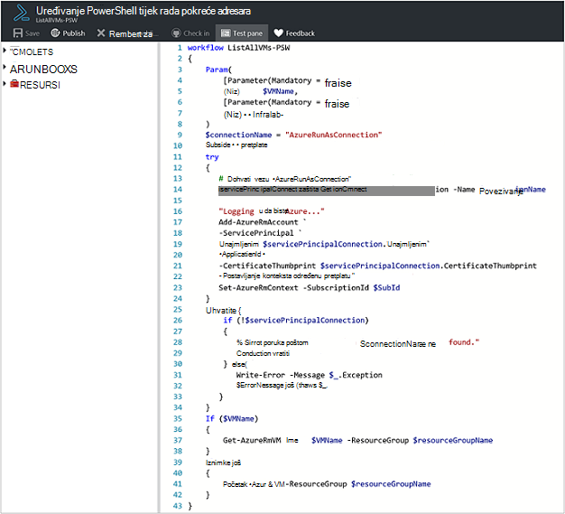
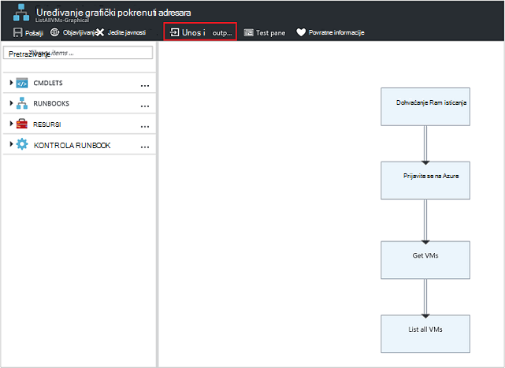
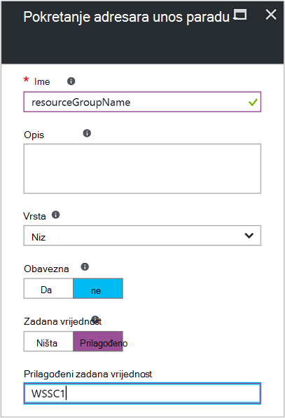
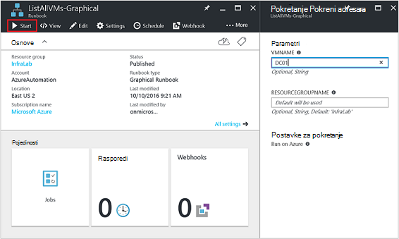
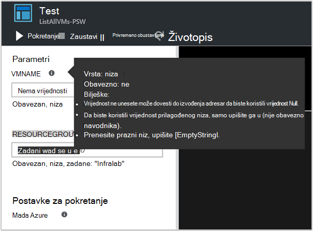
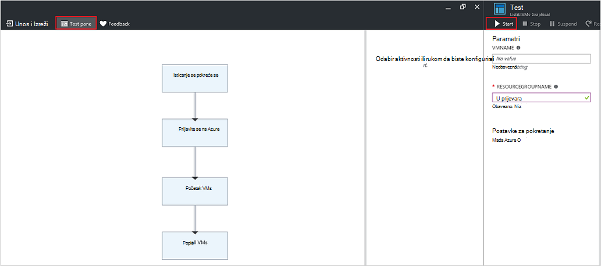
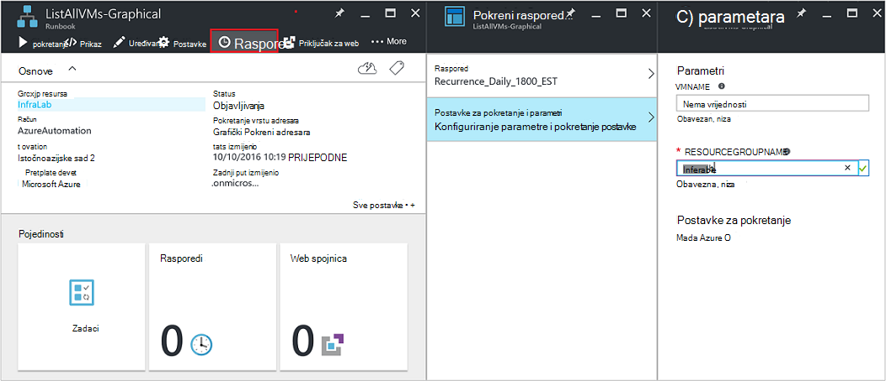
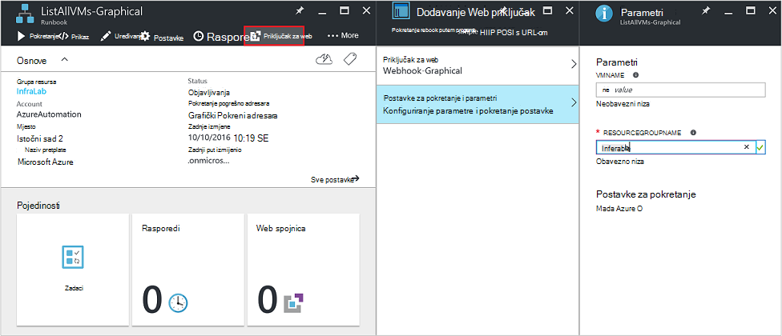
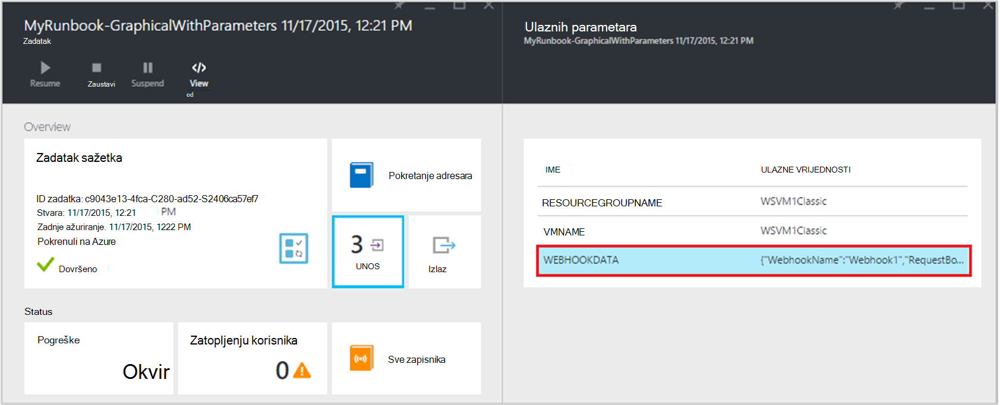

<properties
   pageTitle="Runbook ulazne parametre | Microsoft Azure"
   description="Runbook ulaznih parametara povećati fleksibilnost runbooks omogućujući vam za prosljeđivanje podataka u runbook prilikom pokretanja. U ovom se članku opisuju različitim scenarijima kojima se koriste ulaznih parametara u runbooks."
   services="automation"
   documentationCenter=""
   authors="MGoedtel"
   manager="jwhit"
   editor="tysonn" />
<tags
   ms.service="automation"
   ms.devlang="na"
   ms.topic="article"
   ms.tgt_pltfrm="na"
   ms.workload="infrastructure-services"
   ms.date="10/11/2016"
   ms.author="sngun"/>

# <a name="runbook-input-parameters"></a>Runbook ulaznih parametara

Runbook ulaznih parametara povećati fleksibilnost runbooks omogućujući vam za prosljeđivanje podataka je prilikom pokretanja. Parametri omogućuju runbook akcije koje će biti namijenjeno za nekim konkretnim scenarijima i okruženja. U ovom se članku smo će vas voditi kroz različitim scenarijima kojima se koriste ulaznih parametara u runbooks.

## <a name="configure-input-parameters"></a>Konfiguriranje ulaznih parametara

PowerShell, PowerShell tijeka rada i grafički runbooks moguće je konfigurirati ulazne parametre. Na runbook može imati više parametara s različitim vrstama podataka ili bez parametara uopće. Ulaznih parametara može biti obavezno ili nije obavezno, a možete dodijeliti zadanu vrijednost za neobavezni parametri. Vrijednosti možete dodijeliti ulaznih parametara za na runbook prilikom pokretanja kroz jedan od dostupnih načina. Ove metode obuhvaćaju počevši s runbook s portala sustava ili web-servisa. Možete započeti i jedan kao podređeni runbook koji se poziva izravno u drugom runbook.

## <a name="configure-input-parameters-in-powershell-and-powershell-workflow-runbooks"></a>Konfiguriranje ulaznih parametara u runbooks PowerShell i PowerShell tijeka rada

Podrška za ulazne parametre koji su definirani pomoću sljedećih atributa PowerShell i [runbooks PowerShell tijeka rada](automation-first-runbook-textual.md) u automatizaciji Azure.  

| **Svojstvo** | **Opis** |
|:--- |:---|
| Vrsta | Obavezan. Vrsta podataka očekivani za vrijednost parametra. Bilo koju vrstu .NET nije valjan. |
| Ime | Obavezan. Naziv parametra. To mora biti jedinstveno unutar runbook, i mogu sadržavati samo slova, brojevi ili podvučene znakove. Morate pokrenuti slovom. |
| Obavezna | Neobavezno. Određuje je li vrijednost mora se navesti za parametar. Ako to postavljena na **$true**, zatim vrijednost mora se navesti kada se pokrene u runbook. Ako to postavljena na **$false**, pa vrijednosti nisu obavezni. |
| Zadana vrijednost | Neobavezno.  Određuje vrijednost koja će se koristiti za parametar ako vrijednost nije prošao u kada se pokrene u runbook. Zadana vrijednost može se postaviti za sve parametre i će automatski stvori parametar neobavezno bez obzira na postavku obavezno. |

Komponente Windows PowerShell podržava više atributa ulaznih parametara od one navedene ovdje, kao što je provjera valjanosti, pseudonima, a parametar postavlja. Međutim, automatizacija Azure trenutno podržava samo ulaznih parametara naveden.

Definicija parametara u runbooks PowerShell tijeka rada ima sljedeće Opći oblik, gdje se više parametara odvojenih točkama sa zarezom.

   ```
     Param
     (
         [Parameter (Mandatory= $true/$false)]
         [Type] Name1 = <Default value>,

         [Parameter (Mandatory= $true/$false)]
         [Type] Name2 = <Default value>
     )
   ```

>[AZURE.NOTE] Kad definirate parametre, ako ne navedete **obavezan** atribut, zatim po zadanom parametar se smatra nije obavezno. Osim toga, ako ste postavili zadanu vrijednost za parametar u runbooks PowerShell tijeka rada, ga će se smatrati po PowerShell neobavezan parametar, bez obzira na to **je obavezan** atribut vrijednost.

Na primjer, saznajmo konfigurirati ulaznih parametara za runbook PowerShell tijeka rada koji proizvodi detalje o virtualnim strojevima jedan VM ili sve VMs u grupu resursa. Ovaj runbook sadrži dva parametra kao što je prikazano u sljedećim snimku zaslona: naziv virtualnog računala i naziva grupa resursa.



U taj parametar definiranje parametara **$VMName** i **$resourceGroupName** su jednostavni parametara vrste niz. No PowerShell i tijek rada PowerShell runbooks podržavaju sve vrste jednostavnih i složenih vrste, kao što je **objekt** ili **PSCredential** za ulazne parametre.

Ako je vaš runbook ulazni parametar vrsta objekta, zatim pomoću komponente PowerShell hashtable naziva (vrijednost) parove prenesite vrijednost. Na primjer, ako sadrži sljedeći parametar na runbook:

     [Parameter (Mandatory = $true)]
     [object] $FullName

Zatim možete proslijediti sljedeću vrijednost za parametar:

    @{"FirstName"="Joe";"MiddleName"="Bob";"LastName"="Smith"}


## <a name="configure-input-parameters-in-graphical-runbooks"></a>Konfiguriranje ulaznih parametara u grafički runbooks

Da biste [konfigurirali grafički runbook](automation-first-runbook-graphical.md) ulazne parametre, stvaranje grafički runbook koji proizvodi detalje o virtualnim strojevima jedan VM ili sve VMs u grupu resursa. Konfiguriranje programa runbook sastoji se od dva glavna aktivnosti, prema uputama u nastavku.

[**Autentičnost Runbooks s računom za Azure Pokreni kao**](automation-sec-configure-azure-runas-account.md) za provjeru s Azure.

[**Get-AzureRmVm**](https://msdn.microsoft.com/library/mt603718.aspx) da biste dobili svojstva virtualnih računala.

Aktivnost [**Pisanje izlaz**](https://technet.microsoft.com/library/hh849921.aspx) za izlaz imena virtualnih računala. Aktivnosti **Get-AzureRmVm** prihvaća dva parametra, **naziv virtualnog računala** i **naziv grupe resursa**. Budući da parametara nije zahtijevaju različite vrijednosti svaki put kada pokrenete u runbook, možete dodati ulaznih parametara vaše runbook. Evo nekoliko koraka da biste dodali ulaznih parametara:

1. Odaberite grafički runbook plohu **Runbooks** , a zatim kliknite [**Uređivanje**](automation-graphical-authoring-intro.md) ga.

2. Uređivač runbook kliknite **Ulazni i izlazni** da biste otvorili plohu **Ulazni i izlazni** .

    

3. **Ulazni i izlazni** plohu prikazuje popis ulaznih parametara koji su definirani za na runbook. Na ovom plohu možete dodati nove ulazni parametar ili uređivanje konfiguracije postojeće ulazni parametar. Da biste dodali novi parametar u runbook, kliknite **Dodaj unos** da biste otvorili plohu **Runbook ulazni parametar** . Postoji, možete konfigurirati sljedećih parametara:

  	| **Svojstvo** | **Opis** |
  	|:--- |:---|
  	| Ime | Obavezan.  Naziv parametra. To mora biti jedinstveno unutar runbook, i mogu sadržavati samo slova, brojevi ili podvučene znakove. Morate pokrenuti slovom. |
  	| Opis | Neobavezno. Opis o Svrha ulazni parametar. |
  	| Vrsta | Neobavezno. Vrsta podataka koji se očekuje za vrijednost parametra. Vrste podržanih parametra su **niz**, **Int32**, **Int64**, **decimalni**, **Booleova**, **DateTime**i **objekt**. Ako vrsta podataka nije odabrana, po zadanom je odabrana **niz**. |
  	| Obavezna | Neobavezno. Određuje je li vrijednost mora se navesti za parametar. Ako odaberete **da**, zatim vrijednost mora se navesti kada se pokrene u runbook. Ako odaberete **nema**, zatim vrijednost nije potrebna kada se pokrene u runbook i Zadana vrijednost je možda postavio. |
  	| Zadana vrijednost | Neobavezno. Određuje vrijednost koja će se koristiti za parametar ako vrijednost nije prošao u kada se pokrene u runbook. Zadana vrijednost može se postaviti za parametar koji nije obavezno. Da biste postavili zadanu vrijednost, odaberite **Prilagođeno**. Ta se vrijednost koristi osim u slučaju kada se pokrene u runbook navedeni su druge vrijednosti. Odaberite **nema** ako želite unijeti bilo koju zadanu vrijednost. |  

    

4. Stvorite dva parametra s sljedeća svojstva koja će se koristiti tako da aktivnosti **Get-AzureRmVm** :

    - **Parametar1:**
      - Naziv - VMName
      - Vrsta - niza
      - Obavezno - bez

    - **Parametar2:**
      - Naziv - resourceGroupName
      - Vrsta - niza
      - Obavezno - bez
      - Zadana vrijednost - Prilagođeno
      - Prilagođeni zadana vrijednost - \<naziv grupe resursa koji sadrži virtualnim strojevima >

5. Kada dodate parametre, kliknite **u redu**.  Ih sada možete vidjeti na **Ulazni i izlazni plohu**. Ponovno kliknite **u redu** , a zatim kliknite **Spremi** i **Objavi** na runbook.

## <a name="assign-values-to-input-parameters-in-runbooks"></a>Dodjeljivanje vrijednosti parametara u runbooks za unos

Možete proslijediti vrijednosti parametara u runbooks u sljedećim scenarijima za unos.

### <a name="start-a-runbook-and-assign-parameters"></a>Pokretanje programa runbook i dodijeliti parametara

Na runbook može se pokrenuti mnogo različitih načina: putem Azure portalu s na webhook, pomoću cmdleta ljuske PowerShell, s REST API-JA ili SDK-a. U nastavku ćemo razmotriti različite načine za početak na runbook i dodjela parametara.

#### <a name="start-a-published-runbook-by-using-the-azure-portal-and-assign-parameters"></a>Pokrenite objavljene runbook pomoću portala za Azure i dodijelite parametara

Kada [počnite s runbook](automation-starting-a-runbook.md#starting-a-runbook-with-the-azure-portal), **Pokrenite Runbook** plohu otvorit će se i možete konfigurirati vrijednosti za parametre koje ste upravo stvorili.



U natpisu ispod okvir za unos, vidjet ćete atributa koji ste postavili za parametar. Atributi obuhvaćaju obavezno ili obavezan, vrsta i Zadana vrijednost. U oblačiću za pomoć uz naziv parametra možete vidjeti ključne informacije koje morate donositi odluke o unos vrijednosti parametra. Ti podaci obuhvaćaju parametar je li obavezno ili nije obavezno. Uključuje i vrstu i Zadana vrijednost (ako ih ima) i druge korisne bilješke.



>[AZURE.NOTE] Parametri vrsta niza podržava **prazne** vrijednosti niza.  Unos **[EmptyString]** u okvir ulazni parametar prenesite će prazni niz parametar. Osim toga, parametrima vrsta niza ne podržavaju vrijednosti **Null** predugački. Ako ne prođete bilo koja vrijednost za parametar niza, zatim PowerShell će prevesti kao null.

#### <a name="start-a-published-runbook-by-using-powershell-cmdlets-and-assign-parameters"></a>Pokrenite objavljene runbook pomoću cmdleta ljuske PowerShell i dodijelite parametara

  - **Voditelj resursa azure Cmdlete:** Možete početi programa automatizacije runbook koja je stvorena u grupu resursa pomoću [Start AzureRmAutomationRunbook](https://msdn.microsoft.com/library/mt603661.aspx).

    **Primjer:**

   ```
    $params = @{“VMName”=”WSVMClassic”;”resourceGroupeName”=”WSVMClassicSG”}
 
    Start-AzureRmAutomationRunbook -AutomationAccountName “TestAutomation” -Name “Get-AzureVMGraphical” –ResourceGroupName $resourceGroupName -Parameters $params
   ```

  - **Cmdleti za upravljanje servisom azure:** Možete početi programa automatizacije runbook koja je stvorena u zadanu grupu resursa pomoću [Start AzureAutomationRunbook](https://msdn.microsoft.com/library/dn690259.aspx).

    **Primjer:**

   ```
    $params = @{“VMName”=”WSVMClassic”; ”ServiceName”=”WSVMClassicSG”}

    Start-AzureAutomationRunbook -AutomationAccountName “TestAutomation” -Name “Get-AzureVMGraphical” -Parameters $params
   ```

>[AZURE.NOTE] Prilikom pokretanja programa runbook pomoću cmdleta ljuske PowerShell, zadani parametar, **MicrosoftApplicationManagementStartedBy** se stvara s vrijednošću **PowerShell**. Ovaj parametar možete prikazati u plohu **posao pojedinosti** .  

#### <a name="start-a-runbook-by-using-an-sdk-and-assign-parameters"></a>Pokretanje programa runbook pomoću programa SDK i dodijelite parametara

  - **Voditelj resursa azure metoda:** Možete započeti s runbook pomoću SDK programski jezik. U nastavku je C# kod uzastopna za pokretanje programa runbook na vašem računu za automatizaciju. Možete pogledati sve kodove naše [GitHub spremište](https://github.com/Azure/azure-sdk-for-net/blob/master/src/ResourceManagement/Automation/Automation.Tests/TestSupport/AutomationTestBase.cs).  

   ```
     public Job StartRunbook(string runbookName, IDictionary<string, string> parameters = null)
        {
          var response = AutomationClient.Jobs.Create(resourceGroupName, automationAccount, new JobCreateParameters
           {
              Properties = new JobCreateProperties
               {
                  Runbook = new RunbookAssociationProperty
                   {
                     Name = runbookName
                   },
                     Parameters = parameters
               }
           });
        return response.Job;
        }
   ```

  - **Upravljanje servisom azure metoda:** Možete započeti s runbook pomoću SDK programski jezik. U nastavku je C# kod uzastopna za pokretanje programa runbook na vašem računu za automatizaciju. Možete pogledati sve kodove naše [GitHub spremište](https://github.com/Azure/azure-sdk-for-net/blob/master/src/ServiceManagement/Automation/Automation.Tests/TestSupport/AutomationTestBase.cs).

   ```      
    public Job StartRunbook(string runbookName, IDictionary<string, string> parameters = null)
      {
        var response = AutomationClient.Jobs.Create(automationAccount, new JobCreateParameters
      {
        Properties = new JobCreateProperties
           {
             Runbook = new RunbookAssociationProperty
           {
             Name = runbookName
                },
                  Parameters = parameters
                }
         });
        return response.Job;
      }
   ```

  Da biste pokrenuli ovaj postupak, stvaranje rječnika za pohranu parametara runbook, **VMName** i **resourceGroupName**i njihove vrijednosti. Počnite s runbook. U nastavku je C# koda za pozivanje način na koji je definiran iznad.

   ```
    IDictionary<string, string> RunbookParameters = new Dictionary<string, string>();

    // Add parameters to the dictionary.
    RunbookParameters.Add("VMName", "WSVMClassic");
    RunbookParameters.Add("resourceGroupName", "WSSC1");

    //Call the StartRunbook method with parameters
    StartRunbook(“Get-AzureVMGraphical”, RunbookParameters);
   ```

#### <a name="start-a-runbook-by-using-the-rest-api-and-assign-parameters"></a>Pokretanje programa runbook pomoću REST API-JA i dodijelite parametara

Runbook posao možete stvoriti i rada s Azure Automatizacija REST API-JA pomoću metode amortizacije **STAVITI** sa zahtjevom za sljedeće URI.

    https://management.core.windows.net/<subscription-id>/cloudServices/<cloud-service-name>/resources/automation/~/automationAccounts/<automation-account-name>/jobs/<job-id>?api-version=2014-12-08`

U zahtjevu za URI zamijenite sljedećih parametara:

  - **id pretplate:** Svoj ID Azure pretplate.  
  - **oblaka naziv-usluge:** Naziv servisa u oblaku koji moraju se poslati zahtjev.  
  - **Automatizacija naziv-računa:** Naziv računa za automatizaciju koji je smještena u navedenom oblaku.  
  - **id zadatka:** GUID za posao. GUID u ljusci PowerShell moguće stvoriti pomoću **[GUID]::NewGuid(). ToString()** naredba.

Da bi se Prosljeđivanje parametara runbook zadatak, koristite tijelu zahtjeva. Traje sljedeća dva svojstva u JSON OSNOVNI oblik:

  - **Runbook naziv:** Obavezan. Naziv kompilacije za posao da biste pokrenuli.  
  - **Runbook parametara:** Neobavezno. Rječnik popis parametara u (naziv vrijednosti) oblikovanje gdje mora biti niz i vrijednost može biti bilo koji valjani JSON.

Ako želite da biste pokrenuli runbook **Get-AzureVMTextual** koji je stvoren ranije **VMName** i **resourceGroupName** kao parametar, koristite sljedeće JSON OSNOVNI oblik za tijelo zahtjev.

   ```
    {
      "properties":{
        "runbook":{
        "name":"Get-AzureVMTextual"},
      "parameters":{
         "VMName":"WSVMClassic",
         "resourceGroupName":”WSCS1”}
        }
    }
   ```

Ako je zadatak uspješno stvorili, vraća se Šifra stanja HTTP 201. Dodatne informacije o odgovor zaglavlja i tijela odgovor potražite u članku o [Stvaranje runbook posla pomoću REST API-JA.](https://msdn.microsoft.com/library/azure/mt163849.aspx)

### <a name="test-a-runbook-and-assign-parameters"></a>Testiranje programa runbook i dodijelite parametara

Kada [testiranje verzija skice vaše kompilacije](automation-testing-runbook.md) pomoću mogućnosti test, plohu **testiranje** otvorit će se i možete konfigurirati vrijednosti za parametre koje ste upravo stvorili.



### <a name="link-a-schedule-to-a-runbook-and-assign-parameters"></a>Raspored povezati s runbook i dodijelite parametara

[Vezu raspored](automation-schedules.md) vaše runbook ga tako da se pokreće na runbook u određeno vrijeme. Kada stvorite raspored, a na runbook koristite ove vrijednosti kad je pokrenuo raspored dodjeljujete ulaznih parametara. Raspored nije moguće spremiti dok su navedene sve vrijednosti parametra obavezno.



### <a name="create-a-webhook-for-a-runbook-and-assign-parameters"></a>Stvaranje webhook za na runbook i dodjela parametara

Možete stvoriti [webhook](automation-webhooks.md) za svoje runbook i konfiguriranje runbook ulazne parametre. Nije moguće spremiti u webhook dok su navedene sve vrijednosti parametra obavezno.



Kada izvršiti na runbook pomoću webhook unaprijed definirane ulazni parametar **[Webhookdata](automation-webhooks.md#details-of-a-webhook)** je poslan, i ulazne parametre koje ste definirali. Možete kliknuti da biste proširili parametar **WebhookData** više pojedinosti.




## <a name="next-steps"></a>Daljnji koraci

- Dodatne informacije o runbook ulazni i izlazni potražite u članku [Azure Automatizacija: runbook ulazne, izlazne i ugniježđene runbooks](https://azure.microsoft.com/blog/azure-automation-runbook-input-output-and-nested-runbooks/).
- Detalje o različitim načinima da biste započeli s runbook potražite u članku [počevši s runbook](automation-starting-a-runbook.md).
- Da biste uredili tekstnih runbook, pogledajte [Uređivanje tekstnih runbooks](automation-edit-textual-runbook.md).
- Da biste uredili grafički runbook, pogledajte [Graphical vremenu u Azure automatizaciju](automation-graphical-authoring-intro.md).
