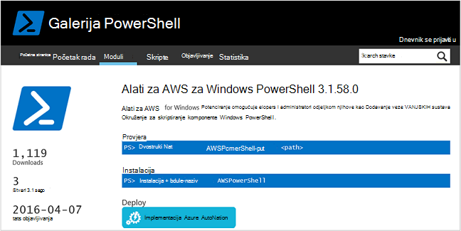
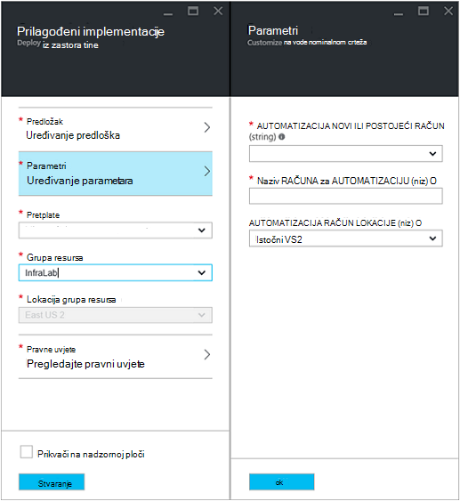
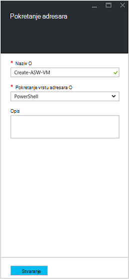
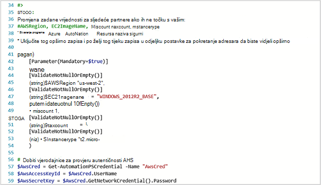
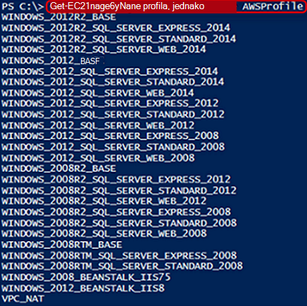
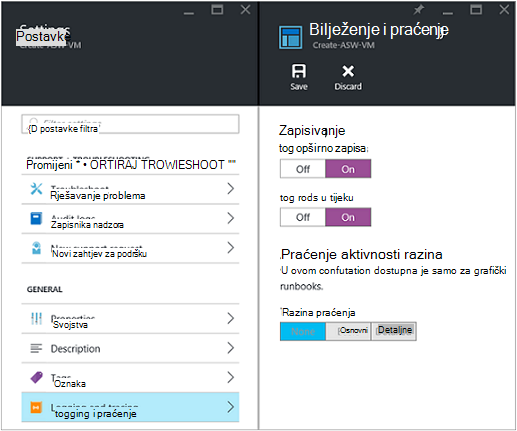
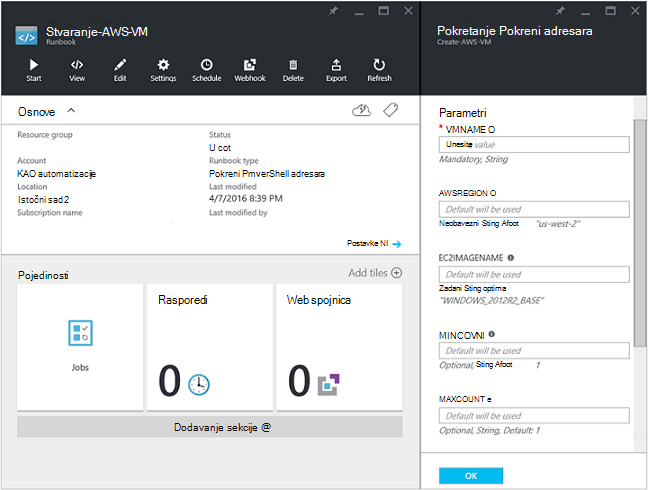
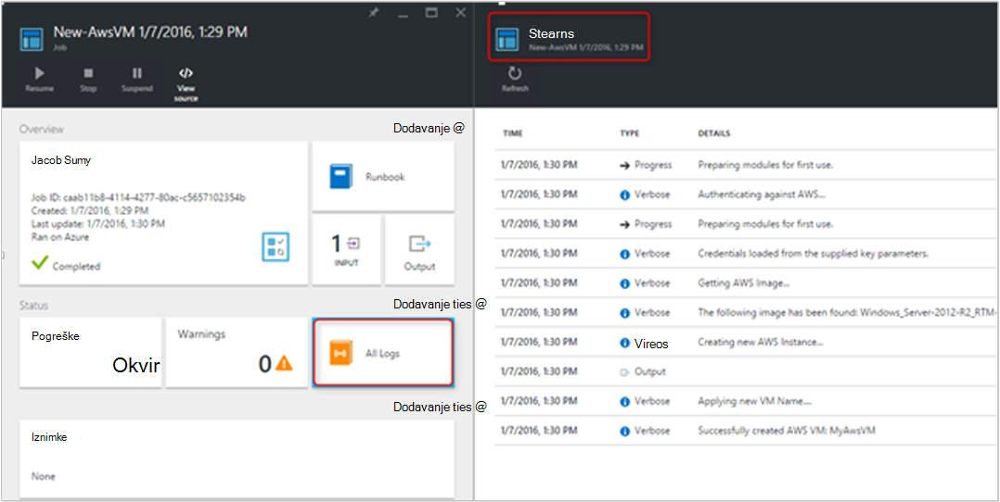
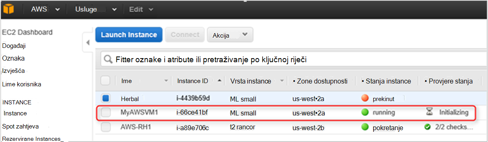

<properties
   pageTitle="Automatizacija implementacije VM Amazon Web Services | Microsoft Azure"
   description="U ovom se članku pokazuje kako koristiti automatizaciju Azure da biste automatizirali stvaranje programa VM servisa za Amazon Web"
   services="automation"
   documentationCenter=""
   authors="mgoedtel"
   manager="jwhit"
   editor="" />
<tags
   ms.service="automation"
   ms.devlang="na"
   ms.topic="article"
   ms.tgt_pltfrm="na"
   ms.workload="na"
   ms.date="08/17/2016"
   ms.author="tiandert; bwren" />

# <a name="azure-automation-scenario---provision-an-aws-virtual-machine"></a>Automatizacija scenarij Azure - dodjele resursa za AWS virtualnog računala 

U ovom se članku smo pokazuje na koji način možete koristiti automatizaciju Azure Dodjela virtualnog računala u vašoj pretplati servisa Amazon Web (AWS) i naziv tog VM određene – koji AWS upućuje na kao "Označavanje" na VM.

## <a name="prerequisites"></a>Preduvjeti

Za potrebe ovog članka, morate imati račun za Azure Automatizacija i pretplate na AWS. Dodatne informacije o postavljanju račun za Azure Automatizacija i konfiguriranju pomoću vjerodajnica za pretplatu AWS pregledajte [Konfiguriranje provjere autentičnosti s web-servisa Amazon](../automation/automation-sec-configure-aws-account.md).  Taj račun trebali biste stvoriti ili ažurirati vjerodajnice za pretplatu AWS prije nastavka, kao što smo pozivati tog računa u koracima u nastavku.


## <a name="deploy-amazon-web-services-powershell-module"></a>Implementacija modul ljuske PowerShell za Amazon Web Services

Naš VM dodjele resursa runbook će pod utjecajem na AWS modul ljuske PowerShell za rad. Izvršite sljedeće korake da biste dodali modul na račun za automatizaciju koji je konfiguriran za korištenje vjerodajnice AWS pretplate.  

1. Otvorite web-preglednik i idite u [Galeriji PowerShell](http://www.powershellgallery.com/packages/AWSPowerShell/) i kliknite **uvođenja gumbu Azure automatizaciju**.<br> 

2. Prijeći ćete na stranicu za Azure prijavu, a nakon provjere autentičnosti, koji će se usmjeriti na Azure Portal i daju se sljedeće plohu.<br> 

3. Odaberite grupu resursa s padajućeg popisa **Grupa resursa** , a zatim na plohu parametara navedite sljedeće podatke:
   * Na padajućem popisu **novi ili postojeći račun za automatizaciju (niz)** odaberite **postojeći**.  
   * U okvir **Naziv računa za automatizaciju (niz)** unesite točan naziv računa Automatizacija koja obuhvaća vjerodajnice za vašu pretplatu AWS.  Na primjer, ako ste stvorili namjenski račun pod nazivom **AWSAutomation**, zatim je upišite u okvir.
   * Odaberite odgovarajuću regiju s padajućeg popisa **Mjesto računa za automatizaciju** .

4. Kada dovršite unos potrebne podatke, kliknite **Stvori**.

    >[AZURE.NOTE]Dok modul ljuske PowerShell za uvoz u Azure Automatizacija, ga i izdvaja s cmdletima i te aktivnosti prikazat će se dok se ne modul potpuno dovrši uvoz i s cmdletima za izdvajanje. Taj postupak može potrajati nekoliko minuta.  
<br>
5. Na portalu za Azure otvorite račun automatizaciju naveden u koraku 3.
6. Kliknite pločicu **Resursi** i plohu **Resursi** , odaberite pločicu **module** .
7. Na plohu **moduli** vidjet ćete modul **AWSPowerShell** na popisu.

## <a name="create-aws-deploy-vm-runbook"></a>Stvaranje AWS implementacija VM runbook

Kada je postavila modul ljuske PowerShell AWS ćemo možete odmah autor runbook da biste automatizirali dodjeljivanje virtualnog računala u AWS pomoću skriptu PowerShell. Koraci u nastavku će Demonstracija odražava nativni skriptu PowerShell u automatizaciji Azure.  

>[AZURE.NOTE] Dodatne mogućnosti i informacije vezane uz tu skriptu, posjetite [PowerShell galerije](https://www.powershellgallery.com/packages/New-AwsVM/DisplayScript).


1. Preuzimanje skriptu PowerShell novo AwsVM iz galerije PowerShell otvaranjem sesije PowerShell i upisivanjem sljedeće:<br>
   ```
   Save-Script -Name New-AwsVM -Path \<path\>
   ```
<br>
2. Na portalu Azure otvorili račun za automatizaciju, a zatim kliknite pločicu **Runbooks** .  
3. Odaberite **Dodaj u runbook**plohu **Runbooks** .
4. Na plohu **Dodaj na runbook** odaberite **Brzo stvaranje** (Stvaranje novog runbook).
5. Na svojstva plohu **Runbook** upišite naziv u okvir naziv za svoje runbook i iz **Vrsta Runbook** padajućeg popisa odaberite **PowerShell**, a zatim kliknite **Stvori**.<br> 
6. Kada se pojavi plohu Runbook ljuske PowerShell za uređivanje, kopirajte i zalijepite skriptu PowerShell u runbook authoring područje crtanja.<br> <br>

    >[AZURE.NOTE] Uzmite u obzir sljedeće prilikom rada s primjer skriptu PowerShell:
    >
    > - Na runbook sadrži broj zadanih vrijednosti parametra. Ocjenjivanje svih zadanih vrijednosti i ažuriranje prema potrebi.
    > - Ako kao pod nazivom drugačije **AWScred**sredstva vjerodajnica koje ste pohranili AWS vjerodajnice, morat ćete ažurirati skripte retku 57 tako da odgovara sukladno tome.  
    > - Prilikom rada s naredbama AWS EŽA u ljusci PowerShell, osobito s runbook u ovom primjeru morate navesti AWS regija. U suprotnom neće uspjeti s cmdletima.  Pogledajte temu AWS [Odredite AWS regija](http://docs.aws.amazon.com/powershell/latest/userguide/pstools-installing-specifying-region.html) u alatima za AWS za dokument PowerShell dodatne detalje.  
<br>
7. Da biste dohvatili popis naziva slike iz pretplate AWS, pokrenite Očisti filtar i uvoz modul ljuske PowerShell AWS.  Provjeru autentičnosti AWS zamjenjujući **Get-AutomationPSCredential** u svom okruženju filtar s **AWScred = Get-vjerodajnica**.  To će vas tražiti vjerodajnice i **Pristup ključ ID** za korisničko ime i **Tajna tipkovni prečac** možete unijeti lozinku.  Pogledajte primjer u nastavku:

        #Sample to get the AWS VM available images
        #Please provide the path where you have downloaded the AWS PowerShell module
        Import-Module AWSPowerShell
        $AwsRegion = "us-west-2"
        $AwsCred = Get-Credential
        $AwsAccessKeyId = $AwsCred.UserName
        $AwsSecretKey = $AwsCred.GetNetworkCredential().Password

        # Set up the environment to access AWS
        Set-AwsCredentials -AccessKey $AwsAccessKeyId -SecretKey $AwsSecretKey -StoreAs AWSProfile
        Set-DefaultAWSRegion -Region $AwsRegion

        Get-EC2ImageByName -ProfileName AWSProfile
   Vraća se sljedeći rezultat:<br>
     
8. Kopiranje i lijepljenje jedan nazivi slika u varijable za automatizaciju kao referentni u runbook kao **$InstanceType**. Budući da u ovom primjeru smo pomoću besplatnog AWS tiered pretplate, ćemo koristiti **t2.micro** za našeg primjera runbook.
9. Spremanje na runbook, a zatim kliknite **Objavi** da biste objavili na runbook, a zatim **da** kada se to od vas zatraži.


### <a name="testing-the-aws-vm-runbook"></a>Testiranje runbook AWS VM
Prije nego što se ne možemo nastaviti s testiranjem na runbook, potrebna je provjeriti nekoliko stvari. Konkretno:

   -  Sredstva za provjeru autentičnosti na temelju AWS stvorena pod nazivom **AWScred** ili skriptu ažurirana referentni naziv vaše sredstvo vjerodajnicama.  
   -  Modul ljuske PowerShell AWS uvezena Automatizacija Azure
   -  Stvoren je novi runbook i vrijednosti parametara provjeriti, a ažuriraju prema potrebi
   -  **Zapisnik opširno** i po želji **zapisnika tijeku zapisa** u odjeljku runbook postavljanje **bilježenje i praćenje** postavljene da biste **na**.<br> 

1. Želimo pokrenuti na runbook, pa kliknite **Start** , a zatim kliknite **u redu** kad se otvori plohu Start Runbook.
2. Na plohu pokretanje Runbook pružaju **VMname**.  Prihvatite zadane vrijednosti za ćete parametre koje ste prethodno konfigurirali u skripti neke starije verzije.  Kliknite **u redu** da biste pokrenuli runbook posao.<br> 
3. Okno zadatka otvara se runbook zadatka koji smo upravo stvorili. Zatvorite ovog okna.
4. Ne možemo možete pregledati tijek zadatka i prikaz izlaz **strujanja** tako da odaberete pločicu **Sve zapisnike** posao plohu runbook.<br> 
5. Da biste potvrdili na VM dodjeljuju se Resursi, prijavite se u konzolu za upravljanje AWS Ako trenutačno niste prijavljeni.<br> 

## <a name="next-steps"></a>Daljnji koraci
-   Početak rada s grafički runbooks, potražite u članku [Moj prvi grafički runbook](automation-first-runbook-graphical.md)
-   Početak rada s runbooks PowerShell tijeka rada, u odjeljku [Moje prvi runbook PowerShell tijeka rada](automation-first-runbook-textual.md)
-   Saznajte više o vrstama runbook, njihove prednosti i ograničenja, potražite u članku [vrste runbook Automatizacija Azure](automation-runbook-types.md)
-   Dodatne informacije o skriptu PowerShell podržava značajku, pročitajte članak [nativni skriptu komponente PowerShell podržava u automatizaciji Azure](https://azure.microsoft.com/blog/announcing-powershell-script-support-azure-automation-2/)
