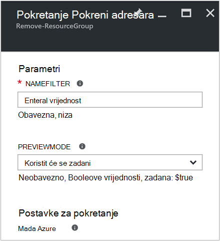
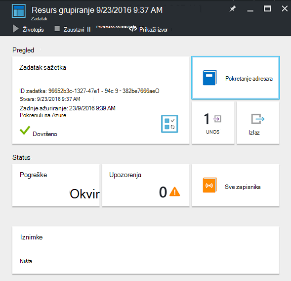
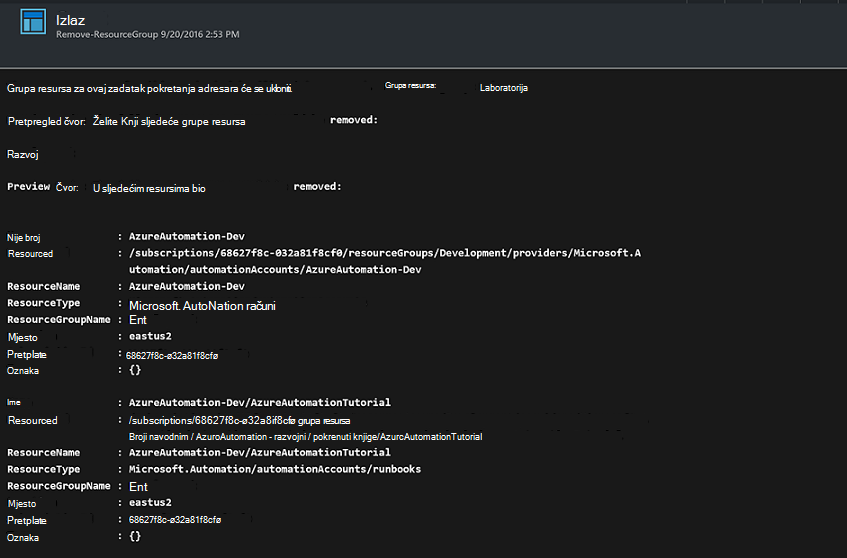

<properties
    pageTitle="Automatiziranje uklanjanje grupa resursa | Microsoft Azure"
    description="Tijek rada PowerShell verzija programa automatizacije Azure scenarija uključujući runbooks da biste uklonili sve grupe resursa u svoju pretplatu."
    services="automation"
    documentationCenter=""
    authors="MGoedtel"
    manager="jwhit"
    editor=""
    />
<tags
    ms.service="automation"
    ms.workload="tbd"
    ms.tgt_pltfrm="na"
    ms.devlang="na"
    ms.topic="get-started-article"
    ms.date="09/26/2016"
    ms.author="magoedte"/>

# Scenarij Azure Automatizacija - automatizirati uklanjanje grupa resursa

Više klijenata stvoriti više od jedne grupe resursa. Neke može koristiti za upravljanje aplikacijama radnog, a drugi mogu koristiti kao razvoj, testiranje i pripremnih okruženja. Automatizacija implementaciju ove resurse je jedna stvar, ali moći isključiti grupu resursa klikom na gumb drugi. Uobičajeni upravljanje zadatak možete pojednostavniti pomoću automatizacije Azure. Ovo je korisno ako se radi o Azure pretplatu koja ima kupujete ograničenje kroz članu ponude kao što su MSDN ili programa Microsoft Partner mreže Cloud Essentials.

Ovaj scenarij temelji se na PowerShell runbook i osmišljene su da biste uklonili jednu ili više grupa resursa koji navedete iz pretplate. Zadana postavka u kompilacije je da biste testirali prije nastavka. Time se osigurava da ne slučajno izbrišete grupu resursa prije nego što ste spremni da biste dovršili postupak.   

## Početak scenarija

Ovaj scenarij sastoji se kompilacije PowerShell koju možete preuzeti iz [Galerije PowerShell](https://www.powershellgallery.com/packages/Remove-ResourceGroup/1.0/DisplayScript). Možete uvesti i ga izravno iz [Galerije Runbook](automation-runbook-gallery.md) na portalu za Azure.  

Runbook | Opis|
----------|------------|
Uklanjanje ResourceGroup | Uklanja jednu ili više grupa Azure resursa i pridružene resurse iz pretplate.  
 
Sljedeće ulaznih parametara definiranih za ovaj runbook:

Parametar | Opis|
----------|------------|
NameFilter (obavezno) | Određuje naziv filtra da biste ograničili grupa resursa koje namjeravate o brisanju. Možete proslijediti više vrijednosti pomoću popisa odvojenih zarezom. Filtar nije velika i mala slova i odgovarat će bilo koju grupu resursa koji sadrži niz.|
PreviewMode (neobavezno) | Izvršava runbook da biste vidjeli grupa resursa koje želite izbrisati, ali vodi ne poduzmete. Zadana je vrijednost **true** da biste izbjegli nenamjerno brisanje jednog ili više grupa resursa koji su preneseni na runbook.  

## Instaliranje i konfiguriranje scenarij

### Preduvjeti

U ovom runbook potvrđuje pomoću [računa za Azure Pokreni kao](automation-sec-configure-azure-runas-account.md).    

### Instalacija i objavljivanje u runbooks

Nakon što preuzmete na runbook, možete je uvesti pomoću postupka u [Uvoz runbook postupke](automation-creating-importing-runbook.md#importing-a-runbook-from-a-file-into-Azure-Automation). Objavljivanje na runbook kada je uspješno uvezena na račun za automatizaciju.

## Korištenje na runbook

Sljedeći koraci će vas voditi kroz izvršavanje ovaj runbook i pomoći vam upoznate s načina funkcioniranja tijeka rada. Koje će samo se testiranje na runbook u ovom primjeru ne izbrišete grupu resursa.  

1. Na portalu Azure otvorili račun za automatizaciju, a zatim kliknite **Runbooks**.
2. Odaberite **Ukloni ResourceGroup** runbook, a zatim kliknite **Start**.
3. Kada započnete s runbook, otvorit će se **Pokrenuti Runbook** plohu i parametre možete konfigurirati. Unesite imena grupa resursa u svoju pretplatu možete koristiti za testiranje i uzrokovat će bez nanošenje Ako slučajno izbrisali.  

    >[AZURE.NOTE] Provjerite je li **Previewmode** je postavljena na **true** pazite da ne izbrišete odabranih grupa resursa.  **Napomena** ova runbook ne uklanja grupu resursa koja sadrži račun za automatizaciju kome je ovaj runbook.  

4. Nakon što ste konfigurirali na parametar vrijednosti, kliknite **u redu**, a na runbook će se u redu čekanja za izvršavanje.  

Da biste pogledali detalje o runbook posla **Ukloni ResourceGroup** na portalu za Azure, odaberite **zadacima** u na runbook. Zadatak sažetka prikazuje ulazne parametre i strujanje Izlaz osim opće informacije o posla i željene došlo je do iznimke.  .

**Sažetak posla** sadrži poruke iz izlaza, upozorenja i strujanja pogreške. Odaberite **Izlazni** da biste pogledali detaljne rezultate iz izvođenja runbook.  

## Daljnji koraci

- Za početak stvaranja vlastitog runbook potražite u članku [Stvaranje ili uvoz runbook u automatizaciji Azure](automation-creating-importing-runbook.md).
- Početak rada s runbooks PowerShell tijeka rada, potražite u članku [Moj prvi runbook PowerShell tijeka rada](automation-first-runbook-textual.md).
