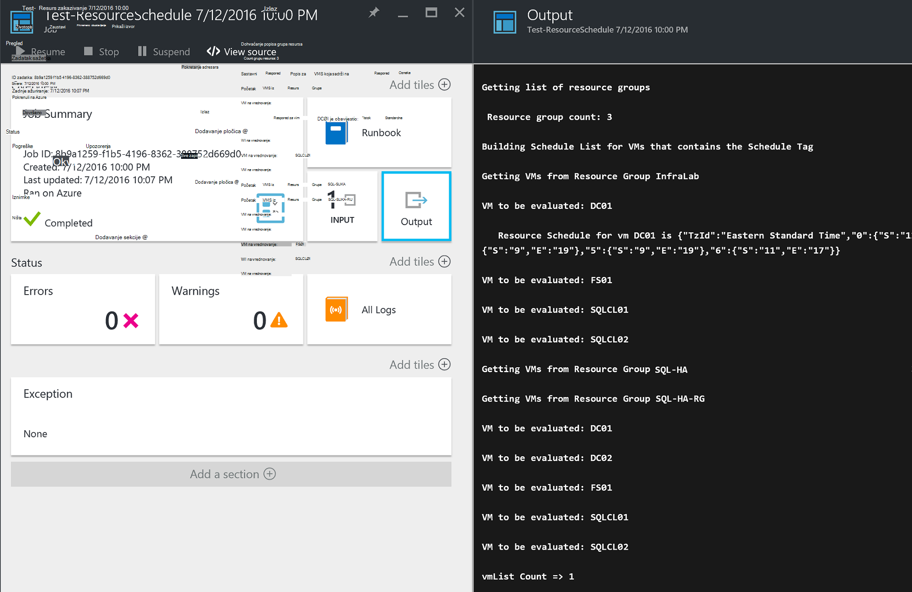

<properties
   pageTitle="Korištenje JSON oblikovan oznaka radi stvaranja rasporeda za Azure VM pokretanja i isključivanja | Microsoft Azure"
   description="U ovom se članku opisuje način za korištenje JSON nizovi na oznake da biste automatizirali zakazivanje VM pokretanja i isključivanja."
   services="automation"
   documentationCenter=""
   authors="MGoedtel"
   manager="jwhit"
   editor="tysonn" />
<tags
   ms.service="automation"
   ms.devlang="na"
   ms.topic="article"
   ms.tgt_pltfrm="na"
   ms.workload="infrastructure-services"
   ms.date="07/18/2016"
   ms.author="magoedte;paulomarquesc" />

# Scenarij Azure Automatizacija: korištenje JSON oblikovani oznaka radi stvaranja rasporeda za Azure VM pokretanja i isključivanja

Korisnici često želite zakazati pokretanja i isključivanja virtualnih računala da biste smanjili pretplatu troškovi ili podršku tvrtke i Tehnički preduvjeti.  

Sljedeći scenarij omogućuje postavljanje automatskog pokretanja i isključivanja vaše VMs pomoću oznaka naziva raspored na razini virtualnog računala u Azure ili razina grupe resursa. U ovom rasporedu možete konfigurirati od nedjelje do subote vrijeme pokretanje i zatvaranje vrijeme.  

Imamo neke mogućnosti Izlaz u-tvorničke. To obuhvaća:
-  [Postavlja skaliranje virtualnog računala](../virtual-machine-scale-sets/virtual-machine-scale-sets-overview.md) s postavkama automatsko skaliranje koje omogućuju vam da biste skalirali unutra ili prema van.
- Servis [DevTest Labs](../devtest-lab/devtest-lab-overview.md) koji ima ugrađenu mogućnost zakazivanja pokretanja i isključivanja operacije.

Međutim, tim mogućnostima podržavaju samo nekim konkretnim scenarijima i nije moguće primijeniti na VMs infrastrukture-kao-na-service (IaaS).   

Oznaka raspored primjenom u grupu resursa također se primjenjuje na sve virtualnim strojevima u toj grupi resursa. Ako je VM izravno Primijeni raspored, zadnjeg rasporeda ima prednost sljedećim redoslijedom:

1.  Raspored koji se primjenjuje na grupu resursa
2.  Raspored koji se primjenjuju na grupu resursa i virtualnog računala u grupu resursa
3.  Raspored koji se primjenjuje na virtualnog računala

Ovaj scenarij zapravo uzima niz JSON s navedenom obliku i dodaje je kao vrijednost za oznaku naziva raspored. Zatim na runbook sadrži popis svih grupa resursa i virtualnim strojevima i označava rasporede za svaki VM koji se temelji na scenarije navedene neke starije verzije. Zatim ga petlje kroz VMs koji imaju rasporede priložene i vrednuje kao što treba uzeti. Na primjer, određuje koji VMs morate zaustaviti, isključite, ili zanemariti.

Ove runbooks provjeru autentičnosti putem [računa za Azure Pokreni kao](../automation/automation-sec-configure-azure-runas-account.md).

## Preuzmite runbooks scenarija

Ovaj scenarij sastoji se od četiri runbooks tijeka rada PowerShell koju možete preuzeti iz [Galerije TechNet](https://gallery.technet.microsoft.com/Azure-Automation-Runbooks-84f0efc7) ili spremište [GitHub](https://github.com/paulomarquesdacosta/azure-automation-scheduled-shutdown-and-startup) za taj projekt.

Runbook | Opis
----------|----------
Test ResourceSchedule | Provjerava svaki raspored virtualnog računala i izvršava isključivanja ili pokretanja ovisno o rasporedu.
Dodavanje ResourceSchedule | Dodaje oznaku raspored grupe VM ili resurs.
Ažuriranje ResourceSchedule | Mijenja postojeću oznaku raspored jer ga zamjenjuje novi.
Uklanjanje ResourceSchedule | Uklanja oznaku raspored iz grupe VM ili resurs.

## Instaliranje i konfiguriranje scenarij

### Instalacija i objavljivanje u runbooks

Nakon preuzimanja sustava runbooks možete ih uvesti pomoću postupka u [Stvaranje ili uvoz runbook u automatizaciji Azure](automation-creating-importing-runbook.md#importing-a-runbook-from-a-file-into-Azure-Automation).  Objavite svaki runbook nakon što ga nije uspješno uvezena na račun za automatizaciju.

### Dodavanje raspored runbook Test ResourceSchedule

Slijedite ove korake da biste omogućili raspored za testiranje ResourceSchedule runbook. Ovo je runbook koji provjerava koje virtualnim strojevima treba pokrenuti, isključite, ili ulijevo kao što je.

1. Na portalu Azure otvorili račun za automatizaciju, a zatim pločicu **Runbooks** .
2. Na plohu **Test ResourceSchedule** kliknite pločicu **rasporeda** .
3. Na plohu **rasporede** , kliknite **Dodaj raspored**.
4. Na plohu **rasporede** odaberite **vezu raspored za vaše runbook**. Zatim odaberite **Stvori novi raspored**.
5.  Na plohu **Novi raspored** , upišite naziv raspored, na primjer: *HourlyExecution*.
6. Za **pokretanje**raspored, postavljanje vremena početka da biste koji predstavlja povećanje sat.
7. Odaberite **Ponavljanje**, a zatim za **svaki intervala ponavljanja**, odaberite **1 sat**.
8. Provjerite je li **Postavljanje isteka** postavljen na **ne**, a zatim kliknite **Stvori** da biste spremili novi raspored.
9. Na mogućnosti plohu **Runbook raspored** odaberite **parametara i postavke za pokretanje**. U plohu probno ResourceSchedule **parametara** unesite naziv pretplate u polju **SubscriptionName** .  To je jedini parametar nužnog za na runbook.  Kada završite, kliknite **u redu**.  

Kada se dovrši, raspored runbook trebao bi izgledati ovako:

 

## Oblikovanje niz JSON

Rješenje zapravo traje na JSON niza s navedenom obliku i dodaje je kao vrijednost za oznaku naziva raspored. Zatim na runbook sadrži popis svih grupa resursa i virtualnim strojevima i služi za identifikaciju rasporede za svaki virtualnog računala.

Na runbook petlje putem virtualnim strojevima koji imaju rasporede priložene i provjera akcije koje treba poduzeti. Slijedi primjer kako oblikovati rješenja:

    {
       "TzId": "Eastern Standard Time",
        "0": {  
           "S": "11",
           "E": "17"
        },
        "1": {
           "S": "9",
           "E": "19"
        },
        "2": {
           "S": "9",
           "E": "19"
        },
    }

Evo nekih detaljne informacije o toj strukturi:

1. Da biste zaobišli ograničenje 256 znakova oznaku vrijednosti u Azure optimiziran je oblik JSON strukture.

2. *TzId* predstavlja vremensku zonu virtualnog računala. Taj ID možete preuzeti pomoću klase TimeZoneInfo .NET u u sesiju ljuske PowerShell –**[System.TimeZoneInfo]:: GetSystemTimeZones()**.

    

    - S numeričku vrijednost nula šest prikazane su dane u tjednu. Vrijednost nula jednaka nedjelja.
    - Vrijeme početka predstavlja s atribut **S** , a njezina vrijednost je u 24-satnom obliku.
    - Vrijeme završetka ili isključivanje predstavlja s atribut **E** , a njezina vrijednost je u 24-satnom obliku.

    Ako **S** i **E** atribute svaki imaju vrijednost nula (0), virtualnog računala će ostati u stanje prezentacija u vrijeme izvođenja.   

3. Ako želite preskočiti procjenu za određeni dan u tjednu, ne dodajte section za taj dan u tjednu. U sljedećem primjeru procjenjuje samo ponedjeljak, a neki drugi dan u tjednu zanemaruju:

        {
          "TzId": "Eastern Standard Time",
           "1": {
             "S": "11",
             "E": "17"
           }
        }

## Grupa resursa oznake ili VMs

Da biste isključili VMs, morate označiti u VMs ili grupe resursa u kojem se nalazi. Virtualnim strojevima koji nemaju oznaku raspored se procjenjuju. Zbog toga ne pokreće ili isključiti.

Dva su načina grupa resursa oznake ili VMs s rješenja. To možete učiniti izravno na portalu. Ili možete koristiti ResourceSchedule za dodavanje, ažuriranje ResourceSchedule i uklanjanje ResourceSchedule runbooks.

### Označavanje putem portala sustava

Slijedite ove korake da biste označili virtualnog računala ili grupu resursa na portalu:

1. Stopi niz JSON pa provjerite je li još nisu razmake.  Vaš niz JSON trebao bi izgledati ovako:

        {"TzId":"Eastern Standard Time","0":{"S":"11","E":"17"},"1":{"S":"9","E":"19"},"2": {"S":"9","E":"19"},"3":{"S":"9","E":"19"},"4":{"S":"9","E":"19"},"5":{"S":"9","E":"19"},"6":{"S":"11","E":"17"}}

2. Odaberite ikonu **oznake** za grupu u VM ili resursa koju želite primijeniti raspored.

    
3. Oznake definiraju pratiti par ključa vrijednosti. Upišite **raspored** u polju **ključ** , a zatim zalijepite niz JSON u polju **vrijednosti** . Kliknite **Spremi**. Nova oznaka sad trebao izgledati na popisu oznake za vaše resursa.

### Oznaku iz komponente PowerShell

Svi uvezeni runbooks sadrže informacije pomoći na početku skriptu koja opisuje kako izvoditi na runbooks izravno iz komponente PowerShell. Dodavanje ScheduleResource i ažuriranje ScheduleResource runbooks možete pozvati iz PowerShell. To se prosljeđivanjem potrebne parametre koje omogućuju stvaranje ili ažuriranje oznaka raspored VM ili resursa grupi izvan portalu.  

Da biste stvorili, dodavanje i brisanje oznaka putem komponente PowerShell, koji prvi potrebe za [Postavljanje okruženja ljuske PowerShell za Azure](../powershell-install-configure.md). Kada dovršite postavljanje, možete nastaviti sa sljedećim koracima.

### Stvaranje rasporeda oznaku sa servisom PowerShell

1. Otvorite sesiju ljuske PowerShell. Koristiti u sljedećem primjeru za provjeru autentičnosti sa svojim računom Pokreni kao i da biste odredili pretplatu:   

        Conn = Get-AutomationConnection -Name AzureRunAsConnection
        Add-AzureRMAccount -ServicePrincipal -Tenant $Conn.TenantID `
        -ApplicationId $Conn.ApplicationID -CertificateThumbprint $Conn.CertificateThumbprint
        Select-AzureRmSubscription -SubscriptionName "MySubscription"

2. Definiranje tablice raspršivanje raspored. Evo primjera kako ga konstruirana:

        $schedule= @{ "TzId"="Eastern Standard Time"; "0"= @{"S"="11";"E"="17"};"1"= @{"S"="9";"E"="19"};"2"= @{"S"="9";"E"="19"};"3"= @{"S"="9";"E"="19"};"4"= @{"S"="9";"E"="19"};"5"= @{"S"="9";"E"="19"};"6"= @{"S"="11";"E"="17"}}

3. Definiranje parametara koji su potrebni za na runbook. Ne možemo birate na VM u sljedećem primjeru:

        $params = @{"SubscriptionName"="MySubscription";"ResourceGroupName"="ResourceGroup01"; `
        "VmName"="VM01";"Schedule"=$schedule}

    Ako ste označavanje grupu resursa, uklonite parametar *VMName* iz tablice raspršivanje $params na sljedeći način:

        $params = @{"SubscriptionName"="MySubscription";"ResourceGroupName"="ResourceGroup01"; `
        "Schedule"=$schedule}

4. Pokrenite runbook Dodaj ResourceSchedule pomoću sljedećih parametara da biste stvorili oznake rasporeda:

        Start-AzureRmAutomationRunbook -Name "Add-ResourceSchedule" -Parameters $params `
        -AutomationAccountName "AutomationAccount" -ResourceGroupName "ResourceGroup01"

5. Da biste ažurirali grupu resursa ili oznaka virtualnog računala, izvršavanje runbook **Ažuriranje ResourceSchedule** pomoću sljedećih parametara:

        Start-AzureRmAutomationRunbook -Name "Update-ResourceSchedule" -Parameters $params `
        -AutomationAccountName "AutomationAccount" -ResourceGroupName "ResourceGroup01"

### Uklanjanje oznake raspored sa servisom PowerShell

1. Otvorite sesiju ljuske PowerShell i pokrenite na sljedeći način za provjeru autentičnosti sa svojim računom Pokreni kao i odaberite, a zatim odredite pretplatu:

        Conn = Get-AutomationConnection -Name AzureRunAsConnection
        Add-AzureRMAccount -ServicePrincipal -Tenant $Conn.TenantID `
        -ApplicationId $Conn.ApplicationID -CertificateThumbprint $Conn.CertificateThumbprint
        Select-AzureRmSubscription -SubscriptionName "MySubscription"

2. Definiranje parametara koji su potrebni za na runbook. Ne možemo birate na VM u sljedećem primjeru:

        $params = @{"SubscriptionName"="MySubscription";"ResourceGroupName"="ResourceGroup01" `
        ;"VmName"="VM01"}

    Ako završite s uklanjanjem oznake iz grupe resursa, uklonite parametar *VMName* iz tablice raspršivanje $params na sljedeći način:

        $params = @{"SubscriptionName"="MySubscription";"ResourceGroupName"="ResourceGroup01"}

3. Izvršavanje Ukloni ResourceSchedule runbook da biste uklonili oznaku rasporeda:

        Start-AzureRmAutomationRunbook -Name "Remove-ResourceSchedule" -Parameters $params `
        -AutomationAccountName "AutomationAccount" -ResourceGroupName "ResourceGroup01"

4. Da biste ažurirali grupu resursa ili oznaka virtualnog računala, izvršavanje runbook Ukloni ResourceSchedule pomoću sljedećih parametara:

        Start-AzureRmAutomationRunbook -Name "Remove-ResourceSchedule" -Parameters $params `
        -AutomationAccountName "AutomationAccount" -ResourceGroupName "ResourceGroup01"

>[AZURE.NOTE] Ne možemo preporučujemo da vam pri praćenje te runbooks (i stanja virtualnog računala) da biste potvrdili da se isključuju virtualnim strojevima prema dolje i rada sukladno tome.  

Da biste pogledali detalje o runbook posla probno ResourceSchedule na portalu za Azure, odaberite pločicu **zadatke** na kompilacije. Zadatak sažetka prikazuje ulaznih parametara i strujanje Izlaz, osim opće informacije o posla i eventualne iznimke ako oni došlo je do.  

**Sažetak posla** sadrži poruke iz izlaza, upozorenja i strujanja pogreške. Odaberite pločicu **Izlaz** da biste pogledali detaljne rezultate iz izvođenja runbook.

  

## Daljnji koraci

-  Početak rada s runbooks PowerShell tijeka rada, potražite u članku [Moj prvi runbook PowerShell tijeka rada](automation-first-runbook-textual.md).
-  Dodatne informacije o vrstama runbook i njihove prednosti i ograničenja potražite u članku [vrste runbook Azure automatizaciju](automation-runbook-types.md).
-  Dodatne informacije o skriptu PowerShell podržava značajke, pročitajte članak [nativni skriptu komponente PowerShell podržava u automatizaciji Azure](https://azure.microsoft.com/blog/announcing-powershell-script-support-azure-automation-2/).
-  Da biste saznali više o runbook zapisivanje i izlaz, potražite u članku [Runbook izlazne i poruke u automatizaciji Azure](automation-runbook-output-and-messages.md).
-  Da biste saznali više o račun za Azure Pokreni kao i upute za provjeru autentičnosti sustava runbooks tako da ga koristiti, potražite u članku [runbooks provjere autentičnosti s računom za Azure Pokreni kao](../automation/automation-sec-configure-azure-runas-account.md).
