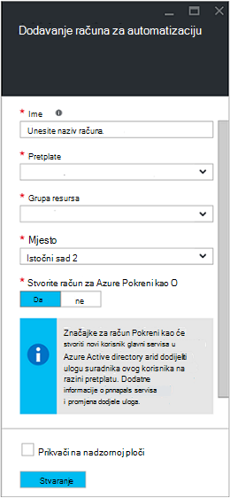
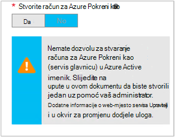

<properties
   pageTitle="Konfiguriranje računa za Azure AD korisnik | Microsoft Azure"
   description="U ovom se članku objašnjava kako konfigurirati Azure AD korisničkog računa vjerodajnica za runbooks u automatizaciji Azure za provjeru autentičnosti ARM i ASM."
   services="automation"
   documentationCenter=""
   authors="MGoedtel"
   manager="jwhit"
   editor="tysonn"
   keywords="Azure active directory azure korisnik servisa azure upravljanja ad korisničkog računa" />
<tags
   ms.service="automation"
   ms.devlang="na"
   ms.topic="get-started-article"
   ms.tgt_pltfrm="na"
   ms.workload="infrastructure-services"
   ms.date="09/12/2016"
   ms.author="magoedte" />

# Runbooks s Upravljanje servisom Azure i resursima za provjeru autentičnosti

U ovom se članku opisuju koraci, morate izvršiti da konfigurirate račun za Azure AD korisnik za automatizaciju Azure runbooks izvodi protiv Azure usluga upravljanja (ASM) ili upravitelj Azure resursa (ARM) resursa.  Dok je to i dalje biti podržane provjere autentičnosti identiteta za vaše ARM temelji runbooks, preporučeni način koristi novi račun za Azure Pokreni kao.       

## Stvaranje novog korisnika Azure Active Directory

1. Prijavite se na Portal klasični Azure kao administrator servisa za Azure pretplatu koju želite upravljati.
2. Odaberite **Servisa Active Directory**, a zatim odaberite naziv imenika tvrtke ili ustanove.
3. Odaberite karticu **korisnika** , a zatim **Dodavanje korisnika**u području naredbe.
4. Na stranici **Recite nam o korisniku** , u odjeljku **Vrsta korisnika**, odaberite **novi korisnik u tvrtki ili ustanovi**.
5. Unesite korisničko ime.  
6. Odaberite naziv direktorija koji je povezan s pretplatom Azure na stranici servisa Active Directory.
7. Na stranici **profila** , navedite na prvi i zadnji naziv, jednostavnih naziv i korisnika s popisa **uloge** .  Nemojte **omogućiti višestruke provjere autentičnosti**.
8. Imajte na umu korisničko ime i prezime i privremenu lozinku.
9. Odaberite **Postavke > administrator > Dodavanje**.
10. Upišite cijeli korisničko ime korisnika koji ste stvorili.
11. Odaberite pretplatu u koju želite da korisnik upravljanje.
12. Odjavite se iz aplikacije Azure, a zatim se prijavite natrag pomoću računa koji ste upravo stvorili. Zatražit će se da biste promijenili korisničku lozinku.

## Stvorite račun za automatizaciju klasični portalu Azure
U ovom ćete odjeljku će poduzeti sljedeće korake da biste stvorili novi račun za Azure Automatizacija na portalu Azure koja će se koristiti s vašeg runbooks Upravljanje resursima u načinu ASM i OKVIRA.  

>[AZURE.NOTE] Automatizacija račune stvorene pomoću portala za klasični Azure upravljati njime mogu Azure klasični i Azure Portal i ili skup cmdleta. Nakon stvaranja računa nije važno kako stvoriti i upravljanje resursima unutar račun. Ako planirate da biste nastavili koristiti Portal klasični Azure, zatim koristite ga umjesto Portal za Azure da biste stvorili svih računa za automatizaciju.

1. Prijavite se na Portal klasični Azure kao administrator servisa za Azure pretplatu koju želite upravljati.
2. Odaberite **automatizaciju**.
3. Na stranici **Automatizacija** odaberite **Stvori račun za automatizaciju**.
4. U okviru **Stvaranje računa za automatizaciju** upišite naziv za novi račun Automatizacija, a zatim odaberite **područje** s padajućeg popisa.  
5. Kliknite **u redu** da biste prihvatili postavke i stvorite račun.
6. Nakon stvaranja će biti navedena na stranici **automatizaciju** .
7. Kliknite račun i ona će vas dovode do stranice nadzorne ploče.  
8. Na stranici nadzorne ploče za automatizaciju odaberite **Resursi**.
9. Na stranici **imovine** odaberite **Dodavanje postavki** koja se nalazi pri dnu stranice.
10. Na stranici **Dodavanje postavki** odaberite **Dodavanje vjerodajnica**.
11. Na stranici **Definiranje vjerodajnica** odaberite **Windows PowerShell vjerodajnica** na padajućem popisu **Vrsta vjerodajnica** , a zatim navedite naziv vjerodajnicu.
12. Na sljedeću **Definiranje vjerodajnica** stranice vrstu u okvir korisničko ime AD korisničkog računa stvorili ranije u polje **Korisničkog imena** i lozinke u poljima **lozinku** i **Potvrdite lozinku** . Kliknite **u redu** da biste spremili promjene.

## Stvorite račun za automatizaciju na portalu za Azure

U ovom ćete odjeljku će poduzeti sljedeće korake da biste stvorili novi račun za Azure Automatizacija na portalu Azure koja će se koristiti s runbooks upravljanje resursa u načinu OKVIRA.  

1. Prijavite se na portal sustava Azure kao administrator servisa za Azure pretplatu koju želite upravljati.
2. Odaberite **računi automatizaciju**.
3. U plohu Automatizacija računi kliknite **Dodaj**. 
2. U **Dodavanje računa za automatizaciju** plohu u okvir unesite **naziv** u naziv na novi račun za automatizaciju.
5. Ako imate više pretplata, navedite opis novog računa, kao i novu ili postojeću **grupu resursa** i Azure podatkovnog centra **mjesto**.
3. Odaberite vrijednost **ne** za mogućnost **Stvori Azure Pokreni kao račun** , a zatim kliknite gumb **Stvori** .  

    >[AZURE.NOTE] Ako ne stvorite račun Pokreni kao tako da odaberete mogućnost **ne**, primit ćete s porukom upozorenja u plohu **Dodavanje računa za automatizaciju** .  Dok je račun se stvara i dodijeljena uloga **suradnika** u pretplatu, neće imati odgovarajuće identiteta provjere autentičnosti unutar svoje pretplate imeničkog servisa i zbog toga ne pristup resursima u svoju pretplatu.  Time će se spriječiti sve runbooks pozivanju taj račun ne bi mogli za provjeru autentičnosti i izvođenje zadataka protiv ARM resursi.

    

4. Dok Azure stvara Automatizacija korisnički račun, možete pratiti napredak u odjeljku **primanje obavijesti** iz izbornika.

Po dovršetku stvaranja vjerodajnicu će morati stvoriti resursa vjerodajnica računa za automatizaciju pridružiti AD korisnički račun ste ranije stvorili.  Ne zaboravite, ne možemo stvoriti samo račun za automatizaciju i nije povezan s identitet provjere autentičnosti.  Poduzeti korake navedene u [vjerodajnica resursima u članku Azure Automatizacija](../automation/automation-credentials.md#creating-a-new-credential) , a zatim unesite vrijednost za **korisničko ime** u obliku **domena\korisnik**.

## Korištenje vjerodajnica u na runbook

Možete dohvatiti vjerodajnica u runbook pomoću [Get-AutomationPSCredential](http://msdn.microsoft.com/library/dn940015.aspx) aktivnosti i pomoću nje s [Dodaj AzureAccount](http://msdn.microsoft.com/library/azure/dn722528.aspx) povezati u pretplatu za Azure. Ako je vjerodajnicu administrator višestruke pretplate Azure, a zatim [Odaberite AzureSubscription](http://msdn.microsoft.com/library/dn495203.aspx) trebali biste koristiti i da biste odredili točan. Prikazuje se u uzorku komponente Windows PowerShell ispod koje se najčešće pojavljuju se pri vrhu Većina Automatizacija Azure runbooks.

    $cred = Get-AutomationPSCredential –Name "myuseraccount.onmicrosoft.com"
    Add-AzureAccount –Credential $cred
    Select-AzureSubscription –SubscriptionName "My Subscription"

Nakon sve [checkpoints](http://technet.microsoft.com/library/dn469257.aspx#bk_Checkpoints) treba ponovite te retke u vašem runbook. Ako na runbook obustavljena je, a zatim nastavlja na drugi tempiranja, ona će potrebne za izvođenje provjeru autentičnosti.

## Daljnji koraci
* Pregledajte runbook različite vrste i koraci za stvaranje vlastitog runbooks iz članka sljedeće [vrste runbook Automatizacija Azure](../automation/automation-runbook-types.md)
