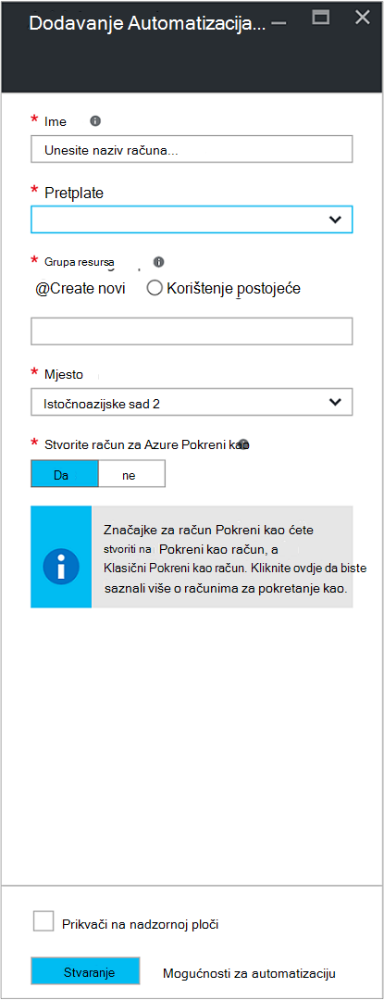
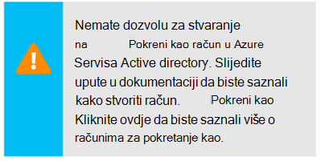
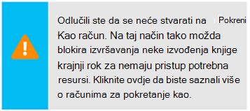
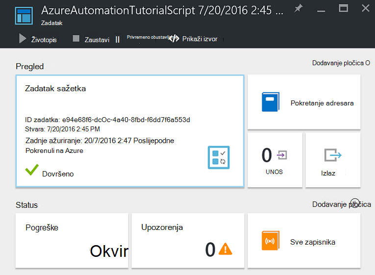
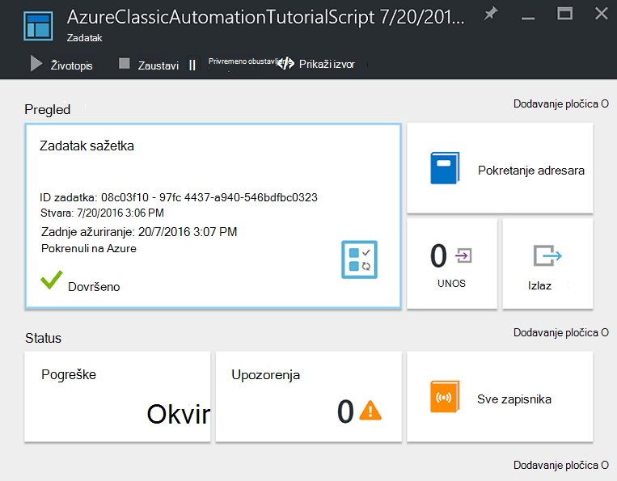
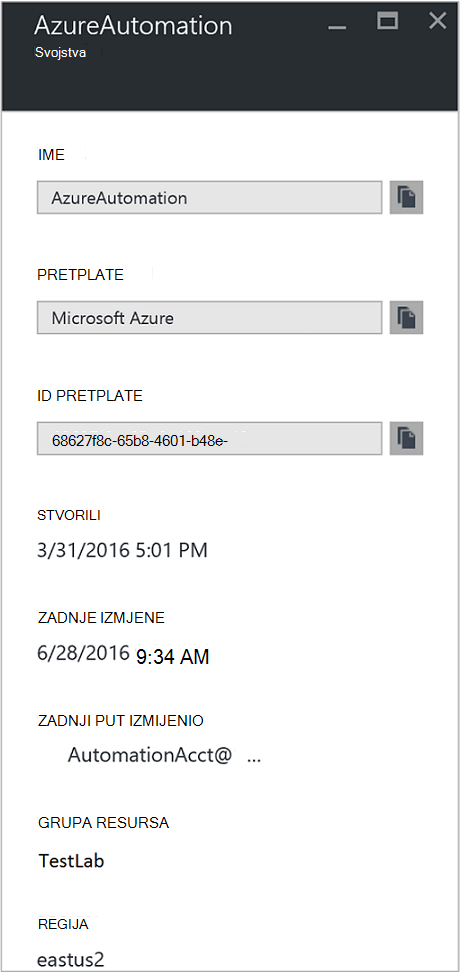

<properties
    pageTitle="Konfiguriranje Azure Pokreni kao račun | Microsoft Azure"
    description="Praktični vodič koji vodi vas kroz stvaranje, testiranje i primjer korištenja sigurnost glavni provjere autentičnosti u automatizaciji Azure."
    services="automation"
    documentationCenter=""
    authors="mgoedtel"
    manager="jwhit"
    editor=""
    keywords="glavni naziv servisa, setspn, azure provjere autentičnosti"/>
<tags
    ms.service="automation"
    ms.workload="tbd"
    ms.tgt_pltfrm="na"
    ms.devlang="na"
    ms.topic="get-started-article"
    ms.date="08/17/2016"
    ms.author="magoedte"/>

# Autentičnost Runbooks s računom za Azure Pokreni kao

U ovoj se temi će vam pokazati kako konfigurirati račun Automatizacija na portalu Azure pomoću značajke za račun Pokreni kao za provjeru autentičnosti runbooks upravljanje resursa u Azure Voditelj resursa i upravljanje servisom Azure.

Kada stvorite novi račun za automatizaciju na portalu za Azure, automatski stvara:

- Pokrenite kao račun koji stvara novi Upravitelj servisa Azure Active Directory, certifikat, a dodjeljuje suradnika na temelju uloga kontrolu pristupa (RBAC), koji će se koristiti za upravljanje resursima resurse pomoću runbooks.   
- Klasični Pokreni kao račun tako da prenesete certifikat za upravljanje, koji će se koristiti za upravljanje Upravljanje servisom Azure ili klasični resurse pomoću runbooks.  

Time se pojednostavljuje postupak s vlastitim potrebama i olakšava brzo pokretanje stvaranje i implementacija runbooks za podršku vaše potrebe za automatizaciju.      

Koristite Pokreni kao i klasični Pokreni kao račun, možete učiniti sljedeće:

- Omogućuje standardizirani provjeri s Azure kada upravljanje Voditelj resursa Azure ili upravljanje servisom Azure resursa iz runbooks na portalu za Azure.  
- Automatiziranje korištenje globalni runbooks konfiguriran u Azure upozorenja.

>[AZURE.NOTE] Azure [upozorenja Integracija](../monitoring-and-diagnostics/insights-receive-alert-notifications.md) s Automatizacija globalni Runbooks potreban je račun za automatizaciju koji je konfiguriran za korištenje na Pokreni kao i račun za klasični Pokreni kao. Možete odabrati Automatizacija račun koji već ima račun Pokreni kao i klasični Pokreni kao definirani ili odaberite da biste stvorili novi.

Ne možemo će vam pokazati kako stvoriti račun za automatizaciju s portala za Azure, ažurirajte Automatizacija račun pomoću komponente PowerShell i Demonstracija za provjeru autentičnosti u vašem runbooks.

Prije toga moramo, postoji nekoliko stvari koje treba razumijevanje i preporučujemo prije nastavka.

1. To ne utječe na postojeće Automatizacija račune koji su već stvorene na klasični ili u model implementacije Voditelj resursa.  
2. To će raditi samo za račune za automatizaciju stvorene pomoću portala za Azure.  Pokušate stvoriti račun s portala sustava klasični će replicirati konfiguracija računa Pokreni kao.
3. Ako trenutno imate runbooks i resursi (odnosno rasporede varijable, itd.) koje ste prethodno stvorili i upravljanje klasični resursima, a želite te runbooks za provjeru autentičnosti pomoću novog računa klasični Pokreni kao, morat ćete ih migrirate na novi račun Automatizacija ili ažurirati na postojeći račun pomoću ispod skriptu PowerShell.  
4. Za provjeru autentičnosti pomoću novog računa za pokretanje kao i klasični pokrenuti kao Automatizacija računa, morat ćete izmijenite svoje postojeće runbooks sa šifrom primjer.  **Rješenje Imajte na umu** da je račun za pokretanje kao za provjeru autentičnosti na temelju resurse resursima pomoću certifikat utemeljen servis glavni i račun za klasični Pokreni kao je za provjeru autentičnosti protiv resursi za upravljanje servisom upravljanje certifikatom.     

## Stvaranje novog računa za automatizaciju na portalu Azure

U ovom ćete odjeljku će poduzeti sljedeće korake da biste stvorili novi račun za automatizaciju Azure s portala za Azure.  Time ste stvorili Pokreni kao i račun za klasični Pokreni kao.  

>[AZURE.NOTE] Korisnika koji se izvodi ove korake *morate* biti član uloge pretplate administratori i zajednički administrator pretplate na kojem je omogućivanju pristupa s pretplatom za korisnika.  Korisnik mora također biti dodan kao korisnik koji pretplate zadani Active Directory račun ne trebate dodijeliti povlaštene ulozi.

1. Prijavite se na portal Azure pomoću računa koji je član uloge pretplate administratori i zajednički administrator pretplate.
2. Odaberite **računi automatizaciju**.
3. U plohu Automatizacija računi kliknite **Dodaj**. 

    >[AZURE.NOTE]Ako vam se prikazuje sljedeću poruku u plohu **Dodavanje računa za automatizaciju** , to je jer je vaš račun nije član uloge pretplate administratori i ko administrator pretplate. 

4. U **Dodavanje računa za automatizaciju** plohu u okvir unesite **naziv** u naziv na novi račun za automatizaciju.
5. Ako imate više pretplata, navedite jednu za novi račun, kao i novu ili postojeću **grupu resursa** i Azure podatkovnog centra **mjesto**.
6. Provjerite je li vrijednost **da** je odabrana mogućnost **Stvaranje Azure Pokreni kao račun** , a zatim kliknite gumb **Stvori** .  

    >[AZURE.NOTE] Ako ne stvorite račun Pokreni kao tako da odaberete mogućnost **ne**, primit ćete s porukom upozorenja u plohu **Dodavanje računa za automatizaciju** .  Prilikom stvaranja računa na portalu za Azure neće imati odgovarajuću identiteta provjere autentičnosti unutar vaše classic ili Voditelj resursa pretplate imeničkog servisa i zbog toga bez pristupa resursima u svoju pretplatu.  Time će se spriječiti sve runbooks pozivanju taj račun ne bi mogli provjeru autentičnosti i izvršavanje zadataka na temelju resursa u tim modelima implementacije.

    > 
Kada Upravitelj servisa nije stvoren dodijelit će se ne ulogu suradnika.

7. Dok Azure stvara Automatizacija korisnički račun, možete pratiti napredak u odjeljku **primanje obavijesti** iz izbornika.

### Resursi uključen

Kada uspješno stvaranja računa Automatizacija, nekoliko resursa se automatski stvaraju za vas.  U sljedećoj su tablici navedene resurse za račun Pokreni kao. 

Resurs|Opis
--------|-----------
AzureAutomationTutorial Runbook|Na primjer PowerShell runbook koji pokazuje kako provjeriti autentičnost pomoću računa za pokretanje kao i dohvaća sve resursima resurse.
AzureAutomationTutorialScript Runbook|Na primjer PowerShell runbook koji pokazuje kako provjeriti autentičnost pomoću računa za pokretanje kao i dohvaća sve resursima resurse.
AzureRunAsCertificate|Certifikat resursa automatski stvara tijekom stvaranja računa za automatizaciju ili pomoću skriptu PowerShell ispod za postojeći račun.  Omogućuje provjeru autentičnosti s Azure tako da možete upravljati Voditelj resursa Azure resursa iz runbooks.  Taj certifikat je vrijeme upotrebljivosti jednu godinu.
AzureRunAsConnection|Veza resursa automatski stvara tijekom stvaranja računa za automatizaciju ili pomoću skriptu PowerShell ispod za postojeći račun.

U sljedećoj su tablici navedene resurse za račun klasični Pokreni kao. 

Resurs|Opis
--------|-----------
AzureClassicAutomationTutorial Runbook|Primjer runbook koja se dobiva klasični VMs u pretplati putem klasične pokrenuti kao računa (certifikat) i zatim proizvodi VM naziv i status.
Skripta AzureClassicAutomationTutorial Runbook|Primjer runbook koja se dobiva klasični VMs u pretplati putem klasične pokrenuti kao računa (certifikat) i zatim proizvodi VM naziv i status.
AzureClassicRunAsCertificate|Certifikat resursa automatski stvara koja se koristi za provjeru s Azure tako da možete upravljati Azure klasični resursa iz runbooks.  Taj certifikat je vrijeme upotrebljivosti jednu godinu.
AzureClassicRunAsConnection|Veza resursa automatski stvara koja se koristi za provjeru s Azure tako da možete upravljati Azure klasični resursa iz runbooks.  

## Provjera autentičnosti Pokreni kao

Dalje ćemo napraviti small test da biste potvrdili da ste moći uspješno autentičnost pomoću novog računa Pokreni kao.     

1. Na portalu za Azure otvorite račun za automatizaciju ste ranije stvorili.  
2. Kliknite pločicu **Runbooks** da biste otvorili popis runbooks.
3. Odaberite **AzureAutomationTutorialScript** runbook, a zatim kliknite da biste započeli s runbook **Start** .  Primit ćete upit potvrđivanja koju želite pokrenuti na runbook.
4. [Zadatak runbook](automation-runbook-execution.md) se stvara zadatak koji se prikazuje se plohu i statusu zadatka prikazane u pločicu **Sažetak posla** .  
5. Status zadatka će se pokrenuti kao *Queued* koja označava da je čeka runbook suradnika u oblaku postane dostupna. On zatim premjestit će *Početni* kada zahtjeve u zadatak, a zatim *izvodi* pri na runbook zapravo pokretanju pokrenut.  
6. Nakon dovršetka posla runbook dobivamo status **Dovršeno**.   
7. Da biste vidjeli detaljne rezultate u kompilacije, kliknite pločicu **Izlaz** .
8. U plohu **izlaznu** vidjet ćete je uspješno provjere autentičnosti i vraća popis svih resurse koji su dostupni u grupu resursa.
9. Zatvorite plohu **izlaznu** da biste se vratili plohu **Sažetak zadatka** .
13. Zatvorite **Sažetak zadatka** i odgovarajuće plohu runbook **AzureAutomationTutorialScript** .

## Provjera autentičnosti klasični Pokreni kao

Dalje ćemo napraviti small test da biste potvrdili možete uspješno autentičnost pomoću novog računa klasični Pokreni kao.     

1. Na portalu za Azure otvorite račun za automatizaciju ste ranije stvorili.  
2. Kliknite pločicu **Runbooks** da biste otvorili popis runbooks.
3. Odaberite **AzureClassicAutomationTutorialScript** runbook, a zatim kliknite da biste započeli s runbook **Start** .  Primit ćete upit potvrđivanja koju želite pokrenuti na runbook.
4. [Zadatak runbook](automation-runbook-execution.md) se stvara zadatak koji se prikazuje se plohu i statusu zadatka prikazane u pločicu **Sažetak posla** .  
5. Status zadatka će se pokrenuti kao *Queued* koja označava da je čeka runbook suradnika u oblaku postane dostupna. On zatim premjestit će *Početni* kada zahtjeve u zadatak, a zatim *izvodi* pri na runbook zapravo pokretanju pokrenut.  
6. Nakon dovršetka posla runbook dobivamo status **Dovršeno**.   
7. Da biste vidjeli detaljne rezultate u kompilacije, kliknite pločicu **Izlaz** .
8. U plohu **Izlaz** vidjet ćete je uspješno provjere autentičnosti i vraća popis svih klasični VM nalaze u pretplatu.
9. Zatvorite plohu **izlaznu** da biste se vratili plohu **Sažetak zadatka** .
13. Zatvorite **Sažetak zadatka** i odgovarajuće plohu runbook **AzureClassicAutomationTutorialScript** .

## Ažuriranje Automatizacija račun pomoću komponente PowerShell

Ovdje možemo vam ponuditi mogućnost da biste koristili PowerShell da biste ažurirali postojećeg računa za automatizaciju ako:

1. Stvorili račun Automatizacija, ali odbio da biste stvorili račun Pokreni kao
2. Već imate račun Automatizacija Upravljanje resursima resurse i želite ga da biste dodali račun Pokreni kao za provjeru autentičnosti runbook ažurirati
2. Već imate račun Automatizacija da biste upravljali klasični resurse i želite ga da biste upotrijebili na klasični pokrenuti umjesto stvaranja novog računa i Migracija runbooks i resursima na je ažurirati   

Prije nego što nastavite, provjerite sljedeće:

1. Ste preuzeli i instalirali [Windows Management Framework (WMF) 4.0](https://www.microsoft.com/download/details.aspx?id=40855) ako koristite Windows 7.   
    Ako koristite Windows Server 2012 R2, Windows Server 2012, Windows 2008 R2, Windows 8.1 i Windows 7 SP1 [Windows Management Framework 5.0](https://www.microsoft.com/download/details.aspx?id=50395) dostupna je za instalaciju.
2. Azure PowerShell 1.0. Informacije o ovom izdanju i kako ga instalirati potražite u članku [kako instalirati i konfigurirati Azure PowerShell](../powershell-install-configure.md).
3. Stvorite račun za automatizaciju.  Račun će se pozivati kao vrijednosti za parametre – AutomationAccountName i - ApplicationDisplayName u oba skripte u nastavku.

Da biste dobili vrijednosti za *SubscriptionID*, *ResourceGroup*i *AutomationAccountName*, koji su obavezni parametri za skripte na portalu za Azure odaberite svoj račun za automatizaciju iz plohu **Automatizacija račun** i odaberite **sve postavke**.  Plohu **sve postavke** u odjeljku **Postavke računa** odaberite **Svojstva**.  U plohu **Svojstva** možete zabilježiti te vrijednosti.    

### Stvaranje pokrenuti kao račun skriptu komponente PowerShell

Ispod skriptu PowerShell će konfigurirati sljedeće:

- Azure AD aplikacije koja će biti ovjerena samopotpisanog certifikata stvorite glavni račun servisa za ovu aplikaciju u Azure AD i dodijeljena uloga suradnika (to nije moguće promijeniti vlasnik ili druge ulogu) za ovaj račun u trenutne pretplate.  Dodatne informacije pogledajte u članku [Kontrola pristupa na temelju uloga u automatizaciji Azure](../automation/automation-role-based-access-control.md) .
- Automatizacija imovine certifikat u navedenom Automatizacija računa pod nazivom **AzureRunAsCertificate**, koji sadrži certifikatu koji se koristi glavni servisa.
- Automatizacija imovine veze u navedenom Automatizacija računa pod nazivom **AzureRunAsConnection**, koji sadrži applicationId, tenantId, subscriptionId i otisak prsta na certifikatu.    

Koraci u nastavku će vas voditi kroz postupak izvršavanja skriptu.

1. Spremite sljedeću skriptu na vašem računalu.  U ovom primjeru, spremite ga pod nazivom datoteke **Novo AzureServicePrincipal.ps1**.  

        #Requires -RunAsAdministrator
        Param (
        [Parameter(Mandatory=$true)]
        [String] $ResourceGroup,

        [Parameter(Mandatory=$true)]
        [String] $AutomationAccountName,

        [Parameter(Mandatory=$true)]
        [String] $ApplicationDisplayName,

        [Parameter(Mandatory=$true)]
        [String] $SubscriptionId,

        [Parameter(Mandatory=$true)]
        [String] $CertPlainPassword,

        [Parameter(Mandatory=$false)]
        [int] $NoOfMonthsUntilExpired = 12
        )

        Login-AzureRmAccount
        Import-Module AzureRM.Resources
        Select-AzureRmSubscription -SubscriptionId $SubscriptionId

        $CurrentDate = Get-Date
        $EndDate = $CurrentDate.AddMonths($NoOfMonthsUntilExpired)
        $KeyId = (New-Guid).Guid
        $CertPath = Join-Path $env:TEMP ($ApplicationDisplayName + ".pfx")

        $Cert = New-SelfSignedCertificate -DnsName $ApplicationDisplayName -CertStoreLocation cert:\LocalMachine\My -KeyExportPolicy Exportable -Provider "Microsoft Enhanced RSA and AES Cryptographic Provider"

        $CertPassword = ConvertTo-SecureString $CertPlainPassword -AsPlainText -Force
        Export-PfxCertificate -Cert ("Cert:\localmachine\my\" + $Cert.Thumbprint) -FilePath $CertPath -Password $CertPassword -Force | Write-Verbose

        $PFXCert = New-Object -TypeName System.Security.Cryptography.X509Certificates.X509Certificate -ArgumentList @($CertPath, $CertPlainPassword)
        $KeyValue = [System.Convert]::ToBase64String($PFXCert.GetRawCertData())

        $KeyCredential = New-Object  Microsoft.Azure.Commands.Resources.Models.ActiveDirectory.PSADKeyCredential
        $KeyCredential.StartDate = $CurrentDate
        $KeyCredential.EndDate= $EndDate
        $KeyCredential.KeyId = $KeyId
        $KeyCredential.Type = "AsymmetricX509Cert"
        $KeyCredential.Usage = "Verify"
        $KeyCredential.Value = $KeyValue

        # Use Key credentials
        $Application = New-AzureRmADApplication -DisplayName $ApplicationDisplayName -HomePage ("http://" + $ApplicationDisplayName) -IdentifierUris ("http://" + $KeyId) -KeyCredentials $keyCredential

        New-AzureRMADServicePrincipal -ApplicationId $Application.ApplicationId | Write-Verbose
        Get-AzureRmADServicePrincipal | Where {$_.ApplicationId -eq $Application.ApplicationId} | Write-Verbose

        $NewRole = $null
        $Retries = 0;
        While ($NewRole -eq $null -and $Retries -le 6)
        {
           # Sleep here for a few seconds to allow the service principal application to become active (should only take a couple of seconds normally)
           Sleep 5
           New-AzureRMRoleAssignment -RoleDefinitionName Contributor -ServicePrincipalName $Application.ApplicationId | Write-Verbose -ErrorAction SilentlyContinue
           Sleep 10
           $NewRole = Get-AzureRMRoleAssignment -ServicePrincipalName $Application.ApplicationId -ErrorAction SilentlyContinue
           $Retries++;
        }

        # Get the tenant id for this subscription
        $SubscriptionInfo = Get-AzureRmSubscription -SubscriptionId $SubscriptionId
        $TenantID = $SubscriptionInfo | Select TenantId -First 1

        # Create the automation resources
        New-AzureRmAutomationCertificate -ResourceGroupName $ResourceGroup -AutomationAccountName $AutomationAccountName -Path $CertPath -Name AzureRunAsCertificate -Password $CertPassword -Exportable | write-verbose

        # Create a Automation connection asset named AzureRunAsConnection in the Automation account. This connection uses the service principal.
        $ConnectionAssetName = "AzureRunAsConnection"
        Remove-AzureRmAutomationConnection -ResourceGroupName $ResourceGroup -AutomationAccountName $AutomationAccountName -Name $ConnectionAssetName -Force -ErrorAction SilentlyContinue
        $ConnectionFieldValues = @{"ApplicationId" = $Application.ApplicationId; "TenantId" = $TenantID.TenantId; "CertificateThumbprint" = $Cert.Thumbprint; "SubscriptionId" = $SubscriptionId}
        New-AzureRmAutomationConnection -ResourceGroupName $ResourceGroup -AutomationAccountName $AutomationAccountName -Name $ConnectionAssetName -ConnectionTypeName AzureServicePrincipal -ConnectionFieldValues $ConnectionFieldValues

2. Na računalu, pokrenite **Windows PowerShell** s **početnom** zaslonu s dodatnim korisnička prava.
3. S dodatnim PowerShell naredbenog retka ljuske, pronađite mapu koja sadrži skriptu stvorene u koraku 1 i izvršavanje skripte promijenite vrijednosti za parametre *– ResourceGroup*, *- AutomationAccountName*, *- ApplicationDisplayName*, *- SubscriptionId*i *- CertPlainPassword*. 

    >[AZURE.NOTE] Zatražit će se za provjeru s Azure nakon izvršavanja skriptu. Morate se prijaviti pomoću računa koji je član uloge administratora za pretplatu, a ko administrator pretplate.

        .\New-AzureServicePrincipal.ps1 -ResourceGroup <ResourceGroupName>
        -AutomationAccountName <NameofAutomationAccount> `
        -ApplicationDisplayName <DisplayNameofAutomationAccount> `
        -SubscriptionId <SubscriptionId> `
        -CertPlainPassword "<StrongPassword>"  
 

Kada skriptu uspješno završi, pogledajte [uzorak koda](#sample-code-to-authenticate-with-resource-manager-resources) niže autentičnost s resursima Voditelj resursa i provjerili valjanost konfiguracije vjerodajnica.

### Stvaranje računa za klasični Pokreni kao skriptu komponente PowerShell

Ispod skriptu PowerShell će konfigurirati sljedeće:

- Automatizacija imovine certifikat u navedenom Automatizacija računa pod nazivom **AzureClassicRunAsCertificate**, koji sadrži certifikat koji se koriste za provjeru autentičnosti sustava runbooks.
- Automatizacija imovine veze u navedenom Automatizacija računa pod nazivom **AzureClassicRunAsConnection**, koji sadrži naziv pretplate, web-mjesto subscriptionId i u okvir za potvrdu naziv resursa.

Skripta će stvoriti upravljanje samopotpisani certifikat i spremite u mapu privremene datoteke na računalo u odjeljku korisnički profil koristiti za izvršavanje sesiju ljuske PowerShell – *%USERPROFILE%\AppData\Local\Temp*.  Nakon izvođenja skripte, morat ćete prenijeti Azure upravljanja certifikat u trgovini upravljanja za pretplatu za račun za automatizaciju stvorena u.  Koraci u nastavku će vas voditi kroz postupak izvršavanja skripte i prijenos certifikata.  

1. Spremite sljedeću skriptu na vašem računalu.  U ovom primjeru, spremite ga pod nazivom datoteke **Novo AzureClassicRunAsAccount.ps1**.

        #Requires -RunAsAdministrator
        Param (
        [Parameter(Mandatory=$true)]
        [String] $ResourceGroup,

        [Parameter(Mandatory=$true)]
        [String] $AutomationAccountName,

        [Parameter(Mandatory=$true)]
        [String] $ApplicationDisplayName,

        [Parameter(Mandatory=$true)]
        [String] $SubscriptionId,

        [Parameter(Mandatory=$true)]
        [String] $CertPlainPassword,

        [Parameter(Mandatory=$false)]
        [int] $NoOfMonthsUntilExpired = 12
        )

        Login-AzureRmAccount
        Import-Module AzureRM.Resources
        $Subscription = Select-AzureRmSubscription -SubscriptionId $SubscriptionId
        $SubscriptionName = $subscription.Subscription.SubscriptionName

        $CurrentDate = Get-Date
        $EndDate = $CurrentDate.AddMonths($NoOfMonthsUntilExpired)
        $KeyId = (New-Guid).Guid
        $CertPath = Join-Path $env:TEMP ($ApplicationDisplayName + ".pfx")
        $CertPathCer = Join-Path $env:TEMP ($ApplicationDisplayName + ".cer")

        $Cert = New-SelfSignedCertificate -DnsName $ApplicationDisplayName -CertStoreLocation cert:\LocalMachine\My -KeyExportPolicy Exportable -Provider "Microsoft Enhanced RSA and AES Cryptographic Provider"

        $CertPassword = ConvertTo-SecureString $CertPlainPassword -AsPlainText -Force
        Export-PfxCertificate -Cert ("Cert:\localmachine\my\" + $Cert.Thumbprint) -FilePath $CertPath -Password $CertPassword -Force | Write-Verbose
        Export-Certificate -Cert ("Cert:\localmachine\my\" + $Cert.Thumbprint) -FilePath $CertPathCer -Type CERT | Write-Verbose

        # Create the automation resources
        $ClassicCertificateAssetName = "AzureClassicRunAsCertificate"
        New-AzureRmAutomationCertificate -ResourceGroupName $ResourceGroup -AutomationAccountName $AutomationAccountName -Path $CertPath -Name $ClassicCertificateAssetName  -Password $CertPassword -Exportable | write-verbose

        # Create a Automation connection asset named AzureClassicRunAsConnection in the Automation account. This connection uses the ClassicCertificateAssetName.
        $ConnectionAssetName = "AzureClassicRunAsConnection"
        Remove-AzureRmAutomationConnection -ResourceGroupName $ResourceGroup -AutomationAccountName $AutomationAccountName -Name $ConnectionAssetName -Force -ErrorAction SilentlyContinue
        $ConnectionFieldValues = @{"SubscriptionName" = $SubscriptionName; "SubscriptionId" = $SubscriptionId; "CertificateAssetName" = $ClassicCertificateAssetName}
        New-AzureRmAutomationConnection -ResourceGroupName $ResourceGroup -AutomationAccountName $AutomationAccountName -Name $ConnectionAssetName -ConnectionTypeName AzureClassicCertificate -ConnectionFieldValues $ConnectionFieldValues

        Write-Host -ForegroundColor red "Please upload the cert $CertPathCer to the Management store by following the steps below."
        Write-Host -ForegroundColor red "Log in to the Microsoft Azure Management portal (https://manage.windowsazure.com) and select Settings -> Management Certificates."
        Write-Host -ForegroundColor red "Then click Upload and upload the certificate $CertPathCer"

2. Na računalu, pokrenite **Windows PowerShell** s **početnom** zaslonu s dodatnim korisnička prava.  
3. S dodatnim PowerShell naredbenog retka ljuske, pronađite mapu koja sadrži skriptu stvorene u koraku 1 i izvršavanje skripte promijenite vrijednosti za parametre *– ResourceGroup*, *- AutomationAccountName*, *- ApplicationDisplayName*, *- SubscriptionId*i *- CertPlainPassword*. 

    >[AZURE.NOTE] Zatražit će se za provjeru s Azure nakon izvršavanja skriptu. Morate se prijaviti pomoću računa koji je član uloge administratora za pretplatu, a ko administrator pretplate.

        .\New-AzureClassicRunAsAccount.ps1 -ResourceGroup <ResourceGroupName>
        -AutomationAccountName <NameofAutomationAccount> `
        -ApplicationDisplayName <DisplayNameofAutomationAccount> `
        -SubscriptionId <SubscriptionId> `
        -CertPlainPassword "<StrongPassword>"

Nakon što skriptu uspješno završi, morat ćete kopirati certifikat koji je stvoren u mapa **Temp** korisničkog profila.  Slijedite korake za [Prijenos certifikat API upravljanje](../azure-api-management-certs.md) Azure klasični portal i odnose se na [ogledni kod](#sample-code-to-authenticate-with-service-management-resources) da biste provjerili valjanost konfiguracije vjerodajnica s resursima za upravljanje servisom.

## Ogledni kod za provjeru autentičnosti s resursima Voditelj resursa

Slijede, ažurirane uzorak koda možete koristiti uzeti primjer runbook **AzureAutomationTutorialScript** za provjeru autentičnosti putem računa Pokreni kao za upravljanje resursima resursa s vašeg runbooks.   

    $connectionName = "AzureRunAsConnection"
    $SubId = Get-AutomationVariable -Name 'SubscriptionId'
    try
    {
       # Get the connection "AzureRunAsConnection "
       $servicePrincipalConnection=Get-AutomationConnection -Name $connectionName         

       "Logging in to Azure..."
       Add-AzureRmAccount `
         -ServicePrincipal `
         -TenantId $servicePrincipalConnection.TenantId `
         -ApplicationId $servicePrincipalConnection.ApplicationId `
         -CertificateThumbprint $servicePrincipalConnection.CertificateThumbprint
       "Setting context to a specific subscription"  
       Set-AzureRmContext -SubscriptionId $SubId             
    }
    catch {
        if (!$servicePrincipalConnection)
        {
           $ErrorMessage = "Connection $connectionName not found."
           throw $ErrorMessage
         } else{
            Write-Error -Message $_.Exception
            throw $_.Exception
         }
    }

Skripta sadrži dvije dodatne redaka koda za podršku pozivanju kontekstu pretplate da biste mogli jednostavno raditi između višestruke pretplate. Varijable resursa pod nazivom SubscriptionId sadrži ID pretplate, a nakon cmdlet naredbe Dodaj AzureRmAccount [skup AzureRmContext cmdlet](https://msdn.microsoft.com/library/mt619263.aspx) je naveden s parametrom postavljanje *- SubscriptionId*. Ako je naziv varijable previše generički, možete izmijeniti naziv varijable za uključivanje prefiks ili druge konvencija imenovanja da biste lakše prepoznali za vaše potrebe. Osim toga, možete koristiti parametar postavljen - SubscriptionName umjesto - SubscriptionId s odgovarajućih varijable resursa.  

Obratite pozornost na to cmdlet koji se koristi za provjeru autentičnosti u runbook – **Dodavanje AzureRmAccount**koristi skup parametara *ServicePrincipalCertificate* .  Potvrđuje pomoću upravitelja certifikat servisa, ne vjerodajnice.  

## Ogledni kod za provjeru autentičnosti s resursima za upravljanje servisom

Ažurirani uzorak koda u nastavku, možete koristiti uzeti primjer runbook **AzureClassicAutomationTutorialScript** za provjeru autentičnosti putem računa klasični Pokreni kao da biste upravljali klasični resursa s vašeg runbooks.

    $ConnectionAssetName = "AzureClassicRunAsConnection"
    # Get the connection
    $connection = Get-AutomationConnection -Name $connectionAssetName        

    # Authenticate to Azure with certificate
    Write-Verbose "Get connection asset: $ConnectionAssetName" -Verbose
    $Conn = Get-AutomationConnection -Name $ConnectionAssetName
    if ($Conn -eq $null)
    {
       throw "Could not retrieve connection asset: $ConnectionAssetName. Assure that this asset exists in the Automation account."
    }

    $CertificateAssetName = $Conn.CertificateAssetName
    Write-Verbose "Getting the certificate: $CertificateAssetName" -Verbose
    $AzureCert = Get-AutomationCertificate -Name $CertificateAssetName
    if ($AzureCert -eq $null)
    {
       throw "Could not retrieve certificate asset: $CertificateAssetName. Assure that this asset exists in the Automation account."
    }

    Write-Verbose "Authenticating to Azure with certificate." -Verbose
    Set-AzureSubscription -SubscriptionName $Conn.SubscriptionName -SubscriptionId $Conn.SubscriptionID -Certificate $AzureCert
    Select-AzureSubscription -SubscriptionId $Conn.SubscriptionID

## Daljnji koraci

- Dodatne informacije o servisa upravitelji priručniku [aplikaciju i usluge objekte](../active-directory/active-directory-application-objects.md).
- Dodatne informacije o kontrola pristupa na temelju uloga u automatizaciji Azure priručniku [Kontrola pristupa na temelju uloga u automatizaciji Azure](../automation/automation-role-based-access-control.md).
- Dodatne informacije o potvrde i servisa Azure odnose se na [Pregled certifikata za servise u Oblaku Azure](../cloud-services/cloud-services-certs-create.md)
