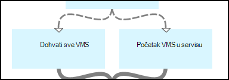

<properties 
    pageTitle="Pokretanje i zaustavljanje virtualnim strojevima - Graph | Microsoft Azure"
    description="Verzija Azure Automatizacija scenarij uključujući runbooks za pokretanje i zaustavljanje klasični virtualnim strojevima PowerShell tijeka rada."
    services="automation"
    documentationCenter=""
    authors="mgoedtel"
    manager="jwhit"
    editor="tysonn" />
<tags 
    ms.service="automation"
    ms.devlang="na"
    ms.topic="article"
    ms.tgt_pltfrm="na"
    ms.workload="infrastructure-services"
    ms.date="07/06/2016"
    ms.author="bwren" />

# Azure Automatizacija scenarij – pokretanje i zaustavljanje virtualnim strojevima

Scenarij Azure Automatizacija obuhvaća runbooks za pokretanje i zaustavljanje klasični virtualnih računala.  U ovom scenariju možete koristiti za nešto od sljedećeg:  

- Korištenje runbooks bez izmjene u vlastitu okruženju. 
- Izmjena runbooks za izvođenje prilagođene funkcije.  
- Pozivanje na runbooks iz drugog runbook kao dio ukupnog rješenja. 
- Upotrijebili na runbooks vodiče da biste saznali runbook authoring koncepata. 

> [AZURE.SELECTOR]
- [Grafički](automation-solution-startstopvm-graphical.md)
- [PowerShell tijeka rada](automation-solution-startstopvm-psworkflow.md)

Ovo je grafički runbook verzija scenarij. Dostupna je i pomoću [runbooks PowerShell tijeka rada](automation-solution-startstopvm-psworkflow.md).

## Početak scenarija

Ovaj scenarij sastoji se od dva dvije grafičkim runbooks koji možete preuzeti sa sljedećih veza.  Pogledajte [verziju tijeka rada PowerShell](automation-solution-startstopvm-psworkflow.md) scenarij za veze na runbooks PowerShell tijeka rada.

| Runbook | Veza | Vrsta | Opis |
|:---|:---|:---|:---|
| StartAzureClassicVM | [Pokretanje Azure klasični VM grafički Runbook](https://gallery.technet.microsoft.com/scriptcenter/Start-Azure-Classic-VM-c6067b3d) | Grafički | Pokreće sve klasični virtualnim strojevima Azure pretplatu ili sve virtualnim strojevima pod nazivom određenog servisa. |
| StopAzureClassicVM | [Zaustavljanje Azure klasični VM grafički Runbook](https://gallery.technet.microsoft.com/scriptcenter/Stop-Azure-Classic-VM-397819bd) | Grafički | Zaustavlja sve virtualnim strojevima u račun za automatizaciju ili sve virtualnim strojevima pod nazivom određenog servisa.  |

## Instaliranje i konfiguriranje scenarija

### 1. na runbooks instalacija

Nakon preuzimanja s runbooks, možete uvesti ih pomoću postupka u [grafički runbook postupke](automation-graphical-authoring-intro.md#graphical-runbook-procedures).

### 2. Pregledajte opis i preduvjeti
Na runbooks obuhvaćaju aktivnost naziva za **Čitanje Me** koja sadrži opis i potrebni resursi.  Ove informacije možete prikazati tako da odaberete aktivnosti **Čitanje ja** , a zatim parametar **Skripte tijeka rada** .  Možete dobiti i iste podatke iz ovog članka. 

### 3. konfigurirajte resursi
Na runbooks potreban je sljedeći resursi koji morate stvoriti i popuniti odgovarajuće vrijednosti.  Zadane su imena.  Ako navedete nazive u [ulazne parametre](#using-the-runbooks) pri pokretanju na runbook možete koristiti resursi pod drugim nazivom.

| Vrsta resursa | Zadani naziv | Opis |
|:---|:---|:---|:---|
| [Vjerodajnica](automation-credentials.md) | AzureCredential | Sadrži vjerodajnice za račun za pokretanje i zaustavljanje virtualnim strojevima Azure pretplate.  |
| [Varijabla](automation-variables.md) | AzureSubscriptionId | Sadrži ID pretplate pretplate Azure. |

## Korištenje scenarija

### Parametri

Svaki runbooks imati sljedeće [ulazne parametre](automation-starting-a-runbook.md#runbook-parameters).  Navedite vrijednosti za parametre obavezna, a po izboru možete unijeti vrijednosti za drugi parametri ovisno o svojim potrebama.

| Parametar | Vrsta | Obavezna | Opis |
|:---|:---|:---|:---|
| Naziv servisa | niz | ne | Ako je navedena vrijednost svih virtualnim strojevima tog naziva će se pokrenuti ili zaustaviti.  Ako nijedna vrijednost nije naveden, sve klasični virtualnim strojevima u Azure pretplata će se pokrenuti ili zaustaviti. |
| AzureSubscriptionIdAssetName | niz | ne | Sadrži naziv [varijable resursa](#installing-and-configuring-the-scenario) koji sadrži ID pretplate pretplate Azure.  Ako ne navedete vrijednost, koristit će se *AzureSubscriptionId* .  |
| AzureCredentialAssetName | niz | ne | Sadrži naziv [vjerodajnica resursa](#installing-and-configuring-the-scenario) koji sadrži vjerodajnice za runbook za korištenje.  Ako ne navedete vrijednost, koristit će se *AzureCredential* .  |

### Pokretanje sustava runbooks

Koristite neku od metoda u [Početni runbook u automatizaciji Azure](automation-starting-a-runbook.md) da biste započeli ili na runbooks u ovom članku.

Sljedeće primjere naredbi koristi Windows PowerShell za izvođenje **StartAzureClassicVM** da biste započeli sve virtualnim strojevima naziv usluge *MyVMService*.

    $params = @{"ServiceName"="MyVMService"}
    Start-AzureAutomationRunbook –AutomationAccountName "MyAutomationAccount" –Name "StartAzureClassicVM" –Parameters $params

### Izlaz

Na runbooks će [izlazne poruke](automation-runbook-output-and-messages.md) za svaki virtualnog računala koja označava hoće li upute za početak ili prestanete uspješno poslan.  Možete potražiti određeni niz za izlaz da biste odredili rezultat za svaku runbook.  U tablici u nastavku navedene su nizovi mogući izlaz.

| Runbook | Uvjet | Poruka |
|:---|:---|:---|
| StartAzureClassicVM | Već je pokrenut virtualnog računala  | MyVM već pokrenut |
| StartAzureClassicVM | Pokretanje zahtjeva za virtualnog računala uspješno poslan | MyVM je pokrenut |
| StartAzureClassicVM | Zahtjev za početak za virtualnog računala nije uspio  | Pokretanje MyVM nije uspjelo |
| StopAzureClassicVM | Već je pokrenut virtualnog računala  | MyVM već zaustavljeno |
| StopAzureClassicVM | Pokretanje zahtjeva za virtualnog računala uspješno poslan | MyVM je pokrenut |
| StopAzureClassicVM | Zahtjev za početak za virtualnog računala nije uspio  | Pokretanje MyVM nije uspjelo |

Slijedi sliku pomoću **StartAzureClassicVM** kao [podređeni runbook](automation-child-runbooks.md) u runbook za grafički uzorak.  Koristi se uvjetno veze na u tablici u nastavku.

| Veza | Kriterij |
|:---|:---|
| Veza za uspjeh | $ActivityOutput ["StartAzureClassicVM"] – kao što su "\* je pokrenut"    |
| Vezu na pogrešku   | $ActivityOutput ["StartAzureClassicVM"]-notlike "\* je pokrenut" |

## Detaljne analitički

Slijedi detaljne razrada svega runbooks u ovom scenariju.  Ove informacije možete koristiti da biste prilagodili na runbooks ili da biste samo za stvaranje vlastite scenariji za automatizaciju dodatne od njih.
 

### Provjera autentičnosti

Na runbook počinje aktivnosti da biste postavili [vjerodajnice](automation-configuring.md#configuring-authentication-to-azure-resources) i Azure pretplatu koja će se koristiti za ostale u kompilacije.

Prva dva aktivnosti, **Dobiti Id pretplate** i **Dobivanje vjerodajnica Azure**dohvatiti [Resursi](#installing-the-runbook) koji se koriste u sljedeća dva aktivnosti.  Te aktivnosti izravno odrediti imovinu, ali moraju nazive resursa.  Budući da ne možemo dopuštate korisnika da biste odredili nazive u [ulazne parametre](#using-the-runbooks), moramo te aktivnosti za dohvaćanje imovine s nazivom određen ulazni parametar.

**Dodavanje AzureAccount** postavlja vjerodajnice koje će se koristiti za ostale u kompilacije.  Vjerodajnica resursa koji dohvaća iz **Dobiti vjerodajnica Azure** morate imati pristup pokretanje i zaustavljanje virtualnim strojevima Azure pretplate.  Pretplata koja se koristi je odabrana po **Odaberite AzureSubscription** koji koristi Id iz **Dobiti Id pretplate**pretplate.

### Početak virtualnim strojevima

Na runbook mora da biste utvrdili koji virtualnim strojevima će raditi s te li oni su već pokrenuti ili zaustaviti (ovisno o runbook).   Jedan od dva aktivnosti će dohvatiti na VMs.  **Početak VMs u servisu** će se pokrenuti ako je *naziv servisa* ulazni parametar u runbook sadrži vrijednost.  **Dohvati sve VMs** će se pokrenuti ako je *naziv servisa* ulazni parametar u runbook sadrže vrijednost.  Ovaj logike se izvoditi uvjetno veze ispred svakog aktivnosti.

Oba aktivnosti pomoću cmdleta **Get-AzureVM** .  **Dohvati sve VMs** koristi skup za vraćanje svih virtualnim strojevima **ListAllVMs** parametara.  **Početak VMs u servisu** koristi skup parametara **GetVMByServiceAndVMName** i njihovi na ulazni parametar **naziv servisa** za parametar **naziv servisa** .  

### Spajanje VMs

**Spajanje VMs** aktivnost je morati omogućiti unos **Start AzureVM** koje treba ime i ime servisa vm(s) da biste pokrenuli.  Taj unos može potjecati iz **Se sve VMs** ili **Se VMs u servisu**, ali **Start AzureVM** možete navesti samo jednu aktivnost za njegov unos.   

Scenarij je da biste stvorili **Spajanje VMs** koji izvršava cmdlet **Pisanje izlaz** .  Parametar **InputObject** za taj cmdlet je PowerShell izraz koji kombinira unos prethodna dva aktivnosti.  Samo jedan od tih aktivnosti pokrenut će se, stoga samo jedan skup izlaz se očekuje.  **Početak AzureVM** možete koristiti taj izlaz za njegov ulazne parametre. 

### Početak i kraj virtualnim strojevima

 

Ovisno o runbook, sljedeći aktivnosti pokušajte pokrenuti ili zaustaviti runbook pomoću **Start AzureVM** ili **Zaustavi AzureVM**.  Budući da aktivnost prethodi vezu kanal, funkcionirat će jednom za svaki objekt vratio **Spajanje VMs**.  Veza je uvjetno tako da se aktivnost će se pokrenuti samo ako je *RunningState* virtualnog računala *zaustavljanja* za **Početak AzureVM** i *Početak rada* za **Zaustavljanje AzureVM**. Ako ovaj uvjet nije zadovoljen, zatim **Obavijesti već pokrenuti** ili **Obavijestiti već zaustaviti** pokreće se da biste poslali poruku pomoću **Pisanje izlaz**.

### Slanje Izlaz

 

U posljednjem koraku u na runbook je slanje izlaz li uspješno poslan zahtjev za pokretanje ili prestanete za svaki virtualnog računala. Postoji poseban **Pisanje izlaz** aktivnost za svaki, i onaj za pokretanje s uvjetnim vezama utvrđujemo.  **Obavijestite VM rada** ili **Obavijestiti VM prestao** je pokrenuti ako je *OperationStatus* *je uspio*.  Ako *OperationStatus* je bilo koja vrijednost, zatim **Obavijesti nije uspjela za pokretanje** ili **Obavijesti nije uspjelo Zaustavi** se izvodi.

## Daljnji koraci

- [Grafički vremenu u Automatizacija Azure](automation-graphical-authoring-intro.md)
- [Podređeni runbooks u automatizaciji Azure](automation-child-runbooks.md) 
- [Web-mjesto Runbook izlazne i u okvir za poruke u automatizaciji Azure](automation-runbook-output-and-messages.md)