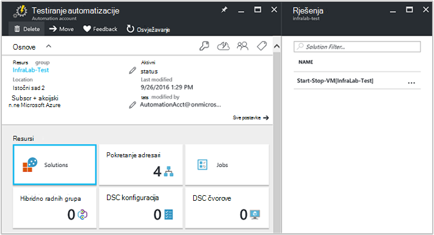

<properties
    pageTitle="Početak i kraj VMs tijekom rješenje off-hours [Preview] | Microsoft Azure"
    description="Rješenja za upravljanje VM pokreće i zaustavlja vaše resursima virtualnim računalima sustava Azure na raspored i doći praćenje iz zapisnika analize."
    services="automation"
    documentationCenter=""
    authors="MGoedtel"
    manager="jwhit"
    editor=""
    />
<tags
    ms.service="automation"
    ms.workload="tbd"
    ms.tgt_pltfrm="na"
    ms.devlang="na"
    ms.topic="get-started-article"
    ms.date="10/07/2016"
    ms.author="magoedte"/>

# Početak i kraj VMs tijekom off-hours [Preview] rješenja u automatizacije

Početak i kraj VMs tijekom off-hours [Preview] rješenje pokreće i zaustavlja Voditelj resursa Azure virtualnim strojevima sa sustavom prema rasporedu korisnički definirane i daje uvid u uspjeh automatizaciju zadataka koji pokretanje i zaustavljanje virtualnim strojevima sa OMS zapisnika analize.  

## Preduvjeti

- Na runbooks raditi s [računa za Azure Pokreni kao](automation-sec-configure-azure-runas-account.md).  Na željeni način provjere autentičnosti je račun Pokreni kao jer je koristi provjera autentičnosti potvrda umjesto lozinku koju je možda istekla ili često mijenja.  

- Ovo je rješenje samo možete upravljati VMs koje su u iste pretplate i grupu resursa kao gdje se nalazi na račun za automatizaciju.  

- Ovo se rješenje uvodi se samo na sljedeće Azure područja - Jugoistok Australija, istočnoazijske SAD-a, Jugoistočne Azije i Zapad Europe.  Runbooks koji upravljaju raspored VM usmjeriti na VMs u bilo kojem regiji.  

- Da biste poslali obavijesti e-poštom kada dovršite VM runbooks početka i završetka, potreban je-poslovnu pretplatu na Office 365.  

## Komponente rješenja

Rješenje se sastoji od navedenih resursa koji će biti uvezeni a dodaje se na račun za automatizaciju.

### Runbooks

Runbook | Opis|
--------|------------|
CleanSolution-MS-upravljanje dokumentima-VM | U ovom runbook uklonit će sve njegove resurse i rasporede kada odete da biste izbrisali rješenje iz pretplate.|  
SendMailO365-MS-upravljanje dokumentima | U ovom runbook šalje poruku e-pošte putem sustava Office 365 Exchange.|
StartByResourceGroup-MS-upravljanje dokumentima-VM | U ovom runbook namijenjen da biste pokrenuli VMs (obje klasični i na ARM VMs) koji se nalazi na popisu navedene Azure resursa grupe.
StopByResourceGroup-MS-upravljanje dokumentima-VM | U ovom runbook namijenjen da biste zaustavili VMs (obje klasični i na ARM VMs) koji se nalazi na popisu navedene Azure resursa grupe.|
 

### Varijable

Varijabla | Opis|
---------|------------|
**SendMailO365-MS-upravljanje dokumentima** Runbook ||
SendMailO365-IsSendEmail-MS-upravljanje dokumentima | Određuje ako StartByResourceGroup-MS-upravljanje dokumentima-VM i runbooks StopByResourceGroup-MS-upravljanje dokumentima-VM možete poslati obavijest e-pošte po dovršetku.  Odaberite **True** da biste omogućili i **False** da biste onemogućili upozorenjem e-pošte. Zadana je vrijednost **False**.| 
**StartByResourceGroup-MS-upravljanje dokumentima-VM** Runbook ||
StartByResourceGroup-ExcludeList-MS-upravljanje dokumentima-VM | Unesite imena VM koji treba izuzeti iz postupak upravljanja; razdvajanje imena korištenjem semi-colon(;). Podržana je zamjenskih znakova (zvjezdica) i vrijednosti su velika i mala slova.|
StartByResourceGroup-SendMailO365-EmailBodyPreFix-MS-upravljanje dokumentima | Tekst koji se mogu pridruživati početak tijela poruke e-pošte.|
StartByResourceGroup-SendMailO365-EmailRunBookAccount-MS-upravljanje dokumentima | Određuje naziv računa za automatizaciju koji sadrži runbook e-pošte.  **Izmjena ovu varijablu.**|
StartByResourceGroup-SendMailO365-EmailRunbookName-MS-upravljanje dokumentima | Određuje naziv kompilacije e-pošte.  Koristi se StartByResourceGroup-MS-upravljanje dokumentima-VM i runbooks StopByResourceGroup-MS-upravljanje dokumentima-VM slanje e-pošte.  **Izmjena ovu varijablu.**|
StartByResourceGroup-SendMailO365-EmailRunbookResourceGroup-MS-upravljanje dokumentima | Određuje naziv grupe resursa koji sadrži runbook e-pošte.  **Izmjena ovu varijablu.**|
StartByResourceGroup-SendMailO365-EmailSubject-MS-upravljanje dokumentima | Određuje tekst za redak predmeta e-pošte.|  
StartByResourceGroup-SendMailO365-EmailToAddress-MS-upravljanje dokumentima | Određuje primateljima e-pošte.  Unesite zasebna imena korištenjem semi-colon(;).|
StartByResourceGroup-TargetResourceGroups-MS-upravljanje dokumentima-VM | Unesite imena VM koji treba izuzeti iz postupak upravljanja; razdvajanje imena korištenjem semi-colon(;). Podržana je zamjenskih znakova (zvjezdica) i vrijednosti su velika i mala slova.  Zadana vrijednost (zvjezdica) neće sadržavati svih grupa resursa u pretplate.|
StartByResourceGroup-TargetSubscriptionID-MS-upravljanje dokumentima-VM | Određuje pretplatu koja sadrži VMs da biste upravlja rješenja.  To mora biti dio iste pretplate na kojoj se nalazi na račun za automatizaciju rješenja.|
**StopByResourceGroup-MS-upravljanje dokumentima-VM** Runbook ||
StopByResourceGroup-ExcludeList-MS-upravljanje dokumentima-VM | Unesite imena VM koji treba izuzeti iz postupak upravljanja; razdvajanje imena korištenjem semi-colon(;). Podržana je zamjenskih znakova (zvjezdica) i vrijednosti su velika i mala slova.|
StopByResourceGroup-SendMailO365-EmailBodyPreFix-MS-upravljanje dokumentima | Tekst koji se mogu pridruživati početak tijela poruke e-pošte.|
StopByResourceGroup-SendMailO365-EmailRunBookAccount-MS-upravljanje dokumentima | Određuje naziv računa za automatizaciju koji sadrži runbook e-pošte.  **Izmjena ovu varijablu.**|
StopByResourceGroup-SendMailO365-EmailRunbookResourceGroup-MS-upravljanje dokumentima | Određuje naziv grupe resursa koji sadrži runbook e-pošte.  **Izmjena ovu varijablu.**|
StopByResourceGroup-SendMailO365-EmailSubject-MS-upravljanje dokumentima | Određuje tekst za redak predmeta e-pošte.|  
StopByResourceGroup-SendMailO365-EmailToAddress-MS-upravljanje dokumentima | Određuje primateljima e-pošte.  Unesite zasebna imena korištenjem semi-colon(;).|
StopByResourceGroup-TargetResourceGroups-MS-upravljanje dokumentima-VM | Unesite imena VM koji treba izuzeti iz postupak upravljanja; razdvajanje imena korištenjem semi-colon(;). Podržana je zamjenskih znakova (zvjezdica) i vrijednosti su velika i mala slova.  Zadana vrijednost (zvjezdica) neće sadržavati svih grupa resursa u pretplate.|
StopByResourceGroup-TargetSubscriptionID-MS-upravljanje dokumentima-VM | Određuje pretplatu koja sadrži VMs da biste upravlja rješenja.  To mora biti dio iste pretplate na kojoj se nalazi na račun za automatizaciju rješenja.|  
 

### Rasporedi

Raspored | Opis|
---------|------------|
StartByResourceGroup – raspored-MS-upravljanje dokumentima | Raspored za runbook StartByResourceGroup koji se izvodi pri pokretanju programa VMs upravlja rješenja.|
StopByResourceGroup – raspored-MS-upravljanje dokumentima | Raspored za runbook StopByResourceGroup koji se izvodi zatvaranja VMs upravlja rješenja.|

### Vjerodajnice

Vjerodajnica | Opis|
-----------|------------|
O365Credential | Određuje valjani korisnički račun sustava Office 365 da biste poslali e-pošte.  Samo potreban varijable SendMailO365-IsSendEmail-MS-upravljanje dokumentima postavljen na **True**.

## Konfiguracija

Izvršite sljedeće korake da biste dodali početak i kraj VMs tijekom off-hours [Preview] rješenje računa za automatizaciju i konfiguriranje varijable da biste prilagodili rješenja.

1. Na početnom-zaslonu na portalu za Azure, odaberite pločicu **trgovine** .  Ako na pločici više nisu prikvačene na Polazno-zaslon, u lijevom navigacijskom oknu odaberite **Novo**.  
2. U plohu trgovine **Pokretanje VM** upišite u okvir za pretraživanje i zatim u rezultatima pretraživanja odaberite rješenje **Početak i kraj VMs tijekom off-hours [Preview]** .  
3. Na **Početak i kraj VMs tijekom off-hours [Preview]** plohu za odabrano rješenje, pregledali sažetak informacija, a zatim kliknite **Stvori**.  
4. Pojavit će se **Dodati rješenje** plohu gdje se od vas zatraži da biste konfigurirali rješenje prije nego što možete uvesti u svoju pretplatu za automatizaciju.     
5.  Na plohu **Dodaj rješenje** odaberite **radnog prostora** i ovdje odaberete OMS radnog prostora koja je povezana s iste Azure pretplate Automatizacija račun ili stvaranje novog radnog prostora OMS.  Ako nemate radnog prostora programa OMS, možete odabrati **Stvaranje novog radnog prostora** i na **Radni prostor OMS** plohu učinite sljedeće: 
   - Unesite naziv za novu **OMS radnog prostora**.
   - Odaberite **pretplatu** da biste se povezali tako da odaberete na padajućem popisu Ako zadana odabrana nije odgovarajuća.
   - **Grupa resursa**možete stvoriti novu grupu resursa ili odaberite postojeću grupu resursa.  
   - Odaberite **mjesto**.  Trenutno samo za odabir mjesta su **Jugoistok Australija**, **Istočni SAD -a**, **Jugoistočne Azije**i **Zapad Europe**.
   - Odaberite **sloj određivanje cijena**.  Rješenje se nude na dvije razine: slobodno i OMS plaćenu sloju.  Besplatni sloju ima ograničenje na količinu podataka prikupljenih svakodnevno, razdoblje zadržavanja i runbook posao runtime minuta.  Razina OMS plaćenu je ograničenje na količinu podataka koji se prikupljaju svakodnevno.  

        > [AZURE.NOTE]
        > Dok samostalne plaćenu sloju prikazuje se kao mogućnost nije primjenjivo.  Odaberite ga i nastavak stvaranja rješenja za pretplatu, on neće uspjeti.  To će se spomenuti kada je službeno rješenja. Ako koristite rješenja, samo bit će se koristiti minute posao Automatizacija i prijavu ingestion.  Rješenje dodajte dodatne OMS čvorove svoje radno okruženje.  

6. Nakon unošenja potrebne informacije na plohu **OMS radnog prostora** , kliknite **Stvori**.  Dok je potvrđena podatke, a zatim je radni prostor stvoren, možete pratiti tijek u odjeljku **primanje obavijesti** iz izbornika.  Vratit ćete se na plohu **Dodaj rješenje** .  
7. Na plohu **Dodaj rješenje** odaberite **Račun za automatizaciju**.  Ako stvarate novog radnog prostora OMS, bit će morati stvoriti na novi račun za automatizaciju koji će biti povezan s novi OMS radni prostor navedena na popisu, uključujući Azure pretplatu, grupa resursa i regija.  Možete odabrati **Stvori račun za automatizaciju** i na plohu **Automatizacija dodati račun** upišite sljedeće: 
  - U polje **naziv** unesite naziv računa za automatizaciju.

    Sve ostale mogućnosti automatski bili popunjeni koji se temelji na radnom prostoru OMS odabrana, a ne može se mijenjati ove mogućnosti.  Račun za Azure Pokreni kao je zadani način provjere autentičnosti runbooks obuhvaćeno rješenja.  Kada kliknete **u redu**, mogućnosti konfiguracije se potvrđuju i stvaranja računa za automatizaciju.  Možete pratiti tijek u odjeljku **primanje obavijesti** iz izbornika. 

    U suprotnom, možete odabrati postojećeg računa za automatizaciju Pokreni kao.  Napomena da račun koji odaberete nije već se moguće povezati s radnim prostorom za drugi OMS inače poruke prikazat će se u plohu da bi vas obavijestio.  Ako je već povezana, morat ćete odabrati neki drugi račun za automatizaciju Pokreni kao ili stvorite novi.    

8. Na kraju na plohu **Dodaj rješenje** odaberite **konfiguraciju** , a pojavit će se plohu **parametara** .  Na plohu **Parametri** se od vas zatraži da biste:  
   - Navedite **Cilj ResourceGroup imena**, koji se naziva grupe resursa koji sadrži VMs da biste upravlja rješenja.  Možete unijeti više od jednog naziva i razdvajanje svaki pomoću točka-zarez (vrijednosti su velika i mala slova).  Korištenje zamjenski znak podržana je ako želite cilj VMs u svim grupama resursa u pretplate.
   - Odaberite **raspored** koji je ponavljajućeg datuma i vremena za pokretanje i zaustavljanje na VM, u ciljne grupe resursa.  

10. Nakon što ste dovršili konfiguriranje početne postavke potrebne za rješenje, odaberite **Stvori**.  Sve postavke će se provjeriti, a zatim će pokušati implementacija rješenja u svoju pretplatu.  Taj postupak može potrajati nekoliko sekundi da biste dovršili, a možete pratiti tijek u odjeljku **primanje obavijesti** iz izbornika. 

## Učestalost zbirke

Automatizacija posao zapisnika i posao strujanja podataka je ingested u spremištu OMS svakih pet minuta.  

## Korištenje rješenja

Kada dodate rješenje za upravljanje VM, u radnom prostoru OMS **StartStopVM prikaz** pločica se dodaju OMS nadzorne ploče.  Pločica prikazuje count i grafički prikaz runbooks poslova rješenje koje ste pokrenuli i je uspješno dovršeno.     

U računu Automatizacija možete pristupiti i upravljanje rješenje tako da odaberete pločicu **rješenja** , a zatim od plohu **rješenja** na popisu odaberete rješenje **Start-Zaustavi-VM [Workspace]** .     

Odabir rješenje prikazat će se rješenje plohu **Start-Zaustavi-VM [Workspace]** , gdje možete pregledati važne pojedinosti kao što su pločicu **StartStopVM** , kao što su u radnom prostoru OMS koji prikazuje broj i grafički prikaz runbooks poslova rješenje koje ste pokrenuli i je uspješno dovršeno.     

Na tom mjestu možete otvoriti radni prostor OMS i izvođenje daljnje analize zapisa posla.  Samo kliknite **sve postavke**u plohu **Postavke** odaberite **Brzi početak rada** i zatim plohu za **Brzo pokretanje** odaberite **OMS Portal**.   To će se otvori na novoj kartici ili u novu sesiju u pregledniku i prikazao radni prostor OMS vezanih uz račun za automatizaciju i pretplate.  

### Konfiguriranje obavijesti e-poštom

Da biste omogućili obavijesti e-poštom kada na početak i kraj VM runbooks dovršeno, morat ćete izmijeniti **O365Credential** vjerodajnica i barem sljedeće varijable:

 - SendMailO365-IsSendEmail-MS-upravljanje dokumentima
 - StartByResourceGroup-SendMailO365-EmailToAddress-MS-upravljanje dokumentima
 - StopByResourceGroup-SendMailO365-EmailToAddress-MS-upravljanje dokumentima

Da biste konfigurirali vjerodajnica **O365Credential** , učinite sljedeće:

1. Vaš račun automatizacije kliknite **Sve postavke** pri vrhu prozora. 
2. Na plohu **Postavke** u odjeljku **Automatizacija resursa**, odaberite **Resursi**. 
3. Na plohu **imovine** odaberite pločicu **vjerodajnica** i plohu **vjerodajnica** odaberite **O365Credential**.  
4. Unesite valjani Office 365 korisničko ime i lozinku, a zatim kliknite **Spremi** da biste spremili promjene.  

Da biste konfigurirali varijable istaknuta ranije, učinite sljedeće:

1. Vaš račun automatizacije kliknite **Sve postavke** pri vrhu prozora. 
2. Na plohu **Postavke** u odjeljku **Automatizacija resursa**, odaberite **Resursi**. 
3. Na plohu **imovine** odaberite pločicu **varijable** plohu **varijable** odaberite varijabla naveden i mijenjati njegov vrijednost sljedeće opis je naveden u odjeljku [varijabla](##variables) neke starije verzije.  
4. Kliknite **Spremi** da biste spremili promjene varijabli.   

### Izmjena rasporeda pokretanja i isključivanja

Upravljanje raspored pokretanja i isključivanja ovog rješenja slijedi iste korake kao što je vidljivo [Zakazivanje runbook u automatizaciji Azure](automation-scheduling-a-runbook.md).  Ne zaboravite, ne možete mijenjati raspored konfiguracije.  Morat ćete onemogućiti postojeći raspored i zatim stvorite novi, a zatim povezati **StartByResourceGroup-MS-upravljanje dokumentima-VM** ili runbook **StopByResourceGroup-MS-upravljanje dokumentima-VM** željeni raspored da biste primijenili.   

## Prijava analitiku zapisa

Automatizacija stvara dvije vrste zapisa u spremištu OMS.

### Zapisnici posla

Svojstvo | Opis|
----------|----------|
Pozivatelja |  Tko je pokrenuo postupak.  Moguće vrijednosti su adresu e-pošte ili sustav za Zakazani zadaci.|
Kategorija | Klasifikacija vrstu podataka.  Automatizacija, vrijednost je JobLogs.|
CorrelationId | GUID koji je Id korelacije runbook posla.|
JobId | GUID koji je Id runbook posao.|
operationName | Navodi vrstu operacije obavljene u Azure.  Automatizacija, vrijednost će biti posao.|
resourceId | Navodi vrstu resursa u Azure.  Automatizacija, vrijednost je račun za automatizaciju povezan s na runbook.|
ResourceGroup | Određuje naziv grupe resursa runbook posla.|
ResourceProvider | Određuje servisa Azure iz kojeg se dohvaćaju resursa možete uvesti i upravljati njima.  Automatizacija, vrijednost je Azure automatizaciju.|
ResourceType | Navodi vrstu resursa u Azure.  Automatizacija, vrijednost je račun za automatizaciju povezan s na runbook.|
resultType | Stanje runbook posao.  Moguće vrijednosti su: -Rada -Zaustavljeno -Obustavljeno -Nije uspjela – Uspješno|
resultDescription | U članku se opisuje stanje runbook posao rezultat.  Moguće vrijednosti su: -Pokreće posao -Posao nije uspjela -Zadatak dovršen|
RunbookName | Određuje naziv u kompilacije.|
SourceSystem | Određuje u izvorišnom sustavu za podatke koji se šalje.  Automatizacija, vrijednost će biti: OpsManager|
StreamType | Navodi vrstu događaja. Moguće vrijednosti su: -Opširno -Izlaz -Pogreška -Upozorenje|
SubscriptionId | Određuje ID pretplate posla.
Vrijeme | Datum i vrijeme kada se izvršava runbook posao.|

### Strujanja posla

Svojstvo | Opis|
----------|----------|
Pozivatelja |  Tko je pokrenuo postupak.  Moguće vrijednosti su adresu e-pošte ili sustav za Zakazani zadaci.|
Kategorija | Klasifikacija vrstu podataka.  Automatizacija, vrijednost je JobStreams.|
JobId | GUID koji je Id runbook posao.|
operationName | Navodi vrstu operacije obavljene u Azure.  Automatizacija, vrijednost će biti posao.|
ResourceGroup | Određuje naziv grupe resursa runbook posla.|
resourceId | Određuje resursa Id Azure.  Automatizacija, vrijednost je račun za automatizaciju povezan s na runbook.|
ResourceProvider | Određuje servisa Azure iz kojeg se dohvaćaju resursa možete uvesti i upravljati njima.  Automatizacija, vrijednost je Azure automatizaciju.|
ResourceType | Navodi vrstu resursa u Azure.  Automatizacija, vrijednost je račun za automatizaciju povezan s na runbook.|
resultType | Rezultat posao runbook trenutku generirana događaj.  Moguće vrijednosti su: – U tijeku|
resultDescription | Obuhvaća strujanje Izlaz iz na runbook.|
RunbookName | Naziv na kompilacije.|
SourceSystem | Određuje u izvorišnom sustavu za podatke koji se šalje.  Automatizacija, vrijednost će biti OpsManager|
StreamType | Vrsta zadatka strujanje. Moguće vrijednosti su: -Tijeku -Izlaz -Upozorenje -Pogreška -Ispravljanje pogrešaka -Opširno|
Vrijeme | Datum i vrijeme kada se izvršava runbook posao.|

Kada dovršite sve zapisnika pretraživanja koji vraća zapise kategoriju **JobLogs** ili **JobStreams**, možete odabrati prikaz **JobLogs** ili **JobStreams** koja se prikazuje skup pločice sa sažetkom ažuriranja rezultata pretraživanja.

## Ogledna zapisnika pretraživanja

Sljedeća tablica sadrži ogledne zapisnika pretraživanja za posao zapise koji se prikupljaju rješenja. 

Upit | Opis|
----------|----------|
Pronalaženje zadataka za runbook StartVM koji je uspješno dovršeno | Kategorija = JobLogs RunbookName_s = "StartByResourceGroup-MS-upravljanje dokumentima-VM" ResultType = uspjela & #124; Izmjerite count() po JobId_g|
Pronalaženje zadataka za runbook StopVM koji je uspješno dovršeno | Kategorija = JobLogs RunbookName_s = "StartByResourceGroup-MS-upravljanje dokumentima-VM" ResultType = nije uspjela & #124; Izmjerite count() po JobId_g
Prikaz statusa posla tijekom vremena za StartVM i StopVM runbooks | Kategorija = JobLogs RunbookName_s = "StartByResourceGroup-MS-upravljanje dokumentima-VM" ili "StopByResourceGroup-MS-upravljanje dokumentima-VM" NOT(ResultType="started") | Izmjerite Count() intervalom ResultType jedan dan|

## Daljnji koraci

- Da biste saznali više o tome kako sastavljanje upita za pretraživanje za različite i Pregled zapisnika posao Automatizacija pomoću zapisnika analize, potražite u članku [zapisnika pretraživanja u zapisnik Analytics](../log-analytics/log-analytics-log-searches.md)
- Da biste saznali više o izvođenja runbook kako praćenje runbook poslovi i drugim tehničke pojedinosti potražite u članku [praćenje runbook posla](automation-runbook-execution.md)
- Dodatne informacije o OMS zapisnika analize i izvore zbirke podataka potražite u članku [Prikupljanje Azure prostora za pohranu podataka u Pregled zapisnika analize](../log-analytics/log-analytics-azure-storage.md)

   

