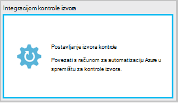
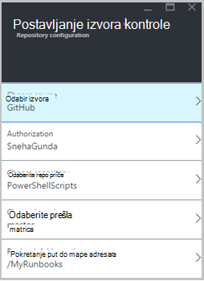
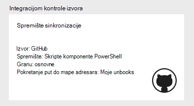
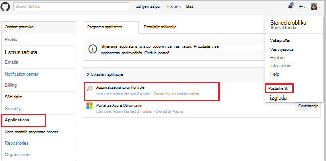
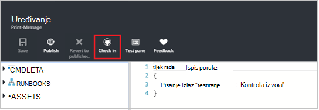
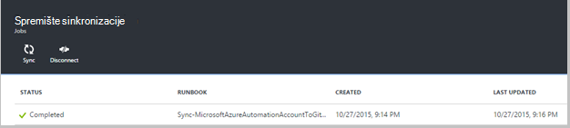
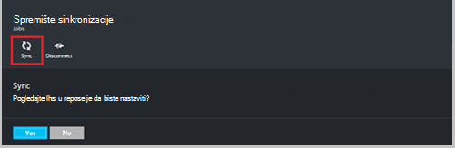
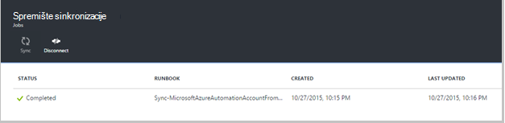
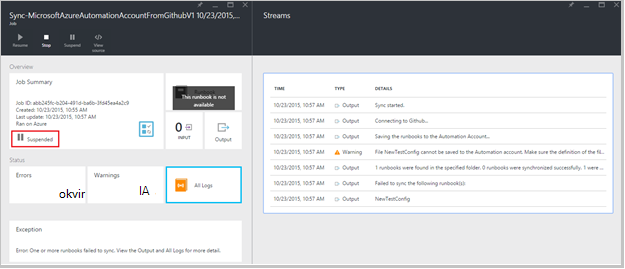
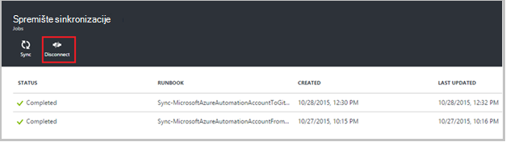

<properties 
    pageTitle=" Izvor integracijom kontrole u automatizaciji Azure | Microsoft Azure"
    description="U ovom se članku opisuju izvor kontrole Integracija s GitHub u automatizaciji Azure."
    services="automation"
    documentationCenter=""
    authors="mgoedtel"
    manager="jwhit"
    editor="tysonn" />    
<tags 
    ms.service="automation"
    ms.devlang="na"
    ms.topic="article"
    ms.tgt_pltfrm="na"
    ms.workload="infrastructure-services"
    ms.date="09/12/2016"
    ms.author="magoedte;sngun" />

# Integracijom kontrole izvora u automatizaciji Azure

Integracijom kontrole izvora omogućuje povezivanje runbooks na vašem računu Automatizacija za kontrole spremišta GitHub izvora. Kontrola izvora omogućuje jednostavno Suradnja s timom, evidentiranje promjena i vratiti starije verzije programa sustava runbooks. Na primjer, kontrola izvora omogućuje da biste sinkronizirali različitim podružnicama u kontroli izvorišnog razvoj, testiranje ili radni Automatizacija računi, jednostavno Promicanje kod koji testirano u razvojno okruženje za radni Automatizacija računa.

Kontrola izvora omogućuje automatske kod iz Azure Automatizacija kontrola izvora ili povući runbooks iz izvora kontrole za automatizaciju Azure. U ovom se članku opisuje kako postaviti izvor kontrole u svom okruženju Azure automatizaciju. Ćemo će se pokrenuti konfiguriranjem Azure Automatizacija za pristup vašem GitHub spremište i voditi kroz različite operacije koje je moguće izvršiti pomoću integracijom kontrole izvora. 

>[AZURE.NOTE]Kontrola izvora podržava izvlačenja i margina [runbooks PowerShell tijeka rada](automation-runbook-types.md#powershell-workflow-runbooks) , kao i [PowerShell runbooks](automation-runbook-types.md#powershell-runbooks). [Grafički runbooks](automation-runbook-types.md#graphical-runbooks) još nije podržana.  

Postoje dvije jednostavne korake potrebne da biste konfigurirali izvora kontrole za vaš račun za automatizaciju i samo jedan ako već imate račun za GitHub. Mogućnosti su sljedeće:
## Korak 1 – stvaranje GitHub spremište

Ako već imate račun GitHub i spremište koje želite povezati Azure Automatizacija, a zatim prijavite se na postojeći račun i pokretanje korak 2 u nastavku. U suprotnom idite do [GitHub](https://github.com/), prijavite se prema gore za novi račun i [stvorite novu spremište](https://help.github.com/articles/create-a-repo/).

## Korak 2 – postavljanje izvora kontrole u automatizaciji Azure

1. Račun za automatizaciju plohu na portalu za Azure, kliknite **postavite izvor kontrole.** 
 
    

2. Otvorit će se plohu **Kontrola izvora** na kojoj možete konfigurirati GitHub podatke o računu. U nastavku je popis parametara da biste konfigurirali:  

  	|**Parametar**            |**Opis** |
  	|:---|:---| 
  	|Odabir izvora   | Odaberite izvor. Trenutno je podržano samo **GitHub** . |
  	|Autorizacija | Kliknite gumb **ovlasti** da biste dodijelili pristup Azure Automatizacija vaše GitHub spremište. Ako već prijavljeni s računom GitHub u drugi prozor, koristi se vjerodajnica za taj račun. Kada autorizacije ne uspije, u plohu prikazivat će se GitHub korisničko ime u odjeljku **Svojstva za autorizaciju**. |
  	|Odaberite spremište | Odaberite GitHub spremište s popisa dostupnih spremišta. |
  	|Odaberite podružnice | S popisa dostupnih grana, odaberite grani. Prikazuje se samo **glavni** granu ako niste stvorili sve grana. |
  	|Put do mape Runbook | Put do mape runbook navodi put u spremištu GitHub iz kojeg želite automatske ili povući kod. Moraju biti unesena u obliku **/foldername/subfoldername**. Samo runbooks put do mape runbook će se sinkronizirati s računom za automatizaciju. Runbooks u podmape runbook mapu put će **nije** moguće sinkronizirati. Korištenje **/** da biste sinkronizirali sve runbooks u odjeljku spremište. |

3. Ako, na primjer, ako imate spremište pod nazivom **PowerShellScripts** koja sadrži mapu pod nazivom **RootFolder**, koji sadrži mapu pod nazivom **podmape**. Možete koristiti sljedeće nizove da biste sinkronizirali svaku razinu mape:

    1. Da biste sinkronizirali runbooks **spremištu**je put do mape runbook*/*
    2. Da biste sinkronizirali runbooks iz **RootFolder**, put do mape runbook je */RootFolder*
    3. Da biste sinkronizirali runbooks iz **podmape**, put do mape runbook je */RootFolder/SubFolder*.
  

4. Kada konfigurirate parametre, prikazuju se na na **Postavljanje izvora kontrole plohu.**  
 
    

5. Kada kliknete u redu, integracijom kontrole izvora sada je konfiguriran za vaš račun za automatizaciju i mora se ažurirati podatke GitHub. Sada možete kliknuti na taj dio da biste pogledali sve povijesti izvor kontrole sinkronizaciju posao.  

    

6. Nakon postavljanja kontrola izvora u sljedećim resursima Automatizacija će se stvoriti u račun za automatizaciju:  
 Stvaraju se dvije [varijable resursi](automation-variables.md) .  
      
    * Varijable **Microsoft.Azure.Automation.SourceControl.Connection** sadrži vrijednosti niza za povezivanje, kao što je prikazano u nastavku.  

  	|**Parametar**            |**Vrijednost** |
  	|:---|:---|
  	| Ime  | Microsoft.Azure.Automation.SourceControl.Connection |
  	| Vrsta | Niz |
  	| Vrijednost  | {"Granu":\<*naziva granu*>, "RunbookFolderPath":\<*put do mape Runbook*>, "ProviderType":\<*ima vrijednost 1 za GitHub*>, "Spremište":\<*naziv vaše spremište*>, "Korisničko ime":\<*GitHub vaše korisničko ime*>} |   

    * Varijable **Microsoft.Azure.Automation.SourceControl.OAuthToken**sadrži vrijednost sigurne šifrirane vaše OAuthToken.  

  	|**Parametar**            |**Vrijednost** |
  	|:---|:---|
  	| Ime  | Microsoft.Azure.Automation.SourceControl.OAuthToken |
  	| Vrsta | Unknown(encrypted) |
  	| Vrijednost | <*Šifrirana OAuthToken*> |  

      

    * **Kontrola izvora Automatizacija** dodaje se kao ovlašteni aplikacije na račun servisa GitHub. Da biste pogledali aplikacije: na početnoj stranici GitHub, idite na **profil** > **Postavke** > **aplikacije**. Ova aplikacija omogućuje automatizaciju Azure da biste sinkronizirali svoje GitHub spremište s računom za automatizaciju.  

    

## Korištenje kontrola izvora u automatizacije

### Prijava runbook iz Automatizacija Azure i kontrola izvora

Runbook prijavi omogućuje automatske promjene koje ste napravili runbook u automatizaciji Azure u spremištu za kontrole izvora. U nastavku su navedeni koraci da biste na runbook za prijavu:

1. S Automatizacija račun, [stvorite novu tekstnih runbook](automation-first-runbook-textual.md)ili [Uređivanje na postojećim, tekstualnih runbook](automation-edit-textual-runbook.md). U ovom runbook može biti tijek rada programa PowerShell ili runbook za skriptu PowerShell.  

2. Kada uredite vaše runbook, spremite je i kliknite **Prijava** s plohu **Uređivanje** .  

    

     >[AZURE.NOTE] Prijava s Azure Automatizacija prebrisat će kod koji trenutno postoji u izvor kontrole. Brojka ekvivalentan naredbenog retka uputa prijavi se **brojka Dodaj + brojka potvrdi + brojka automatske**  

3. Kada kliknete **Prijava**, zatražit će se s poruci za potvrdu kliknite da da biste nastavili.  

    

4. Prijava pokreće runbook kontrola izvora: **Sinkronizacija MicrosoftAzureAutomationAccountToGitHubV1**. U ovom runbook povezuje GitHub i ih gura promjene iz Azure Automatizacija vaše spremište. Da biste prikazali Povijest zadatka za prijavu, vratite se na karticu **Integracijom kontrole izvora** , a zatim kliknite da biste otvorili plohu spremište sinkronizacije. U ovom plohu prikazuju se svi poslova izvor kontrole.  Odaberite posao želite pogledati i kliknite da biste vidjeli detalje.  

    

    >[AZURE.NOTE] Izvor kontrole runbooks su posebno runbooks Automatizacija koje ne možete prikazati ni uređivati. Dok se oni neće se prikazivati na popisu runbook, vidjet ćete sinkronizacije zadataka koji se prikazuje na popisu zadataka.
 
5. Naziv kompilacije izmijenjene šalje se kao ulazni parametar runbook prijavi. Možete [vidjeti detalje posao](automation-runbook-execution.md#viewing-job-status-using-the-azure-management-portal) proširenjem runbook u **Spremištu sinkronizacije** plohu.  

    

6. Osvježavanje vaše spremište GitHub nakon dovršetka posla da biste vidjeli promjene.  Vaše spremište porukom potvrdi mora biti u potvrdi: *Naziv Runbook *ažuriranja ** u Azure Automation.* *  

### Sinkroniziranje runbooks iz izvora kontrole za automatizaciju Azure 

Gumb za sinkroniziranje plohu spremište sinkronizacije omogućuje vam da biste izvukli sve runbooks put do mape runbook vaše spremište na račun za automatizaciju. U istom spremištu mogu se sinkronizirati s više od jednog računa za automatizaciju. U nastavku su navedeni koraci za sinkronizaciju s runbook:

1. S računa Automatizacija gdje postavljanje kontrola izvora, otvorite **plohu izvor kontrole Integracija/spremište sinkronizacije** i kliknite **Sinkroniziraj** , a zatim zatražit će se potvrdnu poruku, kliknite **da** da biste nastavili.  

    

2. Sinkronizacija započinje s runbook: **Sinkronizacija MicrosoftAzureAutomationAccountFromGitHubV1**. U ovom runbook povezuje GitHub i povlači promjene na spremištu Azure automatizaciju. Trebali biste vidjeti novi zadatak na plohu **Spremište sinkronizacije** za ovu akciju. Da biste vidjeli detalje o posao sinkronizacije, kliknite da biste otvorili pojedinosti plohu posao.  
 
    

 
    >[AZURE.NOTE] Sinkroniziranje s kontrolom izvorišnog prebrisati verziju skice runbooks koji trenutno postoje na vašem računu Automatizacija za **sve** runbooks koje trenutno izvor kontrole. Upute za brojka ekvivalentan naredbenog retka da biste sinkronizirali je **brojka istaknuti**

## Otklanjanje poteškoća izvor kontrole

Ako postoje pogreške prijavi ili Sinkroniziraj posla, mora biti obustavljeno statusu zadatka, a možete prikazati dodatne detalje o pogrešci u plohu posao.  Dio **Sve zapisnike** vidjet ćete sva strujanja PowerShell pridružene taj zadatak. To će vam dati pojedinosti potrebno možete riješiti probleme s prijavi ili sinkronizaciju. Ga i vidjet ćete niza akcija nastalih prilikom sinkronizacije ili provjere u na runbook.  

## Prekid veze s kontrolom izvora

Da biste prekinuli računa GitHub, otvorite plohu spremište sinkronizacije i kliknite **Prekini vezu**. Kada prekinete kontrola izvora, runbooks koje su prethodno sinkronizirane i dalje će ostati na vašem računu Automatizacija, ali plohu spremište sinkronizacije nije omogućen.  

  

## Daljnji koraci

Dodatne informacije o integracijom kontrole izvora potražite u sljedećim resursima:  
- [Azure Automatizacija: Integracijom kontrole izvora u Azure automatizacije](https://azure.microsoft.com/blog/azure-automation-source-control-13/)  
- [Glasati za omiljene izvorišnog sustava kontrola](https://www.surveymonkey.com/r/?sm=2dVjdcrCPFdT0dFFI8nUdQ%3d%3d)  
- [Azure Automatizacija: Integracija Runbook izvor kontrole pomoću Visual Studio Team Services](https://azure.microsoft.com/blog/azure-automation-integrating-runbook-source-control-using-visual-studio-online/)  
