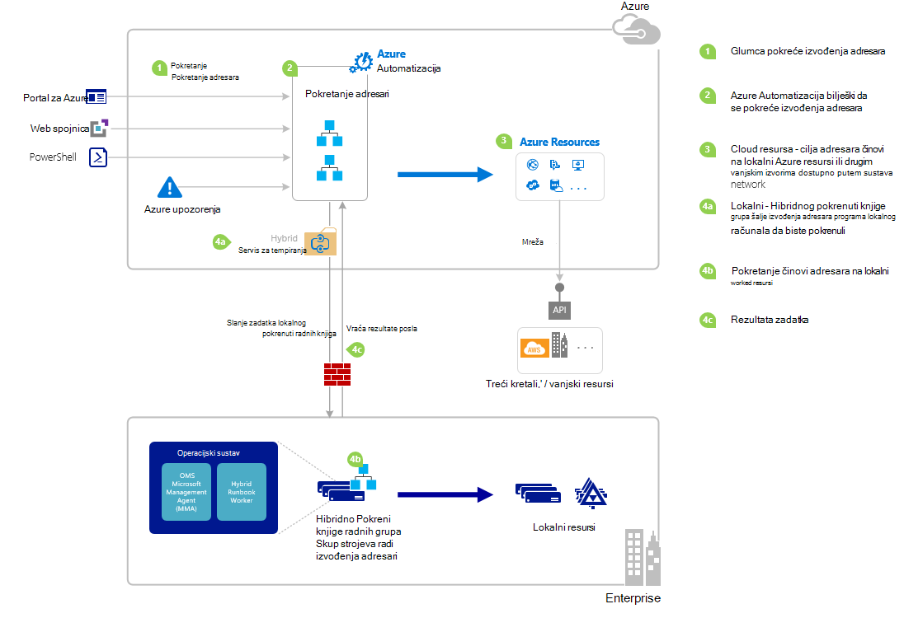

<properties
   pageTitle="Pokretanje programa runbook u Azure Automatizacija | Microsoft Azure"
   description="Navedene različite načine na koje možete koristiti da biste započeli s runbook u Automatizacija Azure te sadrži detalje o korištenju Azure portal i komponente Windows PowerShell."
   services="automation"
   documentationCenter=""
   authors="mgoedtel"
   manager="jwhit"
   editor="tysonn" />
<tags
   ms.service="automation"
   ms.devlang="na"
   ms.topic="article"
   ms.tgt_pltfrm="na"
   ms.workload="infrastructure-services"
   ms.date="10/08/2016"
   ms.author="magoedte;bwren"/>

# <a name="starting-a-runbook-in-azure-automation"></a>Pokretanje programa runbook u automatizaciji Azure

U sljedećoj su tablici će vam pomoći odrediti način da biste započeli s runbook u Automatizacija Azure najčešće prikladan za određeni scenariju. Ovaj članak sadrži informacije o pokretanju programa runbook s portala za Azure i komponente Windows PowerShell. Detalje o druge načine nalaze se u nekoj drugoj dokumentaciji koje možete pristupiti putem veze u nastavku.

| **NAČIN**                                                                    | **ZNAČAJKE**                                                                                                                                                                                                                                                                                                                                                |
|-------------------------------------------------------------------------------|--------------------------------------------------------------------------------------------------------------------------------------------------------------------------------------------------------------------------------------------------------------------------------------------------------------------------------------------------------------------|
| [Portal za Azure](#starting-a-runbook-with-the-azure-portal)                     | <li>Najjednostavniji način interaktivne korisničko sučelje.<br> <li>Obrazac za unos vrijednosti parametra jednostavne.<br> <li>Jednostavno pratite stanje posla.<br> <li>Pristup ovjerena Azure prijave.                                                                                                                                                                               |
| [Komponente Windows PowerShell](https://msdn.microsoft.com/library/dn690259.aspx)        | <li>Pozivanje iz naredbenog retka pomoću cmdleta ljuske Windows PowerShell.<br> <li>Moguće ih je uvrstiti u automatiziranog rješenje s više koraka.<br> <li>Zahtjev za ovjerena certifikat ili korisnik OAuth glavni / servisa glavni.<br> <li>Sadrže vrijednosti parametara jednostavnih i složenih.<br> <li>Praćenje stanja zadatka.<br> <li>Klijent potrebne za podršku cmdleta ljuske PowerShell. |
| [Azure Automatizacija API-JA](https://msdn.microsoft.com/library/azure/mt662285.aspx) | <li>Većina fleksibilne način, ali i većina kompleksnog.<br> <li>Pozivanje iz prilagođenog koda koje mogu poboljšati HTTP zahtjeva.<br> <li>Zahtjev za ovjerena certifikat ili korisnik Oauth glavni / servisa glavni.<br> <li>Sadrže vrijednosti parametara jednostavnih i složenih.<br> <li>Praćenje stanja zadatka.                                                                          |
| [Webhooks](automation-webhooks.md)                                            | <li>Pokretanje runbook iz jedne HTTP zahtjev.<br> <li>Provjeriti autentičnost kod sigurnosnog tokena u URL-u.<br> <li>Klijent nije moguće nadjačati vrijednosti parametara navedenih stvaranja webhook. Runbook možete definirati jedan parametar koji je popunjen detalje HTTP zahtjev.<br> <li>Nema mogućnost praćenja stanja zadatka kroz webhook URL-a.                                      |
| [Odgovaranje na upozorenja za Azure](../log-analytics/log-analytics-alerts.md)               | <li>Započnite s runbook u odgovoru Azure upozorenja.<br> <li>Konfiguriranje webhook runbook i povezati se upozorenje.<br> <li>Provjeriti autentičnost kod sigurnosni token u URL-u.<br> <li>Trenutno podržava upozorenje na metriku samo.                                                                                                                                                       |
| [Raspored](automation-schedules.md)                                | <li>Automatsko pokretanje runbook svaki sat, svakodnevno ili jednom tjedno rasporedu.<br> <li>Rukovanje raspored kroz Azure portal, cmdleta ljuske PowerShell ili Azure API-JA.<br> <li>Sadrže vrijednosti parametara koja će se koristiti s raspored.                                                                                                                                               |
| [Iz drugog Runbook](automation-child-runbooks.md)                          | <li>Pomoću programa runbook kao aktivnost u drugom runbook.<br> <li>Korisne su za funkciju koristi više runbooks.<br> <li>Unos vrijednosti parametra za dijete runbook i koristite izlaza nadređenog runbook.                                                                                                                                                               |

Sljedeća slika prikazuje detaljne detaljan postupak u životnog ciklusa web kompilacije. Uključuje različite načine na runbook pokreće se u Automatizacija Azure komponente potrebne za hibridno Runbook tempiranja izvršiti runbooks Automatizacija Azure i interakcije između različitih komponenata. Da biste saznali više o izvođenju Automatizacija runbooks u vašem podatkovnog centra, pogledajte [Zaposlenici zaduženi za hibridno runbook](automation-hybrid-runbook-worker.md)



## <a name="starting-a-runbook-with-the-azure-portal"></a>Počevši s runbook s portala za Azure

1.  Na portalu Azure odaberite **Automatizacija** , a zatim kliknite naziv računa za automatizaciju.
2.  Odaberite karticu **Runbooks** .
3.  Odaberite na runbook, a zatim **pokretanje**.
4.  Ako je na runbook parametara, zatražit će se možete unijeti vrijednosti s tekstnim okvirom za svaki parametar. Dodatne informacije o parametrima potražite u članku [Runbook parametara](#Runbook-parameters) ispod.
5.  Odaberite **Prikaz posla** uz poruku runbook **Početni** ili odaberite karticu **zadatke** za runbook da biste vidjeli status runbook zadatka.

## <a name="starting-a-runbook-with-the-azure-portal"></a>Počevši s runbook s portala za Azure

1.  Vaš račun automatizacije kliknite dio **Runbooks** da biste otvorili plohu **Runbooks** .
2.  Kliknite runbook da biste otvorili njegov plohu **Runbook** .
3.  Kliknite **Start**.
4.  Ako je na runbook bez parametara, zatražit će se da biste potvrdili da želite li ga pokrenuti. Ako je na runbook parametara, otvorit će se **Pokrenuti Runbook** plohu tako da možete unijeti vrijednosti parametara. Dodatne informacije o parametrima potražite u članku [Runbook parametara](#Runbook-parameters) ispod.
5.  Plohu **posao** otvara se tako da možete pratiti statusa posla.

## <a name="starting-a-runbook-with-windows-powershell"></a>Pokretanje programa runbook s komponentom Windows PowerShell

[Početak AzureRmAutomationRunbook](https://msdn.microsoft.com/library/mt603661.aspx) možete koristiti da biste započeli s runbook s komponentom Windows PowerShell. Sljedeći primjer kod pokreće runbook naziva Test Runbook.

```
Start-AzureRmAutomationRunbook -AutomationAccountName "MyAutomationAccount" -Name "Test-Runbook" -ResourceGroupName "ResourceGroup01"
```

Početak AzureRmAutomationRunbook vraća objekt posla koje možete koristiti da biste pratili njezin status kada se pokrene u runbook. Ovaj zadatak objekt možete koristiti s [Get-AzureRmAutomationJob](https://msdn.microsoft.com/library/mt619440.aspx) da biste odredili status zadatka i [Get-AzureRmAutomationJobOutput](https://msdn.microsoft.com/library/mt603476.aspx) da biste dobili rezultat. Sljedeći primjer kod pokreće runbook naziva Test-Runbook, čekanje dok ne dovrši, a zatim prikazuje rezultat.

```
$runbookName = "Test-Runbook"
$ResourceGroup = "ResourceGroup01"
$AutomationAcct = "MyAutomationAccount"

$job = Start-AzureRmAutomationRunbook –AutomationAccountName $AutomationAcct -Name $runbookName -ResourceGroupName $ResourceGroup

$doLoop = $true
While ($doLoop) {
   $job = Get-AzureRmAutomationJob –AutomationAccountName $AutomationAcct -Id $job.JobId -ResourceGroupName $ResourceGroup
   $status = $job.Status
   $doLoop = (($status -ne "Completed") -and ($status -ne "Failed") -and ($status -ne "Suspended") -and ($status -ne "Stopped"))
}

Get-AzureRmAutomationJobOutput –AutomationAccountName $AutomationAcct -Id $job.JobId -ResourceGroupName $ResourceGroup –Stream Output
```

Ako na runbook zahtijeva parametre, morate ih unijeti kao [hashtable](http://technet.microsoft.com/library/hh847780.aspx) gdje ključ na hashtable odgovara nazivu parametra i vrijednost je vrijednost parametra. Sljedeći primjer prikazuje način da biste započeli s runbook s dva niza parametra pod nazivom ime i prezime, cijeli pod nazivom RepeatCount i Booleova parametar pod nazivom prikaz. Dodatne informacije o parametrima potražite u članku [Runbook parametara](#Runbook-parameters) dolje.

```
$params = @{"FirstName"="Joe";"LastName"="Smith";"RepeatCount"=2;"Show"=$true}
Start-AzureRmAutomationRunbook –AutomationAccountName "MyAutomationAccount" –Name "Test-Runbook" -ResourceGroupName "ResourceGroup01" –Parameters $params
```

## <a name="runbook-parameters"></a>Parametri Runbook

Kada započnete s runbook s portala za Azure ili komponente Windows PowerShell, uputama šalje se putem web-servisa Azure automatizaciju. Ovaj servis ne podržava parametara s vrstama složenih podataka. Ako je potrebno navesti vrijednost parametra složene pa morate pozovite ga izravno iz drugog runbook kao što je opisano u [podređene runbooks u automatizaciji Azure](automation-child-runbooks.md).

Web-servisa Azure Automatizacija pronaći ćete posebnu funkcionalnost parametar koji se koriste za određene vrste podataka kao što je opisano u sljedećim odjeljcima.

### <a name="named-values"></a>Imenovani vrijednosti

Ako je parametar vrsta podataka [objekt], a zatim koristite sljedeće JSON OSNOVNI oblik da biste poslali popis imenovanih vrijednosti: *{Name1: 'Vrijednost1', Name2: 'Vrijednost2', Name3: "Value3"}*. Ove vrijednosti mora biti jednostavne vrste. Na runbook primit će parametar kao [PSCustomObject](https://msdn.microsoft.com/library/system.management.automation.pscustomobject%28v=vs.85%29.aspx) sa svojstvima koje odgovaraju svakom imenovana vrijednost.

Razmotrite sljedeće probno runbook koje prihvaća parametar naziva korisnika.

```
Workflow Test-Parameters
{
   param (
      [Parameter(Mandatory=$true)][object]$user
   )
    $userObject = $user | ConvertFrom-JSON
    if ($userObject.Show) {
        foreach ($i in 1..$userObject.RepeatCount) {
            $userObject.FirstName
            $userObject.LastName
        }
    }
}
```

Sljedeći tekst se može koristiti za parametar korisnika.

```
{FirstName:'Joe',LastName:'Smith',RepeatCount:'2',Show:'True'}
```

Rezultat u sljedeće izlaz.

```
Joe
Smith
Joe
Smith
```

### <a name="arrays"></a>Polja.

Ako je parametar polja kao što su [polje] i [niz []], a zatim koristite sljedeće JSON OSNOVNI oblik da biste poslali popis vrijednosti: *[vrijednost1; vrijednost2; Value3]*. Ove vrijednosti mora biti jednostavne vrste.

Razmotrite sljedeće probno runbook koje prihvaća parametar naziva *korisnika*.

```
Workflow Test-Parameters
{
   param (
      [Parameter(Mandatory=$true)][array]$user
   )
    if ($user[3]) {
        foreach ($i in 1..$user[2]) {
            $ user[0]
            $ user[1]
        }
    }
}
```

Sljedeći tekst se može koristiti za parametar korisnika.

```
["Joe","Smith",2,true]
```

Rezultat u sljedeće izlaz.

```
Joe
Smith
Joe
Smith
```

### <a name="credentials"></a>Vjerodajnice

Ako je parametar vrsta podataka **PSCredential**, možete unijeti naziv za automatizaciju Azure [sredstvo vjerodajnicama](automation-credentials.md). Na runbook će dohvatiti vjerodajnica pod nazivom koji navedete.

Razmotrite sljedeće probno runbook koje prihvaća parametar naziva vjerodajnica.

```
Workflow Test-Parameters
{
   param (
      [Parameter(Mandatory=$true)][PSCredential]$credential
   )
   $credential.UserName
}
```

Sljedeći tekst se može koristiti za parametar korisnika uz pretpostavku da je došlo je vjerodajnica resursa pod nazivom *Moje vjerodajnice*.

```
My Credential
```

Pod pretpostavkom da korisničko ime u vjerodajnicu je *jsmith*, rezultat u sljedeće izlaz.

```
jsmith
```

## <a name="next-steps"></a>Daljnji koraci

-   Arhitektura runbook u trenutnom članak sadrži pregled više razine runbooks Upravljanje resursima u Azure i na lokaciji s Runbook tempiranja hibridnog.  Da biste saznali više o izvođenju Automatizacija runbooks u vašem podatkovnog centra, pogledajte [Zaposlenici zaduženi za hibridno Runbook](automation-hybrid-runbook-worker.md).
-   Da biste saznali više o stvaranju modularan runbooks tako da koristi drugi runbooks za određene ili uobičajenih funkcije, pogledajte [Podređeni Runbooks](automation-child-runbooks.md).
