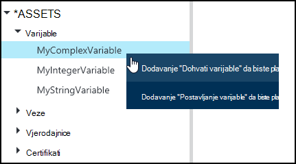
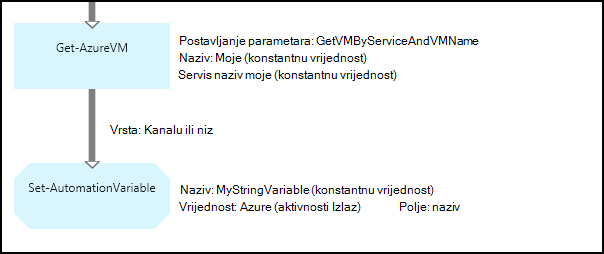
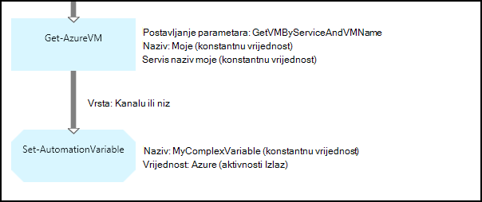
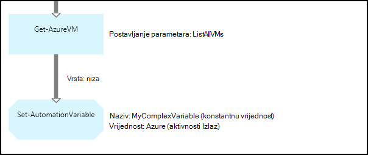
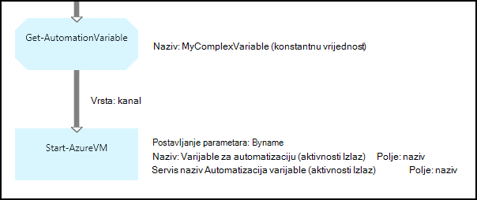
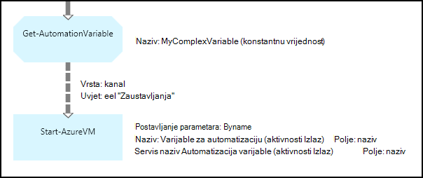

<properties 
   pageTitle="Varijable resursima u Azure Automatizacija | Microsoft Azure"
   description="Varijable Resursi su vrijednosti koje su raspoložive za sve runbooks i konfiguracija DSC u automatizaciji Azure.  U ovom se članku objašnjava detalje varijabli i kako raditi s njima u tekstnih i grafičke za izradu."
   services="automation"
   documentationCenter=""
   authors="mgoedtel"
   manager="jwhit"
   editor="tysonn" />
<tags 
   ms.service="automation"
   ms.devlang="na"
   ms.topic="article"
   ms.tgt_pltfrm="na"
   ms.workload="infrastructure-services"
   ms.date="05/24/2016"
   ms.author="magoedte;bwren" />

# Varijable resursima u Automatizacija Azure

Varijable Resursi su vrijednosti koje su raspoložive za sve runbooks i konfiguracija DSC na vašem računu za automatizaciju. Mogu se stvorili, mijenjati, i dohvatiti Azure, na portalu komponente Windows PowerShell i iz programa runbook ili DSC konfiguracije. Automatizacija varijable su korisne za sljedeće scenarije:

- Zajedničko korištenje vrijednost između više runbooks ili DSC konfiguracije.

- Zajedničko korištenje vrijednost između više zadataka s istom runbook ili DSC konfiguracije.

- Upravljanje vrijednost s portala sustava ili iz naredbenog retka komponente Windows PowerShell, koji se koristi runbooks ili DSC konfiguracije.

Automatizacija varijable se ista i tako da mogu i dalje biti dostupne čak i ako runbook ili DSC konfiguracija ne uspijeva.  Time se vrijednost koju želite je postaviti tako da jedan runbook koji se zatim koristi drugi ili ako se koristi iste runbook ili DSC konfiguracije sljedeći put kad se izvršava.

Pri stvaranju tjednog prikaza kalendara možete odrediti da se pohraniti šifrirane.  Kada varijabla šifriran, sigurno je pohranjen u Automatizacija Azure i njezina vrijednost nije moguće dohvatiti iz cmdlet [Get-AzureAutomationVariable](http://msdn.microsoft.com/library/dn913772.aspx) koji se isporučuje u sklopu modula Azure PowerShell.  Šifrirana vrijednost mogu biti dohvaćeni se samo iz **Get-AutomationVariable** aktivnosti u runbook ili DSC konfiguracije.

>[AZURE.NOTE]Sigurna resursima u Azure Automatizacija obuhvaćaju vjerodajnice, certifikata, veze i šifrirane varijabli. Ove imovine šifriraju se i pohranjuju u automatizaciji Azure pomoću jedinstvenih tipke koje generira za svaki račun za automatizaciju. Ovaj ključ je šifrirana uz osnovne certifikata i pohranjene u automatizaciji Azure. Prije pohrani sigurne resursa, ključ za račun za automatizaciju je dešifriranu pomoću osnovnih certifikata i za šifriranje sredstava.

## Varijable vrste

Kada stvorite tjednog prikaza kalendara s portala za Azure, morate odrediti vrstu podataka s padajućeg popisa da bi portal mogao prikazati odgovarajuće kontrole za unos varijable vrijednost. Varijabla nije ograničena ovu vrstu podataka, ali morate postaviti varijabla pomoću komponente Windows PowerShell ako želite navesti vrijednost različite vrste. Ako navedete **nije definiran**, zatim vrijednost varijable će biti postavljen **$null**, a morate postaviti vrijednost [Skupa AzureAutomationVariable](http://msdn.microsoft.com/library/dn913767.aspx) cmdlet ili **Skup AutomationVariable** aktivnosti.  Ne možete stvoriti ili promijeniti vrijednost kompleksnog varijablu vrsta na portalu, ali možete navesti vrijednost bilo koje vrste pomoću komponente Windows PowerShell. Složene vrste vratit će se kao [PSCustomObject](http://msdn.microsoft.com/library/system.management.automation.pscustomobject.aspx).

Stvaranjem polja ili hashtable i spremanje varijabli možete pohraniti višestruke vrijednosti jedan tjednog prikaza kalendara.

## Cmdleti za i aktivnosti tijeka rada

Cmdleti za u tablici u nastavku se koriste za stvaranje i upravljanje njima automatizaciji varijable s komponentom Windows PowerShell. Oni isporuka kao dio [Modul Azure PowerShell](../powershell-install-configure.md) koji je dostupan za korištenje u runbooks Automatizacija i DSC konfiguracije.

|Cmdleti za|Opis|
|:---|:---|
|[Get-AzureAutomationVariable](http://msdn.microsoft.com/library/dn913772.aspx)|Dohvaća vrijednost postojeće varijablu.|
|[Novi AzureAutomationVariable](http://msdn.microsoft.com/library/dn913771.aspx)|Stvara novu varijablu, a postavlja njegovom vrijednošću.|
|[Uklanjanje AzureAutomationVariable](http://msdn.microsoft.com/library/dn913775.aspx)|Uklanja postojeće varijablu.|
|[Postavljanje AzureAutomationVariable](http://msdn.microsoft.com/library/dn913767.aspx)|Postavlja vrijednost za postojeće varijablu.|

Aktivnosti tijeka rada u tablici u nastavku koriste se za pristup Automatizacija varijable u na runbook. Oni su dostupni za upotrebu u runbook ili DSC konfiguracije i isporuka kao dio modul Azure PowerShell.

|Aktivnosti tijeka rada|Opis|
|:---|:---|
|Get-AutomationVariable|Dohvaća vrijednost postojeće varijablu.|
|Postavljanje AutomationVariable|Postavlja vrijednost za postojeće varijablu.|

>[AZURE.NOTE] Izbjegavajte korištenje varijable u – naziv parametar **Get-AutomationVariable** runbook ili DSC konfiguracije jer to zakomplicirati željeli otkriti međuzavisnosti runbooks ili DSC konfiguraciju i automatizaciju varijable u trenutku dizajniranja.

## Stvaranje nove varijable za automatizaciju

### Da biste stvorili novi varijabla s portala za Azure

1. Računa automatizacije kliknite **Resursi** pri vrhu prozora.
1. Pri dnu prozora kliknite **Dodavanje postavku**.
1. Kliknite **Dodaj varijablu**.
1. Dovršite čarobnjak, a zatim kliknite potvrdni okvir da biste spremili novi varijablu.

### Da biste stvorili novi varijabla s portala za Azure

1. Računa automatizacije kliknite dio **imovine** da biste otvorili plohu **Resursi** .
1. Kliknite dio **varijable** da biste otvorili plohu **varijabli** .
1. Kliknite **Dodaj varijabla** pri vrhu na plohu.
1. Ispunite obrazac, a zatim kliknite **Stvori** da biste spremili novi varijablu.

### Da biste stvorili novi varijabla s komponentom Windows PowerShell

Cmdlet [Novo AzureAutomationVariable](http://msdn.microsoft.com/library/dn913771.aspx) stvara nova varijabla i postavlja svoju početnu vrijednost. Možete dohvatiti vrijednost koristeći [Get-AzureAutomationVariable](http://msdn.microsoft.com/library/dn913772.aspx). Ako je vrijednost jednostavna vrsta, vraća se iste vrste. Ako je složene vrste, vraća se **PSCustomObject** .

Sljedeće primjere naredbi pokazati kako stvoriti varijablu vrste niz, a zatim se vratite njegovom vrijednošću.

    New-AzureAutomationVariable –AutomationAccountName "MyAutomationAccount" –Name 'MyStringVariable' –Encrypted $false –Value 'My String'
    $string = (Get-AzureAutomationVariable –AutomationAccountName "MyAutomationAccount" –Name 'MyStringVariable').Value

Sljedeće primjere naredbi pokazati kako stvoriti varijablu s vrstom složene, a zatim se vratite njezina svojstva. U ovom slučaju koristi se objekt virtualnog računala iz **Get-AzureVM** .

    $vm = Get-AzureVM –ServiceName "MyVM" –Name "MyVM"
    New-AzureAutomationVariable –AutomationAccountName "MyAutomationAccount" –Name "MyComplexVariable" –Encrypted $false –Value $vm
    
    $vmValue = (Get-AzureAutomationVariable –AutomationAccountName "MyAutomationAccount" –Name "MyComplexVariable").Value
    $vmName = $vmValue.Name
    $vmIpAddress = $vmValue.IpAddress

## Korištenjem varijable runbook ili DSC konfiguracija

Koristite aktivnost **Skup AutomationVariable** da biste postavili vrijednost varijable za automatizaciju na runbook ili DSC konfiguraciju i **Get-AutomationVariable** preuzeti.  Cmdleti za **Postavljanje AzureAutomationVariable** ili **Get-AzureAutomationVariable** runbook ili DSC konfiguracije bi trebalo koristiti jer su manje učinkovita od aktivnosti tijeka rada.  Također nije moguće dohvatiti vrijednost sigurne varijable s **Get-AzureAutomationVariable**.  Jedini način da biste stvorili nova varijabla iz runbook ili DSC konfiguracije je pomoću cmdleta [New-AzureAutomationVariable](http://msdn.microsoft.com/library/dn913771.aspx) .

### Uzorci tekstnih runbook

#### Postavljanje i dohvaćanja jednostavne vrijednost iz tjednog prikaza kalendara

Sljedeće primjere naredbi pokazuju kako postaviti i dohvaćanje varijablu u tekstnih runbook. U ovom primjeru pretpostavlja koje varijable vrste cijeli broj pod nazivom *NumberOfIterations* i *NumberOfRunnings* i varijablu vrste niz imenovanih *SampleMessage* već stvoren.

    $NumberOfIterations = Get-AutomationVariable -Name 'NumberOfIterations'
    $NumberOfRunnings = Get-AutomationVariable -Name 'NumberOfRunnings'
    $SampleMessage = Get-AutomationVariable -Name 'SampleMessage'
    
    Write-Output "Runbook has been run $NumberOfRunnings times."
    
    for ($i = 1; $i -le $NumberOfIterations; $i++) {
       Write-Output "$i`: $SampleMessage"
    }
    Set-AutomationVariable –Name NumberOfRunnings –Value ($NumberOfRunnings += 1)

#### Postavljanje i dohvaćanje složene objekt u tjednog prikaza kalendara

Sljedeći ogledni kod prikazuje kako ažurirati varijablu složene vrijednošću u tekstnih runbook. U ovom primjeru Azure virtualnog računala dohvaćene s **Get-AzureVM** i spremiti postojeće varijable za automatizaciju.  Kao što je opisano u [varijable vrste](#variable-types), to je pohranjena kao u PSCustomObject.

    $vm = Get-AzureVM -ServiceName "MyVM" -Name "MyVM"
    Set-AutomationVariable -Name "MyComplexVariable" -Value $vm

U sljedećem kodu vrijednost dohvaćeni iz varijable i koristi za pokretanje virtualnog računala.

    $vmObject = Get-AutomationVariable -Name "MyComplexVariable"
    if ($vmObject.PowerState -eq 'Stopped') {
       Start-AzureVM -ServiceName $vmObject.ServiceName -Name $vmObject.Name
    }

#### Postavljanje i dohvaćanje zbirke u tjednog prikaza kalendara

Sljedeći kod uzorka pokazuje kako pomoću varijabla zbirka složene vrijednosti u tekstno runbook. U ovom primjeru više Azure virtualnim strojevima dohvaćaju s **Get-AzureVM** i spremaju na postojeće varijable za automatizaciju.  Kao što je opisano u [varijable vrste](#variable-types), to je pohranjena kao skup PSCustomObjects.

    $vms = Get-AzureVM | Where -FilterScript {$_.Name -match "my"}     
    Set-AutomationVariable -Name 'MyComplexVariable' -Value $vms

U sljedeći kod u zbirci dohvaćeni iz varijable i koristiti da biste pokrenuli svaki virtualnog računala.

    $vmValues = Get-AutomationVariable -Name "MyComplexVariable"
    ForEach ($vmValue in $vmValues)
    {
       if ($vmValue.PowerState -eq 'Stopped') {
          Start-AzureVM -ServiceName $vmValue.ServiceName -Name $vmValue.Name
       }
    }

### Grafički runbook uzorka

U grafički runbook, dodajete **Get-AutomationVariable** ili **Skup AutomationVariable** tako da desnom tipkom miša na varijablu u oknu biblioteke grafički uređivača i odaberete željenu aktivnost.

#### Postavljanje vrijednosti u varijablu

Sljedeća slika prikazuje uzorak aktivnosti da biste ažurirali varijabla jednostavne vrijednošću u grafički runbook. U ovom primjeru jedan Azure virtualnog računala koja se dohvaća pomoću **Get-AzureVM** , a naziv računala se sprema postojeće Automatizacija varijable vrste niz.  Nije važno ima li na [je veza kanalu ili niz](automation-graphical-authoring-intro.md#links-and-workflow) jer samo očekivanog jedan objekt u izlaz.

Sljedeća slika prikazuje aktivnosti koristiti da biste ažurirali varijabla složene vrijednošću u grafički runbook. Samo promjena iz prethodnog primjera je određivanje **polja put** za **Izlaz aktivnosti** u aktivnosti **Skup AutomationVariable** tako da se objekt pohranjuju se umjesto samo svojstva objekta.  Kao što je opisano u [varijable vrste](#variable-types), to je pohranjena kao u PSCustomObject.

Sljedeća slika prikazuje sličnu funkciju kao u prethodnom primjeru s više virtualnim strojevima spremili varijabli.  [Niz veze](automation-graphical-authoring-intro.md#links-and-workflow) koristi se ovdje tako da se **Skup AutomationVariable** aktivnosti prima cijeli skup virtualnim strojevima kao jednu zbirku.  Ako [kanalu veza](automation-graphical-authoring-intro.md#links-and-workflow) koristila, zatim aktivnosti **Skup AutomationVariable** želite pokrenuti zasebno za svaki objekt s rezultatom se da će se spremiti samo u zadnji virtualnog računala u zbirci.  Kao što je opisano u [varijable vrste](#variable-types), to je pohranjena kao skup PSCustomObjects.

#### Dohvaćanje vrijednosti iz tjednog prikaza kalendara

Sljedeća slika prikazuje uzorak aktivnosti koje dohvatiti i koristiti tjednog prikaza kalendara u grafički runbook.  Prvi aktivnosti dohvaća virtualnim strojevima spremljenih u varijablu u prethodnom primjeru.  Veza mora biti [kanal](automation-graphical-authoring-intro.md#links-and-workflow) tako da se aktivnosti **Start AzureVM** pokreće se jednom za svaki objekt šalje **Get-AutomationVariable** aktivnosti.  To će funkcionira na isti način bez obzira na jedan objekt ili više objekata spremljena u varijabli.  **Početak AzureVM** aktivnosti koristi svojstva PSCustomObject koji predstavlja svaki virtualnog računala. 

Sljedeća slika prikazuje kako da biste filtrirali objekata pohranjenih u grafički runbook tjednog prikaza kalendara.  [Uvjet](automation-graphical-authoring-intro.md#links-and-workflow) dodaje se veza u prethodnom primjeru da biste filtrirali samo one virtualnim strojevima koji su prestao prilikom postavljanja varijablu.

## Daljnji koraci

- Da biste saznali više o povezivanju aktivnosti zajedno u grafički authoring, potražite u članku [veze u grafički authoring](automation-graphical-authoring-intro.md#links-and-workflow)
- Početak rada s grafički runbooks, potražite u članku [Moj prvi grafički runbook](automation-first-runbook-graphical.md) 
