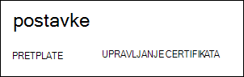
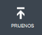
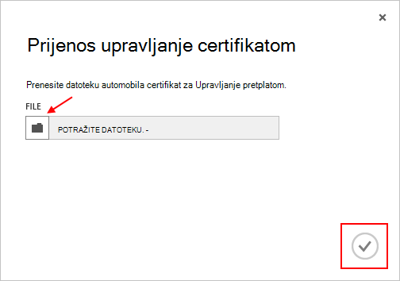

<properties 
    pageTitle="Prijenos potvrdu API Azure upravljanja | Azure Microsoft" 
    description="Saznajte kako prenijeti athe API upravljanja certficate portala klasični Azure." 
    services="cloud-services" 
    documentationCenter=".net" 
    authors="Thraka" 
    manager="timlt" 
    editor=""/>

<tags 
    ms.service="na" 
    ms.workload="tbd" 
    ms.tgt_pltfrm="na" 
    ms.devlang="na" 
    ms.topic="article" 
    ms.date="04/18/2016"
    ms.author="adegeo"/>

# Prijenos potvrdu upravljanje Azure upravljanja API-JA

Upravljanje certifikati omogućuju provjeru s API upravljanje usluge nudi Azure. Mnoge programima i alatima (primjerice Visual Studio ili Azure SDK) će koristiti te certifikati da biste automatizirali konfiguraciju i implementaciju različite servise za Azure. **To se odnosi samo na portalu za Azure klasični**. 

>[AZURE.WARNING] pazi! Ove vrste certifikata Dopusti svima koji potvrđuje s njima da biste upravljali pretplate na kojima su povezane. 

Dodatne informacije o Azure certifikata (uključujući stvaranje samopotpisane potvrde) nije [dostupna](cloud-services/cloud-services-certs-create.md#what-are-management-certificates) ako vam je potrebna.

Možete koristiti i [Azure Active Directory](/services/active-directory/) za provjeru autentičnosti klijenta koda za automatizaciju svrhe.

## Prijenos upravljanje certifikatom

Nakon što dodate upravljanja certficate stvorili, (.cer datoteka s javnim ključem) možete prenijeti u portal. Kada je dostupna na portalu certifikata, svi korisnici s odgovarajućom certficiate (privatni ključ) povezivanje putem upravljanja API-JA i pristup resursima za povezane pretplatu.

1. Prijavite se u [Azure klasični portal](http://manage.windowsazure.com).

2. Obavezno odaberite odgovarajuće pretplatu u koju želite pridružiti certifikat s. Pritisnite tekst **pretplate na** gornjem desnom kutu na portal.

    

3. Kada imate ispravne odabrane pretplate, pritisnite tipku **Postavke** na lijevoj strani portal (možda morati pomaknuti prema dolje). 
    
    

4. Pritisnite karticu **Upravljanje potvrde** .

    
    
5. Pritisnite gumb **Prenesi** .

    
    
6. Ispunite podatke dijaloški okvir, a zatim pritisnite gotovo **kvačica**.

    

## Daljnji koraci

Sad kad ste upravljanja certficate povezan s pretplatom, možete (nakon što ste instalirali odgovarajući certifikat lokalno) programatically povezati [Usluga upravljanja REST API -JA](https://msdn.microsoft.com/library/azure/mt420159.aspx) i automatizirati razne Azure resursa koje su povezane s tom pretplate. 