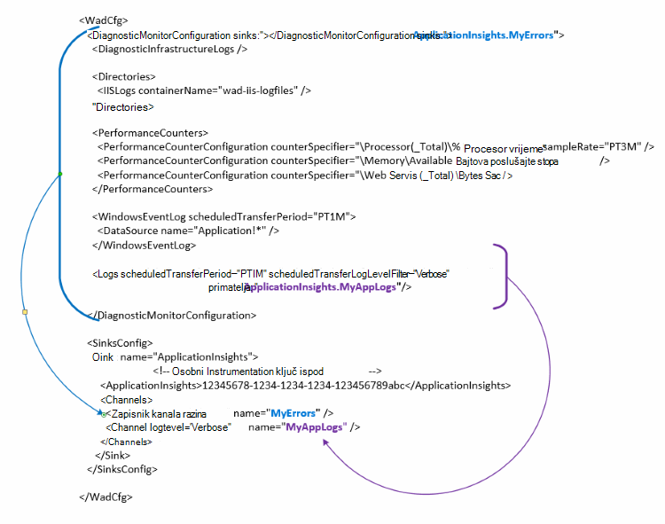

<properties
   pageTitle="Konfiguriranje Azure Dijagnostika slanje podataka u aplikaciji uvide | Microsoft Azure"
   description="Ažurirati Azure Dijagnostika javno konfiguraciju slanje podataka do uvida aplikacije."
   services="multiple"
   documentationCenter=".net"
   authors="sbtron"
   manager="douge"
   editor="" />
<tags
   ms.service="application-insights"
   ms.devlang="na"
   ms.topic="article"
   ms.tgt_pltfrm="na"
   ms.workload="na"
   ms.date="12/15/2015"
   ms.author="saurabh" />

# Konfiguriranje Azure Dijagnostika slanje podataka do uvida aplikacije

Azure Dijagnostika sprema podatke tablice Azure prostora za pohranu.  Međutim, možete i kanala svih ili podskup podataka do uvida aplikacije konfiguriranjem "primatelja" i "kanala" u konfiguraciji prilikom korištenja Azure Dijagnostika proširenje 1.5 ili noviji.

U ovom se članku opisuje kako stvoriti javne konfiguraciju za proširenje Azure Dijagnostika tako da njegov je konfiguriran za slanje podataka u aplikaciji uvide.

## Konfiguriranje aplikacije uvida kao na primatelj

Nastavak Azure Dijagnostika 1,5 predstavlja na **<SinksConfig>** element u konfiguraciji javno. Ovim se definira dodatne *primatelj* gdje se mogu poslati podatke Azure Dijagnostika. Možete navesti detalje aplikacije uvide resursa mjesto na koje želite da biste poslali Azure Dijagnostika podataka kao dio tog **<SinksConfig>**.
Primjer **SinksConfig** izgleda ovako –  

    <SinksConfig>
        <Sink name="ApplicationInsights">
          <ApplicationInsights>{Insert InstrumentationKey}</ApplicationInsights>
          <Channels>
            <Channel logLevel="Error" name="MyTopDiagData"  />
            <Channel logLevel="Verbose" name="MyLogData"  />
          </Channels>
        </Sink>
      </SinksConfig>

Za element **primatelj** atribut *naziva* određuje vrijednost niza koja će se koristiti za jedinstveno upućivanje primatelj.
**ApplicationInsights** element određuje instrumentation ključ resursa uvida aplikaciju koju se šalju podaci Azure Dijagnostika. Ako nemate postojeći resurs za uvid aplikacije, potražite u članku [Stvaranje nove uvide aplikacije resursa](./application-insights/app-insights-create-new-resource.md) za dodatne informacije o stvaranju resursa i početak tipku instrumentation.

Ako razvijate projekt u Oblaku s Azure SDK 2,8 ovog ključa instrumentation automatski se unose u javno konfiguracije na temelju postavke za konfiguriranje usluge **APPINSIGHTS_INSTRUMENTATIONKEY** kada pakiranje servisa project oblaka. U odjeljku [Korištenje aplikacije uvida s Azure Dijagnostika za otklanjanje poteškoća u Oblaku](./cloud-services/cloud-services-dotnet-diagnostics-applicationinsights.md).

Element **kanala** omogućuje određivanje elemente **kanala** za podatke koji će se slati primatelj. Kanal ponaša se kao filtar i omogućuje odabir određene zapisnika razine koju biste htjeli poslati primatelj. Na primjer nije prikupljanje zapisnika opširno i poslati ih prostora za pohranu, ali nije moguće odabrati da biste definirali kanal s razinom zapisnika pogreške i poslati zapisnike putem kanala samo zapisivanje će biti poslana na tom primatelj.
**Kanal** atribut *naziv* koristi se za jedinstveno odnose na taj kanal.
Atribut *loglevel* omogućuje vam da odredite razinu zapisnika koja dopušta kanal. Razine dostupne zapisnika redoslijedom najčešće najmanje podataka
 - Opširno
 - Informacije o
 - Upozorenje
 - Pogreška
 - Od ključne važnosti

## Slanje podataka u aplikaciju uvida primatelj
Kada aplikacija uvide primatelj je definiran podataka možete poslati taj primatelj dodavanjem atribut *primatelj* elementima u odjeljku čvor **DiagnosticMonitorConfiguration** . Dodavanje *primatelja* element svaki čvor određuje želite li podaci prikupljeni s tom čvor i svi čvorovi ispod njega slati primatelj naveden.

Ako, na primjer, ako želite da biste poslali sve podatke koji se prikupljaju se po Azure Dijagnostika pa možete dodate atribut *primatelj* izravno čvor **DiagnosticMonitorConfiguration** . Postavite vrijednost od *primatelja* primatelj naziv naveden u **SinkConfig**.

    <DiagnosticMonitorConfiguration overallQuotaInMB="4096" sinks="ApplicationInsights">

Ako ste željeli da biste poslali samo evidencije pogrešaka aplikacije uvid u sita, a zatim možete postaviti *Primatelji* vrijednost koja se naziva primatelj slijedi naziv kanala razdvojene točkom ("."). Na primjer, da biste poslali samo zapisivanje uvide aplikacije primatelj pomoću kanal MyTopDiagdata koja je definirana u SinksConfig iznad.  

    <DiagnosticMonitorConfiguration overallQuotaInMB="4096" sinks="ApplicationInsights.MyTopDiagdata">

Ako samo želite poslati zapisnike opširno aplikacije aplikacije uvid u želite dodati atribut *primatelja* čvor **zapisnika** .

    <Logs scheduledTransferPeriod="PT1M" scheduledTransferLogLevelFilter="Verbose" sinks="ApplicationInsights.MyLogData"/>

Također mogu sadržavati više primatelji u konfiguraciji na različitim razinama hijerarhije. U tom slučaju primatelj naveden na najvišoj razini hijerarhije djeluje kao općih postavki i jedan naveden u činovi element pojedinačne element kao što je Odbaci da biste tu općih postavki.    

Evo primjera dovršeno javno konfiguracijske datoteke koje šalje sve pogreške aplikacije uvide (koji je naveden u čvor **DiagnosticMonitorConfiguration** ) i nadalje opširno razine zapisnika zapisnici aplikacije (koji je naveden u čvor **zapisnika** ).

    <WadCfg>
      <DiagnosticMonitorConfiguration overallQuotaInMB="4096"
           sinks="ApplicationInsights.MyTopDiagData"> <!-- All info below sent to this channel -->
        <DiagnosticInfrastructureLogs />
        <PerformanceCounters>
          <PerformanceCounterConfiguration counterSpecifier="\Processor(_Total)\% Processor Time" sampleRate="PT3M" sinks="ApplicationInsights.MyLogData/>
          <PerformanceCounterConfiguration counterSpecifier="\Memory\Available MBytes" sampleRate="PT3M" />
          <PerformanceCounterConfiguration counterSpecifier="\Web Service(_Total)\Bytes Total/Sec" sampleRate="PT3M" />
        </PerformanceCounters>
        <WindowsEventLog scheduledTransferPeriod="PT1M">
          <DataSource name="Application!*" />
        </WindowsEventLog>
        <Logs scheduledTransferPeriod="PT1M" scheduledTransferLogLevelFilter="Verbose"
                sinks="ApplicationInsights.MyLogData"/> <!-- This specific info sent to this channel -->
      </DiagnosticMonitorConfiguration>

    <SinksConfig>
        <Sink name="ApplicationInsights">
          <ApplicationInsights>{Insert InstrumentationKey}</ApplicationInsights>
          <Channels>
            <Channel logLevel="Error" name="MyTopDiagData"  />
            <Channel logLevel="Verbose" name="MyLogData"  />
          </Channels>
        </Sink>
      </SinksConfig>
    </WadCfg>

Postoje određena ograničenja Imajte na umu s ta je funkcija

- Kanala samo namijenjeni su rad s vrste zapisa i mjerača performansi. Ako navedete kanala elementom brojač performanse će zanemariti.
- Razina zapisnika za kanal ne može prelaziti razinu zapisnika za što je koji se prikupljanju Azure Dijagnostika. Na primjer: ne prikupljanje zapisnika aplikacije pogrešaka u element zapisnika i poslali tekstni zapisnike da biste uvid aplikacije primatelj. Atribut *scheduledTransferLogLevelFilter* moraju uvijek prikupljanje jednaka ili više zapisnika od zapisnike pokušavate poslati na primatelj.
- Ne možete poslati podatke blob prikupi Azure Dijagnostika proširenje uvide aplikacije. Na primjer ništa navedeno u odjeljku čvor *direktorija* . Za pad ako ste stvarni pad i dalje poslat će se bloba za pohranu i samo u pad generirana obavijest poslat će se aplikacija uvide.

## Daljnji koraci

- Da biste omogućili Azure Dijagnostika proširenja za svoju aplikaciju pomoću [komponente PowerShell](./cloud-services/cloud-services-diagnostics-powershell.md) . 
- Da biste omogućili Azure Dijagnostika proširenja za svoju aplikaciju pomoću [Programa Visual Studio](vs-azure-tools-diagnostics-for-cloud-services-and-virtual-machines.md)
