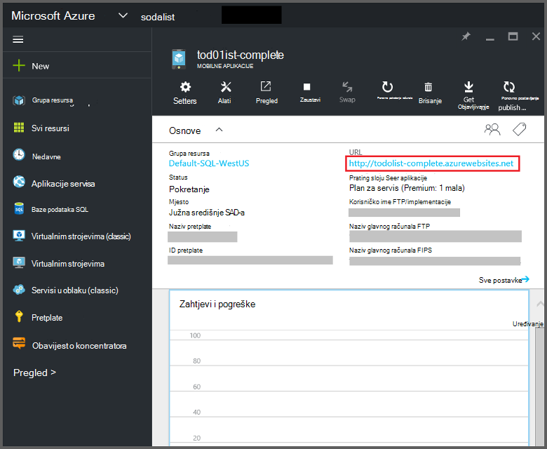
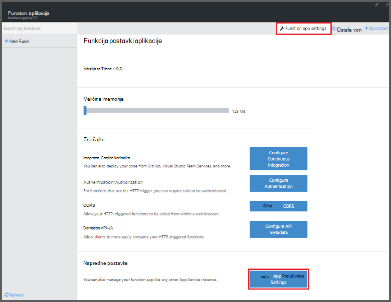
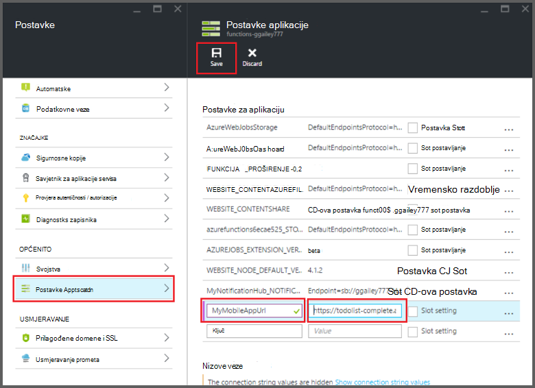

<properties
    pageTitle="Azure funkcije mobilne aplikacije povezivanja | Microsoft Azure"
    description="Objašnjenje kako koristiti aplikacije Mobile Azure povezivanja u funkcijama Azure."
    services="functions"
    documentationCenter="na"
    authors="ggailey777"
    manager="erikre"
    editor=""
    tags=""
    keywords="Azure funkcije, Funkcije, događaja obrada dinamički računalnim serverless arhitekture"/>

<tags
    ms.service="functions"
    ms.devlang="multiple"
    ms.topic="reference"
    ms.tgt_pltfrm="multiple"
    ms.workload="na"
    ms.date="08/30/2016"
    ms.author="glenga"/>

# Azure povezivanja funkcije mobilne aplikacije

[AZURE.INCLUDE [functions-selector-bindings](../../includes/functions-selector-bindings.md)]

U ovom se članku objašnjava kako konfigurirati i kod povezivanja Azure mobilne aplikacije u funkcijama Azure. 

[AZURE.INCLUDE [intro](../../includes/functions-bindings-intro.md)] 

Usluga mobilne Azure aplikacija omogućuje vam ponudili podatke krajnjoj točki tablice za mobilne klijente. Isti tablične podatke može se koristiti s obje unos i izlazna povezivanja u funkcijama Azure. Jer podržava dinamičke shemu, Node.js mobilne aplikacije za pozadinski idealna je za će tablične podatke za korištenje s vašeg funkcije. Dinamični sheme po zadanom je omogućena i mora biti onemogućena u mobilnoj aplikaciji radnog. Dodatne informacije o krajnje točke tablice u Node.js pozadinski potražite u članku [Pregled: operacije s tablicom](../app-service-mobile/app-service-mobile-node-backend-how-to-use-server-sdk.md#TableOperations). U aplikacijama za mobilne pozadinski Node.js podržava pregledavanje i uređivanje tablica u portal. Dodatne informacije potražite u temi Node.js SDK [u portal za uređivanje](../app-service-mobile/app-service-mobile-node-backend-how-to-use-server-sdk.md#in-portal-editing) . Kada koristite .NET mobilne aplikacije za pozadinskog s funkcijama Azure, podatkovnog modela prema potrebi tako da funkcija morate ažurirati ručno. Dodatne informacije o krajnje točke tablice u mobilnoj aplikaciji pozadinskog .NET potražite u članku [Kako: definiranje kontroler tablice](../app-service-mobile/app-service-mobile-dotnet-backend-how-to-use-server-sdk.md#define-table-controller) u temi SDK pozadinskog .NET. 

## Stvaranje varijabla okruženja za mobilnu aplikaciju pozadinskog URL-a

Mobilne aplikacije povezivanja trenutno potrebno da biste stvorili varijabla okruženja koji vraća URL pozadinskog mobilne aplikacije sam. Ovaj URL pronaći ćete na [portal za Azure](https://portal.azure.com) pronalaženjem mobilne aplikacije i otvaranje u plohu.

Da biste postavili ovaj URL kao varijabla okruženja aplikaciji funkcija:

1. U svojoj aplikaciji funkcija [Azure funkcije portal](https://functions.azure.com/signin)kliknite **postavki aplikacije funkcija** > **idite na postavke aplikacije servisa**. 

    

2. U aplikaciju programa (funkcija), kliknite **sve postavke**, pomaknite se do **postavki aplikacije**, zatim u odjeljku vrsta **postavki aplikacije** novi **naziv** varijable okruženja, zalijepite URL u **vrijednost**, pazeći da koristite shemu HTTPS, a zatim kliknite **Spremi** i Zatvori plohu aplikacije (funkcija) da biste se vratili na portalu funkcije.   

    

Sada možete postaviti ovu okruženje za prikaz i skrivanje kao polje *veze* u vašem povezivanja.

## Korištenje ključa API-JA za sigurnog pristupa vašem krajnje točke tablice mobilne aplikacije.

U funkcijama Azure povezivanja mobilne tablice omogućuju vam navođenje API ključ, što je dijeljena tajna koje je moguće koristiti da biste spriječili neželjene pristup iz aplikacija osim na funkcije. Mobilne aplikacije nema ugrađenu podršku za ključ za provjeru autentičnosti API-JA. Međutim, možete implementirati ključa API-JA u mobilnoj aplikaciji pozadinski Node.js pratiti primjerima u [Pozadinski Azure servisa mobilna aplikacija implementacije ključa API-JA](https://github.com/Azure/azure-mobile-apps-node/tree/master/samples/api-key). Na sličan način možete implementirati ključa API-JA u [.NET pozadinskog mobilne aplikacije](https://github.com/Azure/azure-mobile-apps-net-server/wiki/Implementing-Application-Key).

>[AZURE.IMPORTANT] Ovaj ključ za API-JA ne smije biti distribuirati s klijentima mobilne aplikacije, ona mora samo distribuirati sigurno davatelj usluge klijentima, kao što su funkcije Azure. 

## Azure mobilne aplikacije za unos povezivanja

Unos povezivanja možete učitati zapis iz krajnjoj točki mobilne tablice i prenesite izravno na povezivanja. Zapis ovisi o ID-a na temelju okidača koja se poziva funkciju. U C# funkciji, sve promjene zapisa automatski se šalju natrag u tablici kada funkciju zatvara uspješno.

#### Function.JSON za mobilne aplikacije za povezivanje za unos

Datoteka *function.json* podržava sljedeća svojstva:

- `name`: Naziv varijable koristi u kod funkcije za novi zapis.
- `type`: Biding vrsta mora biti postavljeno na *mobileTable*.
- `tableName`: Tablica u kojem će se stvoriti novi zapis.
- `id`: ID zapisa želite dohvatiti. Ovo svojstvo podržava povezivanja slično `{queueTrigger}`, koji će koristiti vrijednost niza reda čekanja poruke kao zapis ID-a.
- `apiKey`: Niz koji je postavka aplikacije koja određuje neobavezno ključ za API za mobilne aplikacije. Ovo je obavezan kada mobilne aplikacije koristi ključa API ograničavanja pristupa klijenta.
- `connection`: Niz koji je naziv varijable okruženja u postavkama aplikacije koja određuje URL vaše pozadinski mobilne aplikacije.
- `direction`: Smjer povezivanje koji se mora biti postavljeno na *u*.

Primjer *function.json* datoteka:

    {
      "bindings": [
        {
          "name": "record",
          "type": "mobileTable",
          "tableName": "MyTable",
          "id" : "{queueTrigger}",
          "connection": "My_MobileApp_Url",
          "apiKey": "My_MobileApp_Key",
          "direction": "in"
        }
      ],
      "disabled": false
    }

#### Azure primjer koda aplikacije Mobile reda čekanja okidača C#

Na primjer function.json gornjeg vraća unos povezivanje zapisa iz mobilne aplikacije tablice krajnje točke s ID-a koji se podudara s nizom reda čekanja poruke, a zatim prosljeđuje parametar *zapisa* na temelju. Kada se zapis nije pronađen, parametar nije null. Zapis je ažurirat s novom vrijednosti *teksta* kada zatvara funkciju.

    #r "Newtonsoft.Json"    
    using Newtonsoft.Json.Linq;
    
    public static void Run(string myQueueItem, JObject record)
    {
        if (record != null)
        {
            record["Text"] = "This has changed.";
        }    
    }

#### Azure primjer koda aplikacije Mobile okidača Node.js reda čekanja

Na primjer function.json gornjeg vraća unos povezivanje zapisa iz mobilne aplikacije tablice krajnje točke s ID-a koji se podudara s nizom reda čekanja poruke, a zatim prosljeđuje parametar *zapisa* na temelju. U funkcijama Node.js ažuriranim zapisima ne šalju natrag u tablici. U ovom se primjeru kod piše dohvaćeni zapis u zapisnik.

    module.exports = function (context, input) {    
        context.log(context.bindings.record);
        context.done();
    };

## Azure mobilne aplikacije izlazna povezivanja

Funkcija možete napisati zapis da biste krajnju točku tablice mobilne aplikacije za korištenje programa izlazna povezivanja. 

#### Function.JSON za mobilne aplikacije izlazna povezivanja

Datoteka function.json podržava sljedeća svojstva:

- `name`: Naziv varijable koristi u kod funkcije za novi zapis.
- `type`: Povezivanje vrsta mora biti postavljeno na *mobileTable*.
- `tableName`: Tablica koje se stvara novi zapis.
- `apiKey`: Niz koji je postavka aplikacije koja određuje neobavezno ključ za API za mobilne aplikacije. Ovo je obavezan kada mobilne aplikacije koristi ključa API ograničavanja pristupa klijenta.
- `connection`: Niz koji je naziv varijable okruženja u postavkama aplikacije koja određuje URL pozadinskog sustava mobilne aplikacije.
- `direction`: Smjer povezivanje koji mora biti postavljeno na *odgovor*.

Primjer function.json:

    {
      "bindings": [
        {
          "name": "record",
          "type": "mobileTable",
          "tableName": "MyTable",
          "connection": "My_MobileApp_Url",
          "apiKey": "My_MobileApp_Key",
          "direction": "out"
        }
      ],
      "disabled": false
    }

#### Azure primjer koda aplikacije Mobile reda čekanja okidača C#

U ovom primjeru koda za C# umeće novi zapis u krajnje za tablice mobilne aplikacije s svojstvo *tekst* u tablicu navedenu u iznad povezivanja.

    public static void Run(string myQueueItem, out object record)
    {
        record = new {
            Text = $"I'm running in a C# function! {myQueueItem}"
        };
    }

#### Azure primjer koda aplikacije Mobile okidača Node.js reda čekanja

U ovom se primjeru kod Node.js umeće novi zapis u krajnje za tablice mobilne aplikacije s svojstvo *tekst* u tablicu navedenu u iznad povezivanja.

    module.exports = function (context, input) {
    
        context.bindings.record = {
            text : "I'm running in a Node function! Data: '" + input + "'"
        }   
    
        context.done();
    };

## Daljnji koraci

[AZURE.INCLUDE [next steps](../../includes/functions-bindings-next-steps.md)]
