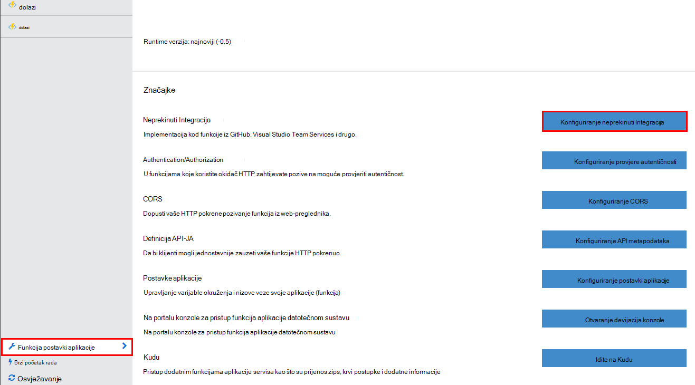
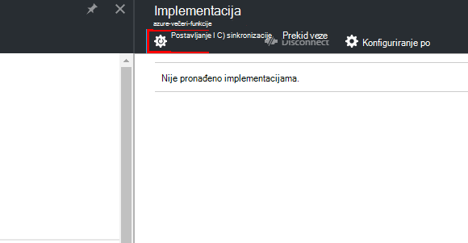
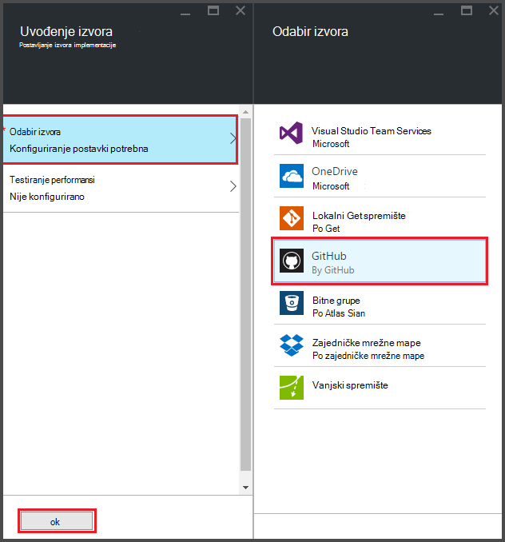
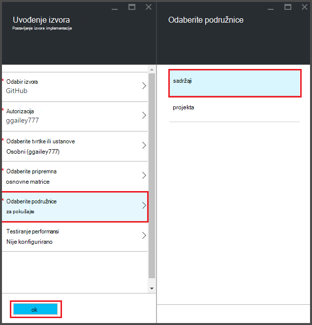
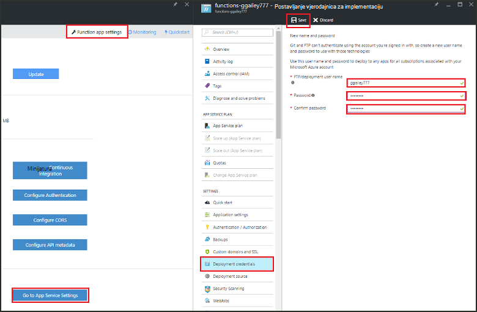
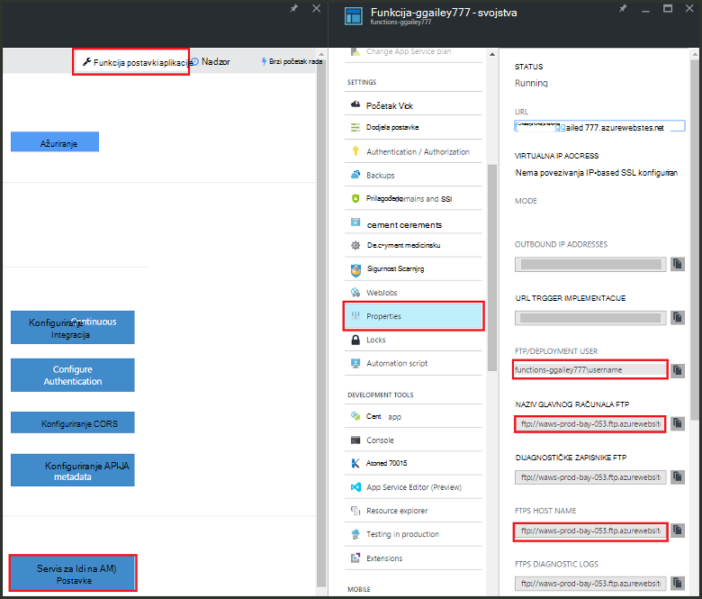
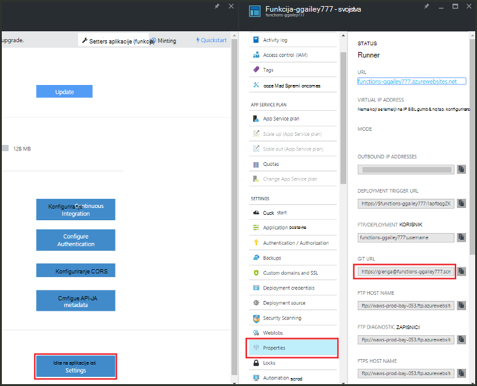

<properties
   pageTitle="Neprekinuti implementacije za Azure funkcije | Microsoft Azure"
   description="Koristiti funkcije neprekinuti uvođenje servisa Azure aplikacije da biste objavili svoje Azure funkcije."
   services="functions"
   documentationCenter="na"
   authors="ggailey777"
   manager="erikre"
   editor=""
   tags=""
   />

<tags
   ms.service="functions"
   ms.devlang="multiple"
   ms.topic="article"
   ms.tgt_pltfrm="multiple"
   ms.workload="na"
   ms.date="09/25/2016"
   ms.author="glenga"/>

# Neprekinuti implementacije za funkcije Azure 

Azure funkcije olakšava konfigurirati neprekinuti implementaciju aplikacije (opis funkcije). Funkcija upravlja Azure aplikacije servisa za integraciju s BitBucket, Dropbox, GitHub i Visual Studio tima Services (VSTS) da biste omogućili neprekinuti implementacije tijeka rada kojem Azure povlači ažuriranja za funkcije kod prilikom objavljivanja na jednu od tih servisa. Ako ste novi korisnik Azure funkcije, započnite [Pregled funkcija Azure](functions-overview.md).

Neprekinuti implementaciju videobilješki vrlo je korisno za projekte gdje više i integrirana Česti prilozima. Također, omogućuje vam održavanje kontrola izvora kod funkcije. Trenutno podržava sljedećih izvora implementacije:

+ [Bitbucket](https://bitbucket.org/)
+ [Zajedničke mrežne mape](https://bitbucket.org/)
+ [Lokalni repo brojka](../app-service-web/app-service-deploy-local-git.md)
+ Vanjski repo brojka
+ [GitHub]
+ Mercurial vanjski repo
+ [OneDrive](https://onedrive.live.com/)
+ Visual Studio Team Services

Implementacija konfigurirane na temelju po – funkcija – aplikacije. Kada je omogućen neprekinuti implementaciju, pristup kod funkcije na portalu postavljen na *samo za čitanje*.

## Neprekinuti implementacije preduvjeti

Morate imati izvor implementacije konfigurirati i kod funkcije u izvoru implementacije prije nego što ste postaviti neprekinuti implementacije. U implementacija aplikacije navedene funkcije, svaka funkcija koji se nalaze u imenovani poddirektorij, Naziv direktorija postoji naziv funkcije. Struktura mapa za ovu je zapravo kod web-mjesta. 

[AZURE.INCLUDE [functions-folder-structure](../../includes/functions-folder-structure.md)]

## Postavka gore neprekinuti implementacije

Da biste konfigurirali neprekinuti implementacije postojeće aplikacije (funkcija), koristite sljedeći postupak:

1. U svojoj aplikaciji funkcija [Azure funkcije portal](https://functions.azure.com/signin)kliknite **postavki aplikacije funkcija** > **Neprekinuti integraciju Konfiguriraj** > **Postavljanje**.

    
    
    
    
    Možete i pristupiti plohu implementacijama iz funkcije brzi početak rada tako da kliknete **Start iz izvora kontrole**.

2. U plohu implementacijama kliknite **Odabir izvora**, zatim fill-in podatke o izvoru odabranom implementaciju, a zatim kliknite **u redu**.

    

Kada je konfiguriran neprekinuti implementaciju, sve promjene datoteka u izvornoj implementacije kopiraju se aplikaciju (opis funkcije) i aktivira implementacije cijelo web-mjesto. Web-mjesto je ponovno implementirati kada se ažuriraju datoteka u izvorišnog web-mjesta.

##Mogućnosti implementacije

Slijede nekim scenarijima uobičajenu implementacije:

+ 

###Stvaranje pripremna implementacije

Funkcija aplikacije još ne podržava slobodnih implementacije. Međutim, zasebnom implementacijama pripremna i radnih možete i dalje upravljati pomoću neprekinuti integracije.

Postupak za konfiguriranje i rad s pripremna implementacije obično izgleda ovako:

1. Stvorite dva funkcija aplikacije u svoju pretplatu, jedan radni koda i jedan za pripremna. 

2. Stvorite izvor implementaciju, ako ga već nemate. Koristit ćemo [GitHub].
 
3. Svoje aplikacije funkcija radnog dovršite korake iznad **postavka gore neprekinuti** implementacije i postavite granu implementacije osnovne grana na repo GitHub.

    

4. Ponovite ovaj korak za aplikaciju pripremna (funkcija), ali ovaj put u vašem repo GitHub odaberite pripremna grani. Ako izvor implementacije ne podržava grananja, koristite neku drugu mapu.
 
5. Ništa ažurirati kod pripremna granu ili mapu, a zatim provjerite je li da te su promjene vidljive pripremna implementacije.

6. Nakon testirati spajanja mijenja iz pripremna podružnice u glavni grani. To će pokrenuti implementacije aplikaciju funkcija radnog. Ako izvor implementacije ne podržava grana, prebrisati datoteke u mapi radnog datoteke iz pripremna mapa.

###Premještanje postojećih funkcije neprekinuti implementacije

Kada imate postojeće funkcije koje ste stvorili i održava na portalu, morate preuzeti postojeće datoteke kod funkcija pomoću FTP ili u lokalnom spremištu brojka prije nego što možete postaviti neprekinuti implementacije kao što je opisano iznad. To možete učiniti u odjeljku postavke aplikacije servisa za svoje aplikacije (opis funkcije). Nakon preuzimanja datoteka, prenesite ih s odabranom neprekinuti implementacije izvorom.

>[AZURE.NOTE]Kada konfigurirate neprekinuti integracije, više neće moći uređivati izvorne datoteke na portalu za funkcije.

####Kako: Konfiguriranje vjerodajnica za implementaciju
Prije nego što možete preuzimati datoteke iz aplikacije (funkcija), morate konfigurirati vjerodajnice za pristup web-mjestu koje možete učiniti na portalu. Vjerodajnice su postavljene na razini aplikacije (opis funkcije).

1. U svojoj aplikaciji funkcija [Azure funkcije portal](https://functions.azure.com/signin)kliknite **postavki aplikacije funkcija** > **idite na postavke aplikacije servisa za** > **implementacije vjerodajnice**.

    

2. Upišite korisničko ime i lozinku, a zatim kliknite **Spremi**. Sada možete koristiti te vjerodajnice za pristup funkcija aplikacije iz FTP ili ugrađene repo brojka.

####Kako: preuzimanje datoteke pomoću FTP

1. U svojoj aplikaciji funkcija [Azure funkcije portal](https://functions.azure.com/signin)kliknite **postavki aplikacije funkcija** > **idite na postavke aplikacije servisa za** > **Svojstva** i kopirajte vrijednosti za **FTP/implementaciju korisnika**, **Naziv glavnog računala FTP**i **FTPS naziv glavnog računala**.  
**FTP/implementaciju korisnika** moraju se unijeti kao što je prikazano na portalu, uključujući naziv aplikacije da bi se pružaju kontekst proper FTP poslužitelja.

    
    
2. Iz FTP klijent koristiti podatke o vezi prikupili možete se povezati s aplikacijom i preuzmite izvorne datoteke za vaše funkcije.

####Kako: preuzimanje datoteka pomoću alata u lokalnom spremištu brojka

1. U svojoj aplikaciji funkcija [Azure funkcije portal](https://functions.azure.com/signin)kliknite **postavki aplikacije funkcija** > **Neprekinuti integraciju Konfiguriraj** > **Postavljanje**.

2. U plohu implementacijama kliknite **Odabir izvora**, **Lokalni brojka spremište**, zatim kliknite **u redu**.
 
3. Kliknite **Idi na postavke aplikacije servisa za** > **Svojstva** i bilješke vrijednost brojka URL-a. 
    
    

4. Kloniraj repo na lokalnom računalu pomoću brojka umu naredbenog retka ili omiljeni alat za brojka. Naredba Kloniraj brojka izgleda ovako:

        git clone https://username@my-function-app.scm.azurewebsites.net:443/my-function-app.git

5. Dohvaćanje datoteka iz aplikacije programa (opis funkcije) i na Kloniraj na lokalnom računalu, kao u sljedećem primjeru:

        git pull origin master

    Ako ste tražili, navedite korisničko ime i lozinku za implementaciju aplikacije sustava (opis funkcije).  

[GitHub]: https://github.com/
