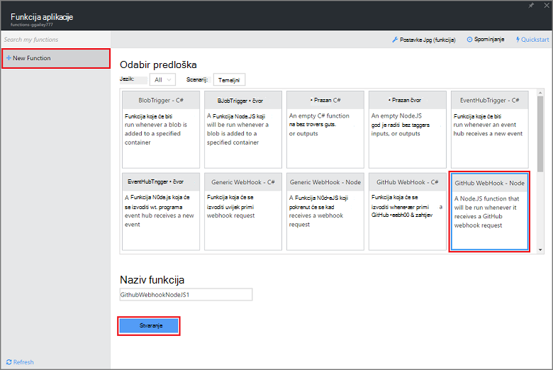
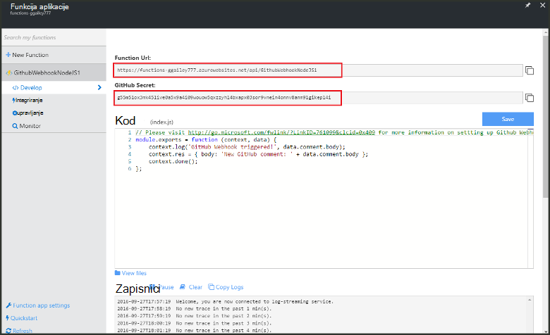
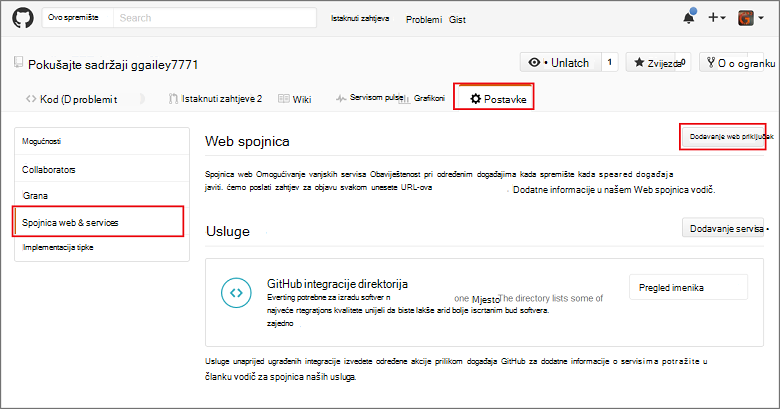
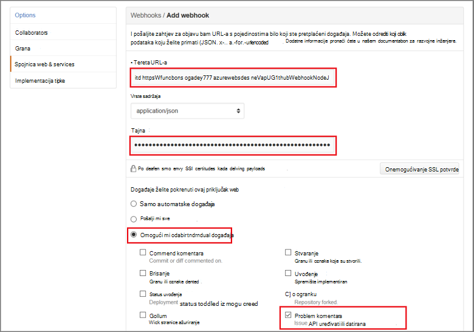

<properties
   pageTitle="Stvaranje priključak web ili funkcija Azure API | Microsoft Azure"
   description="Koristite funkcije Azure da biste stvorili funkciju koja se poziva WebHook ili API poziva."
   services="azure-functions"
   documentationCenter="na"
   authors="ggailey777"
   manager="erikre"
   editor=""
   tags=""
   />

<tags
   ms.service="functions"
   ms.devlang="multiple"
   ms.topic="get-started-article"
   ms.tgt_pltfrm="multiple"
   ms.workload="na"
   ms.date="08/30/2016"
   ms.author="glenga"/>
   
# Stvaranje webhook ili funkcija Azure API-JA

Azure funkcije je utemeljenih na događaj, računalnim na zahtjev sučelje, koje omogućuje stvaranje zakazano ili aktivira šifru jedinica implementirana u raznim programskog jezika. Da biste saznali više o funkcijama Azure, potražite u članku [Pregled funkcija Azure](functions-overview.md).

U ovoj se temi objašnjava da biste stvorili novi Node.js funkciju koja se poziva po GitHub webhook. Nova funkcija stvara se temelji na predlošku unaprijed definiranih na portalu za Azure funkcije. Možete gledati i kratki videozapis da biste saznali kako se izvode korake na portalu.

## Pogledajte videozapis

U ovom videozapisu pokazuju kako da biste izvršili osnovne korake ovog praktičnog vodiča 

[AZURE.VIDEO create-a-web-hook-or-api-azure-function]

##Stvaranje funkcije webhook pokrene iz predloška

Funkcija aplikacije hostira izvođenja funkcije u Azure. Da biste mogli stvarati funkcije, morate imati račun za Azure active poruka. Ako već nemate Azure račun, [dostupne su besplatno računi](https://azure.microsoft.com/free/). 

1. Idite na [portal za funkcije Azure](https://functions.azure.com/signin) i prijavite se pomoću računa za Azure.

2. Ako imate postojeće funkcija aplikacije da biste koristili, odaberite **funkciju** aplikacijama pa kliknite **Otvori**. Da biste stvaranja nove aplikacije (funkcija), upišite jedinstveni **naziv** za novu aplikciju funkcija ili prihvatiti generirani jedan, odaberite željeni **regija**, a zatim kliknite **Stvaranje + početak**. 

3. U aplikaciju programa (funkcija), kliknite **+ novoj funkciji** > **GitHub Webhook - čvor** > **Stvori**. Time ste stvorili funkcije sa zadanim nazivom koji se temelji na predlošku navedeni. 

     

4. U **razvoju**, imajte na umu express.js funkcija sample u prozoru **koda** . Ova funkcija primi zahtjev GitHub iz programa webhook komentar problem, evidentira tekst problem i šalje odgovor webhook kao `New GitHub comment: <Your issue comment text>`.

     

5. Kopirajte **URL-a (opis funkcije)** i **Tajna GitHub** vrijednosti. Trebat će vam te kada stvarate na webhook u GitHub. 

6. Pomaknite se do odjeljka **pokretanje**, imajte na umu unaprijed definirane JSON tijelo komentara problem u tijelu zahtjeva, a zatim kliknite **Pokreni**. 
 
    Uvijek možete testirati i nove funkcije utemeljen na predlošku desno na kartici **razvoju** po unošenju podataka za bilo koju očekivani tijela JSON podataka i klikom na gumb **Pokreni** . U ovom slučaju predložak sadrži unaprijed definirane tijelo komentara problem. 
 
Nakon toga stvarni webhook ćete stvoriti u vašem GitHub spremište.

##Konfiguriranje na webhook

1. U GitHub, dođite do spremište da ste vlasnik; To obuhvaća sve spremištima koje ste forked.
 
2. Kliknite **Postavke** > **Webhooks & services** > **webhook Dodaj**.

       

3. Zalijepite URL i tajna vaše funkcija **Tereta URL** i **tajna**, a zatim kliknite **Omogući mi odabir pojedinačnih događaje**, odaberite **komentar problem** , a zatim **Dodaj webhook**.

     

Sada GitHub webhook je konfiguriran za pokretanje funkcija kada se doda novi komentar problem.  
Sada je vrijeme da biste testirali ga.

##Testiranje funkcija

1. U vašem repo GitHub, otvorite karticu **probleme** u novom prozoru preglednika, kliknite **Novi problem**, unesite naslov, zatim kliknite **Pošalji novi problem**. Možete otvoriti i postojeće problem.

2. U problem, upišite komentar, a zatim kliknite **komentar**. Sada možete vratiti u svoje nove webhook u GitHub u odjeljku **Nedavne isporuka** potražite u članku koja je poslana zahtjeva za webhook i koji se nalazi u tijelu odgovor `New GitHub comment: <Your issue comment text>`.

3. Natrag na portalu za funkcije pomaknite se do zapisnike i potražite u članku da funkcija je aktivirala te vrijednost `New GitHub comment: <Your issue comment text>` napisan strujanje zapisnika.

##Daljnji koraci

Potražite u ovim temama za dodatne informacije o funkcijama Azure.

+ [Azure funkcije reference za razvojne inženjere](functions-reference.md)  
Programer referenca za kodiranje funkcije.
+ [Testiranje Azure funkcije](functions-test-a-function.md)  
U članku se opisuje različite Alati i tehnike za testiranje sustava funkcije.
+ [Upute za promjenu veličine Azure funkcije](functions-scale.md)  
U članku se opisuje servisa tarife dostupno u sklopu Azure funkcija, uključujući tarifa za dinamičku servis te kako odabrati desnom plan.  

[AZURE.INCLUDE [Getting Started Note](../../includes/functions-get-help.md)]
