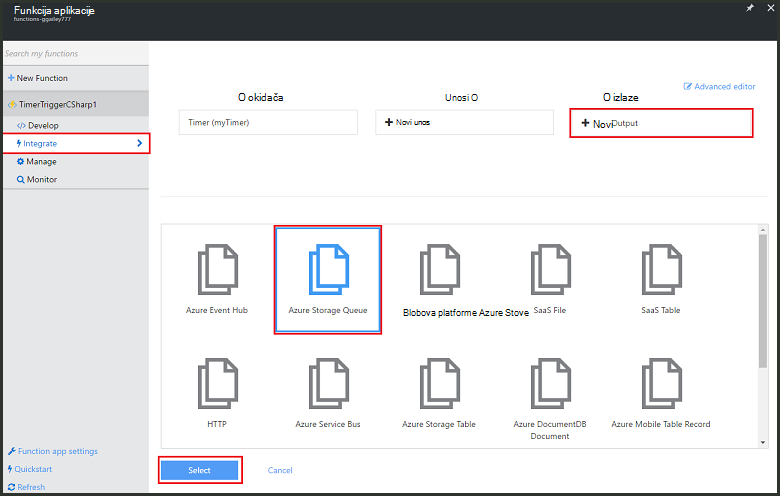

<properties
   pageTitle="Stvaranje događaja obrade funkcija | Microsoft Azure"
   description="Koristite funkcije Azure stvorite C# funkciju koja se izvršava na temelju na mjerača vremena za događaj."
   services="functions"
   documentationCenter="na"
   authors="ggailey777"
   manager="erikre"
   editor=""
   tags=""
   />

<tags
   ms.service="functions"
   ms.devlang="multiple"
   ms.topic="get-started-article"
   ms.tgt_pltfrm="multiple"
   ms.workload="na"
   ms.date="09/25/2016"
   ms.author="glenga"/>
   
# Stvaranje događaja obrade Azure (opis funkcije)

Azure funkcije je utemeljenih na događaj, računalnim na zahtjev sučelje, koje omogućuje stvaranje zakazano ili aktivira šifru jedinica implementirana u raznim programskog jezika. Da biste saznali više o funkcijama Azure, potražite u članku [Pregled funkcija Azure](functions-overview.md).

U ovoj se temi objašnjava stvaranje nove funkcije u C# koji se izvršava na temelju događaja mjerača vremena da biste dodali poruke čekanja za pohranu. 

## Preduvjeti 

Da biste mogli stvarati funkcije, morate imati račun za Azure active poruka. Ako već nemate Azure račun, [dostupne su besplatno računi](https://azure.microsoft.com/free/).

## Stvaranje funkcija timer pokrene iz predloška

Funkcija aplikacije hostira izvođenja funkcije u Azure. Da biste mogli stvarati funkcije, morate imati račun za Azure active poruka. Ako već nemate Azure račun, [dostupne su besplatno računi](https://azure.microsoft.com/free/). 

1. Idite na [portal za funkcije Azure](https://functions.azure.com/signin) i prijavite se pomoću računa za Azure.

2. Ako imate postojeće funkcija aplikacije da biste koristili, odaberite **funkciju** aplikacijama pa kliknite **Otvori**. Da biste stvaranja nove aplikacije (funkcija), upišite jedinstveni **naziv** za novu aplikciju funkcija ili prihvatiti generirani jedan, odaberite željeni **regija**, a zatim kliknite **Stvaranje + početak**. 

3. U aplikaciju programa (funkcija), kliknite **+ novoj funkciji** > **TimerTrigger - C#** > **Stvori**. Time ste stvorili funkcije sa zadanim nazivom koji je pokrenut na zadani raspored s jednom svake minute. 

    

4. U novoj funkciji, kliknite karticu **Integrate** > **Novi izlazna** > **Reda čekanja za pohranu Azure** > **Odaberite**.

    

5. U **Izlaz reda čekanja za pohranu Azure**, odaberite postojeće **veza s računom za pohranu**, ili stvorite novi, a zatim kliknite **Spremi**. 

    

6. Na kartici **razvoju** zamijeniti postojeći C# skriptu u prozoru **koda** sljedeći kod:

        using System;
        
        public static void Run(TimerInfo myTimer, out string outputQueueItem, TraceWriter log)
        {
            // Add a new scheduled message to the queue.
            outputQueueItem = $"Ping message added to the queue at: {DateTime.Now}.";
            
            // Also write the message to the logs.
            log.Info(outputQueueItem);
        }

    Kod dodaje nove poruke u red sadrži trenutni datum i vrijeme kada se izvršava funkciju.

7. Kliknite **Spremi** i pogledajte windows **zapisnika** za sljedeći izvođenja funkcija.

8. (Neobavezno) Otvorite račun za pohranu i provjerite da poruke dodaju u redu čekanja.

9. Vratite se na karticu **Integrate** i promjena rasporeda polja radi `0 0 * * * *`. Funkcija sada pokreće jednom svaki sat. 

Ovo je vrlo pojednostavljeni primjer mjerača vremena okidača i reda čekanja za pohranu izlazna povezivanja. Dodatne informacije potražite u članku [Azure funkcija timer okidača](functions-bindings-timer.md) i teme [okidača funkcije Azure i povezivanja za Azure prostora za pohranu](functions-bindings-storage.md) .

##Daljnji koraci

Potražite u ovim temama za dodatne informacije o funkcijama Azure.

+ [Azure funkcije reference za razvojne inženjere](functions-reference.md)  
Programer referenca za funkcije za kodiranje i definiranje okidača i povezivanja.
+ [Testiranje Azure funkcije](functions-test-a-function.md)  
U članku se opisuje različite Alati i tehnike za testiranje sustava funkcije.
+ [Upute za promjenu veličine Azure funkcije](functions-scale.md)  
U članku se opisuje servisa tarife dostupno u sklopu Azure funkcija, uključujući tarifa za dinamičku servis te kako odabrati desnom plan.  

[AZURE.INCLUDE [Getting Started Note](../../includes/functions-get-help.md)]
