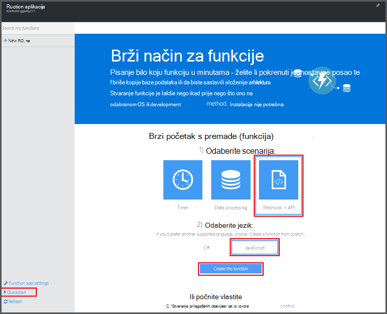

<properties
   pageTitle="Stvaranje funkcije na portalu Azure | Microsoft Azure"
   description="Stvaranje prve Azure funkcija, serverless aplikaciju, u manje od dvije minute."
   services="functions"
   documentationCenter="na"
   authors="ggailey777"
   manager="erikre"
   editor=""
   tags=""
/>

<tags
   ms.service="functions"
   ms.devlang="multiple"
   ms.topic="article"
   ms.tgt_pltfrm="multiple"
   ms.workload="na"
   ms.date="09/08/2016"
   ms.author="glenga"/>

#Stvaranje funkcije na portalu za Azure

##Pregled
Azure funkcije je sučelje utemeljenih na događaj, računalnim na zahtjev koji se proteže postojeće platforme Azure aplikacije s mogućnostima za implementaciju kod koji se prikazuje kada događaja u drugim Azure services, SaaS proizvodi i lokalnog sustava. Pomoću funkcija Azure aplikacija skaliranje na temelju zahtjev i plaćate samo za resurse koji zauzimaju. Azure funkcije omogućuje stvaranje zakazano ili aktivira jedinicama kod primijenjeno na raznim jezicima programiranje. Da biste saznali više o funkcijama Azure, potražite u članku [Pregled funkcija Azure](functions-overview.md).

U ovoj se temi objašnjava pomoću portala za Azure da biste stvorili jednostavan "Zdravo svijete" Node.js Azure funkcija koja se poziva putem HTTP-okidača. Da biste mogli stvarati funkcije na portalu za Azure, morate izričito stvorite funkcija aplikaciju u aplikacije servisa za Azure. Da bi aplikacija funkcija automatski stvara za vas, pogledajte [druge funkcije Azure vodič brzi početak rada](functions-create-first-azure-function.md), što je jednostavnije sučelje za brzi početak rada i sadrži videozapis.

##Stvaranje aplikacije (funkcija)

Funkcija aplikacije hostira izvođenja funkcije u Azure. Slijedite ove korake da biste stvorili funkcija aplikacije na portalu za Azure.

Da biste mogli stvarati prvi (funkcija), morate imati račun za Azure active poruka. Ako već nemate Azure račun, [dostupne su besplatno računi](https://azure.microsoft.com/free/).

1. Idite na [portal za Azure](https://portal.azure.com) i prijavite se pomoću računa za Azure.

2. Kliknite **+ Novo** > **Web + Mobile** > **Funkcija aplikacije**odaberite **pretplatu**upišite jedinstveni **naziv aplikacije** koja služi za identifikaciju aplikacije (funkcija), a zatim navedite sljedeće postavke:

    + **[Grupa resursa](../azure-portal/resource-group-portal.md/)**: odaberite **Stvori novi** , a zatim unesite naziv za novu grupu resursa. Možete odabrati i postojeću grupu resursa, ali nećete moći stvoriti plan aplikacije servisa za dinamičku svoje aplikacije (funkcija).
    + **[Aplikacije servisa za planiranje](../app-service/azure-web-sites-web-hosting-plans-in-depth-overview.md)**: odaberite *dinamičke* ili *Klasični*. 
        + **Dinamični**: Zadana vrsta plan za Azure funkcije. Kad odaberete plan za dinamičku, morate odaberite **mjesto** i postavljanje **Dodjelu memorije** (u MB). Informacije o utjecaju na dodjelu memorije troškova potražite u članku [funkcije Azure cijene](https://azure.microsoft.com/pricing/details/functions/). 
        + **Klasični**: klasični aplikacije servisa za planiranje zahtijeva stvaranje **aplikacije servisa za planiranje/mjesto** ili odaberite postojeći. Ove postavke određuju [mjesto, značajke, cijena i resursi za izračun](https://azure.microsoft.com/pricing/details/app-service/) povezan s vašom aplikacijom.  
    + **Račun za pohranu**: svaku aplikaciju funkcija potreban je račun za pohranu. Možete odabrati postojeći račun za pohranu ili stvorili. 

    

3. Kliknite **Stvori** za dodjelu resursa, a Implementirajte novu aplikaciju (opis funkcije).  

Sad kad je dodjeli aplikaciju (funkcija), možete stvoriti prvi (funkcija).

## Stvaranje funkcija

Ove korake stvaranje funkcije iz funkcije Azure brzi početak rada.

1. Na kartici **brzi početak rada** kliknite **WebHook + API-JA** i **JavaScript**, a zatim kliknite **Stvori funkcije**. Stvorit će se nova unaprijed definirane Node.js funkcija. 

    

2. (Neobavezno) Sada u brzi početak rada, možete odabrati da biste Brzi vodič kroz Azure funkcije značajki na portalu.   Kada imate dovršiti ili preskočiti se vodič, možete testirati novoj funkciji pomoću okidača HTTP-a.

##Testiranje funkcija

Budući da početak rada Azure funkcije sadržavati funkcionalni kod, odmah možete testirati i novoj funkciji.

1. Na kartici **razvoju** pregledajte u prozoru **koda** i obratite pozornost na to da kod Node.js očekuje HTTP zahtjev s vrijednošću *naziva* proslijeđena u tijelu poruke ili niza upita. Kada se pokrene funkciju, tu vrijednost, vraća se u poruci odgovor.

    

2. Pomaknite se do odjeljka tekstni okvir **zahtjev tijelo** , promijenite vrijednost svojstvo *naziv* u vaše ime i kliknite **Pokreni**. Vidite izvođenja aktivira putem HTTP zahtjev za testiranje, informacije napisan strujanje zapisnicima i odgovora "Pozdrav" prikazuju se u **Izlaz**. 

3. Da biste pokrenuli izvođenja funkcije isti iz drugog prozoru preglednika ili karticu, kopirajte vrijednost **Funkcije URL-a** na kartici **razvoju** i zalijepite ga u adresnoj traci preglednika, a zatim Dodaj vrijednost niza upita `&name=yourname` i pritisnite enter. U zapisnicima napisan iste podatke i web-pregledniku prikazuje odgovor "Pozdrav" kao prije.

##Daljnji koraci

U ovom brzi početak rada pokazuje vrlo jednostavne izvođenja funkcije osnovni HTTP pokrenut. Potražite u ovim temama za dodatne informacije o korištenju power funkcija Azure u aplikacijama.

+ [Azure funkcije reference za razvojne inženjere](functions-reference.md)  
Programer referenca za funkcije za kodiranje i definiranje okidača i povezivanja.
+ [Testiranje Azure funkcije](functions-test-a-function.md)  
U članku se opisuje različite Alati i tehnike za testiranje sustava funkcije.
+ [Upute za promjenu veličine Azure funkcije](functions-scale.md)  
U članku se opisuje servisa tarife dostupno u sklopu Azure funkcija, uključujući tarifa za dinamičku servis te kako odabrati desnom plan. 
+ [Što je aplikacije servisa za Azure?](../app-service/app-service-value-prop-what-is.md)  
Azure funkcije koristi platforme Azure aplikacije servisa za osnovne funkcije kao što su implementacije, varijable okruženja i Dijagnostika. 

[AZURE.INCLUDE [Getting Started Note](../../includes/functions-get-help.md)]
