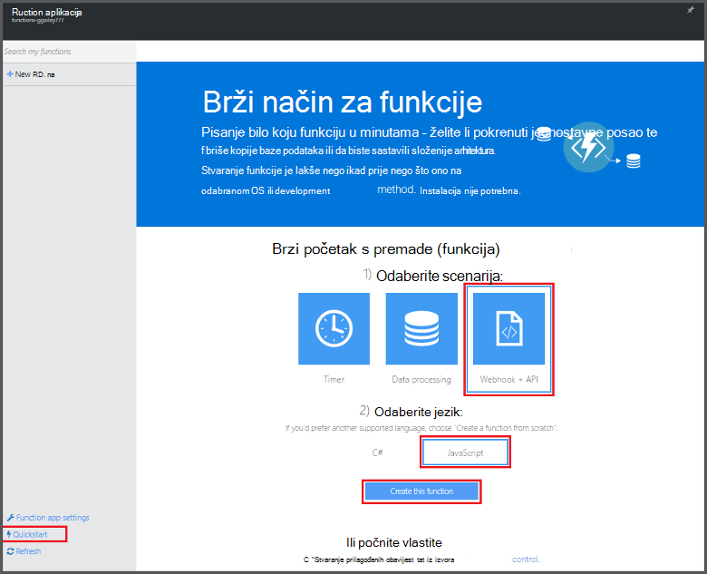
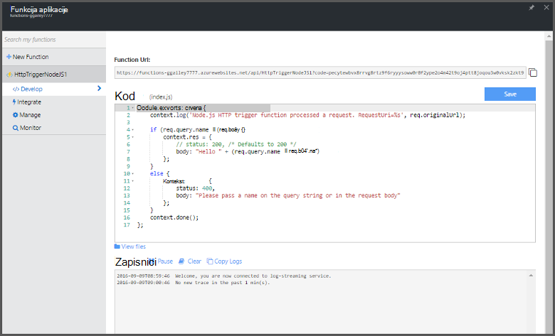

<properties
   pageTitle="Stvaranje prve funkcija Azure | Microsoft Azure"
   description="Stvaranje prve Azure funkcija, serverless aplikaciju, u manje od dvije minute."
   services="functions"
   documentationCenter="na"
   authors="ggailey777"
   manager="erikre"
   editor=""
   tags=""
/>

<tags
   ms.service="functions"
   ms.devlang="multiple"
   ms.topic="hero-article"
   ms.tgt_pltfrm="multiple"
   ms.workload="na"
   ms.date="09/08/2016"
   ms.author="glenga"/>

#Stvaranje prve Azure (funkcija)

##Pregled
Azure funkcije je sučelje utemeljenih na događaj, računalnim na zahtjev koji se proteže postojeće platforme Azure aplikacije s mogućnostima za implementaciju kod koji se prikazuje kada događaja u drugim Azure services, SaaS proizvodi i lokalnog sustava. Pomoću funkcija Azure aplikacija skaliranje na temelju zahtjev i plaćate samo za resurse koji zauzimaju. Azure funkcije omogućuje stvaranje zakazano ili jedinicama kod implementirana u raznim programskog jezika koji se prikazuje. Da biste saznali više o funkcijama Azure, potražite u članku [Pregled funkcija Azure](functions-overview.md).

U ovoj se temi objašnjava korištenje funkcije Azure brzi početak rada na portalu za stvaranje jednostavne funkcije Node.js "Pozdrav svijeta" koja se poziva putem HTTP-okidača. Možete gledati i kratki videozapis da biste saznali kako se izvode korake na portalu.

## Pogledajte videozapis

U ovom videozapisu pokazuju kako da biste izvršili osnovne korake ovog praktičnog vodiča. 

[AZURE.VIDEO create-your-first-azure-function-simple]

##Stvaranje funkcije iz za brzi početak rada

Funkcija aplikacije hostira izvođenja funkcije u Azure. Slijedite ove korake da biste stvorili novu aplikaciju funkcija, kao i na novoj funkciji. Nove funkcije aplikacije stvara se pomoću zadanu konfiguraciju. Primjer izričito stvaranju aplikacije funkcija potražite u članku [druge funkcije Azure vodič brzi početak rada](functions-create-first-azure-function-azure-portal.md).

Da biste mogli stvarati prvi (funkcija), morate imati račun za Azure active poruka. Ako već nemate Azure račun, [dostupne su besplatno računi](https://azure.microsoft.com/free/).

1. Idite na [portal za funkcije Azure](https://functions.azure.com/signin) i prijavite se pomoću računa za Azure.

2. Upišite jedinstveni **naziv** za novu aplikciju funkcija ili prihvatiti generirani jedan, odaberite željeni **regija**, a zatim kliknite **Stvaranje + početak**. 

3. Na kartici **brzi početak rada** kliknite **WebHook + API-JA** i **JavaScript**, a zatim kliknite **Stvori funkcije**. Stvorit će se nova unaprijed definirane Node.js funkcija. 

    

4. (Neobavezno) Sada u brzi početak rada, možete odabrati da biste Brzi vodič kroz Azure funkcije značajki na portalu.   Kada imate dovršiti ili preskočiti se vodič, možete testirati novoj funkciji pomoću okidača HTTP-a.

##Testiranje funkcija

Budući da početak rada Azure funkcije sadržavati funkcionalni kod, odmah možete testirati i novoj funkciji.

1. Na kartici **razvoju** pregledajte u prozoru **koda** i obratite pozornost na to da kod Node.js očekuje HTTP zahtjev s vrijednošću *naziva* proslijeđena u tijelu poruke ili niza upita. Kada se pokrene funkciju, tu vrijednost, vraća se u poruci odgovor.

    

2. Pomaknite se do odjeljka tekstni okvir **zahtjev tijelo** , promijenite vrijednost svojstvo *naziv* u vaše ime i kliknite **Pokreni**. Vidjet ćete da izvođenja aktivira HTTP zahtjev za testiranje, informacije napisan strujanje zapisnicima i odgovora "Pozdrav" prikazuju se u **Izlaz**. 

3. Da biste pokrenuli izvođenja funkcije isti iz drugog prozoru preglednika ili karticu, kopirajte vrijednost **Funkcije URL-a** na kartici **razvoju** i zalijepite ga u adresnoj traci preglednika, a zatim Dodaj vrijednost niza upita `&name=yourname` i pritisnite enter. U zapisnicima napisan iste podatke i web-pregledniku prikazuje odgovor "Pozdrav" kao prije.

##Daljnji koraci

U ovom brzi početak rada pokazuje vrlo jednostavne izvođenja funkcije osnovni HTTP pokrenut. Potražite u ovim temama dodatne informacije o korištenje power funkcija Azure u aplikacijama.

+ [Azure funkcije reference za razvojne inženjere](functions-reference.md)  
Programer referenca za funkcije za kodiranje i definiranje okidača i povezivanja.
+ [Testiranje Azure funkcije](functions-test-a-function.md)  
U članku se opisuje različite Alati i tehnike za testiranje sustava funkcije.
+ [Upute za promjenu veličine Azure funkcije](functions-scale.md)  
U članku se opisuje servisa tarife dostupno u sklopu Azure funkcija, uključujući tarifa za dinamičku servis te kako odabrati desnom plan. 
+ [Što je aplikacije servisa za Azure?](../app-service/app-service-value-prop-what-is.md)  
Azure funkcije upravlja platforme Azure aplikacije servisa za osnovne funkcije kao što su implementacije, varijable okruženja i Dijagnostika. 

[AZURE.INCLUDE [Getting Started Note](../../includes/functions-get-help.md)]
