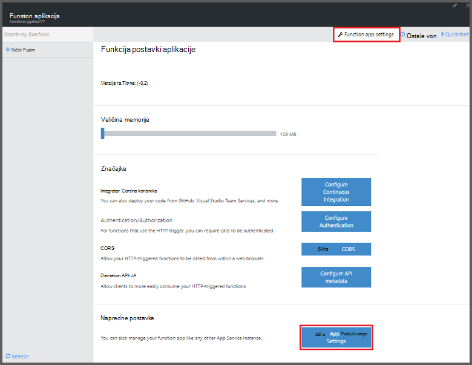
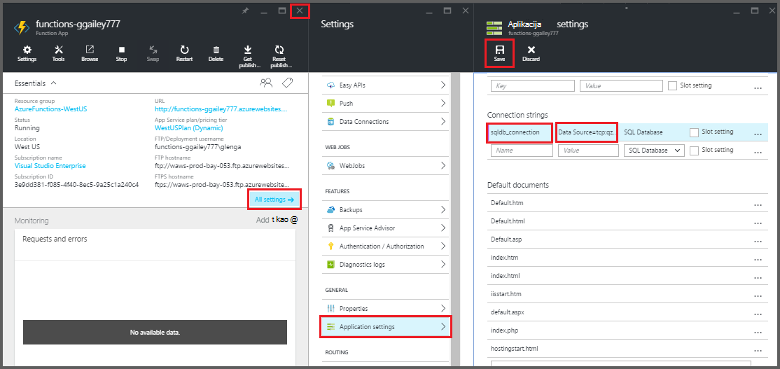
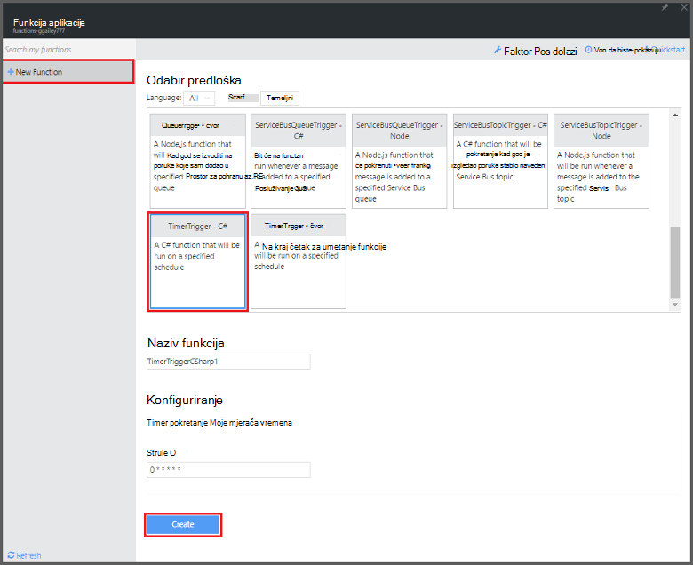

<properties
   pageTitle="Koristite funkcije Azure zakazani zadatak čišćenja | Microsoft Azure"
   description="Koristite funkcije Azure stvorite C# funkciju koja se izvršava na temelju na mjerača vremena za događaj."
   services="functions"
   documentationCenter="na"
   authors="ggailey777"
   manager="erikre"
   editor=""
   tags=""
   />

<tags
   ms.service="functions"
   ms.devlang="multiple"
   ms.topic="article"
   ms.tgt_pltfrm="multiple"
   ms.workload="na"
   ms.date="09/26/2016"
   ms.author="glenga"/>
   
# Zakazani zadatak čišćenja koristite funkcije Azure

U ovoj se temi objašnjava funkcije Azure koristiti za stvaranje nove funkcije u C# koja se izvršava na temelju na događaj mjerača vremena za čišćenje redaka u tablici baze podataka. Nova funkcija stvara se temelji na predlošku unaprijed definiranih na portalu za Azure funkcije. Da biste podržavaju taj scenarij, morate postaviti i niza za povezivanje baze podataka kao aplikacije servisa postavljanje u aplikaciji (opis funkcije). 

## Preduvjeti 

Da biste mogli stvarati funkcije, morate imati račun za Azure active poruka. Ako već nemate Azure račun, [dostupne su besplatno računi](https://azure.microsoft.com/free/).

U ovoj se temi objašnjava Transact-SQL naredbu koja se izvršava masovne operacije čišćenja u tablicu pod nazivom *TodoItems* u bazi podataka za SQL. U ovoj su tablici isti TodoItems stvara se kada dovršite [Azure servisa mobilna aplikacija vodič za brzi početak rada](../app-service-mobile/app-service-mobile-ios-get-started.md). Ogledne baze podataka možete koristiti i ako želite koristiti neku drugu tablicu, morat ćete izmijeniti naredbu.

Možete dobiti niz za povezivanje koristi pozadinskog mobilnu aplikaciju na portalu u odjeljku **postavke za sve** > **Postavke aplikacije** > **nizove veze** > **Pokaži vrijednosti niza veze** > **MS_TableConnectionString**. Možete pronaći niz za povezivanje izravno iz baze podataka sustava SQL na portalu u odjeljku **postavke za sve** > **Svojstva** > **Prikaz niza veze baze podataka** > **ADO.NET (SQL provjera autentičnosti)**.

Ovaj scenarij koristi masovne operacije u bazi podataka. Da bi vaše funkcija postupak pojedinačne CRUD operacije u tablici mobilne aplikacije, umjesto toga koristite tablica mobilnog povezivanja.

## Postavljanje niz za povezivanje s bazom podataka SQL u aplikaciji (funkcija)

Funkcija aplikacije hostira izvođenja funkcije u Azure. Je najbolji način za pohranu nizove veze i druge tajne u postavkama aplikacije (opis funkcije). To sprječava nenamjerno otkrivanja kada kod funkcija završava gore u repo negdje. 

1. Idite na [portal za funkcije Azure](https://functions.azure.com/signin) i prijavite se pomoću računa za Azure.

2. Ako imate postojeće funkcija aplikacije da biste koristili, odaberite **funkciju** aplikacijama pa kliknite **Otvori**. Da biste stvaranja nove aplikacije (funkcija), upišite jedinstveni **naziv** za novu aplikciju funkcija ili prihvatiti generirani jedan, odaberite željeni **regija**, a zatim kliknite **Stvaranje + početak**. 

3. U aplikaciju programa (funkcija), kliknite **Postavke aplikacije funkcija** > **idite na postavke aplikacije servisa**. 

    

4. U aplikaciju programa (funkcija), kliknite **sve postavke**, pomaknite se prema dolje do **postavki aplikacije**, a zatim u odjeljku vrsta **niza veze** `sqldb_connection` **naziv**niz za povezivanje zalijepiti **vrijednost**, kliknite **Spremi**, a zatim zatvorite plohu aplikacije (opis funkcije) da biste se vratili na portalu funkcije.

    

Sada možete dodati C# kod funkcije koja se povezuje s SQL baze podataka.

## Stvaranje funkcija timer pokrene iz predloška

1. U aplikaciju programa (funkcija), kliknite **+ novoj funkciji** > **TimerTrigger - C#** > **Stvori**. Time ste stvorili funkcije sa zadanim nazivom koji je pokrenut na zadani raspored s jednom svake minute. 

    

2. U oknu **kod** na kartici **razvoju** dodajte sljedeće reference skupa pri vrhu postojeće kod funkcije:

        #r "System.Configuration"
        #r "System.Data"

3. Dodajte sljedeće `using` izjave funkcije:

        using System.Configuration;
        using System.Data.SqlClient;
        using System.Threading.Tasks; 

4. Zamijenite postojeće funkcija **pokrenuti** sljedeći kod:

        public static async Task Run(TimerInfo myTimer, TraceWriter log)
        {
            var str = ConfigurationManager.ConnectionStrings["sqldb_connection"].ConnectionString;
            using (SqlConnection conn = new SqlConnection(str))
            {
                conn.Open();
                var text = "DELETE from dbo.TodoItems WHERE Complete='True'";
                using (SqlCommand cmd = new SqlCommand(text, conn))
                {
                    // Execute the command and log the # rows deleted.
                    var rows = await cmd.ExecuteNonQueryAsync();
                    log.Info($"{rows} rows were deleted");
                }
            }
        }

5. Kliknite **Spremi**, pogledajte windows **zapisnika** za sljedeći izvođenja funkcije, a zatim zabilježite broj redaka koji se brišu iz tablice TodoItems.

6. (Neobavezno) Pomoću [aplikacije za mobilne aplikacije za brzi početak rada](../app-service-mobile/app-service-mobile-ios-get-started.md), označite dodatnih stavki kao što je "dovršeno" vratite u prozor **zapisnika** i brisanje pogledajte isti broj redaka pomoću funkcije tijekom sljedećeg izvršavanja. 

##Daljnji koraci

Potražite u ovim temama za dodatne informacije o funkcijama Azure.

+ [Azure funkcije reference za razvojne inženjere](functions-reference.md)  
Programer referenca za funkcije za kodiranje i definiranje okidača i povezivanja.
+ [Testiranje Azure funkcije](functions-test-a-function.md)  
U članku se opisuje različite Alati i tehnike za testiranje sustava funkcije.
+ [Upute za promjenu veličine Azure funkcije](functions-scale.md)  
U članku se opisuje servisa tarife dostupno u sklopu Azure funkcija, uključujući tarifa za dinamičku servis te kako odabrati desnom plan.  

[AZURE.INCLUDE [Getting Started Note](../../includes/functions-get-help.md)]