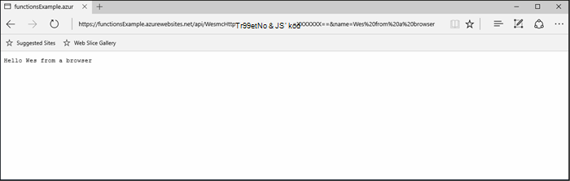
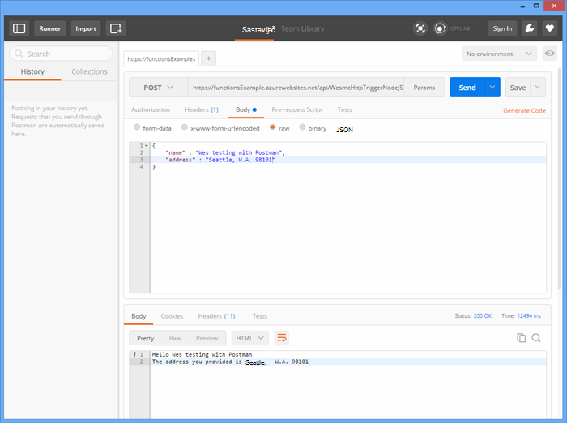
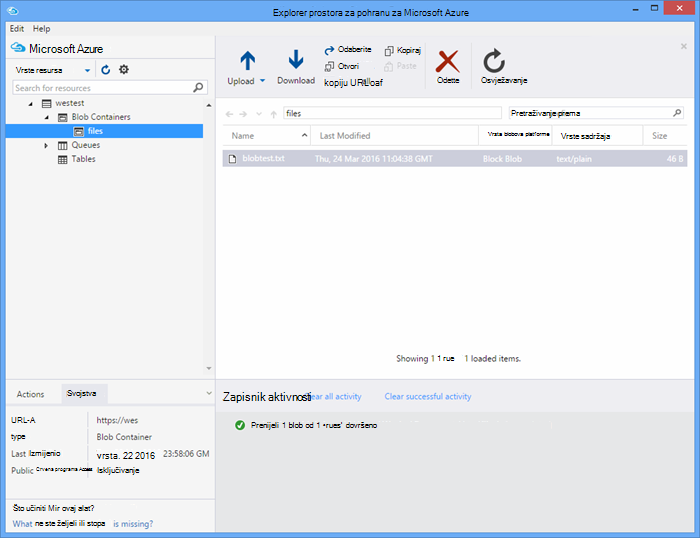

<properties
   pageTitle="Testiranje Azure funkcije | Microsoft Azure"
   description="Testirajte svoje funkcije Azure pomoću Postman, zakretanja i Node.js."
   services="functions"
   documentationCenter="na"
   authors="wesmc7777"
   manager="erikre"
   editor=""
   tags=""
   keywords="Azure funkcije, obrada događaj, webhooks, dinamični računalnim, funkcije serverless arhitektura testiranje"/>

<tags
   ms.service="functions"
   ms.devlang="multiple"
   ms.topic="article"
   ms.tgt_pltfrm="multiple"
   ms.workload="na"
   ms.date="08/19/2016"
   ms.author="wesmc"/>

# Testiranje Azure funkcije

## Pregled

U ovom ćete praktičnom vodiču smo će voditi kroz različitih pristupa za testiranje funkcije. Ne možemo će definirati funkcije pokretanje http koja prihvaća unos parametra niza upita ili u tijelu zahtjeva. Zadana šifra predloška **Funkcija Node.js HttpTrigger** podržava na `name` parametra niza upita. Ne možemo će dodavanje koda za podršku taj parametar s `address` informacije za korisnika u tijelu zahtjeva.

## Stvaranje funkcije za testiranje

Za većinu ovog praktičnog vodiča, koristit ćemo malo izmijenjene verzije predloška **Funkcija Nodejs HttpTrigger** koja je dostupna prilikom stvaranja nove funkcije.  Možete pregledati [Stvaranje prve funkcija Azure Praktični vodič](functions-create-first-azure-function.md) ako vam je potrebna pomoć pri stvaranju nove funkcije.  Samo odaberite predložak **HttpTrigger Nodejs funkcija** prilikom stvaranja funkciju probno [Azure Portal].

Zadani predložak funkcija je zapravo funkcija svijeta pozdrav koji echoes natrag ime iz zahtjeva tijela teksta ili upita niz parametar `name=<your name>`.  Ažuriramo koda za omogućuju koje možete unijeti ime i adresu kao JSON sadržaj u tijelu zahtjeva. Zatim funkciju će jeku te natrag klijentu kada su dostupni.   

Ažurirajte funkciju sljedeći kod koji koristimo za testiranje:

    module.exports = function(context, req) {
        context.log("Node.js HTTP trigger function processed a request. RequestUri=%s", req.originalUrl);
        context.log("Request Headers = " + JSON.stringify(req.headers));    
    
        if (req.query.name || (req.body && req.body.name)) {
            if (typeof req.query.name != "undefined") {
                context.log("Name was provided as a query string param..."); 
                ProcessNewUserInformation(context, req.query.name);
            }
            else {
                context.log("Processing user info from request body..."); 
                ProcessNewUserInformation(context, req.body.name, req.body.address);
            }
        }
        else {
            context.res = {
                status: 400,
                body: "Please pass a name on the query string or in the request body"
            };
        }
        context.done();
    };
    
    function ProcessNewUserInformation(context, name, address)
    {    
        context.log("Processing User Information...");            
        context.log("name = " + name);            
        echoString = "Hello " + name;
        
        if (typeof address != "undefined")
        {
            echoString += "\n" + "The address you provided is " + address;
            context.log("address = " + address);            
        }
        
        context.res = {
                // status: 200, /* Defaults to 200 */
                body: echoString
            };
    }

## Funkcija pomoću alata za testiranje

### Testiranje s zakretanja

Često prilikom testiranja softvera nije potrebno nešto dalje od naredbenog retka za svoju aplikaciju za ispravljanje pogrešaka izgledati, to je ne razlikuje se s funkcijama.

Da biste testirali funkciju iznad, kopirajte **Url funkcija** na portalu. Imat će sljedećem obliku: 

    https://<Your Function App>.azurewebsites.net/api/<Your Function Name>?code=<your access code>
    
Budući da je Url za pokretanje funkcija, ne možemo možete testirati pomoću naredbe zakretanja na naredbenog retka da biste vidjeli (`-G` ili `--get`) zahtjev na našem funkcija:

    curl -G https://<Your Function App>.azurewebsites.net/api/<Your Function Name>?code=<your access code>
    
Ovaj određeni gornji primjer zahtijeva parametra niza upita koji se mogu proslijediti kao podataka (`-d`) u naredbi zakretanja:

    curl -G https://<Your Function App>.azurewebsites.net/api/<Your Function Name>?code=<your access code> -d name=<Enter a name here>
    
Unesite uspješnosti i prikazat će se rezultat funkcije na naredbenog retka.

U prozoru portala **zapisnika** izlaz sličnu ovoj prijavljen je prilikom izvršavanja funkcije:

    2016-04-05T21:55:09  Welcome, you are now connected to log-streaming service.
    2016-04-05T21:55:30.738 Function started (Id=ae6955da-29db-401a-b706-482fcd1b8f7a)
    2016-04-05T21:55:30.738 Node.js HTTP trigger function processed a request. RequestUri=https://functionsExample.azurewebsites.net/api/HttpTriggerNodeJS1?code=XXXXXXX&name=Azure Functions
    2016-04-05T21:55:30.738 Function completed (Success, Id=ae6955da-29db-401a-b706-482fcd1b8f7a)

### Testiranje s preglednikom

Funkcije koje se ne zahtijevaju parametre ili potreban vam je samo parametrima niza upita, možete testirati pomoću preglednika.

Da biste testirali funkciju definirali iznad, kopirajte **Url funkcija** na portalu. Imat će sljedećem obliku:

    https://<Your Function App>.azurewebsites.net/api/<Your Function Name>?code=<your access code>

Dodavanje u `name` upit parametra niza na sljedeći način, koristeći stvarni naziv za na `<Enter a name here>` rezervirano mjesto.

    https://<Your Function App>.azurewebsites.net/api/<Your Function Name>?code=<your access code>&name=<Enter a name here>

Zalijepite URL u pregledniku, a koje trebali biste dobiti odgovor otprilike ovako.

U prozoru portala **zapisnika** izlaz sličnu ovoj prijavljen je prilikom izvršavanja funkcije:

    2016-03-23T07:34:59  Welcome, you are now connected to log-streaming service.
    2016-03-23T07:35:09.195 Function started (Id=61a8c5a9-5e44-4da0-909d-91d293f20445)
    2016-03-23T07:35:10.338 Node.js HTTP trigger function processed a request. RequestUri=https://functionsExample.azurewebsites.net/api/WesmcHttpTriggerNodeJS1?code=XXXXXXXXXX==&name=Wes from a browser
    2016-03-23T07:35:10.338 Request Headers = {"cache-control":"max-age=0","connection":"Keep-Alive","accept":"text/html","accept-encoding":"gzip","accept-language":"en-US"}
    2016-03-23T07:35:10.338 Name was provided as a query string param.
    2016-03-23T07:35:10.338 Processing User Information...
    2016-03-23T07:35:10.369 Function completed (Success, Id=61a8c5a9-5e44-4da0-909d-91d293f20445)

### Testiranje s Postman

Preporučuje se alat da biste testirali Većina vaše funkcija je Postman. Da biste instalirali Postman, potražite u članku [Početak Postman](https://www.getpostman.com/). Postman omogućuje kontrolu nad mnogo više atributa HTTP zahtjev.

> [AZURE.TIP] Koristite klijent OSTALE u kojem ste upoznati s. Evo alternativa Postman:  
> 
> * [Fiddler](http://www.telerik.com/fiddler)  
> * [Otisci](https://luckymarmot.com/paw)  

Da biste testirali funkcija s tijelo zahtjev u Postman: 

1. Pokrenite Postman klikom na gumb **aplikacija** u gornjem lijevom kutu prozora preglednika Chrome.
2. Kopirajte **URL-a (opis funkcije)** i zalijepite ga u Postman. Obuhvaća parametra niza upita za pristupni kod.
3. Promijenite način HTTP **objavu**.
4. Kliknite **tijelo** > **neobrađenog** i dodajte JSON zahtjev tijelo otprilike ovako:

        {
            "name" : "Wes testing with Postman",
            "address" : "Seattle, W.A. 98101"
        }

5. Kliknite **Pošalji**.

Sljedeća slika prikazuje testiranje funkcija primjer jednostavne jeka ovog praktičnog vodiča. 

U prozoru portala **zapisnika** izlaz sličnu ovoj prijavljen je prilikom izvršavanja funkcije:

    2016-03-23T08:04:51  Welcome, you are now connected to log-streaming service.
    2016-03-23T08:04:57.107 Function started (Id=dc5db8b1-6f1c-4117-b5c4-f6b602d538f7)
    2016-03-23T08:04:57.763 Node.js HTTP trigger function processed a request. RequestUri=https://functions841def78.azurewebsites.net/api/WesmcHttpTriggerNodeJS1?code=XXXXXXXXXX==
    2016-03-23T08:04:57.763 Request Headers = {"cache-control":"no-cache","connection":"Keep-Alive","accept":"*/*","accept-encoding":"gzip","accept-language":"en-US"}
    2016-03-23T08:04:57.763 Processing user info from request body...
    2016-03-23T08:04:57.763 Processing User Information...
    2016-03-23T08:04:57.763 name = Wes testing with Postman
    2016-03-23T08:04:57.763 address = Seattle, W.A. 98101
    2016-03-23T08:04:57.795 Function completed (Success, Id=dc5db8b1-6f1c-4117-b5c4-f6b602d538f7)
    
### Testiranje blob okidača pomoću programa Explorer prostora za pohranu

Možete testirati i funkcije okidača blob pomoću [Programa Explorer sustava Microsoft Azure prostora za pohranu](http://storageexplorer.com/).

1. [Azure Portal] za aplikacije funkcije stvorite novi C#, F # ili čvor funkcije blob okidača. Postavite put praćenje naziv spremnika blob. Ako, na primjer:

        files

2. Kliknite na **+** gumb da biste odabrali ili stvorite račun za pohranu koji želite koristiti. Zatim kliknite **Stvori**.

3. Stvorite tekstne datoteke s sljedeći tekst i spremite je:

        A text file for blob trigger function testing.

4. Pokrenite [Microsoft Azure prostora za pohranu Explorer](http://storageexplorer.com/) i povezivanje s blob spremnik u račun za pohranu prate.

5. Kliknite gumb **Prenesi** pa prenesite tekstnu datoteku.

    

    Zadana blob okidača funkcija Šifra prijavljuje obrada blob u zapisnicima:

        2016-03-24T11:30:10  Welcome, you are now connected to log-streaming service.
        2016-03-24T11:30:34.472 Function started (Id=739ebc07-ff9e-4ec4-a444-e479cec2e460)
        2016-03-24T11:30:34.472 C# Blob trigger function processed: A text file for blob trigger function testing.
        2016-03-24T11:30:34.472 Function completed (Success, Id=739ebc07-ff9e-4ec4-a444-e479cec2e460)

## Testiranje funkcije unutar funkcije

### Testiranje pomoću portala za funkcije gumb za pokretanje

Portal sustava predstavlja gumb za **pokretanje** koji će omogućuju vam neke ograničeni testiranje. Možete unijeti zahtjev tijelo pomoću gumba za pokretanje, ali, nije moguće navesti parametra niza upita ili ažurirati zaglavlja zahtjeva.

Testiranje funkciju pokretanje HTTP smo ste ranije stvorili dodavanjem niz JSON slično sljedećem u polju **zahtjev tijelo** , a zatim kliknite gumb za **pokretanje** .

    {
        "name" : "Wes testing Run button",
        "address" : "USA"
    } 

U prozoru portala **zapisnika** izlaz sličnu ovoj prijavljen je prilikom izvršavanja funkcije:

    2016-03-23T08:03:12  Welcome, you are now connected to log-streaming service.
    2016-03-23T08:03:17.357 Function started (Id=753a01b0-45a8-4125-a030-3ad543a89409)
    2016-03-23T08:03:18.697 Node.js HTTP trigger function processed a request. RequestUri=https://functions841def78.azurewebsites.net/api/wesmchttptriggernodejs1
    2016-03-23T08:03:18.697 Request Headers = {"connection":"Keep-Alive","accept":"*/*","accept-encoding":"gzip","accept-language":"en-US"}
    2016-03-23T08:03:18.697 Processing user info from request body...
    2016-03-23T08:03:18.697 Processing User Information...
    2016-03-23T08:03:18.697 name = Wes testing Run button
    2016-03-23T08:03:18.697 address = USA
    2016-03-23T08:03:18.744 Function completed (Success, Id=753a01b0-45a8-4125-a030-3ad543a89409)

### Testiranje s okidač mjerača vremena

Neke funkcije, ne može se uistinu testirati pomoću alata za što je već rečeno. Ako, na primjer, reda čekanja okidača funkcije koja se pokreće kada poruke se prekine u [Azure red prostora za pohranu](../storage/storage-dotnet-how-to-use-queues.md). Uvijek napisati kod da biste ispustite poruku u redu, a primjera to u programu project konzole navedene u nastavku. No postoji neki drugi način možete koristiti da biste testirali izravno s funkcijama.  

Koristite okidač timer konfiguriran pomoću reda izlazna povezivanja. Kod okidača mjerača vremena pa napisati test poruke u red. U ovom se odjeljku će voditi kroz do primjera. 

Detaljnije informacije o korištenju povezivanja s Azure funkcijama potražite u članku [Referenca za razvojne inženjere Azure funkcije](functions-reference.md). 

#### Stvaranje reda čekanja okidača za testiranje

Da bismo pokazali takvog, ne možemo će najprije stvorite red okidača funkciju koja želimo da biste testirali red pod nazivom `queue-newusers`. Ova funkcija obradit će se ime i adresu informacije o novom korisniku prekida u Azure red prostora za pohranu. 

> [AZURE.NOTE] Ako koristite drugi red naziv, provjerite je li ime koje koristite u skladu pravila [imenovanja redovima i metapodacima](https://msdn.microsoft.com/library/dd179349.aspx) .  U suprotnom će dobiti kod stanja HTTP 400: neispravan zahtjev. 

1. [Azure Portal] za aplikacije funkcije kliknite **Nova funkcija** > **QueueTrigger - C#**.
2. Unesite naziv reda čekanja moguće nadzirati funkcija reda čekanja 

        queue-newusers 

3. Kliknite na **+** (Dodaj) gumb da biste odabrali ili stvorite račun za pohranu koji želite koristiti. Zatim kliknite **Stvori**.
4. Ostavite taj prozor portala preglednika otvoriti tako da možete nadzirati stavaka evidencije šifru predloška funkcija reda čekanja zadani.

#### Stvaranje okidača mjerača vremena za prekid poruku u redu čekanja

1. Otvorite [Azure Portal] u novom prozoru preglednika, a zatim otvorite aplikaciju (opis funkcije).
2. Kliknite **Nova funkcija** > **TimerTrigger - C#**. Unesite izraz cron da biste postavili koliko često kod timer će izvršiti testiranje funkcija reda. Zatim kliknite **Stvori**. Ako želite da se test za izvođenje svakih 30 sekundi možete koristiti sljedeći [izraz CRON](https://wikipedia.org/wiki/Cron#CRON_expression):

        */30 * * * * *

2. Kliknite karticu **Integrate** za svoje nove okidača mjerača vremena.
3. U odjeljku **Izlaz**, kliknite gumb **+ Novi izlaz** . Zatim **reda čekanja** i gumb **Odaberi** .
4. Imajte na umu to ime koje koristite **objekt reda čekanja poruka** koju će koristiti u kodu funkcija timer.

        myQueue

4. Unesite naziv reda čekanja na koju se šalju poruke: 

        queue-newusers 

3. Kliknite na **+** (Dodaj) gumb da biste odabrali prostora za pohranu račun koji ste prethodno koristili pomoću okidača red. Zatim kliknite **Spremi**.
4. Kliknite karticu **razvoju** okidač za mjerenje vremena.
5. Sljedeći kod možete koristiti za C# timer funkciju pod uvjetom da koriste isti naziv reda čekanja poruka objekt gore navedenoj sintaksi. Kliknite **Spremi**

        using System;
        
        public static void Run(TimerInfo myTimer, out String myQueue, TraceWriter log)
        {
            String newUser = 
            "{\"name\":\"User testing from C# timer function\",\"address\":\"XYZ\"}";
        
            log.Verbose($"C# Timer trigger function executed at: {DateTime.Now}");   
            log.Verbose($"{newUser}");   
            
            myQueue = newUser;
        }

Sada funkcija timer C# će se izvršiti svakih 30 sekundi ako ste koristili primjeru cron izraza. U zapisnicima funkcija timer prijavljuje svakog izvođenja:

    2016-03-24T10:27:02  Welcome, you are now connected to log-streaming service.
    2016-03-24T10:27:30.004 Function started (Id=04061790-974f-4043-b851-48bd4ac424d1)
    2016-03-24T10:27:30.004 C# Timer trigger function executed at: 3/24/2016 10:27:30 AM
    2016-03-24T10:27:30.004 {"name":"User testing from C# timer function","address":"XYZ"}
    2016-03-24T10:27:30.004 Function completed (Success, Id=04061790-974f-4043-b851-48bd4ac424d1)

U prozoru preglednika za funkciju reda čekanja vidjet ćete svake poruke obrade:

    2016-03-24T10:27:06  Welcome, you are now connected to log-streaming service.
    2016-03-24T10:27:30.607 Function started (Id=e304450c-ff48-44dc-ba2e-1df7209a9d22)
    2016-03-24T10:27:30.607 C# Queue trigger function processed: {"name":"User testing from C# timer function","address":"XYZ"}
    2016-03-24T10:27:30.607 Function completed (Success, Id=e304450c-ff48-44dc-ba2e-1df7209a9d22)
    
## Testiranje funkcije koda

### Testiranje funkcije pokretanje HTTP kod: Node.js

Node.js kod možete koristiti za izvođenje http zahtjev za testiranje funkcija Azure. 

Provjerite je li postavili:

- Na `host` u odjeljku mogućnosti zahtjev funkcija glavno računalo za aplikaciju
- Naziv funkcije u na `path`.
- Pristupni kod (`<your code>`) u na `path`.

Primjer kod:

    var http = require("http");
    
    var nameQueryString = "name=Wes%20Query%20String%20Test%20From%20Node.js";
    
    var nameBodyJSON = {
        name : "Wes testing with Node.JS code",
        address : "Dallas, T.X. 75201"
    };
    
    var bodyString = JSON.stringify(nameBodyJSON);
    
    var options = {
      host: "functions841def78.azurewebsites.net",
      //path: "/api/HttpTriggerNodeJS2?code=sc1wt62opn7k9buhrm8jpds4ikxvvj42m5ojdt0p91lz5jnhfr2c74ipoujyq26wab3wk5gkfbt9&" + nameQueryString,
      path: "/api/HttpTriggerNodeJS2?code=sc1wt62opn7k9buhrm8jpds4ikxvvj42m5ojdt0p91lz5jnhfr2c74ipoujyq26wab3wk5gkfbt9",
      method: "POST",
      headers : {
          "Content-Type":"application/json",
          "Content-Length": Buffer.byteLength(bodyString)
        }    
    };
    
    callback = function(response) {
      var str = ""
      response.on("data", function (chunk) {
        str += chunk;
      });
    
      response.on("end", function () {
        console.log(str);
      });
    }
    
    var req = http.request(options, callback);
    console.log("*** Sending name and address in body ***");
    console.log(bodyString);
    req.end(bodyString);

Izlaz:

    C:\Users\Wesley\testing\Node.js>node testHttpTriggerExample.js
    *** Sending name and address in body ***
    {"name" : "Wes testing with Node.JS code","address" : "Dallas, T.X. 75201"}
    Hello Wes testing with Node.JS code
    The address you provided is Dallas, T.X. 75201
        
U prozoru portala **zapisnika** izlaz sličnu ovoj prijavljen je prilikom izvršavanja funkcije:

    2016-03-23T08:08:55  Welcome, you are now connected to log-streaming service.
    2016-03-23T08:08:59.736 Function started (Id=607b891c-08a1-427f-910c-af64ae4f7f9c)
    2016-03-23T08:09:01.153 Node.js HTTP trigger function processed a request. RequestUri=http://functionsExample.azurewebsites.net/api/WesmcHttpTriggerNodeJS1/?code=XXXXXXXXXX==
    2016-03-23T08:09:01.153 Request Headers = {"connection":"Keep-Alive","host":"functionsExample.azurewebsites.net"}
    2016-03-23T08:09:01.153 Name not provided as query string param. Checking body...
    2016-03-23T08:09:01.153 Request Body Type = object
    2016-03-23T08:09:01.153 Request Body = [object Object]
    2016-03-23T08:09:01.153 Processing User Information...
    2016-03-23T08:09:01.215 Function completed (Success, Id=607b891c-08a1-427f-910c-af64ae4f7f9c)
    

### Testiranje okidača funkcija reda čekanja kod: C# #

Ne možemo ranije spomenutih nije testiranje okidač reda čekanja pomoću koda za prekid poruku u redu. Sljedeći primjer kod utemeljena je C# kod navedene u ovom praktičnom vodiču za [Početak rada s reda čekanja Azure prostora za pohranu](../storage/storage-dotnet-how-to-use-queues.md) . Kod za druge jezike dostupan je i sa tu vezu.

Da biste testirali kod u aplikaciji konzole morate:

- [Konfiguriranje nizu za povezivanje za pohranu u datoteci app.config](../storage/storage-dotnet-how-to-use-queues.md#setup-a-storage-connection-string).
- Kod prihvaća željeno ime i adresu za novi korisnik tekstualnoj tijekom izvođenja. Prenesite na `name` i `address` kao parametar aplikaciju. Na primjer,`C:\myQueueConsoleApp\test.exe "Wes testing queues" "in a console app"`

Primjer C# kod:

    static void Main(string[] args)
    {
        string name = null;
        string address = null;
        string queueName = "queue-newusers";
        string JSON = null;

        if (args.Length > 0)
        {
            name = args[0];
        }
        if (args.Length > 1)
        {
            address = args[1];
        }

        // Retrieve storage account from connection string
        CloudStorageAccount storageAccount = CloudStorageAccount.Parse(ConfigurationManager.AppSettings["StorageConnectionString"]);

        // Create the queue client
        CloudQueueClient queueClient = storageAccount.CreateCloudQueueClient();

        // Retrieve a reference to a queue
        CloudQueue queue = queueClient.GetQueueReference(queueName);

        // Create the queue if it doesn't already exist
        queue.CreateIfNotExists();

        // Create a message and add it to the queue.
        if (name != null)
        {
            if (address != null)
                JSON = String.Format("{{\"name\":\"{0}\",\"address\":\"{1}\"}}", name, address);
            else
                JSON = String.Format("{{\"name\":\"{0}\"}}", name);
        }

        Console.WriteLine("Adding message to " + queueName + "...");
        Console.WriteLine(JSON);

        CloudQueueMessage message = new CloudQueueMessage(JSON);
        queue.AddMessage(message);
    }

U prozoru preglednika za funkciju reda čekanja vidjet ćete svake poruke obrade:

    2016-03-24T10:27:06  Welcome, you are now connected to log-streaming service.
    2016-03-24T10:27:30.607 Function started (Id=e304450c-ff48-44dc-ba2e-1df7209a9d22)
    2016-03-24T10:27:30.607 C# Queue trigger function processed: {"name":"Wes testing queues","address":"in a console app"}
    2016-03-24T10:27:30.607 Function completed (Success, Id=e304450c-ff48-44dc-ba2e-1df7209a9d22)

<!-- URLs. -->

[Portal za Azure]: https://portal.azure.com
