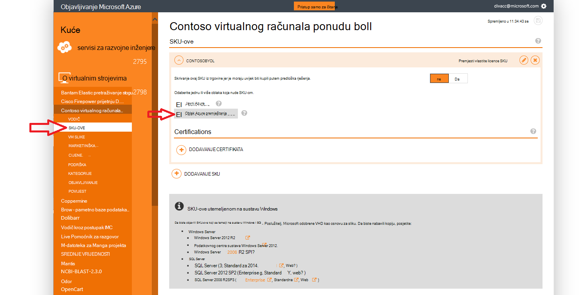

<properties
            pageTitle="Azure državne dokumentaciju | Microsoft Azure"
            description="To omogućuje usporedbu značajki i upute na razvoj aplikacija za državne ustanove Azure."
            services="Azure-Government"
            cloud="gov"
            documentationCenter=""
            authors="tsingh"
            manager="asimm"
            editor=""/>
 
<tags    ms.service="multiple"
            ms.devlang="na"
            ms.topic="article"
            ms.tgt_pltfrm="na"
            ms.workload="azure-government"
            ms.date="10/20/2016"
            ms.author="zakramer;tsingh;divacc"/> 

# Državne Azure Marketplace
Za partnere zanimati Azure Marketplace za državne ustanove za objavljivanje na ponuda, pronađite pojedinosti u nastavku.

## Za objavljivanje
>[AZURE.NOTE] Ako niste postojeće partnera za certificirane trgovine Windows Azure, slijedite korake [u nastavku](../marketplace-publishing/marketplace-publishing-getting-started.md) prije nastavka.

### Korak 1  
Prijavite se u [https://publish.windowsazure.com](https://publish.windowsazure.com)

### Korak 2
Kliknite ponude za koje želite objaviti

### Korak 3
Kliknite **SKU-ove** , a zatim kliknite okvir Azure državne oblaka

>[AZURE.NOTE] Podržani su samo ponijeti vaše vlastite licence (BYOL) SKU-ove.  Ta mogućnost nije dostupna za SKU-ove Pay-as-You-Go (PayG).

### Korak 4
Kliknite na + ustanova Dodaj vezu da biste dodali veze na bilo kojem certifications za tu ponudu.

### Korak 5
Zahtjev za probno razdoblje računa u Microsoft Azure Government cloud da biste omogućili da biste testirali sliku u portal za objavljivanje: [https://azuregov.microsoft.com/trial/azuregovtrial](https://azuregov.microsoft.com/trial/azuregovtrial)

Ispunjavate uvjete kao partner za koji služi sad Savezna stanja, lokalne ili tribal entiteti potvrde i potvrdu objavit ćemo zajedno putem e-pošte.  Račun za probno razdoblje bit će dostupni unutar je 3 do 5 dana za tvrtke.

### Korak 6
Kliknite Objavi, a zatim kliknite Pritisni za pripremna. 

Zatražit će se da biste unijeli whitelisted pretplatu koja ima pristup na postupnu nude. Unesite ID pretplate s upravo nabave računa probno državne Azure.

### Korak 7
Nakon što ponudu uspješno kopirana bez postavljanja, sliku možete testirati prijavom na [https://portal.azure.us](https://portal.azure.us) pomoću računa za probnu verziju državne Azure.

### Korak 8
Nakon što ste potvrđuju sliku pomoću probnu pretplatu, ponudu možete učiniti dostupnom uživo po klikom na Objavi i traženje odobrenja da biste prešli na radni. 

## Daljnji koraci

Dodatne informacije i ažuriranja, pretplatiti na [Blog o programu Microsoft Azure državne](https://blogs.msdn.microsoft.com/azuregov/).
